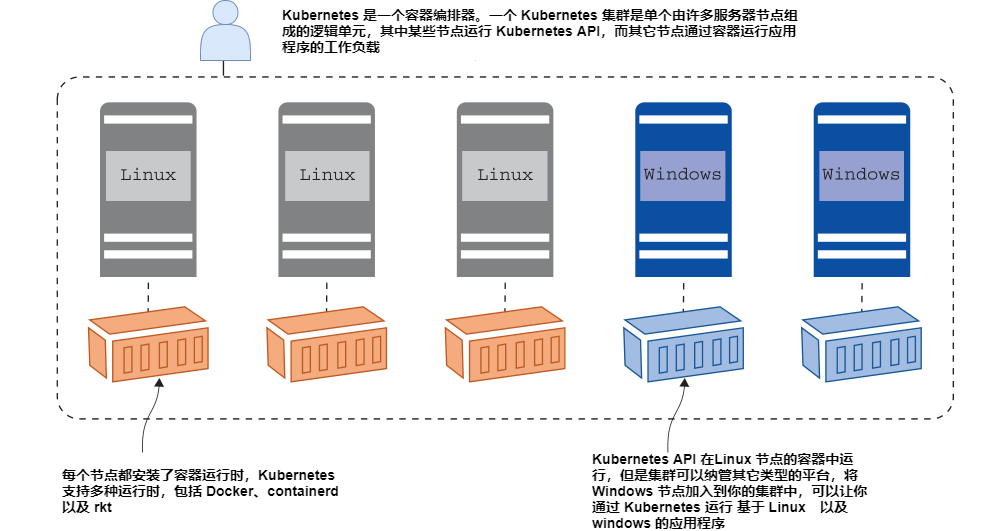

# 一个月学会 Kubernetes

哈喽，欢迎来到我的课程。我希望本课程可以给大家带来良好的学习体验。

在每一章中都有一个明确的重点，一个有用的话题，并且这些话题是相互关联的，让你有一个全面的了解，了解如何在实践中使用 Kubernetes。你需要大量的练习，每天练习巩固每一章获得的知识，形成肌肉记忆。

可以移步到 [GitHub Pages](https://yyong-brs.github.io/learn-kubernetes/) 页面进行阅读。

更多云原生技术，请关注公众号：云原生拓展

# 目录

- **第一部分** 快速了解 Kubernetes

  - 第一章 [开始之前](./chapter1.md)

    - 1.1 [了解 Kubernetes](./chapter1.md#11-了解-kubernetes)

    - 1.2 [这本书适合你吗?](./chapter1.md#12-这本书适合你吗)

    - 1.3 [创建你的实验环境](./chapter1.md#13-创建你的实验环境)

    - 1.4 [立即见效](./chapter1.md#14-立即见效)
  
  - 第二章 [Pods & Deployment 在 Kubernetes 中的应用](./chapter2.md)

    - 2.1 [Kubernetes 如何运行并管理容器](./chapter2.md#21-kubernetes-如何运行并管理容器)

    - 2.2 [通过控制器运行 Pods](./chapter2.md#22-通过控制器运行-pods)

    - 2.3 [在清单文件中定义 Deployments](./chapter2.md#23-在清单文件中定义-deployments)

    - 2.4 [应用在 Pods 中运行](./chapter2.md#24-应用在-pods-中运行)

    - 2.5 [了解 Kubernetes 资源管理](./chapter2.md#25-了解-kubernetes-资源管理)

    - 2.6 [实验室](./chapter2.md#26-实验室)