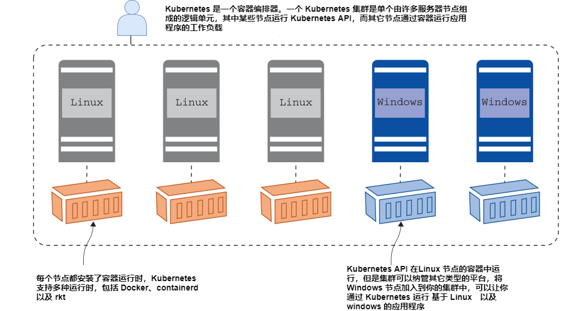
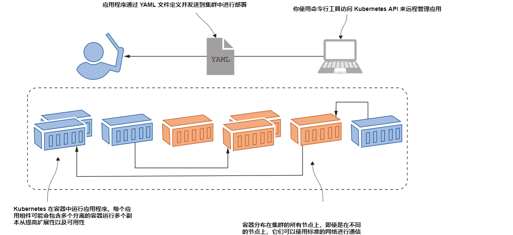
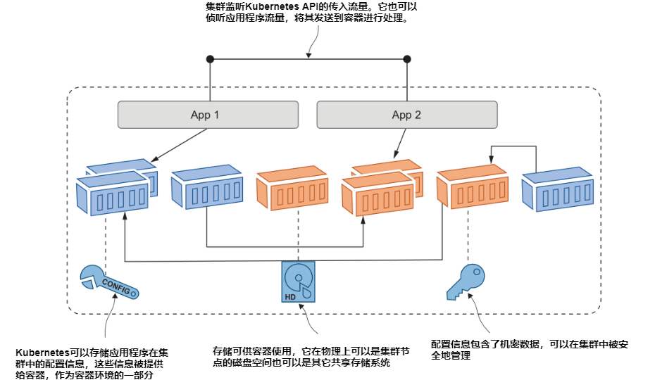
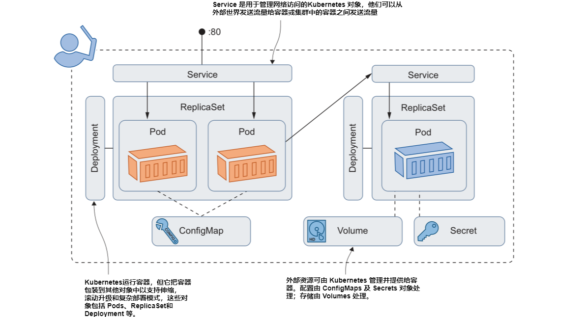
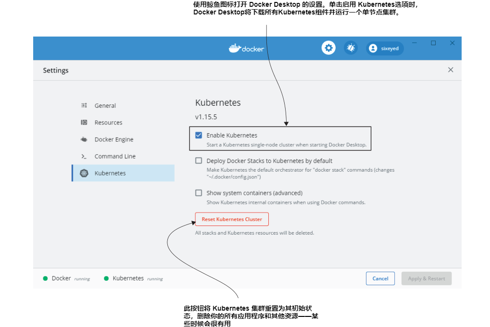
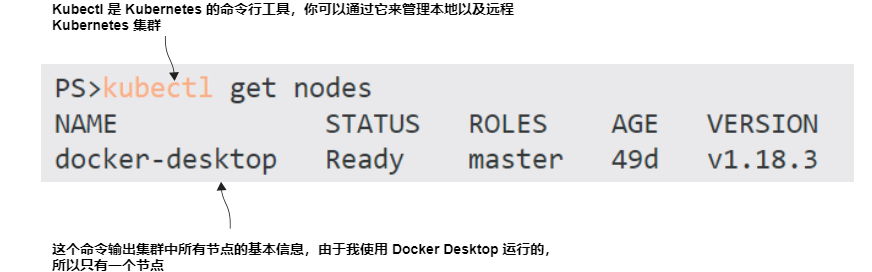

# 第一章 开始之前

Kubernetes 很强大。2014 年，在 GitHub 上它被作为开源项目发布，现如今在全球社区平均每周有 200 次变更提交，拥有2500名贡献者。一年一度的 KubeCon 会议的与会者从 2016年的 1000 多人增加到现在的 12000 多人，现在已经成为美国、欧洲和亚洲举办的全球系列活动。所有主流的云服务商提供托管的 Kubernetes 服务，您可以在数据中心或者在你的笔记本电脑上运行 Kubernete，最终它们都是等同的。

独立性和标准化是 Kubernetes 如此流行的主要原因。一旦您的应用程序在 Kubernetes 中良好运行，就可以部署它们到任何地方，这对迁移到云的组织都很有吸引力，因为
使它们能够在数据中心和其他云之间移动而无需重写代码。一旦你掌握了Kubernetes，你就可以在项目和组织之间快速移动，提高生产力。

但要达到这一点很难，因为 Kubernetes 很难。即使很简单应用程序也需要通过它部署为多个组件，以轻松的就可以跨越数百行的自定义文件格式代码进行描述。Kubernetes 将诸如负载平衡、网络、存储和计算等基础设施级别的问题带入应用程序配置，这可能是新概念，具体取决于您的IT背景。此外，Kubernetes 总是在扩展，它每季度发布新版本，通常会带来大量新功能。

但这是值得的。我花了很多年帮助人们学习 Kubernetes，然后一种共同的模式出现了：问题“为什么这么复杂？” 变成 “你能做到吗？这太神奇了！” Kubernetes确实是一项令人惊叹的技术。你对它了解得越多，你就会越喜欢它，这本书会加速你
的 Kubernetes 精通之旅。

## 1.1 了解 Kubernetes

本书提供了 Kubernetes 的实际使用介绍。每个章节都提供了“现在就试试”的练习，您可以通过练习和实验室获得大量使用 Kubernetes 的经验。我们将在下一章开始实际工作，但我们需要一点
理论先行。让我们先了解一下 Kubernetes到底是什么以及它解决了什么问题。

Kubernetes 是一个运行容器的平台，它负责启动容器化应用程序、滚动更新、Service 层面维护、扩展以满足需求、安全访问等。在 Kubernetes 中有两个核心概念，一个是 API，用于定义你的应用，另外一个是集群，运行你的应用。集群是一组单独的服务器，它们都配置了容器运行时，如Docker，然后使用Kubernetes 连接到单个逻辑单元中。图 1.1 显示了集群的高层级视图：


<center>图1.1 Kubernetes 集群包含了一组服务器，它们加入到一个组中运行容器 </center>

集群管理员负责管理单独的服务器，它们在 Kubernetes 被称作节点（node）。你可以通过添加节点来扩展集群的容量，也可以使节点脱机以维护，或者升级 Kubernetes 集群。在像 Microsoft Azure Kubernetes Sevice（AKS）或 Amazon Elastic Kubernete Service（EKS）这样的托管服务中，这些功能都封装在简单的 web 界面或命令行中。正常使用时您忘记了底层节点，将集群视为单个实体。

Kubernetes 集群用于运行你的应用程序。你通过 YAML 文件来定义应用，然后将这些文件发送给 Kubernetes API。Kubernetes 会查看你在 Yaml 文件中有什么要求，并将其与集群中已经运行的应用进行比较。它会进行任何必要的更改以达到所需的状态，这可能是更新配置、删除容器或创建新容器。为了高可用，容器将会被分发到集群中去，它们可以通过 Kubernetes 管理的虚拟网络进行通信。图 1.2 显示了部署的过程，但是没有看到节点，因为我们在这个层面上并不真正关心它们。


<center>图1.2 当您将应用程序部署到 Kubernetes 集群时，通常可以忽略实际节点 </center>

定义应用的结构是你的工作，但是运行和管理的所有工作都交给了 Kubernetes 。如果某个集群中的节点断线了，然后有一些容器在该节点上，Kubernetes 发现了并开始在其它节点创建替换的容器。如果某个应用容器变成不健康状态，Kubernetes 会去重启它。如果组件由于高负载而承受压力，Kubernetes 可以启动额外的该组件的新容器来降低压力。如果你将你的工作通过 Docker image 以及 Kubernetes YAML 文件进行管理，你将得到可以以同样的方式在不同的集群上运行的自我修复应用程序。

Kubernetes 不仅仅管理容器，这促使它成为一个功能完整的应用程序平台。Kubernetes 集群有一个分布式数据库，您可以使用它来存储应用程序的配置文件和API密钥以及连接凭据等机密信息。Kubernetes 将这些信息无缝交付给您的容器
允许您在每个环境中使用相同的容器镜像，并应用正确的配置。Kubernetes还提供存储，因此您的应用程序可以在容器外维护数据，为有状态应用程序提供高可用性。Kubernetes 还实现将网络流量发送到正确的容器进行处理。图1.3显示了其他资源类型：包括 Kubernetes的主要功能。


<center>图1.3 Kubernetes 不仅仅管理容器，集群还管理其他资源 </center>

我还没有谈到容器中的应用程序是什么样子的；那是因为 Kubernetes 并不在乎。您可以在多个容器中运行通过云原生理念设计的跨多个微服务的应用。您可以运行作为一个整体构建在一个大容器中的旧版应用程序。它们可能是Linux应用程序或
Windows应用程序。您可以使用相同的API在YAML文件中定义所有类型的应用程序，你可以在一个集群上运行它们。使用Kubernetes的乐趣在于，它在所有应用之上上增加了一层一致性——老的 .Net和 Java 单体应用以及新的 Node.js和 Go 微服务都是以相同的方式被描述、部署和管理的。

这正是我们开始使用 Kubernetes 所需要的所有理论，但在此之前我们再深入一点，我想为我所讲的概念取一些恰当的名字。关于这些YAML文件被正确地称为应用程序清单（manifests），因为它们是一个应用程序的所有组件的列表。这些组件是Kubernetes 资源；他们也有自己的名字。图1.4采用了图1.3中的概念并应用正确的Kubernetes资源名称。


<center>图1.4 真实情况：这些是您需要掌握的最基本的 Kubernetes 资源 </center>

我告诉过你Kubernetes很难。:)但我们在接下来的几章中将一次覆盖所有这些资源，对理解进行分层。当你完成第6章时，该图将完全有意义，您将在 YAML文件中定义这些资源并在自己的Kubernetes 中运行这些资源拥有很多经验。

## 1.2 这本书适合你吗?

本书的目标是快速跟踪您的 Kubernetes 学习, 让你有信心在 Kubernetes 中定义和运行自己的应用程序，并且让你了解上生产实践之路是怎样的。学习 Kubernetes 的最佳方法是练习，如果你遵循章节中的所有示例并在实验室中工作，
等你读完这本书，那么您将对Kubernetes的所有最重要的部分有一个坚实的理解。

但 Kubernetes 是一个巨大的话题，我不会涵盖所有内容。最大的差距在管理方面，我不会深入讨论集群设置和管理，因为它们在不同的基础设施中有所不同。如果你计划小跑进入云环境中的Kubernetes作为您的生产环境，那么无论如何，托管服务中都会处理这些问题。如果你想获得 Kubernetes 认证，这本书是一个很好的开始，但它不会让你一直受益。有两个主要的Kubernetes认证：Certified Kubernetes Application Developer (CKAD) 以及 Certified Kubernetes Administrator (CKA)。这本书约占 CKAD 课程的 80%，约占 CKA 课程的50%。

此外，你还需要掌握合理数量的背景知识来有效地阅读本书。当我们在讲解 Kubernetes 的特性时，但我不会填补任何关于容器的空白。如果您不熟悉镜像、容器和注册表等概念，我建议从我的
这本书《一个月学会 Docker》开始。你不需要在使用 Kubernetes 时使用 Docker，但它是打包您的应用程序，以便您可以在Kubernetes的容器中运行它们的工具。

如果您将自己归类为一个全新的或想提升 Kubernetes 知识，那么这就是适合你的书。你的背景角色可能是开发、运维、架构、DevOps或站点可靠性工程（SRE）——Kubernetes涉及所有这些角色，因此他们都受到欢迎，并且
你会学到很多东西。

## 1.3 创建你的实验环境

A Kubernetes cluster can have hundreds of nodes, but for the exercises in this book, a
single-node cluster is fine. We’ll get your lab environment set up now so you’re ready
to get started in the next chapter. Dozens of Kubernetes platforms are available, and
the exercises in this book should work with any certified Kubernetes setup. I’ll describe
how to create your lab on Linux, Windows, Mac, Amazon Web Services (AWS), and
Azure, which covers all the major options. I’m using Kubernetes version 1.18, but earlier or later versions should be fine, too.

The easiest option to run Kubernetes locally is Docker Desktop, which is a single
package that gives you Docker and Kubernetes and all the command-line tools. It
also integrates nicely with your computer’s network and has a handy Reset Kuber-
netes button, which clears everything, if necessary. Docker Desktop is supported on Windows 10 and macOS, and if that doesn’t work for you, I’ll also walk through
some alternatives.

One point you should know: the components of Kubernetes itself need to run as
Linux containers. You can’t run Kubernetes in Windows (although you can run Win-
dows apps in containers with a multinode Kubernetes cluster), so you’ll need a Linux
virtual machine (VM) if you’re working on Windows. Docker Desktop sets that up and
manages it for you.

And one last note for Windows users: please use PowerShell to follow along with
the exercises. PowerShell supports many Linux commands, and the try-it-now exer-
cises are built to run on Linux (and Mac) shells and PowerShell. If you try to use the
classic Windows command terminal, you’re going to run into issues from the start.

### 1.3.1 下载本书源码

Every example and exercise is in the book’s source code repository on GitHub,
together with sample solutions for all of the labs. If you’re comfortable with Git and
you have a Git client installed, you can clone the repository onto your computer with
the following command:

`git clone https://github.com/sixeyed/kiamol`

If you’re not a Git user, you can browse to the GitHub page for the book at https://
github.com/sixeyed/kiamol and click the Clone or Download button to download a
zip file, which you can expand.

The root of the source code is a folder called kiamol, and within that is a folder for
each chapter: ch02, ch03, and so on. The first exercise in the chapter usually asks you
to open a terminal session and switch to the chXX directory, so you’ll need to navigate
to your kiamol folder first.

The GitHub repository is the quickest way for me to publish any corrections to the
exercises, so if you do have any problems, you should check for a README file with
updates in the chapter folder.

### 1.3.2 安装 Docker Desktop

Docker Desktop runs on Windows 10 or macOS Sierra (version 10.12 or higher).
Browse to https://www.docker.com/products/docker-desktop and choose to install
the stable version. Download the installer and run it, accepting all the defaults. On
Windows, that might include a reboot to add new Windows features. When Docker
Desktop is running, you’ll see Docker’s whale icon near the clock on the Windows
taskbar or the Mac menu bar. If you’re an experienced Docker Desktop user on Win-
dows, you’ll need to make sure you’re in Linux container mode (which is the default
for new installations).

Kubernetes isn’t set up by default, so you’ll need to click the whale icon to open
the menu and click Settings. That opens the window shown in figure 1.5; select Kubernetes from the menu and select Enable Kubernetes.


<center>图1.5 Docker Desktop 创建了一个 Linux 虚拟机去运行容器，同时可以运行 Kubernetes </center>

Docker Desktop downloads all the container images for the Kubernetes runtime—
which might take a while—and then starts up everything. When you see two green
dots at the bottom of the Settings screen, your Kubernetes cluster is ready to go.
Docker Desktop installs everything else you need, so you can skip to section 1.4.7.

Other Kubernetes distributions can run on top of Docker Desktop, but they don’t
integrate well with the network setup that Docker Desktop uses, so you’ll encounter
problems running the exercises. The Kubernetes option in Docker Desktop has all
the features you need for this book and is definitely the easiest option.

### 1.3.3 安装 Docker 社区版本以及 K3s

If you’re using a Linux machine or a Linux VM, you have several options for running
a single-node cluster. Kind and minikube are popular, but my preference is K3s, which
is a minimal installation but has all the features you’ll need for the exercises. (The
name is a play on “K8s,” which is an abbreviation of Kubernetes. K3s trims the Kubernetes codebase, and the name indicates that it’s half the size of K8s.)

K3s works with Docker, so first, you should install Docker Community Edition. You
can check the full installation steps at https://rancher.com/docs/k3s/latest/en/
quick-start/, but this will get you up and running:

```
# install Docker:
curl -fsSL https://get.docker.com | sh
# install K3s:
curl -sfL https://get.k3s.io | sh -s - --docker --disable=traefik --write-
   kubeconfig-mode=644
```

If you prefer to run your lab environment in a VM and you’re familiar with using
Vagrant to manage VMs, you can use the following Vagrant setup with Docker and K3s
found in the source repository for the book:

```
# from the root of the Kiamol repo:
cd ch01/vagrant-k3s
# provision the machine:
vagrant up
# and connect:
vagrant ssh
```

K3s installs everything else you need, so you can skip to section 1.4.7.

### 1.3.4 安装 Kubernetes 命令行工具

You manage Kubernetes with a tool called kubectl (which is pronounced “cube-cuttle”
as in “cuttlefish”—don’t let anyone tell you different). It connects to a Kubernetes
cluster and works with the Kubernetes API. Both Docker Desktop and K3s install
kubectl for you, but if you’re using one of the other options described below, you’ll
need to install it yourself.

The full installation instructions are at https://kubernetes.io/docs/tasks/tools/
install-kubectl/. You can use Homebrew on macOS and Chocolatey on Windows, and
for Linux you can download the binary:

```
# macOS:
brew install kubernetes-cli
# OR Windows:
choco install kubernetes-cli
# OR Linux:
curl -Lo ./kubectl https://storage.googleapis.com/kubernetes-
   release/release/v1.18.8/bin/linux/amd64/kubectl
chmod +x ./kubectl
sudo mv ./kubectl /usr/local/bin/kubectl
```

### 1.3.5 在 Azure 中运行一个单节点的 Kubernetes

You can run a managed Kubernetes cluster in Microsoft Azure using AKS. This might
be a good option if you want to access your cluster from multiple machines or if you
have an MSDN subscription with Azure credits. You can run a minimal single-node
cluster, which won’t cost a huge amount, but bear in mind that there’s no way to stop
the cluster and you’ll be paying for it 24/7 until you remove it.

The Azure portal has a nice user interface for creating an AKS cluster, but it’s
much easier to use the az command. You can check the latest docs at https://docs
.microsoft.com/en-us/azure/aks/kubernetes-walkthrough, but you can get started by
downloading the az command-line tool and running a few commands, as follows:

```
# log in to your Azure subscription:
az login
# create a resource group for the cluster:
az group create --name kiamol --location eastus
# create a single-code cluster with 2 CPU cores and 8GB RAM:
az aks create --resource-group kiamol --name kiamol-aks --node-count 1 --
node-vm-size Standard_DS2_v2 --kubernetes-version 1.18.8 --generate-ssh-keys
# download certificates to use the cluster with kubectl:
az aks get-credentials --resource-group kiamol --name kiamol-aks
```

That final command downloads the credentials to connect to the Kubernetes API
from your local kubectl command line.

### 1.3.6 在 AWS 中运行一个单节点的 Kubernetes

The managed Kubernetes service in AWS is called the Elastic Kubernetes Service
(EKS). You can create a single-node EKS cluster with the same caveat as Azure—that
you’ll be paying for that node and associated resources all the time it’s running.

You can use the AWS portal to create an EKS cluster, but the recommended way is
with a dedicated tool called eksctl. The latest documentation for the tool is at https://
eksctl.io, but it’s pretty simple to use. First, install the latest version of the tool for your
operating system as follows:

```
# install on macOS:
brew tap weaveworks/tap
brew install weaveworks/tap/eksctl
# OR on Windows:
choco install eksctl
# OR on Linux:
curl --silent --location
"https://github.com/weaveworks/eksctl/releases/download/latest/eksctl_$(uname
-s)_amd64.tar.gz" | tar xz -C /tmp
sudo mv /tmp/eksctl /usr/local/bin
```

Assuming you already have the AWS CLI installed, eksctl will use the credentials from
the CLI (if not, then check the installation guide for authenticating eksctl). Then create a simple one-node cluster as follows:

```
# create a single node cluster with 2 CPU cores and 8GB RAM:
eksctl create cluster --name=kiamol --nodes=1 --node-type=t3.large
```

The tool sets up the connection from your local kubectl to the EKS cluster.

### 1.3.7 验证你的集群

Now you have a running Kubernetes cluster, and whichever option you chose, they all
work in the same way. Run the following command to check that your cluster is up
and running:

`kubectl get nodes`

You should see output like that shown in figure 1.6. It’s a list of all the nodes in your
cluster, with some basic details like the status and Kubernetes version. The details of
your cluster may be different, but as long as you see a node listed and in the ready
state, then your cluster is good to go.



<center>图1.6 如果你可以运行 Kubectl 命令并且节点已就绪，那么你就可以继续往后了 </center>

## 1.4 立即见效

“Immediately effective” is a core principle of the Month of Lunches series. In all, the
focus is on learning skills and putting them into practice, in every chapter that follows.

Each chapter starts with a short introduction to the topic, followed by try-it-now
exercises where you put the ideas into practice using your own Kubernetes cluster.
Then there’s a recap with some more detail, to fill in some of the questions you may
have from diving in. Last, there’s a hands-on lab for you to try by yourself, to really
gain confidence in your new understanding.

All the topics center on tasks that are genuinely useful in the real world. You’ll
learn how to be immediately effective with the topic during the chapter, and you’ll finish by understanding how to apply the new skill. Let’s start running some containerized apps!