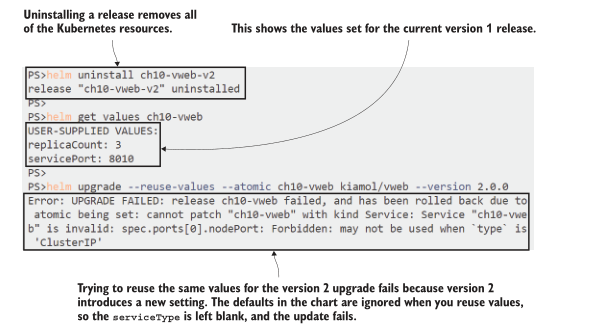

# 第十章 通过 Helm 打包并管理应用

尽管 Kubernetes 规模庞大，但它本身并不能解决所有问题;一个庞大的生态系统填补了这些空白。其中一个差距就是应用的包装和分发，而 Helm 就是解决方案。您可以使用 Helm 将一组 Kubernetes YAML 文件分组到一个工件中，并在公共或私有存储库中共享该工件。任何可以访问存储库的人都可以通过一个 Helm 命令安装应用程序。该命令可能部署一整套相关的 Kubernetes 资源，包括 ConfigMaps、Deployments 和 Services，您可以自定义配置作为安装的一部分。

人们使用 Helm 的方式各不相同。有些团队只使用 Helm 来安装和管理来自公共存储库的第三方应用程序。其他团队将 Helm 用于他们自己的应用程序，打包并发布到私有存储库。在本章中，您将学习如何做到这两点，并且您将带着自己的想法离开，了解 Helm 如何适合您的组织。你不需要学习 Helm 来有效地使用 Kubernetes，但它被广泛使用，所以你应该熟悉它。该项目由云原生计算基金会(CNCF)管理，与管理 kubernetes 的基金会相同，这是成熟度和寿命的可靠指标。

## 10.1	Helm 给 Kubernetes 带来了什么

Kubernetes 应用程序在设计时是在 YAML 文件的扩展中建模的，在运行时使用一组标签进行管理。Kubernetes 中没有原生的“应用程序”概念，这显然是将一组相关资源组合在一起的，这是 Helm 解决的问题之一。它是一个命令行工具，用于与存储库服务器交互，以查找和下载应用程序包，并与 Kubernetes 集群一起安装和管理应用程序。

Helm 是另一个抽象层，这次是在应用程序级别。当您安装带有 Helm 的应用程序时，它会在 Kubernetes 集群中创建一组资源——它们是标准的 Kubernetes 资源。Helm 打包格式扩展了 Kubernetes YAML文件，因此 Helm 包实际上只是一组 Kubernetes 清单和一些元数据。我们将首先使用 Helm 部署前面章节中的一个示例应用程序，但首先我们需要安装 Helm。

​<b>现在就试试</b>	helm 是一个跨平台的工具，可以在Windows、macOS和Linux上运行。您可以在这里找到最新的安装说明:https://helm.sh/docs/intro/install。本练习假设您已经安装了 Homebrew 或 Chocolatey 这样的包管理器。如果没有，你需要参考Helm网站的完整安装说明。

```
# 在 Windows, 使用 Chocolatey:
choco install -y kubernetes-helm

# 在 Mac, 使用 Homebrew:
brew install helm

# 在 Linux, 使用 Helm install script:
curl https://raw.githubusercontent.com/helm/helm/master/scripts/get-
  helm-3 | bash
  
# 检查成功安装:
helm version
```

本练习中的安装步骤可能在您的系统上不起作用，在这种情况下，您需要在这里停下来，转向 Helm 安装文档。在安装 Helm 并看到 version 命令成功输出(如图10.1所示)之前，我们不能继续深入。


<center>图 10.1 有很多安装 Helm 的选项;使用包管理器是最简单的</center>

Helm 是一个客户端工具。以前版本的 Helm 需要在 Kubernetes 集群中部署服务器组件，但在 Helm 3 的主要更新中发生了变化。Helm CLI 使用与 kubectl 连接到 Kubernetes 集群相同的连接信息，因此安装应用程序不需要任何额外配置。然而，您需要配置一个包存储库。Helm 存储库类似于 Docker Hub 这样的容器镜像仓库，但服务器发布所有可用包的索引;Helm 缓存存储库索引的本地副本，您可以使用它来搜索包。

​	<b>现在就试试</b>	添加Helm存储库，同步它，并搜索一个应用程序。

```
# 添加一个仓库, 使用本地名称代替远程服务:
helm repo add kiamol https://kiamol.net

# 更新本地仓库缓存:
helm repo update

# 在仓库缓存中搜索应用:
helm search repo vweb --versions
```

Kiamol 存储库是一个公共服务器，在本练习中您可以看到这个名为 vweb 的包有两个版本。我的输出如图10.2所示。


<center>图 10.2 同步Kiamol Helm存储库的本地副本并搜索包</center>

你对 helm 有了一些了解，但现在是时候介绍一些理论了这样我们就可以在进一步讨论之前使用正确的概念和名称。Helm 的应用程序包被称为 chart;可以在本地开发和部署 chart，也可以将 chart 发布到存储库。当你安装一个 chart 时，这被称为发布;每个版本都有一个名称，您可以在集群中安装同一 chart 的多个实例作为独立的、命名的版本,被称作 release。

Charts 包含 Kubernetes YAML 清单，清单通常包含参数化值，因此用户可以使用不同的配置设置安装相同的 Chart——要运行的副本数量或应用程序日志级别可以是参数值。每个 Chart 还包含一组默认值，可以使用命令行检查这些值。图10.3显示了 Helm Chart 的文件结构。


<center>图 10.3 Helm Chart 包含应用程序的所有 Kubernetes YAML，加上一些元数据</center>

vweb charts 包包含了我们在第9章中用来演示更新和回滚的简单 web 应用程序。每个 Chart 都包含一个 Service 和 Deployment 的 spec，以及一些参数化值和默认设置。您可以在安装 Chart 之前使用 Helm 命令行检查所有可用值，然后在安装版本时使用自定义值覆盖默认值。

​	<b>现在就试试</b> 检查 vweb Chart 版本 1 中可用的值，然后使用自定义值安装一个 release

```
# 查看 chart 中默认参数信息:
helm show values kiamol/vweb --version 1.0.0

# 安装 chart, 覆盖默认参数值:
helm install --set servicePort=8010 --set replicaCount=1 ch10-vweb
  kiamol/vweb --version 1.0.0

# 检查你安装的 release:
helm ls
```

在本练习中，您可以看到 Chart 中 Service 端口和 Deployment 中的副本数量具有默认值。我的输出如图10.4所示。你使用 helm install 的 set 参数来指定你自己的值，当安装完成时，你有一个应用程序在 Kubernetes 中运行，不使用kubectl，也不直接使用 YAML 清单。


<center>图 10.4 使用helm安装应用程序-这将创建Kubernetes资源，而不使用kubectl</center>

Helm 提供了一组用于使用存储库和 Chart 以及安装、更新和回滚版本的特性，但它不适用于应用程序的持续管理。Helm 命令行并不是 kubectl 的替代品—您可以同时使用它们。现在已经安装了 release，您可以以通常的方式使用 Kubernetes 资源，如果需要修改设置，还可以返回 Helm 操作。

​	<b>现在就试试</b> 使用 kubectl 检查 Helm 部署的资源，然后返回Helm 扩容部署并检查应用程序是否正常工作

```
# 查看 Deployment:
kubectl get deploy -l app.kubernetes.io/instance=ch10-vweb --show-
  labels
  
# 更新 release 增加副本数量:
helm upgrade --set servicePort=8010 --set replicaCount=3 ch10-vweb
  kiamol/vweb --version 1.0.0

# 检查 ReplicaSet:
kubectl get rs -l app.kubernetes.io/instance=ch10-vweb

# 获取访问 url:
kubectl get svc ch10-vweb -o
  jsonpath='http://{.status.loadBalancer.ingress[0].*}:8010'

# 浏览器访问 url
```

让我们从这个练习中看看一些东西。首先，标签比标准的 “app” 和“version” 标签要冗长得多。这是因为这是一个公共存储库上的公共 Chart ，所以我使用Kubernetes 配置最佳实践指南中推荐的标签名称——这是我的选择，而不是 Helm 的要求。其次，Helm 升级命令再次指定了Service端口，尽管我想修改的只是副本计数。这是因为 Helm 使用默认值，除非您指定它们，所以如果端口没有包含在升级命令中，它将被更改为默认值。可以在图10.5中看到我的输出。


<center>图 10.5 你不使用 Helm 来管理应用程序，但你可以用它来更新配置</center>

这是 Helm 工作流的消费者端。您可以从 Helm 命令行搜索应用程序的存储库，发现应用程序可用的配置值，然后安装和升级应用程序。它是在Kubernetes中运行的应用程序的包管理。在下一节中，您将学习如何打包和发布您自己的应用程序，这是工作流的生产者方面。

## 10.2	使用 Helm 打包你自己的应用

Helm charts 是包含 Kubernetes 清单的文件夹或压缩档案。您可以使用应用程序清单创建自己的 Chart，确定想要参数化的任何值，并用模板化变量替换实际值。

清单 10.1 显示了模板化部署规范的开头部分，其中包括了使用 Helm 为资源名和标签值设置的值。

> 清单10.1 web-ping-deployment.yaml，一个模板化的 Kubernetes manifest

```
apiVersion: apps/v1
kind: Deployment            # 这些都是标准的 Kubernetes YAML.

metadata:
  name: {{ .Release.Name }}             # 使用 release 名称
  labels:
    kiamol: {{ .Values.kiamolChapter }} # 使用 变量 “kiamolChapter” 值
                                        
```

双大括号语法用于模板化值——从开头 {{ 到结束 }} 的所有内容都在安装时被替换，Helm 将处理后的 YAML 发送到 Kubernetes。可以使用多个源作为输入来替换模板化的值。清单 10.1 中的代码片段使用 Release 对象获取发布的名称，使用 Values 对象获取名为 kiamolChapter 的参数值。Release 对象使用来自安装或升级命令的信息填充，Values 对象使用 Chart 中的默认值和用户已覆盖的任何设置填充。模板还可以访问关于 chart 的静态细节和关于 Kubernetes 集群功能的运行时细节。

Helm 对 Chart 中的文件结构非常讲究。您可以使用 helm create 命令为新图表生成样板结构。顶层是一个文件夹，其名称必须与您想要使用的 Chart 名称相匹配，并且该文件夹必须至少具有以下三个项目:
- Chart.yaml 文件，指定 Chart 元数据，包括名称和版本
- values.yaml 文件，为参数设置默认值
- 存放 Kubernetes 清单模板的 templates 文件夹

Listing 10.1 is from a file called web-ping-deployment.yaml in the web-ping/templates folder in this chapter’s source. The web-ping folder contains all the files needed for a valid chart, and Helm can validate the chart contents and install a release from the chart folder.
清单 10.1 来自一个名为 web-ping-deployment 的文件。Yaml 在本章源代码的 web-ping/templates 文件夹中。web-ping 文件夹包含有效 chart 所需的所有文件，Helm 可以验证 chart 内容并从 chart 文件夹中安装一个 release。

​	<b>现在就试试</b>	当你在开发 chart 时，你不需要将它们打包在 zip 档案中;您可以使用 chart 文件夹。
```
# 切换到本章源码目录:
cd ch10

# 校验 chart 内容:
helm lint web-ping

# 基于 chart 目录安装一个 release:
helm install wp1 web-ping/

# 检查已安装的 releases:
helm ls
```

lint 命令仅用于处理本地 chart，但是 install 命令对于本地 chart 和 存储在存储库中的 chart 是相同的。本地 chart 可以是文件夹或压缩档案，在本练习中，您将看到从本地 chart 安装版本与从存储库安装版本的经验相同。图 10.6 中的输出显示我现在安装了两个 releases:一个来自vweb chart，另一个来自web-ping chart。


<center>图 10.6 从本地文件夹安装和升级可以让您快速迭代 chart 开发</center>

web-ping 应用程序是一个基本的实用程序，通过定期向域名发出HTTP请求来检查网站是否正常运行。现在，你有一个Pod在运行，它每 30 秒就会向我的博客发送请求。我的博客运行在Kubernetes上，所以我相信它能够处理这个问题。应用程序使用环境变量来配置要使用的URL和调度间隔，这些都在Helm的清单中模板化。清单10.2显示了带有模板化变量的Pod spec。

> 清单10.2 web-ping-deployment.yaml，模板容器环境

```
spec:
  containers:
    - name: app
      image: kiamol/ch10-web-ping
      env:
        - name: TARGET
          value: {{ .Values.targetUrl }}
        - name: INTERVAL
          value: {{ .Values.pingIntervalMilliseconds | quote }}
```

Helm 有一组丰富的模板函数，您可以使用它来操作在 YAML 中设置的值。清单10.2 中的 quote 函数将提供的值包装在引号中，如果它还没有引号的话。您可以在模板中包含循环和分支逻辑，计算字符串和数字，甚至可以查询 Kubernetes API 以从其他对象中查找详细信息。我们不会讨论那么多细节，但重要的是要记住 Helm 可以让您生成复杂的模板，可以做几乎任何事情。

您需要仔细考虑 spec 中需要被模板化的部分。Helm 相对于标准清单部署的最大好处之一是，您可以从一个 chart 运行同一个应用程序的多个实例。kubectl 不能这样做，因为清单包含的资源名必须是唯一的。如果多次部署同一组 YAML, Kubernetes 只会更新相同的资源。如果你模板化了 spec 中所有独特的部分，比如资源名和标签选择器，那么你就可以用 Helm 运行同一个应用的多个副本。

​<b>现在就试试</b>	部署 web-ping 应用程序的第二个版本，使用相同的 chart 文件夹，但指定不同的URL来ping.

```
# 检查 chart 可用变量:
helm show values web-ping/

# 安装一个新的名为 wp2 的 release :
helm install --set targetUrl=kiamol.net wp2 web-ping/

# 等待然后检查日志:
kubectl logs -l app=web-ping --tail 1
```

在这个练习中，您将看到我需要对我的博客做一些优化——它在500毫秒左右返回，而Kiamol网站在100毫秒返回。更重要的是，您可以看到应用程序正在运行的两个实例:两个deployment管理两组具有不同容器规格的pod。我的输出如图10.7所示。


<center>图 10.7 你不能用纯清单安装一个应用程序的多个实例，但你可以用Helm</center>

现在应该清楚了，用于安装和管理应用程序的 Helm 工作流与 kubectl 工作流是不同的，但您还需要了解两者是不兼容的。不能通过在 chart 的模板文件夹中运行kubectl apply 来部署应用程序，因为模板化的变量不是有效的YAML，并且该命令将失败。如果您采用 Helm，那么您需要在以下两种情况中做出选择:在每个环境中使用 Helm，这可能会降低开发人员的工作流程;或者在其他环境中使用纯 Kubernetes 清单进行开发，而在其他环境中使用 Helm，这意味着您将拥有YAML的多个副本。

请记住，Helm 的作用不仅仅是安装，它更是关于分发和发现。Helm 带来的额外摩擦是为了能够将复杂的应用程序简化为几个变量，并在存储库上共享它们。存储库实际上只是一个索引文件，其中包含可以存储在任何 Web 服务器上的一系列 chart 版本（Kiamol 存储库使用 GitHub 页面，并且您可以在 https://kiamol.net/index.yaml 上查看其全部内容）。

您可以使用任何服务器技术来托管存储库，但在本节的其余部分中，我们将使用名为 ChartMuseum 的专用存储库服务器，这是一种流行的开源选项。您可以在自己的组织中运行 ChartMuseum 作为私有 Helm 存储库，而且它很容易设置，因为您可以使用 Helm Chart 安装它。

​	<b>现在就试试</b>	ChartMuseum 的图表位于官方的 Helm 存储库中，通常被称为“稳定版”。添加该存储库后，您可以安装一个发行版在本地运行自己的存储库
```
# 添加官方 Helm 仓库:
helm repo add stable https://kubernetes-charts.storage.googleapis.com

# 安装 ChartMuseum— repo 参数指定了直接从远程仓库获取信息，所以你不需要更新本地缓存:

helm install --set service.type=LoadBalancer --set
  service.externalPort=8008 --set env.open.DISABLE_API=false repo
  stable/chartmuseum --version 2.13.0 --wait

# 获取访问 url:
kubectl get svc repo-chartmuseum -o
  jsonpath='http://{.status.loadBalancer.ingress[0].*}:8008'

# 将其添加到本地，名为 local:
helm repo add local $(kubectl get svc repo-chartmuseum -o
  jsonpath='http://{.status.loadBalancer.ingress[0].*}:8008')
```

现在您已经有三个存储库在 Helm 上注册了: Kiamol存储库、稳定的Kubernetes存储库(它是一组精心策划的 chart，类似于Docker Hub中的官方镜像)，以及您自己的本地存储库。您可以在图10.8中看到我的输出，为了减少Helm安装命令的输出，对其进行了删减。


<center>图 10.8 运行自己的Helm存储库就像从Helm repository 安装 chart一样简单</center>

在将 chart 发布到存储库之前，需要对 chart 进行打包，发布通常分为三个阶段:将chart 打包到zip归档文件中，将归档文件上传到服务器，并更新存储库索引以添加新 chart。ChartMuseum 为您完成了最后一步，因此您只需要打包并上传 chart，以便自动更新存储库索引。

​<b>现在就试试</b> 使用Helm为 chart 创建zip存档，并使用curl将其上传到您的 ChartMuseum 存储库。检查存储库—您将看到您的 chart 已被索引

```
# 打包本地 chart:
helm package web-ping

# 在 win10 需要，删除 Powershell 别名以直接使用 curl:
Remove-Item Alias:curl -ErrorAction Ignore

# 上传 chart 压缩档到 ChartMuseum:
curl --data-binary "@web-ping-0.1.0.tgz" $(kubectl get svc repo-
  chartmuseum -o
  jsonpath='http://{.status.loadBalancer.ingress[0].*}:8008/api/chart
  s')

# 检查 ChartMuseum 已经更新索引:
curl $(kubectl get svc repo-chartmuseum -o jsonpath='http://{.status
  .loadBalancer.ingress[0].*}:8008/index.yaml')
```

Helm 使用压缩档案使 chart 易于分发，而且文件很小——它们包含Kubernetes清单、元数据和 values，但不包含任何大的二进制文件。chart 中的Pod spec 指定了要使用的容器镜像，但镜像本身不是 chart 的一部分——它们是在安装版本时从 Docker Hub 或您自己的镜像注册表中提取的。在图10.9中可以看到，当您上传 chart 并添加新的 chart 细节时，ChartMusem 生成存储库索引。


<center>图 10.9 您可以将ChartMuseum作为私有存储库来轻松地在团队之间共享 Chart</center>

您可以使用 ChartMuseum 或组织中的另一个存储库服务器来共享内部应用程序或将 chart 作为持续集成过程的一部分，然后在公共存储库上发布候选版本。您拥有的本地存储库只在您的实验室环境中运行，但它是使用 LoadBalancer Service发布的，因此任何有网络访问权限的人都可以从中安装web-ping应用程序。

​<b>现在就试试</b> 安装另一个版本的web-ping应用程序，这次使用本地存储库中的 chart，并提供一个 value 文件，而不是在安装命令中指定每个设置

```
# 更新仓库缓存:
helm repo update

# 验证 helm 可以发现你的 chart :
helm search repo web-ping

# 检查本地的 values 文件:
cat web-ping-values.yaml

# 从仓库安装并使用本地 values 文件:
helm install -f web-ping-values.yaml wp3 local/web-ping

# 查看 Pods:
kubectl get pod -l app=web-ping -o custom-
  columns='NAME:.metadata.name,ENV:.spec.containers[0].env[*].value'
```

在本练习中，您看到了使用自定义设置安装 Helm release 的另一种方法—使用本地 values 文件。这是一个很好的实践，因为您可以将不同环境的设置存储在不同的文件中，并且可以降低在没有提供设置时更新恢复到默认值的风险。我的输出如图10.10所示。


<center>图 10.10 从本地存储库安装 chart 与从任何远程存储库安装相同</center>

在前面的练习中，您还看到可以在不指定版本的情况下从存储库安装 chart。这不是一个很好的做法，因为它安装的是最新版本，这是一个移动的目标。最好总是明确地说明 chart 版本。Helm要求您使用语义版本控制，以便 chart 消费者了解他们即将升级的包是否是beta版本，或者它是否有突破性的变化。

使用 chart 的功能不止我在这里要介绍的这些。它们可以包含测试，即 Kubernetes Job 规范，在安装后运行以验证部署；它们可以有钩子，在安装工作流程的特定点运行 Jobs；它们可以被签名并附带来源的签名进行传输。在下一部分中，我将介绍另一项您在编写模板中使用的重要功能，即构建依赖于其他 chart 的 chart。
## 10.3	charts 中的模块依赖

Helm 允许你设计应用程序，使其在不同的环境中工作，这就产生了一个有趣的依赖关系问题。在某些环境中可能需要依赖项，但在其他环境中则不需要。也许你有一个web 应用真的需要缓存反向代理来提高性能。在某些环境中，你会想要将代理与应用一起部署，而在其他环境中，你已经有了一个共享的代理，所以你只想部署web应用本身。Helm 通过条件依赖性来支持这些。

清单10.3显示了我们从第5章开始使用的 Pi web应用程序的 chart 清单。它有两个依赖项——一个来自Kiamol存储库，另一个来自本地文件系统——它们是独立的chart。

> 清单10.3 chart.yaml，一个包含可选依赖项的 chart

```
apiVersion: v2 # Helm 配置版本
name: pi # Chart name
version: 0.1.0 # Chart version
dependencies: # 其他依赖 chart
  - name: vweb
    version: 2.0.0
    repository: https://kiamol.net # 其他仓库的依赖
    condition: vweb.enabled # 按需安装
  - name: proxy
    version: 0.1.0
    repository: file://../proxy # 本地目录的依赖
    condition: proxy.enabled # 按需安装
```

在建模依赖项时，需要保持 chart 的灵活性。父 chart (在本例中是Pi应用程序)可能需要子chart(proxy和vweb chart)，但子 chart 本身需要是独立的。您应该在子 chart 中模板化 Kubernetes清单，以使其具有一般的用处。如果它只在一个应用程序中有用，那么它应该是应用程序 chart 的一部分，而不是子 chart。

我的代理通常是有用的;它只是一个缓存反向代理，可以使用任何 HTTP 服务器作为内容源。该 chart 使用一个模板值作为服务器的名称来代理，所以尽管它主要用于Pi应用程序，但它可以用于代理任何 Kubernetes 服务。我们可以通过安装一个代理集群中现有应用程序的 release 来验证这一点。

<b>现在就试试</b> 单独安装 proxy chart，使用它作为我们在本章前面安装的 vweb 应用程序的反向代理

```
# 从本地目录安装 release:
helm install --set upstreamToProxy=ch10-vweb:8010 vweb-proxy proxy/

# 从新的 proxy service 获取访问 url:
kubectl get svc vweb-proxy-proxy -o
  jsonpath='http://{.status.loadBalancer.ingress[0].*}:8080'
  
# 浏览 url
```

练习中的 proxy chart 完全独立于Pi应用程序;它被用来代理我和Helm从Kiamol存储库部署的web应用程序。在图10.11中可以看到，它可以作为任何HTTP服务器的缓存代理。


<center>图 10.11 代理子 chart 被构建成一个有用的chart，它可以代理任何应用</center>

要将代理作为依赖项使用，需要将其添加到父 chart 中的依赖项列表中，这样它就成为子 chart。然后，通过在设置名称前加上依赖项名称，可以为父 chart 中的子chart 设置指定值——代理 chart 中的设置upstreamToProxy被引用为代理。在Pi图表中的upstreamToProxy。清单10.4显示了Pi应用程序的默认 values 文件，其中包括应用程序本身和代理依赖项的设置。

> 清单10.4 values.yaml，Pi chart 的默认设置

```
replicaCount: 2 # Pods 副本数
serviceType: LoadBalancer #  Pi Service 类型

proxy: # 反向代理设置
  enabled: false # 是否部署 proxy
  upstreamToProxy: "{{ .Release.Name }}-web" # 代理的 server
  servicePort: 8030 #  proxy Service 的端口
  replicaCount: 2 # proxy pod 副本数
```

这些值在没有代理的情况下部署应用程序本身，使用Pi Pods的LoadBalancer Service。设置 proxy.enabled 被指定为Pi图中代理依赖关系的条件，因此整个子 chart 将被跳过，除非安装设置覆盖默认值。完整的 values 文件还设置vweb.enabled值为false——该依赖项只是为了证明子 chart 可以从存储库中获得，因此默认情况下也不部署该 chart。

这里有一个额外的细节需要调用。Pi 应用程序的 Service 名称在 chart 中模板化，使用 release 名称。启用同一 chart 的多个安装是很重要的，但这会增加代理子 chart 的默认值的复杂性。代理服务器的名称需要与Pi服务名称相匹配，因此 values 文件使用与 servie 名称相同的模板值，并将代理链接到同一版本中的服务。

在安装或打包 chart 之前，chart 需要有它们的依赖项，可以使用 Helm 命令行来完成这一点。构建依赖项将把它们填充到 chart 的charts文件夹中，方法是从存储库下载存档或将本地文件夹打包到存档中。

<b>现在就试试</b> 构建Pi chart 的依赖项，下载远程 chart，打包本地 chart，并将其添加到 chart 文件夹中

```
# 构建 dependencies:
helm dependency build pi

# 检查依赖已下载:
ls ./pi/charts
```

图10.12显示了版本控制对 Helm chart 如此重要的原因。chart 包使用 chart 元数据中的版本号进行版本控制。父chart 在指定的版本中与其依赖项一起打包。如果我更新 proxy chart 而不更新版本号，我的Pi chart 将不同步，因为Pi包中的 proxy chart 的版本0.1.0与最新版本0.1.0不同。你应该认为 Helm chart 是不可变的，并且总是通过发布一个新的包版本来发布变更。


<center>图 10.12 Helm 将依赖包捆绑到父 chart 中，并且它们作为一个包分发</center>

条件依赖的原则是你如何管理一个更复杂的应用程序，比如第8章中的待办事项应用程序。Postgres数据库部署将是一个子 chart，对于希望使用外部数据库的环境，用户可以完全跳过该子 chart。或者您甚至可以有多个条件依赖项，允许用户为开发环境部署简单的Postgres Deployment，为测试环境使用高可用的StatefulSet，并在生产环境中插入托管的Postgres服务。

Pi 应用程序比这更简单，我们可以选择是单独部署它还是通过代理部署它。这个 chart 使用了Pi Service类型的模板值，但是如果没有部署代理，可以将其设置为LoadBalancer，如果部署了代理，则可以将其设置为ClusterIP，从而在模板中计算该值。

<b>现在就试试</b>部署启用代理子 chart 的Pi app。使用Helm 's dry-run特性检查默认部署，然后使用自定义设置进行实际安装。

```
# 打印 helm 使用默认值部署的 yaml:
helm install pi1 ./pi --dry-run

# 使用自定义setting ，开启 proxy 安装:
helm install --set serviceType=ClusterIP --set proxy.enabled=true pi2
./pi

# 获取 proxied 应用 url:
kubectl get svc pi2-proxy -o
  jsonpath='http://{.status.loadBalancer.ingress[0].*}:8030'
  
# 访问 url
```

在本练习中您将看到，dry-run 标志非常有用:它将值应用到模板，并为它将要安装的资源写出所有YAML，而不需要部署任何东西。然后在实际安装中，设置几个标志将部署一个与主 chart 集成的附加 chart，因此应用程序可以作为单个单元工作。我的圆周率计算如图10.13所示。


<center>图 10.13 通过覆盖默认设置，安装带有可选子 chart 的 chart</center>

在这一章中，我没有给 Helm 留出足够的空间，因为只有当你在 Helm 上下了很大的赌注并计划广泛使用它时，你才需要深入了解它的复杂性。如果那是你，你会发现 helm 有能力保护你。举个例子:您可以从ConfigMap模板的内容生成一个散列，并将其用作部署模板中的标签，因此每次配置更改时，部署标签也会更改，并且升级您的配置会触发 Pod rollout。

这很简洁，但并不适用于所有人，所以在下一节中，我们将回到一个简单的演示应用程序，看看Helm如何平滑升级和回滚过程。
## 10.4	升级及回滚 Helm releases

Upgrading an app with Helm doesn’t do anything special; it just sends the updated specs to Kubernetes, which rolls out changes in the usual way. If you want to configure the specifics of the rollout, you still do that in the YAML files in the chart, using the settings we explored in chapter 9. What Helm brings to upgrades is a consistent approach for all types of resources and the ability to easily roll back to previous versions.

​	One other advantage you get with Helm is the ability to safely try out a new version by deploying an additional instance to your cluster. I started this chapter by deploying version 1.0.0 of the vweb app in my cluster, and it’s still running happily. Version 2.0.0 is available now, but before I upgrade the running app, I can use Helm to install a separate release and test the new functionality.

​	<b>现在就试试</b>	Check that the original vweb release is still there, and then install a version 2 release alongside, specifying settings to keep the app private.**

```
# list all releases:
helm ls -q

# check the values for the new chart version:
helm show values kiamol/vweb --version 2.0.0

# deploy a new release using an internal Service type:
helm install --set servicePort=8020 --set replicaCount=1 --set
  serviceType=ClusterIP ch10-vweb-v2 kiamol/vweb --version 2.0.0

# use a port-forward so you can test the app:
kubectl port-forward svc/ch10-vweb-v2 8020:8020

# browse to localhost:8020, then exit the port-forward with Ctrl-C or
# Cmd-C
```

This exercise uses the parameters the chart supports to install the app without making it publicly available, using a ClusterIP Service type and a port-forward so the app is accessible only to the current user. The original app is unchanged, and I have a chance to smoke-test the new Deployment in the target cluster. Figure 10.14 shows the new version running.

​	Now I’m happy that the 2.0.0 version is good, I can use the Helm upgrade command to upgrade my actual release. I want to make sure I deploy with the same values I set in the previous release, and Helm has features to show the current values and to reuse custom values in the upgrade.

​	<b>现在就试试</b>	Remove the temporary version 2 release, and upgrade the ver- sion 1 release to the version 2 chart reusing the same values set on the current release.**

```
# remove the test release:
helm uninstall ch10-vweb-v2

# check the values used in the current version 1 release:
helm get values ch10-vweb

# upgrade to version 2 using the same values—this will fail:
helm upgrade --reuse-values --atomic ch10-vweb kiamol/vweb --version
2.0.0
```


​												<center>图 10.14 Charts that deploy Services typically let you set the type, so you can keep them private</center>

Oh dear. This is a particularly nasty issue that will take some tracking down to understand. The reuse-values flag tells Helm to reuse all the values set for the current release on the new release, but the version 2.0.0 chart includes another value, the type of the Service, which wasn’t set in the current release because it didn’t exist. The net result is that the Service type is blank, which defaults to ClusterIP in Kubernetes, and the update fails because that clashes with the existing Service spec. You can see this hinted at in the output in figure 10.15.



​											<center>图 10.15 An invalid upgrade fails, and Helm can automatically roll back to the previous release</center>

This sort of problem is where Helm’s abstraction layer really helps. You can get the same issue with a standard kubectl deployment, but if one resource update fails, you need to check through all the other resources and manually roll them back. Helm does that automatically with the atomic flag. It waits for all the resource updates to complete, and if any of them fails, it rolls back every other resource to the previous state. Check the history of the release, and you can see that Helm has automatically rolled back to version 1.0.0.

​	<b>现在就试试</b>	Recall from chapter 9 that Kubernetes doesn’t give you much information on the history of a rollout—compare that to the detail you get from Helm.**

```
# show the history of the vweb release:
helm history ch10-vweb
```

That command gets an exercise all to itself, because there’s a wealth of information that you just don’t get in the history for a standard Kubernetes rollout. Figure 10.16 shows all four revisions of the release: the first install, a successful upgrade, a failed upgrade, and an automatic rollback.


​													<center>图 10.16 The release history clearly links application and chart versions to revisions</center>

To fix the failed update, I can manually set all the values in the upgrade command or use a values file with the same settings that are currently deployed. I don’t have that values file, but I can save the output of the get values command to a file and use that in the upgrade, which gives me all my previous settings plus the defaults in the chart for any new settings.

​	<b>现在就试试</b>	Upgrade to version 2 again, this time saving the current version 1 values to a file and using that in the upgrade command.**

```
# save the values of the current release to a YAML file:
helm get values ch10-vweb -o yaml > vweb-values.yaml

# upgrade to version 2 using the values file and the atomic flag:
helm upgrade -f vweb-values.yaml --atomic ch10-vweb kiamol/vweb
  --version 2.0.0
  
# check the Service and ReplicaSet configuration:
kubectl get svc,rs -l app.kubernetes.io/instance=ch10-vweb
```

This upgrade succeeds, so the atomic rollback doesn’t kick in. The upgrade is actually effected by the Deployment, which scales up the replacement ReplicaSet and scales down the current ReplicaSet in the usual way. Figure 10.17 shows that the configuration values set in the previous release have been retained, the Service is listening on port 8010, and three Pods are running.

​	All that’s left is to try out a rollback, which is syntactically similar to a rollback in kubectl, but Helm makes it much easier to track down the revision you want to use. You’ve already seen the meaningful release history in figure 10.16, and you can also use Helm to check the values set for a particular revision. If I want to roll back the web


​										<center>图 10.17 The upgrade succeeds by exporting the release settings to a file and using them again</center>

application to version 1.0.0 but preserve the values I set in revision 2, I can check those values first.

​	<b>现在就试试</b>	Roll back to the second revision, which was version 1.0.0 of the app upgraded to use three replicas.**

```
# confirm the values used in revision 2:
helm get values ch10-vweb --revision 2

# roll back to that revision:
helm rollback ch10-vweb 2

# check the latest two revisions:
helm history ch10-vweb --max 2 -o yaml
```

You can see my output in figure 10.18, where the rollback is successful and the history shows that the latest revision is 6, which is actually a rollback to revision 2.

​	The simplicity of this example is good for focusing on the upgrade and rollback workflow, and highlighting some of the quirks, but it hides the power of Helm for major upgrades. A Helm release is an abstraction of an application, and different


​																	<center>图 10.18 Helm makes it easy to check exactly what you’re rolling back to</center>

versions of the application might be modeled in different ways. A chart might use a ReplicationController in an early release, then change to a ReplicaSet and then a Deployment; as long as the user-facing parts remain the same, the internal workings become an implementation detail.

## 10.5	理解 Helm 定位

Helm adds a lot of value to Kubernetes, but it’s invasive—once you template your manifests, there’s no going back. Everyone on the team has to switch to Helm, or you have to commit to having multiple sets of manifests: pure Kubernetes for the development team and Helm for every other environment. You really don’t want two sets of manifests getting out of sync, but equally, Kubernetes itself is plenty to learn without adding Helm on top.

​	Whether Helm fits in for you depends very much on the type of applications you’re packaging and the way your teams work. If your app is composed of 50+ microservices, then development teams might work on only a subset of the full app, running it natively or with Docker and Docker Compose, and a separate team owns the full Kubernetes deployment. In that environment, a move to Helm will reduce friction rather than increasing it, centralizing hundreds of YAML files into manageable charts.

​	A couple of other indicators that Helm is a good fit include a fully automated continuous deployment process—which can be easier to build with Helm—running test environments from the same chart version with custom values files, and running verification jobs as part of the deployment. When you find yourself needing to template your Kubernetes manifests—which you will sooner or later—Helm gives you a standard approach, which is better than writing and maintaining your own tools.

​	That’s all for Helm in this chapter, so it’s time to tidy up the cluster before moving on to the lab.

​	<b>现在就试试</b>	Everything in this chapter was deployed with Helm, so we can use Helm to uninstall it all.**

```
# uninstall all the releases:
helm uninstall $(helm ls -q)
```

## 10.6	实验室

It’s back to the to-do app again for the lab. You’re going to take a working set of Kubernetes manifests and package them into a Helm chart. Don’t worry—it’s not the full-on app from chapter 8 with StatefulSets and backup Jobs; it’s a much simpler version. Here are the goals:

- Use the manifests in the lab/todo-list folder as the starting point (there are hints in the YAML for what needs templating).
- Create the Helm chart structure.
- Template the resource names and any other values that need to be templated so the app can run as multiple releases.
- Add parameters for configuration settings to support running the app as different environments.
- Your chart should run as the Test configuration when installed with default values.
- Your chart should run as the Dev configuration when installed using the lab/dev-values.yaml values file.

If you’re planning on making use of Helm, you should really find time for this lab, because it contains the exact set of tasks you’ll need to do when you package apps in Helm. My solution is on GitHub for you to check in the usual place: https://github.com/sixeyed/kiamol/blob/master/ch10/lab/README.md.

​	Happy Helming!