# 第十一章 App 开发——开发人员工作流程及 CI/CD

这是本书中有关实际应用 Kubernetes 的最后一章，重点是开发和交付在 Kubernetes 上运行的软件的实用性。无论您是开发人员还是正在与开发人员一起工作的操作人员，容器的使用都会影响您的工作方式、使用的工具以及从进行代码更改到在开发和测试环境中看到其运行所需的时间和精力。在本章中，我们将探讨Kubernetes如何影响内部循环——本地机器上的开发人员工作流程和外部循环——将更改推送到测试和生产的CI/CD工作流程中。

您在组织中如何使用Kubernetes将与您在本书中使用它的方式非常不同，因为您将使用共享的资源，例如群集和镜像仓库。随着我们在本章中探讨交付工作流程，我们还将涵盖许多可能会在向现实世界转变时令您感到困惑的细节，例如使用私有镜像仓库和维护共享群集上的隔离。本章的主要重点是帮助您了解在Docker为中心的工作流程和类似于运行在Kubernetes上的平台即服务（PaaS）之间做出选择。

## 11.1 Docker 开发人员工作流程

开发人员喜欢 Docker。在Stack Overflow的年度调查中，它被评为“最想要的平台”第一名和“最受喜爱的”第二名两年。Docker使开发人员工作流程的一些部分变得非常容易，但代价是：Docker构件成为项目的核心，这对内部循环产生了影响。如果您不熟悉使用容器构建应用程序，请参阅我的另外一篇《在一个月的午餐时间内学习Docker》一书。

在本节中，我们将介绍使用Docker和Kubernetes在每个环境中的开发人员工作流程，并且开发人员拥有自己的专用群集。如果您想要跟随练习，那么您需要安装Docker。如果您的实验室环境是Docker Desktop或K3s，那么您就可以开始了。我们将首先看一下开发人员入职——加入新项目并尽快掌握工作。

现在，本章提供了一个全新的演示应用程序——一个简单的公告板，您可以在其中发布即将到来的活动详情。它是用Node.js编写的，但您无需安装Node.js即可使用Docker工作流快速上手。

```
# 切换到本章的源代码文件夹：
cd ch11
# 构建应用程序：
docker-compose -f bulletin-board/docker-compose.yml build
# 运行应用程序：
docker-compose -f bulletin-board/docker-compose.yml up -d
# 检查正在运行的容器：
docker ps
# 浏览器打开http://localhost:8010/查看应用程序。
```

这是您可以作为新项目的开发人员开始的最简单的方式。您唯一需要安装的软件是Docker，然后获取代码的副本，就可以开始了。您可以在图11.1中看到我的输出。我的机器上没有安装Node.js，无论您是否安装了它以及它的版本是什么，您的结果将是相同的。

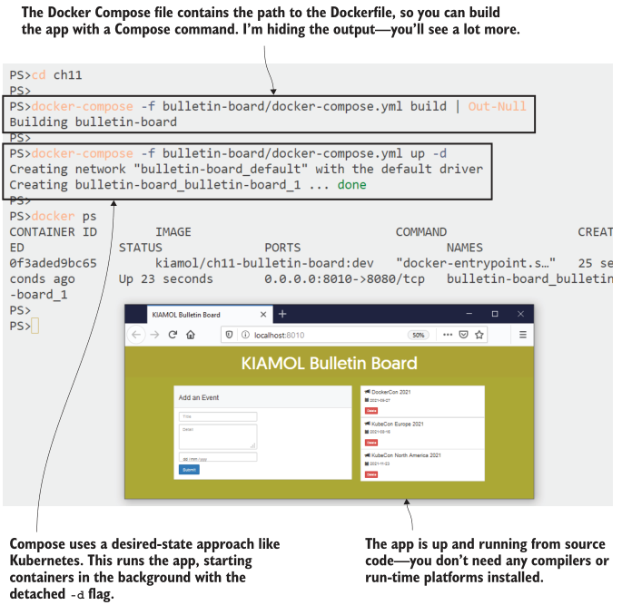
<center>图 11.1 开发人员使用Docker和compose是轻而易举的事情——如果没有任何问题的话</center>

这背后的魔法有两个方面：Dockerfile，其中包含构建和打包Node.js组件的所有步骤，以及Docker Compose文件，其中指定了所有组件以及其Dockerfile的路径。此应用程序中只有一个组件，但可能会有十几个组件——都使用不同的技术——工作流程都将是相同的。但这不是我们将在生产中运行应用程序的方式，因此，如果我们想使用相同的技术堆栈，则可以切换到在Kubernetes中本地运行应用程序，只使用Docker进行构建。

试一试，在源文件夹中提供了使用本地镜像运行应用程序的简单 Kubernetes 清单。删除 Compose 版本的应用程序，并将其部署到 Kubernetes 中。

```
# 停止 Compose 中的应用程序:
docker-compose -f bulletin-board/docker-compose.yml down

# 在 Kubernetes 中部署:
kubectl apply -f bulletin-board/kubernetes/
# 获取新的 URL:
kubectl get svc bulletin-board -o jsonpath='http://{.status.loadBalancer.ingress[0].*}:8011'
# 浏览
```

这个工作流程仍然非常简单，尽管现在我们有三个容器构建工件要处理：Dockerfile、Compose 文件和 Kubernetes 清单。我有自己的 Kubernetes 集群，可以像在生产环境中一样运行应用程序。我的输出在图 11.2 中显示，它展示了使用之前练习中使用 Docker Compose 构建的相同本地镜像运行的相同应用程序。

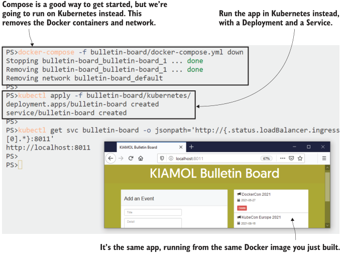
<center>图 11.2 您可以使用 Compose 将 Docker 和 Kubernetes 混合使用以构建在 Pod 中运行的镜像</center>


Kubernetes 可以使用您创建或者使用 Docker 拉取的本地镜像，但是必须遵循一些规则，关于它是否使用本地镜像或从仓库中拉取它。如果镜像名称中没有显式标记（并且使用默认的 :latest 标记），那么 Kubernetes 将始终尝试首先拉取镜像。否则，如果节点上的镜像缓存中存在本地镜像，则 Kubernetes 将使用本地镜像。您可以通过指定镜像拉取策略来覆盖这些规则。清单 11.1 显示了公告板应用程序的 Pod spec，其中包括显式策略。

> 清单 11.1 bb-deployment.yaml, 指定镜像拉取策略

```
spec: # 这是 Deployment 中的 Pod spec
  containers:
    - name: bulletin-board
      image: kiamol/ch11-bulletin-board:dev
      imagePullPolicy: IfNotPresent # 如果存在本地镜像，则优先使用本地镜像
```

这是在开发人员工作流程中可能会遇到的难题。Pod spec 可能被配置为首选仓库镜像，然后您可以无限制地重建自己的本地镜像，但是永远不会看到任何更改，因为 Kubernetes 将始终使用远程镜像。类似的复杂情况还存在于镜像版本周围，因为可以使用相同的名称和标记替换镜像版本。这在 Kubernetes 的期望状态方法中并不奏效，因为如果使用未更改的 Pod spec 部署更新，则不会发生任何事情，即使镜像内容已更改。

回到我们的演示应用程序。您在项目中的第一个任务是向事件列表添加一些更多的细节，这对您来说是一个容易的代码更改。测试更改更具有挑战性，因为您可以重复 Docker Compose 命令来重建镜像，但是如果您重复 kubectl 命令来部署更改，则会发现没有任何事情发生。如果您熟悉容器技术，可以进行一些调查以了解问题并删除 Pod 以强制替换，但是如果您不熟悉容器技术，则您的工作流程已经破损了。

试一试，您实际上不需要更改代码—新文件中已经有了更改。只需替换代码文件并重建镜像，然后删除Pod，就可以看到在替换Pod中运行的新应用程序版本。

```
# 移除原始代码文件:
rm bulletin-board/src/backend/events.js
# 用更新的版本替换它:
cp bulletin-board/src/backend/events-update.js bulletin-board/src/backend/events.js
# 使用 Compose 重新构建镜像:
docker-compose -f bulletin-board/docker-compose.yml build
# 尝试使用 kubectl 重新部署:
kubectl apply -f bulletin-board/kubernetes/
# 删除现有的 Pod 以重新创建它:
kubectl delete pod -l app=bulletin-board
```
您可以在图 11.3 中看到我的输出。更新的应用程序在屏幕截图中运行，但是只有在手动删除 Pod 并由 Deployment 控制器重新创建它，使用最新的镜像版本时才能运行更新的应用程序。

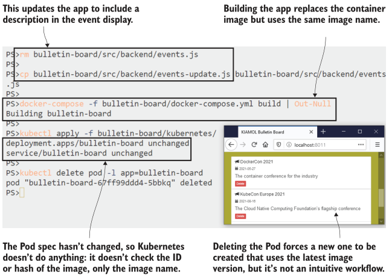
<center>图 11.3 Docker 镜像是可变的，但重命名镜像不会触发Kubernetes中的更新</center>

如果您选择了基于 Docker 的工作流程，那么您可以使用 Docker Compose 快速构建和重复部署应用程序，而不必担心 Kubernetes 中的 Pod spec 和镜像缓存。但是，如果您选择将应用程序迁移到 Kubernetes 环境中，则必须考虑这些问题，并为此做好准备。在 Kubernetes 中部署应用程序需要更多的准备工作，但是它也提供了更大的弹性和可靠性。

另一种选择是将所有容器技术集中在一个团队中，提供一个CI/CD管道，开发团队可以插入该管道来部署他们的应用程序。管道负责包装容器镜像并将其部署到集群，因此开发团队不需要将Docker和Kubernetes引入到自己的工作中。

## 11.2 Kubernetes 开发人员工作流程
在 Kubernetes 上运行的平台即服务 (PaaS) 体验对许多组织来说是一个有吸引力的选择。您可以为所有测试环境运行单个集群，该集群还托管 CI/CD 服务，以处理容器运行时的混乱细节。所有 Docker 构件都已从开发人员工作流程中删除，因此开发人员可直接在其计算机上运行 Node.js 和其他所需的所有组件，并且不在本地使用容器。

该方法将容器移至外部循环——当开发人员将更改推送到源代码时，会触发构建，该构建创建容器镜像，将其推送到仓库并将新版本部署到群集中的测试环境。您可以获得在容器平台上运行的所有好处，而无需容器对开发的摩擦。图 11.4 显示了使用一组技术选项的外部循环的外观。

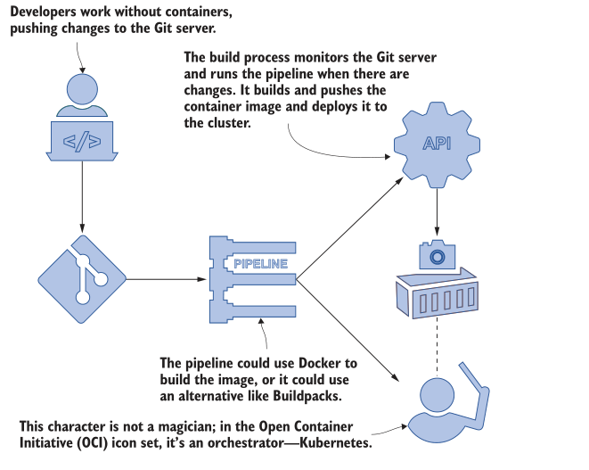
<center>图 11.4 在外循环中使用容器可以让开发人员专注于代码</center>

此方法的承诺是，您可以在不影响开发人员工作流程或要求每个团队成员熟练掌握Docker和Compose的情况下在Kubernetes上运行应用程序。它可以在开发团队在小组件上工作且单独的团队将所有组件组装成工作系统的组织中运行良好，因为只有组装团队需要容器技能。您还可以完全删除Docker，这在您的集群使用不同的容器运行时非常有用。如果您要构建容器镜像而不使用Docker，您需要将其替换为许多其他移动部件。您最终将获得更多的复杂性，但它将集中在交付管道而不是项目中。

我们将在本章中通过示例来演示这一点，但为了管理复杂性，我们将分阶段进行，从内部构建服务的视图开始。为了保持简单，我们将运行自己的Git服务器，以便我们可以从我们的实验室集群中推送更改并触发构建。

立即尝试，Gogs是一个简单但功能强大的Git服务器，它作为Docker Hub上的镜像发布。它是在您的组织中运行私有Git服务器或在在线服务离线时快速启动备份的好方法。在集群中运行Gogs以推送本书源代码的本地副本。
```
# 部署Git服务器:
kubectl apply -f infrastructure/gogs.yaml
# 等待它运行:
kubectl wait --for=condition=ContainersReady pod -l app=gogs
# 将本地Git服务器添加到书籍存储库—
# 这会从服务中获取URL以用作目标:
git remote add gogs $(kubectl get svc gogs -o jsonpath=
'http://{.status.loadBalancer.ingress[0].*}:3000/kiamol/kiamol.git')
# 将代码推送到您的服务器 - 使用身份验证
# 用户名kiamol和密码kiamol
git push gogs
# 查找服务器URL:
kubectl get svc gogs -o
jsonpath='http://{.status.loadBalancer.ingress[0].*}:3000'
# 浏览并使用相同的kiamol凭据登录
```

图11.5显示了我的输出。您不需要为此工作流程运行自己的Git服务器；使用GitHub或任何其他源代码控制系统都可以使用相同的方式，但是这样做可以获得易于重复的环境 - 本章的Gogs设置已经预配置了用户帐户，因此您可以快速启动。

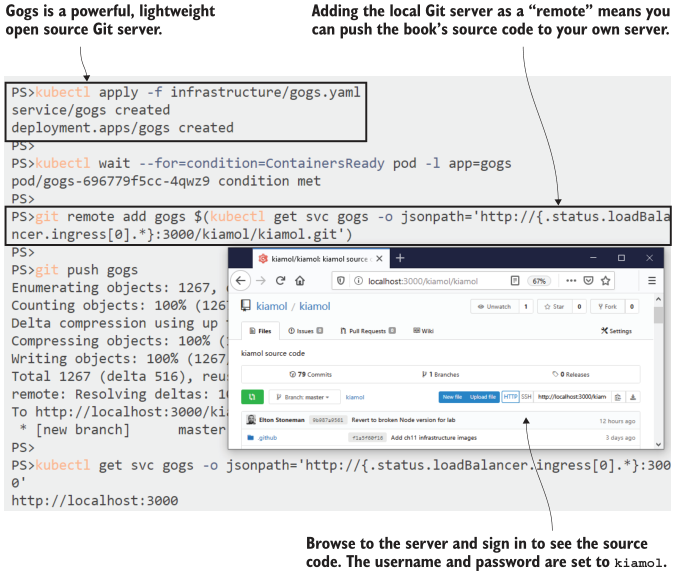
<center> 11.5 在Kubernetes中运行自己的Git服务器非常容易</center>

现在，我们有了一个本地源代码控制服务器，可以在其中插入其他组件。接下来是可以构建容器镜像的系统。为了使其可移植，以便在任何集群上运行，我们需要一些不需要Docker的东西，因为群集可能使用不同的容器运行时。我们有几个选项，但是最好的之一是BuildKit，这是Docker团队的一个开源项目。BuildKit最初是Docker Engine内部的镜像构建组件的替代品，它具有可插拔的架构，因此您可以使用或不使用Dockerfiles构建映像。您可以将BuildKit作为服务器运行，因此工具链中的其他组件可以使用它来构建映像。

试一试，在集群中运行BuildKit作为服务器，并确认它拥有在没有Docker的情况下构建容器镜像所需的所有工具。

```
# 部署BuildKit:
kubectl apply -f infrastructure/buildkitd.yaml
# 等待它开始:
kubectl wait --for=condition=ContainersReady pod -l app=buildkitd
# verify that Git and BuildKit are available:
kubectl exec deploy/buildkitd -- sh -c 'git version && buildctl
--version'
# check that Docker isn’t installed—this command will fail:
kubectl exec deploy/buildkitd -- sh -c 'docker version'
```

您可以在图11.6中看到我的输出，其中BuildKit Pod正在运行一个安装了BuildKit和Git客户端但没有Docker的镜像。重要的是要意识到，BuildKit完全独立——它不连接到Kubernetes中的容器运行时以构建镜像；所有这些都将在Pod内部完成。

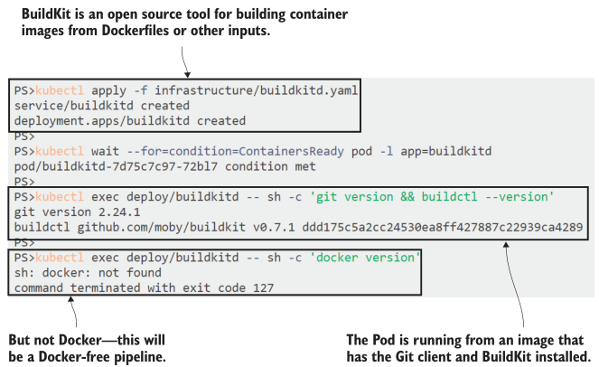
<center> 11.6 BuildKit作为容器镜像构建服务运行，无需Docker</center>

在我们能够看到完整的PaaS工作流程之前，我们需要设置更多的组件，但是现在我们已经有足够的内容来看到其中的构建部分是如何工作的。我们在这里针对无Docker的方法，因此我们将忽略上一节中使用的Dockerfile，并直接从源代码中构建应用程序到容器镜像中。如何做到这一点呢？通过使用一个名为Buildpacks的CNCF项目，这是由Heroku推出的一种技术，用于支持其PaaS产品。

Buildpacks使用与多阶段Dockerfile相同的概念：在容器内部运行构建工具来编译应用程序，然后将编译的应用程序打包到另一个具有应用程序运行时的容器镜像之上。您可以使用一个名为Pack的工具，对应用程序的源代码运行它。Pack会确定您使用的语言，将其与Buildpack匹配，然后将您的应用程序打包成一个映像——不需要Dockerfile。现在Pack仅能与Docker一起运行，但我们不使用Docker，因此可以使用另一种方法将Buildpacks与BuildKit集成。

现在我们将进入构建过程，手动运行构建，稍后在本章中自动化。连接到BuildKit Pod，从本地Git服务器拉取书籍代码，并使用Buildpacks而不是Dockerfile进行构建。
```
# 连接到 BuildKit Pod 中的会话:
kubectl exec -it deploy/buildkitd -- sh
# 从Gogs 克隆源码:
cd ~
git clone http://gogs:3000/kiamol/kiamol.git
# 切换到 app 目录:
cd kiamol/ch11/bulletin-board/
# 使用 BuidKit 构建应用:
buildctl build --frontend=gateway.v0 --opt source=kiamol/buildkit-buildpacks --local context=src --output
type=image,name=kiamol/ch11-bulletin-board:buildkit
# 构建完成退出会话
exit
```

This exercise takes a while to run, but keep an eye on the output from BuildKit, and you’ll see what’s happening—first, it downloads the component that provides the Buildpacks integration, and then that runs and finds this is a Node.js app; it packages the app into a compressed archive and then exports the archive into a container image that has the Node.js runtime installed. My output is shown in figure 11.7.
这项任务需要运行一段时间，但请注意来自BuildKit的输出，您将看到正在发生的事情——首先，它下载提供Buildpacks集成的组件，然后运行并发现这是一个Node.js应用程序；它将应用程序打包成压缩归档文件，然后将归档文件导出到包含Node.js运行时的容器镜像中。图11.7显示了我的输出。

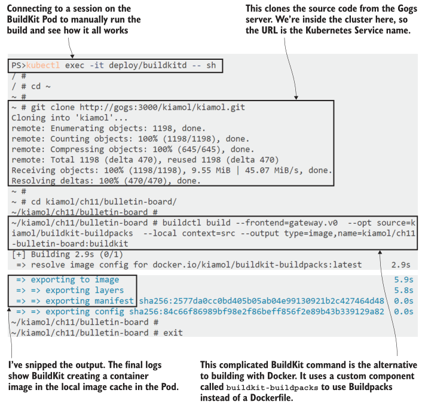
<center> 11.7 在没有Docker和Dockerfile的情况下构建容器镜像会增加很多复杂性</center>

您不能在BuildKit Pod上从该镜像运行容器，因为它没有配置容器运行时，但是BuildKit能够将镜像推送到仓库中构建和打包应用程序以在容器中运行而不需要Dockerfile或Docker是相当令人印象深刻的，但代价是很大的。

最大的问题是构建过程的复杂性和所有组件的成熟度。 BuildKit是一个稳定的工具，但它远不如标准的Docker构建引擎使用得广泛。 Buildpacks是一种有前途的方法，但对Docker的依赖意味着它们在像云中的受管Kubernetes集群这样的无Docker环境中无法很好地工作。我们用来桥接它们的组件是由BuildKit项目的维护者Tõnis Tiigi编写的一种工具。它实际上只是一个将Buildpacks插入BuildKit中的概念验证工具；它足以演示工作流程，但不是您想依靠构建生产应用程序的工具。

有替代方案。 GitLab是将Git服务器与使用Buildpacks的构建流水线相结合的产品，而Jenkins X是Kubernetes的本地构建服务器。它们本身就是复杂的产品，您需要知道，如果想从开发人员工作流程中删除Docker，则会在构建过程中换取更多的复杂性。本章的最后，您将能够决定结果是否值得。接下来，我们将看看如何在Kubernetes中隔离工作负载，以便单个集群可以运行您的交付流水线和所有测试环境。
## 11.3 Isolating workloads with contexts and namespaces

Way back in chapter 3, I introduced Kubernetes namespaces—and very quickly moved on. You need to be aware of them to make sense of the fully qualified DNS names Kubernetes uses for Services, but you don’t need to use them until you start dividing up  your cluster. Namespaces are a grouping mechanism—every Kubernetes object belongs to a namespace—and you can use multiple namespaces to create virtual clusters from one real cluster.

Namespaces are very flexible, and organizations use them in different ways. You might use them in a production cluster to divide it up for different products or to divide up a nonproduction cluster for different environments—integration test, system test, and user testing. You might even have a development cluster where each developer has their own namespace, so they don’t need to run their own cluster. Namespaces are a boundary where you can apply security and resource restrictions, so deployment, but we’ll start with a simple walkthrough.

TRY IT NOW
Kubectl is namespace aware. You can explicitly create a namespace, and then deploy and query resources using the namespace flag—this creates a simple sleep Deployment.

```
# create a new namespace:
kubectl create namespace kiamol-ch11-test
# deploy a sleep Pod in the new namespace:
kubectl apply -f sleep.yaml --namespace kiamol-ch11-test
# list sleep Pods—this won’t return anything:
kubectl get pods -l app=sleep
# now list the Pods in the namespace:
kubectl get pods -l app=sleep -n kiamol-ch11-test
```

My output is shown in figure 11.8, where you can see that namespaces are an essential part of resource metadata. You need to explicitly specify the namespace to work with an object in kubectl. The only reason we’ve avoided this for the first 10 chapters is that every cluster has a namespace called default, which is used if you don’t specify a namespace, and that’s where we’ve created and used everything so far.


<center> 11.8 Namespaces isolate workloads—you can use them to represent different environments</center>

Objects within a namespace are isolated, so you can deploy the same apps with the same object names in different namespaces. Resources can’t see resources in other namespaces. Kubernetes networking is flat, so Pods in different namespaces can communicate through Services, but a controller looks for Pods only in its own namespace. Namespaces are ordinary Kubernetes resources, too. Listing 11.2 shows a namespace spec in YAML, along with the metadata for another sleep Deployment that uses the new namespace.

> Listing 11.2 sleep-uat.yaml, a manifest that creates and targets a namespace

```
apiVersion: v1
kind: Namespace # Namespace specs need only a name.
metadata:
  name: kiamol-ch11-uat
---
apiVersion: apps/v1
kind: Deployment
metadata: # The target namespace is part of the
  name: sleep # object metadata. The namespace needs
  namespace: kiamol-ch11-uat # to exist, or the deployment fails.
# The Pod spec follows.
```

The Deployment and Pod specs in that YAML file use the same names as the objects you deployed in the previous exercise, but because the controller is set to use a different namespace, all the objects it creates will be in that namespace, too. When you deploy this manifest, you’ll see the new objects created without any naming collisions.

TRY IT NOW
Create a new UAT namespace and Deployment from the YAML in listing 11.2. The controller uses the same name, and you can see objects across namespaces using kubectl. Deleting a namespace deletes all its resources.

```
# create the namespace and Deployment:
kubectl apply -f sleep-uat.yaml
# list the sleep Deployments in all namespaces:
kubectl get deploy -l app=sleep --all-namespaces
# delete the new UAT namespace:
kubectl delete namespace kiamol-ch11-uat
# list Deployments again:
kubectl get deploy -l app=sleep --all-namespaces
```

You can see my output in figure 11.9. The original sleep Deployment didn’t specify a namespace in the YAML file, and we created it in the kiamol-ch11-test namespace by specifying that in the kubectl command. The second sleep Deployment specified the   kiamol-ch11-uat namespace in the YAML, so it was created there without needing a kubectl namespace flag.

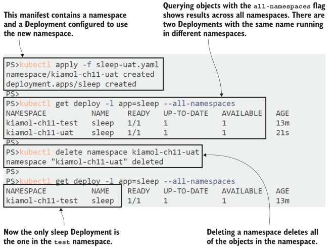
<center> 11.9 Namespaces are a useful abstraction for managing groups of objects</center>

In a shared cluster environment, you might regularly use different namespaces— deploying apps in your own development namespace and then looking at logs in the test namespace. Switching between them using kubectl flags is time consuming and
error prone, and kubectl provides an easier way with contexts. A context defines the connection details for a Kubernetes cluster and sets the default namespace to use in kubectl commands. Your lab environment will already have a context set up, and you
can modify that to switch namespaces.

TRY IT NOW
Show your configured contexts, and update the current one to set the default namespace to the test namespace.

```
# list all contexts:
kubectl config get-contexts
# update the default namespace for the current context:
kubectl config set-context --current --namespace=kiamol-ch11-test
# list the Pods in the default namespace:
kubectl get pods
```

You can see in figure 11.10 that setting the namespace for the context sets the default namespace for all kubectl commands. Any queries that don’t specify a namespace and any create commands where the YAML doesn’t specify a namespace will now all use the test namespace. You can create multiple contexts, all using the same cluster but different namespaces, and switch between them with the kubectl use-context command.

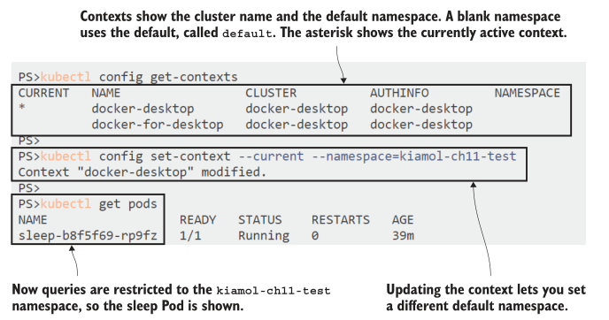
<center> 11.10 Contexts are an easy way to switch between namespaces and clusters</center>

The other important use for contexts is to switch between clusters. When you set up Docker Desktop or K3s, they create a context for your local cluster—the details all live in a configuration file, which is stored in the .kube directory in your home folder. Managed

Kubernetes services usually have a feature to add a cluster to your config file, so you can work with remote clusters from your local machine. The remote API server will be secured using TLS, and your kubectl configuration will use a client certificate to identify you as the user. You can see those security details by viewing the configuration.

TRY IT NOW
Reset your context to use the default namespace, and then print out the details of the client configuration.

```
# setting the namespace to blank resets the default:
kubectl config set-context --current --namespace=
# printing out the config file shows your cluster connection:
kubectl config view
```

Figure 11.11 shows my output, with a local connection to my Docker Desktop cluster using TLS certificates—which aren’t shown by kubectl—to authenticate the connection.

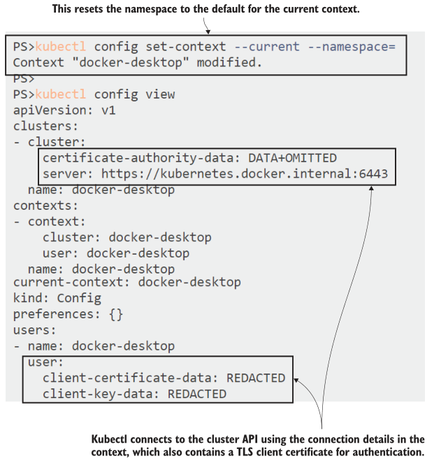
<center> 11.11 Contexts contain the connection details for the cluster, which could be local or remote</center>

Kubectl can also use a token to authenticate with the Kubernetes API server, and Pods are provided with a token they can use as a Secret, so apps running in Kubernetes can connect to the Kubernetes API to query or deploy objects. That’s a long way to getting where we want to go next: we’ll run a build server in a Pod that triggers a build when the source code changes in Git, builds the image using BuildKit, and deploys it to Kubernetes in the test namespace.

## 11.4 Continuous delivery in Kubernetes without Docker
Actually, we’re not quite there yet, because the build process needs to push the image to a registry, so Kubernetes can pull it to run Pod containers. Real clusters have multiple nodes, and each of them needs to be able to access the image registry. That’s been easy so far because we’ve used public images on Docker Hub, but in your own builds, you’ll push to a private repository first. Kubernetes supports pulling private images by storing registry credentials in a special type of Secret object.

You’ll need to have an account set up on an image registry to follow along with this section—Docker Hub is fine, or you can create a private registry on the cloud using Azure Container Registry (ACR) or Amazon Elastic Container Registry (ECR). If you’re running your cluster in the cloud, it makes sense to use that cloud’s registry to reduce download times, but all registries use the same API as Docker Hub, so they’re interchangeable.

TRY IT NOW
Create a Secret to store registry credentials. To make it easier to follow along, there’s a script to collect the credentials into local variables. Don’t worry—the scripts don’t email your credentials to me. . .

```
# collect the details—on Windows:
. .\set-registry-variables.ps1
# OR on Linux/Mac:
. ./set-registry-variables.sh
# create the Secret using the details from the script:
kubectl create secret docker-registry registry-creds --docker-
server=$REGISTRY_SERVER --docker-username=$REGISTRY_USER --docker-
password=$REGISTRY_PASSWORD
# show the Secret details:
kubectl get secret registry-creds
```

My output appears in figure 11.12. I’m using Docker Hub, which lets you create temporary access tokens that you can use in the same way as a password for your account. When I’m done with this chapter, I’ll revoke the access token—that’s a nice security
feature in Hub.

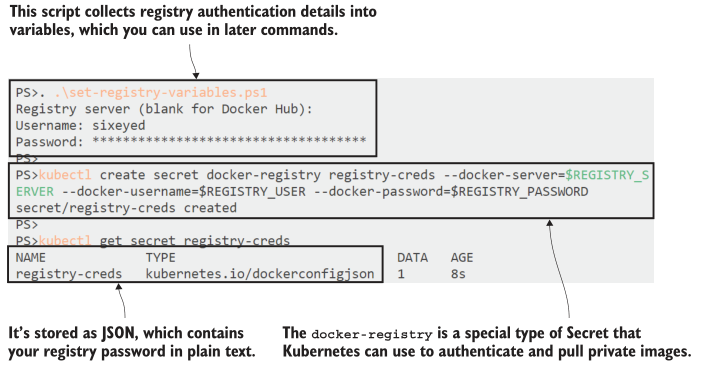
<center> 11.12 Your organization may use a private image registry—you need a Secret to authenticate</center>

Okay, now we’re ready. We have a Docker-less build server running in the BuildKit Pod, a local Git server we can use to quickly iterate over the build process, and a registry Secret stored in the cluster. We can use all of those pieces with an automation


server to run the build pipeline, and we’ll be using Jenkins for that. Jenkins has a long legacy as a build server, and it’s very popular, but you don’t need to be a Jenkins guru to set up this build, because I have it already configured in a custom
Docker Hub image.

The Jenkins image for this chapter has the BuildKit and kubectl command lines installed, and the Pod is set up to surface credentials in the right places. The registry Secret you created in the previous exercise is mounted in the Pod container, so  BuildKit can use it to authenticate to the registry when it pushes the image. Kubectl is configured to connect to the local API server in the cluster using the token Kubernetes provides in another Secret. Deploy the Jenkins server, and check that everything is correctly configured.

TRY IT NOW
Jenkins gets everything it needs from Kubernetes Secrets, using a startup script in the container image. Start by deploying Jenkins and confirming it can connect to Kubernetes.

```
# deploy Jenkins:
kubectl apply -f infrastructure/jenkins.yaml
# wait for the Pod to spin up:
kubectl wait --for=condition=ContainersReady pod -l app=jenkins
# check that kubectl can connect to the cluster:
kubectl exec deploy/jenkins -- sh -c 'kubectl version --short'
# check that the registry Secret is mounted:
kubectl exec deploy/jenkins -- sh -c 'ls -l /root/.docker'
```

In this exercise, you’ll see kubectl report the version of your own Kubernetes lab cluster—that confirms the Jenkins Pod container is set up correctly to authenticate to Kubernetes, so it can deploy applications to the same cluster where it is running. My output is shown in figure 11.13.

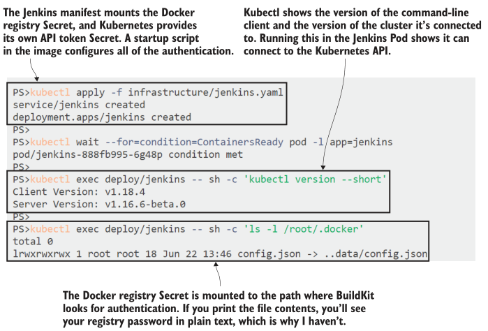 
<center> 11.13 Jenkins runs the pipeline, so it needs authentication details for Kubernetes and the registry</center>

Everything is in place now for Jenkins to fetch application code from the Gogs Git server, connect to the BuildKit server to build the container image using Buildpacks and push it to the registry, and deploy the latest application version to the test namespace. That work is already set up using a Jenkins pipeline, but the pipeline steps just use simple build scripts in the application folder. Listing 11.3 shows the build stage, which packages and pushes the image.

> Listing 11.3 build.sh, the build script using BuildKit

```
buildctl --addr tcp://buildkitd:1234 \ # The command runs on Jenkins,
  build \ # but it uses the BuildKit server.
  --frontend=gateway.v0 \
  --opt source=kiamol/buildkit-buildpacks \ # Uses Buildpacks as input
  --local context=src \
  --output type=image,name=${REGISTRY_SERVER}/${REGISTRY_USER}/bulletin-board:
     ${BUILD_NUMBER}-kiamol,push=true # Pushes the output to the registry
```

The script is an extension of the simpler BuildKit command you ran in section 11.2, when you were pretending to be the build server. The buildctl command uses the same integration component for Buildpacks, so there’s no Dockerfile in here. This command runs inside the Jenkins Pod, so it specifies an address for the BuildKit server, which is running in a separate Pod behind the Service called buildkitd. No Docker here, either. The variables in the image name are all set by Jenkins, but they’re standard
environment variables, so there’s no dependency on Jenkins in the build scripts.

When this stage of the pipeline completes, the image will have been built and pushed to the registry. The next stage is to deploy the updated application, which is in a separate script, shown in listing 11.4. You don’t need to run this yourself—it’s all in the Jenkins pipeline.

> Listing 11.4 run.sh, the deployment script using Helm

```
helm upgrade --install --atomic \ # Upgrades or installs the release
  --set registryServer=${REGISTRY_SERVER}, \ # Sets the values for the
        registryUser=${REGISTRY_USER}, \ # image tag, referencing
        imageBuildNumber=${BUILD_NUMBER} \ # the new image version
--namespace kiamol-ch11-test \ # Deploys to the test namespace
bulletin-board \
helm/bulletin-board
```

The deployment uses Helm with a chart that has values for the parts of the image name. They’re set from the same variables used in the build stage, which are compiled from the Docker registry Secret and the build number in Jenkins. In my case, the first
build pushes an image to Docker Hub named sixeyed/bulletin-board:1-kiamol and installs a Helm release using that image. To run the build in your cluster and push to your registry, you just need to log in to Jenkins and enable the build—the pipeline itself is already set up.

TRY IT NOW
Jenkins is running and configured, but the pipeline job isn’t enabled. Log in to enable the job, and you will see the pipeline execute and the app deployed to the cluster.

```
# get the URL for Jenkins:
kubectl get svc jenkins -o
jsonpath='http://{.status.loadBalancer.ingress[0].*}:8080/job/kiamol'
# browse and login with username kiamol and password kiamol;
# if Jenkins is still setting itself up you’ll see a wait screen
# click enable for the Kiamol job and wait . . .
# when the pipeline completes, check the deployment:
kubectl get pods -n kiamol-ch11-test -l
app.kubernetes.io/name=bulletin-board -o=custom-
columns=NAME:.metadata.name,IMAGE:.spec.containers[0].image
# find the URL of the test app:
kubectl get svc -n kiamol-ch11-test bulletin-board -o
jsonpath='http://{.status.loadBalancer.ingress[0].*}:8012'
# browse
```

The build should be fast because it’s using the same BuildKit server that has already cached the images for the Buildpack build from section 11.2. When the build has completed, you can browse to the application deployed by Helm in the test namespace and see the app running—mine is shown in figure 11.14.

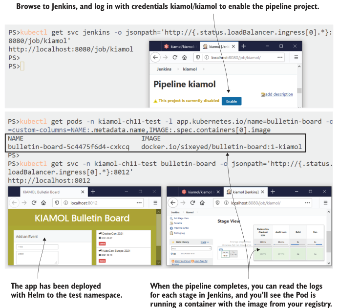
<center> 11.14 The pipeline in action, built and deployed to Kubernetes without Docker or Dockerfiles</center>

So far so good. We’re playing the ops role, so we understand all the moving parts in the delivery of this app—we would own the pipeline in the Jenkinsfile and the application specs in the Helm chart. Lots of small fiddly details are in there, like the templated image name and the image pull Secret in the Deployment YAML, but from the developer’s point of view, that’s all hidden.

The developer’s view is that you can work on the app using your local environment, push changes, and see them running at the test URL, without worrying what happens in between. We can see that workflow now. You made an application change earlier to add event descriptions to the site, and to deploy that, all you need to do is push the changes to your local Git server and wait for the Jenkins build to complete.

TRY IT NOW
Push your code change to your Gogs server; Jenkins will see the change within one minute and start a new build. That will push a new image version to your registry and update the Helm release to use that version.

```
# add your code change, and push it to Git:
git add bulletin-board/src/backend/events.js
git commit -m 'Add event descriptions'
git push gogs
# browse back to Jenkins, and wait for the new build to finish
# check that the application Pod is using the new image version:
kubectl get pods -n kiamol-ch11-test -l
app.kubernetes.io/name=bulletin-board -o=custom-
columns=NAME:.metadata.name,IMAGE:.spec.containers[0].image
# browse back to the app
```

This is the git push PaaS workflow applied to Kubernetes. We’re dealing with a simple app here, but the approach is the same for a large system with many components: a shared namespace could be the deployment target for all the latest versions, pushed by many different teams. Figure 11.15 shows an application update in Kubernetes triggered from a push of code, with no  requirement for developers to use Docker, Kubernetes, or Helm.

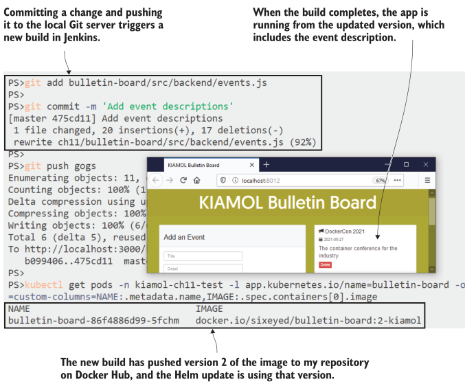
<center> 11.15 It’s PaaS on your own Kubernetes cluster—a lot of complexity is hidden from the developer</center>

Of course, the PaaS approach and the Docker approach are not mutually exclusive. If your cluster is running on Docker, you can take advantage of a simpler build process for Docker-based apps but still support a Docker-free PaaS approach for other apps, all in the same cluster. Each approach offers benefits and drawbacks, and we’ll end by looking at how you should choose between them.

## 11.5 Evaluating developer workflows on Kubernetes

In this chapter, we’ve looked at developer workflows at extreme ends of the spectrum, from teams who fully embrace containers and want to make them front and center in every environment, to teams who don’t want to add any ceremony to their development process, want to keep working natively, and leave all the container bits to the CI/CD pipeline. There are plenty of places in between, and the likelihood is that you’ll build an approach to suit your organization, your application architectures, and your Kubernetes platform.


The decision is as much about culture as about technology. Do you want every team to level up on container knowledge, or do you want to centralize that knowledge in a service team and leave the developer teams to focus on delivering software? Although I’d love to see copies of Learn Docker in a Month of Lunches and Learn Kubernetes in a Month of Lunches on every desk, skilling up on containers does require a pretty big commitment. Here are the major advantages I see in keeping Docker and Kubernetes visible in your projects:

* The PaaS approach is complicated and bespoke—you’ll be plugging together lots of different technologies with different maturity levels and support structures.

* The Docker approach is flexible—you can add any dependencies and setup you need in a Dockerfile, whereas PaaS approaches are more prescriptive, so they won’t fit every app.

* PaaS technologies don’t have the optimizations you can get when you fine-tune your Docker images; the bulletin board image from the Docker workflow is 95 MB compared to 1 GB for the Buildpacks version—that’s a much smaller surface area to secure.
* The commitment to learning Docker and Kubernetes pays off because they’re portable skills—developers can easily move between projects using a standard toolset.
* Teams don’t have to use the full container stack; they can opt out at different stages—some developers might just use Docker to run containers, whereas others might use Docker Compose and others Kubernetes.
* Distributed knowledge makes for a better collaborative culture—centralized service teams might be resented for being the only ones who get to play with all the fun technology.

Ultimately, it’s a decision for your organization and teams, and the pain of migrating from the current workflow to the desired workflow needs to be considered. In my own consulting work, I’m often balancing development and operations roles, and I tend to be pragmatic. When I’m actively developing, I use native tooling (I typically work on .NET projects using Visual Studio), but before I push any changes, I run the CI process locally to build container images with Docker Compose and then spin everything
up in my local Kubernetes cluster. That won’t fit every scenario, but I find it a good balance between development speed and  confidence that my changes will work the same way in the next environment.

That’s all for the developer workflow, so we can tidy up the cluster before we move on. Leave your build components running (Gogs, BuildKit, and Jenkins)—you’ll need them for the lab.

TRY IT NOW
Remove the bulletin board deployments.

```
# uninstall the Helm release from the pipeline:
helm -n kiamol-ch11-test uninstall bulletin-board
# delete the manual deployment:
kubectl delete all -l app=bulletin-board
```

## 11.6 Lab
This lab is a bit nasty, so I’ll apologize in advance—but I want you to see that going down the PaaS path with a custom set of tools has danger in store. The bulletin board app for this chapter used a very old version of the Node runtime, version 10.5.0, and in
the lab, that needs updating to a more recent version. There’s a new source code folder for the lab that uses Node 10.6.0, and your job is to set up a pipeline to build that version, and then find out why it fails and fix it. There are a few hints that follow because the goal isn’t for you to learn Jenkins but to see how to debug failing pipelines:

- Start by creating a new item from the Jenkins home page: choose the option to copy an existing job, and copy the kiamol job; call the new job anything you like.
- In the new job configuration in the Pipeline tab, change the path to the pipeline file to the new source code folder: ch11/lab/bulletin-board/Jenkinsfile.
- Build the job, and look through the logs to find out why it failed.
- You’ll need to make a change in the lab source folder and push it to Gogs to fix the build


My sample solution is on GitHub with some screenshots for the Jenkins setup to help you: https://github.com/sixeyed/kiamol/blob/master/ch11/lab/README.md.