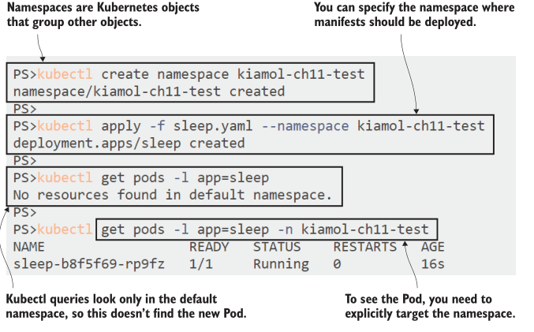

# 第十一章 App 开发——开发人员工作流程及 CI/CD

这是本书中有关实际应用 Kubernetes 的最后一章，重点是开发和交付在 Kubernetes 上运行的软件的实用性。无论您是开发人员还是正在与开发人员一起工作的操作人员，容器的使用都会影响您的工作方式、使用的工具以及从进行代码更改到在开发和测试环境中看到其运行所需的时间和精力。在本章中，我们将探讨Kubernetes如何影响内部循环——本地机器上的开发人员工作流程和外部循环——将更改推送到测试和生产的CI/CD工作流程中。

您在组织中如何使用Kubernetes将与您在本书中使用它的方式非常不同，因为您将使用共享的资源，例如群集和镜像仓库。随着我们在本章中探讨交付工作流程，我们还将涵盖许多可能会在向现实世界转变时令您感到困惑的细节，例如使用私有镜像仓库和维护共享群集上的隔离。本章的主要重点是帮助您了解在Docker为中心的工作流程和类似于运行在Kubernetes上的平台即服务（PaaS）之间做出选择。

## 11.1 Docker 开发人员工作流程

开发人员喜欢 Docker。在Stack Overflow的年度调查中，它被评为“最想要的平台”第一名和“最受喜爱的”第二名两年。Docker使开发人员工作流程的一些部分变得非常容易，但代价是：Docker构件成为项目的核心，这对内部循环产生了影响。如果您不熟悉使用容器构建应用程序，请参阅我的另外一篇《在一个月的午餐时间内学习Docker》一书。

在本节中，我们将介绍使用Docker和Kubernetes在每个环境中的开发人员工作流程，并且开发人员拥有自己的专用群集。如果您想要跟随练习，那么您需要安装Docker。如果您的实验室环境是Docker Desktop或K3s，那么您就可以开始了。我们将首先看一下开发人员入职——加入新项目并尽快掌握工作。

现在，本章提供了一个全新的演示应用程序——一个简单的公告板，您可以在其中发布即将到来的活动详情。它是用Node.js编写的，但您无需安装Node.js即可使用Docker工作流快速上手。

```
# 切换到本章的源代码文件夹：
cd ch11
# 构建应用程序：
docker-compose -f bulletin-board/docker-compose.yml build
# 运行应用程序：
docker-compose -f bulletin-board/docker-compose.yml up -d
# 检查正在运行的容器：
docker ps
# 浏览器打开http://localhost:8010/查看应用程序。
```

这是您可以作为新项目的开发人员开始的最简单的方式。您唯一需要安装的软件是Docker，然后获取代码的副本，就可以开始了。您可以在图11.1中看到我的输出。我的机器上没有安装Node.js，无论您是否安装了它以及它的版本是什么，您的结果将是相同的。


<center>图 11.1 开发人员使用Docker和compose是轻而易举的事情——如果没有任何问题的话</center>

这背后的魔法有两个方面：Dockerfile，其中包含构建和打包Node.js组件的所有步骤，以及Docker Compose文件，其中指定了所有组件以及其Dockerfile的路径。此应用程序中只有一个组件，但可能会有十几个组件——都使用不同的技术——工作流程都将是相同的。但这不是我们将在生产中运行应用程序的方式，因此，如果我们想使用相同的技术堆栈，则可以切换到在Kubernetes中本地运行应用程序，只使用Docker进行构建。

试一试，在源文件夹中提供了使用本地镜像运行应用程序的简单 Kubernetes 清单。删除 Compose 版本的应用程序，并将其部署到 Kubernetes 中。

```
# 停止 Compose 中的应用程序:
docker-compose -f bulletin-board/docker-compose.yml down

# 在 Kubernetes 中部署:
kubectl apply -f bulletin-board/kubernetes/
# 获取新的 URL:
kubectl get svc bulletin-board -o jsonpath='http://{.status.loadBalancer.ingress[0].*}:8011'
# 浏览
```

这个工作流程仍然非常简单，尽管现在我们有三个容器构建工件要处理：Dockerfile、Compose 文件和 Kubernetes 清单。我有自己的 Kubernetes 集群，可以像在生产环境中一样运行应用程序。我的输出在图 11.2 中显示，它展示了使用之前练习中使用 Docker Compose 构建的相同本地镜像运行的相同应用程序。


<center>图 11.2 您可以使用 Compose 将 Docker 和 Kubernetes 混合使用以构建在 Pod 中运行的镜像</center>


Kubernetes 可以使用您创建或者使用 Docker 拉取的本地镜像，但是必须遵循一些规则，关于它是否使用本地镜像或从仓库中拉取它。如果镜像名称中没有显式标记（并且使用默认的 :latest 标记），那么 Kubernetes 将始终尝试首先拉取镜像。否则，如果节点上的镜像缓存中存在本地镜像，则 Kubernetes 将使用本地镜像。您可以通过指定镜像拉取策略来覆盖这些规则。清单 11.1 显示了公告板应用程序的 Pod spec，其中包括显式策略。

> 清单 11.1 bb-deployment.yaml, 指定镜像拉取策略

```
spec: # 这是 Deployment 中的 Pod spec
  containers:
    - name: bulletin-board
      image: kiamol/ch11-bulletin-board:dev
      imagePullPolicy: IfNotPresent # 如果存在本地镜像，则优先使用本地镜像
```

这是在开发人员工作流程中可能会遇到的难题。Pod spec 可能被配置为首选仓库镜像，然后您可以无限制地重建自己的本地镜像，但是永远不会看到任何更改，因为 Kubernetes 将始终使用远程镜像。类似的复杂情况还存在于镜像版本周围，因为可以使用相同的名称和标记替换镜像版本。这在 Kubernetes 的期望状态方法中并不奏效，因为如果使用未更改的 Pod spec 部署更新，则不会发生任何事情，即使镜像内容已更改。

回到我们的演示应用程序。您在项目中的第一个任务是向事件列表添加一些更多的细节，这对您来说是一个容易的代码更改。测试更改更具有挑战性，因为您可以重复 Docker Compose 命令来重建镜像，但是如果您重复 kubectl 命令来部署更改，则会发现没有任何事情发生。如果您熟悉容器技术，可以进行一些调查以了解问题并删除 Pod 以强制替换，但是如果您不熟悉容器技术，则您的工作流程已经破损了。

试一试，您实际上不需要更改代码—新文件中已经有了更改。只需替换代码文件并重建镜像，然后删除Pod，就可以看到在替换Pod中运行的新应用程序版本。

```
# 移除原始代码文件:
rm bulletin-board/src/backend/events.js
# 用更新的版本替换它:
cp bulletin-board/src/backend/events-update.js bulletin-board/src/backend/events.js
# 使用 Compose 重新构建镜像:
docker-compose -f bulletin-board/docker-compose.yml build
# 尝试使用 kubectl 重新部署:
kubectl apply -f bulletin-board/kubernetes/
# 删除现有的 Pod 以重新创建它:
kubectl delete pod -l app=bulletin-board
```
您可以在图 11.3 中看到我的输出。更新的应用程序在屏幕截图中运行，但是只有在手动删除 Pod 并由 Deployment 控制器重新创建它，使用最新的镜像版本时才能运行更新的应用程序。


<center>图 11.3 Docker 镜像是可变的，但重命名镜像不会触发Kubernetes中的更新</center>

如果您选择了基于 Docker 的工作流程，那么您可以使用 Docker Compose 快速构建和重复部署应用程序，而不必担心 Kubernetes 中的 Pod spec 和镜像缓存。但是，如果您选择将应用程序迁移到 Kubernetes 环境中，则必须考虑这些问题，并为此做好准备。在 Kubernetes 中部署应用程序需要更多的准备工作，但是它也提供了更大的弹性和可靠性。

另一种选择是将所有容器技术集中在一个团队中，提供一个CI/CD管道，开发团队可以插入该管道来部署他们的应用程序。管道负责包装容器镜像并将其部署到集群，因此开发团队不需要将Docker和Kubernetes引入到自己的工作中。

## 11.2 Kubernetes 开发人员工作流程
在 Kubernetes 上运行的平台即服务 (PaaS) 体验对许多组织来说是一个有吸引力的选择。您可以为所有测试环境运行单个集群，该集群还托管 CI/CD 服务，以处理容器运行时的混乱细节。所有 Docker 构件都已从开发人员工作流程中删除，因此开发人员可直接在其计算机上运行 Node.js 和其他所需的所有组件，并且不在本地使用容器。

该方法将容器移至外部循环——当开发人员将更改推送到源代码时，会触发构建，该构建创建容器镜像，将其推送到仓库并将新版本部署到群集中的测试环境。您可以获得在容器平台上运行的所有好处，而无需容器对开发的摩擦。图 11.4 显示了使用一组技术选项的外部循环的外观。


<center>图 11.4 在外循环中使用容器可以让开发人员专注于代码</center>

此方法的承诺是，您可以在不影响开发人员工作流程或要求每个团队成员熟练掌握Docker和Compose的情况下在Kubernetes上运行应用程序。它可以在开发团队在小组件上工作且单独的团队将所有组件组装成工作系统的组织中运行良好，因为只有组装团队需要容器技能。您还可以完全删除Docker，这在您的集群使用不同的容器运行时非常有用。如果您要构建容器镜像而不使用Docker，您需要将其替换为许多其他移动部件。您最终将获得更多的复杂性，但它将集中在交付管道而不是项目中。

我们将在本章中通过示例来演示这一点，但为了管理复杂性，我们将分阶段进行，从内部构建服务的视图开始。为了保持简单，我们将运行自己的Git服务器，以便我们可以从我们的实验室集群中推送更改并触发构建。

立即尝试，Gogs是一个简单但功能强大的Git服务器，它作为Docker Hub上的镜像发布。它是在您的组织中运行私有Git服务器或在在线服务离线时快速启动备份的好方法。在集群中运行Gogs以推送本书源代码的本地副本。
```
# 部署Git服务器:
kubectl apply -f infrastructure/gogs.yaml
# 等待它运行:
kubectl wait --for=condition=ContainersReady pod -l app=gogs
# 将本地Git服务器添加到书籍存储库—
# 这会从服务中获取URL以用作目标:
git remote add gogs $(kubectl get svc gogs -o jsonpath=
'http://{.status.loadBalancer.ingress[0].*}:3000/kiamol/kiamol.git')
# 将代码推送到您的服务器 - 使用身份验证
# 用户名kiamol和密码kiamol
git push gogs
# 查找服务器URL:
kubectl get svc gogs -o
jsonpath='http://{.status.loadBalancer.ingress[0].*}:3000'
# 浏览并使用相同的kiamol凭据登录
```

图11.5显示了我的输出。您不需要为此工作流程运行自己的Git服务器；使用GitHub或任何其他源代码控制系统都可以使用相同的方式，但是这样做可以获得易于重复的环境 - 本章的Gogs设置已经预配置了用户帐户，因此您可以快速启动。


<center>图 11.5 在Kubernetes中运行自己的Git服务器非常容易</center>

现在，我们有了一个本地源代码控制服务器，可以在其中插入其他组件。接下来是可以构建容器镜像的系统。为了使其可移植，以便在任何集群上运行，我们需要一些不需要Docker的东西，因为群集可能使用不同的容器运行时。我们有几个选项，但是最好的之一是BuildKit，这是Docker团队的一个开源项目。BuildKit最初是Docker Engine内部的镜像构建组件的替代品，它具有可插拔的架构，因此您可以使用或不使用Dockerfiles构建映像。您可以将BuildKit作为服务器运行，因此工具链中的其他组件可以使用它来构建映像。

试一试，在集群中运行BuildKit作为服务器，并确认它拥有在没有Docker的情况下构建容器镜像所需的所有工具。

```
# 部署BuildKit:
kubectl apply -f infrastructure/buildkitd.yaml
# 等待它开始:
kubectl wait --for=condition=ContainersReady pod -l app=buildkitd
# verify that Git and BuildKit are available:
kubectl exec deploy/buildkitd -- sh -c 'git version && buildctl
--version'
# check that Docker isn’t installed—this command will fail:
kubectl exec deploy/buildkitd -- sh -c 'docker version'
```

您可以在图11.6中看到我的输出，其中BuildKit Pod正在运行一个安装了BuildKit和Git客户端但没有Docker的镜像。重要的是要意识到，BuildKit完全独立——它不连接到Kubernetes中的容器运行时以构建镜像；所有这些都将在Pod内部完成。


<center>图 11.6 BuildKit作为容器镜像构建服务运行，无需Docker</center>

在我们能够看到完整的PaaS工作流程之前，我们需要设置更多的组件，但是现在我们已经有足够的内容来看到其中的构建部分是如何工作的。我们在这里针对无Docker的方法，因此我们将忽略上一节中使用的Dockerfile，并直接从源代码中构建应用程序到容器镜像中。如何做到这一点呢？通过使用一个名为Buildpacks的CNCF项目，这是由Heroku推出的一种技术，用于支持其PaaS产品。

Buildpacks使用与多阶段Dockerfile相同的概念：在容器内部运行构建工具来编译应用程序，然后将编译的应用程序打包到另一个具有应用程序运行时的容器镜像之上。您可以使用一个名为Pack的工具，对应用程序的源代码运行它。Pack会确定您使用的语言，将其与Buildpack匹配，然后将您的应用程序打包成一个映像——不需要Dockerfile。现在Pack仅能与Docker一起运行，但我们不使用Docker，因此可以使用另一种方法将Buildpacks与BuildKit集成。

现在我们将进入构建过程，手动运行构建，稍后在本章中自动化。连接到BuildKit Pod，从本地Git服务器拉取书籍代码，并使用Buildpacks而不是Dockerfile进行构建。
```
# 连接到 BuildKit Pod 中的会话:
kubectl exec -it deploy/buildkitd -- sh
# 从Gogs 克隆源码:
cd ~
git clone http://gogs:3000/kiamol/kiamol.git
# 切换到 app 目录:
cd kiamol/ch11/bulletin-board/
# 使用 BuidKit 构建应用:
buildctl build --frontend=gateway.v0 --opt source=kiamol/buildkit-buildpacks --local context=src --output
type=image,name=kiamol/ch11-bulletin-board:buildkit
# 构建完成退出会话
exit
```

这项任务需要运行一段时间，但请注意来自BuildKit的输出，您将看到正在发生的事情——首先，它下载提供Buildpacks集成的组件，然后运行并发现这是一个Node.js应用程序；它将应用程序打包成压缩归档文件，然后将归档文件导出到包含Node.js运行时的容器镜像中。图11.7显示了我的输出。


<center>图 11.7 在没有Docker和Dockerfile的情况下构建容器镜像会增加很多复杂性</center>

您不能在BuildKit Pod上从该镜像运行容器，因为它没有配置容器运行时，但是BuildKit能够将镜像推送到仓库中构建和打包应用程序以在容器中运行而不需要Dockerfile或Docker是相当令人印象深刻的，但代价是很大的。

最大的问题是构建过程的复杂性和所有组件的成熟度。 BuildKit是一个稳定的工具，但它远不如标准的Docker构建引擎使用得广泛。 Buildpacks是一种有前途的方法，但对Docker的依赖意味着它们在像云中的受管Kubernetes集群这样的无Docker环境中无法很好地工作。我们用来桥接它们的组件是由BuildKit项目的维护者Tõnis Tiigi编写的一种工具。它实际上只是一个将Buildpacks插入BuildKit中的概念验证工具；它足以演示工作流程，但不是您想依靠构建生产应用程序的工具。

有替代方案。 GitLab是将Git服务器与使用Buildpacks的构建流水线相结合的产品，而Jenkins X是Kubernetes的本地构建服务器。它们本身就是复杂的产品，您需要知道，如果想从开发人员工作流程中删除Docker，则会在构建过程中换取更多的复杂性。本章的最后，您将能够决定结果是否值得。接下来，我们将看看如何在Kubernetes中隔离工作负载，以便单个集群可以运行您的交付流水线和所有测试环境。
## 11.3 使用上下文和名称空间隔离工作负载

在第3章中，我介绍了Kubernetes命名空间，并很快就进行了下一步。您需要了解它们才能理解Kubernetes为服务使用的完全限定DNS名称，但在开始划分集群之前，您不需要使用它们。命名空间是一种分组机制——每个Kubernetes对象都属于一个命名空间——您可以使用多个命名空间从一个真实的集群创建虚拟集群。

命名空间非常灵活，组织以不同的方式使用它们。您可以在生产集群中将它们用于将其划分为不同的产品，或将非生产集群划分为不同的环境——集成测试、系统测试和用户测试。您甚至可能有一个开发集群，每个开发人员都有自己的命名空间，以便他们不需要运行自己的集群。命名空间是一个边界，您可以在其中应用安全性和资源限制，以便部署，但我们将从简单的演练开始。

NOW 尝试一下Kubectl是命名空间感知的。您可以显式地创建一个命名空间，然后使用命名空间标志部署和查询资源——这将创建一个简单的sleep部署。

```
# 创建命名空间:
kubectl create namespace kiamol-ch11-test
# 在命名空间中部署 sleep pod:
kubectl apply -f sleep.yaml --namespace kiamol-ch11-test
# 查询 sleep Pods—不会返回任何内容:
kubectl get pods -l app=sleep
# 现在指定命名空间查询:
kubectl get pods -l app=sleep -n kiamol-ch11-test
```

我的输出如图11.8所示，其中可以看到命名空间是资源元数据的重要组成部分。您需要显式地指定命名空间来处理kubectl中的对象。我们在前10章中避免这样做的唯一原因是，每个集群都有一个名为default的命名空间，如果您没有指定就会使用它，到目前为止，我们已经在这里创建和使用了所有内容。


<center>图 11.8 命名空间隔离工作负载—您可以使用它们来表示不同的环境</center>

命名空间中的对象是隔离的，因此您可以在不同的命名空间中部署具有相同对象名称的相同应用程序。资源不能看到其他命名空间中的资源。Kubernetes的网络是扁平化的，所以不同命名空间中的pod可以通过Services通信，但是控制器只在自己的命名空间中查找pod。命名空间也是普通的Kubernetes资源。清单11.2显示了YAML中的命名空间 spec，以及另一个使用新命名空间的 sleep 部署的元数据。

> 清单 11.2 sleep-uat.yaml, 创建和定位命名空间的清单

```
apiVersion: v1
kind: Namespace # 命名空间只需要一个名称的配置.
metadata:
  name: kiamol-ch11-uat
---
apiVersion: apps/v1
kind: Deployment
metadata: # namespace 是 metadata 对象的一个属性，必须存在，否则 deployment 将失败
  name: sleep 
  namespace: kiamol-ch11-uat 
# 后续就是 pod 相关的 spec.
```

该YAML文件中的Deployment和Pod规范使用与上一练习中部署的对象相同的名称，但由于控制器设置为使用不同的命名空间，因此它创建的所有对象也将位于该命名空间中。当您部署这个清单时，您将看到创建的新对象没有任何命名冲突。

现在试试吧，从清单11.2中的YAML创建一个新的UAT命名空间和Deployment。控制器使用相同的名称，您可以使用kubectl跨命名空间查看对象。删除命名空间会删除命名空间中的所有资源。

```
# 创建 namespace and Deployment:
kubectl apply -f sleep-uat.yaml
# 查看所有命名空间下的 sleep deployment:
kubectl get deploy -l app=sleep --all-namespaces
# 删除 UAT namespace:
kubectl delete namespace kiamol-ch11-uat
# 再次查看 Deployment:
kubectl get deploy -l app=sleep --all-namespaces
```

可以在图11.9中看到我的输出。最初的sleep Deployment没有在YAML文件中指定命名空间，我们通过在kubectl命令中指定kiamol-ch11-test命名空间创建了它。第二个sleep 部署在YAML中指定了kiamol-ch11-uat命名空间，因此它是在那里创建的，不需要kubectl 命名空间标志。


<center>图 11.9 命名空间是管理对象组的有用抽象</center>

在共享集群环境中，您可能经常使用不同的命名空间——在您自己的开发命名空间中部署应用程序，然后在测试命名空间中查看日志。使用kubectl标志在它们之间切换既耗时又容易出错，而kubectl提供了一种更简单的上下文方式。上下文定义Kubernetes集群的连接细节，并设置kubectl命令中使用的默认命名空间。您的实验室环境已经设置了上下文，您可以修改它来切换命名空间。

现在试试吧，显示您配置的上下文，并更新当前上下文，以将默认命名空间设置为test 命名空间。
```
# 查看所有contexts:
kubectl config get-contexts
# 更新默认的 命名空间上下文:
kubectl config set-context --current --namespace=kiamol-ch11-test
# 查看默认命名空间下的 Pods:
kubectl get pods
```

在图11.10中可以看到，为上下文设置命名空间将为所有kubectl命令设置默认命名空间。任何没有指定命名空间的查询和任何YAML没有指定命名空间的创建命令现在都将使用test命名空间。您可以创建多个上下文，所有上下文都使用相同的集群但不同的命名空间，并使用kubectl use-context命令在它们之间切换。


<center>图 11.10 上下文是在命名空间和集群之间切换的一种简单方法</center>

上下文的另一个重要用途是在集群之间切换。当您设置Docker Desktop或K3s时，它们会为您的本地集群创建一个上下文—所有细节都保存在配置文件中，该配置文件存储在主文件夹中的.kube目录中。管理Kubernetes服务通常具有向配置文件添加集群的功能，因此您可以在本地计算机上使用远程集群。远程API服务器将使用TLS进行保护，并且您的kubectl配置将使用客户端证书将您标识为用户。您可以通过查看配置来查看这些安全细节。

现在试试吧，重置上下文以使用默认命名空间，然后打印客户端配置的详细信息。

```
# 将命名空间设置为空白将重置默认值:
kubectl config set-context --current --namespace=
# 打印配置文件显示您的集群连接:
kubectl config view
```

图11.11显示了我的输出，其中使用TLS证书(kubectl没有显示)对连接进行身份验证的Docker Desktop集群的本地连接。


<center>图 11.11 上下文包含集群的连接细节，可以是本地的，也可以是远程的</center>

Kubectl 还可以使用令牌与 Kubernetes API 服务器进行身份验证，Pods也提供了一个令牌，可以用作Secret，因此运行在Kubernetes中的应用程序可以连接到Kubernetes API来查询或部署对象。这距离我们接下来要去的地方还有很长的路要走:我们将在Pod中运行一个构建服务器，当Git中的源代码发生变化时触发构建，使用BuildKit构建镜像，并将其部署到测试命名空间中的Kubernetes。

## 11.4 在不考虑 Docker 的 Kubernetes 中持续交付

实际上，我们还没有完全做到这一点，因为构建过程需要将镜像推到仓库中，这样Kubernetes才能将其拉出以运行Pod容器。真正的集群有多个节点，每个节点都需要能够访问镜像仓库。到目前为止，这还很简单，因为我们在Docker Hub上使用了公共镜像，但在您自己的构建中，您将首先推入私有存储库。Kubernetes支持通过在特殊类型的Secret对象中存储仓库凭据来提取私有镜像。

您需要在镜像仓库上设置一个帐户来跟随本节的内容—docker Hub就可以了，或者您可以使用Azure容器仓库(ACR)或Amazon弹性容器仓库(ECR)在云中创建一个私有仓库。如果你在云中运行集群，使用云的仓库来减少下载时间是有意义的，但所有仓库都使用与Docker Hub相同的API，所以它们是可互换的。

现在试试吧,创建Secret来存储仓库凭证。为了便于理解，有一个脚本将凭据收集到局部变量中。别担心，脚本不会把你的证书发邮件给我…

```
# 收集Windows上的详细信息:
. .\set-registry-variables.ps1
# 或者 Linux/Mac:
. ./set-registry-variables.sh
# 使用脚本中的细节创建Secret:
kubectl create secret docker-registry registry-creds --docker-server=$REGISTRY_SERVER --docker-username=$REGISTRY_USER --docker-password=$REGISTRY_PASSWORD
# 查看 Secret:
kubectl get secret registry-creds
```

我的输出如图11.12所示。我使用的是Docker Hub，它允许您创建临时访问令牌，您可以以与帐户密码相同的方式使用它。当我完成本章时，我将撤销访问令牌——这是Hub中的一个很好的安全功能。


<center>图 11.12 您的组织可能使用私有镜像仓库—您需要一个Secret来进行身份验证</center>

好了，我们准备好了。我们有一个在BuildKit Pod中运行的无docker构建服务器，一个本地Git服务器，我们可以使用它快速遍历构建过程，还有一个存储在集群中的仓库 Secret。我们可以使用自动化服务器来运行构建管道，我们将使用Jenkins来实现这一点。Jenkins作为构建服务器有着悠久的历史，它非常受欢迎，但您不需要成为Jenkins专家来设置此构建，因为我已经在自定义Docker Hub 镜像中配置了它。

本章的Jenkins 镜像安装了BuildKit和kubectl命令行，Pod设置为在正确的位置显示凭据。在前面的练习中创建的仓库 Secret 被挂载在Pod容器中，因此BuildKit在推送镜像时可以使用它对仓库进行身份验证。Kubectl被配置为使用Kubernetes在另一个Secret中提供的令牌连接到集群中的本地API服务器。部署Jenkins服务器，并检查所有配置是否正确。

现在试试吧，Jenkins使用容器镜像中的启动脚本，从Kubernetes Secrets中获得所需的一切。首先部署Jenkins并确认它可以连接到Kubernetes。

```
# 部署 Jenkins:
kubectl apply -f infrastructure/jenkins.yaml
# 等待 pod 就绪:
kubectl wait --for=condition=ContainersReady pod -l app=jenkins
# 检查集群可连接:
kubectl exec deploy/jenkins -- sh -c 'kubectl version --short'
# 检查仓库 secret 已挂载:
kubectl exec deploy/jenkins -- sh -c 'ls -l /root/.docker'
```

在本练习中，您将看到kubectl报告您自己的Kubernetes实验室集群的版本，这将确认Jenkins Pod容器已正确设置为向Kubernetes进行身份验证，因此它可以将应用程序部署到运行它的同一集群中。我的输出如图11.13所示。

 
<center>图 11.13 Jenkins运行管道，因此它需要Kubernetes和仓库的身份验证细节</center>

现在一切就绪，Jenkins可以从Gogs Git服务器获取应用程序代码，连接到BuildKit服务器，使用Buildpacks构建容器镜像并将其推送到仓库，并将最新的应用程序版本部署到测试命名空间。这项工作已经使用Jenkins管道进行了设置，但是管道步骤只使用应用程序文件夹中的简单构建脚本。清单11.3显示了构建阶段，该阶段打包并推送镜像。

> 清单 11.3 build.sh, 使用BuildKit构建脚本

```
buildctl --addr tcp://buildkitd:1234 \ # The command runs on Jenkins,
  build \ # but it uses the BuildKit server.
  --frontend=gateway.v0 \
  --opt source=kiamol/buildkit-buildpacks \ # Uses Buildpacks as input
  --local context=src \
  --output type=image,name=${REGISTRY_SERVER}/${REGISTRY_USER}/bulletin-board:
     ${BUILD_NUMBER}-kiamol,push=true # Pushes the output to the registry
```

该脚本是您在11.2节中运行的更简单的BuildKit命令的扩展，当时您假装是构建服务器。buildctl命令对Buildpacks使用相同的集成组件，因此这里没有Dockerfile。该命令在Jenkins Pod中运行，因此它为BuildKit服务器指定了一个地址，该服务器在名为buildkitd的服务后面的单独Pod中运行。这里也没有Docker。镜像名称中的变量都是由Jenkins设置的，但它们是标准的环境变量，因此在构建脚本中不依赖于Jenkins。

当管道的这一阶段完成时，镜像将被构建并推送到仓库。下一阶段是部署更新后的应用程序，该应用程序位于单独的脚本中，如清单11.4所示。你不需要亲自操作，这都在Jenkins的流程中。

> 清单 11.4 run.sh, 使用Helm的部署脚本

```
helm upgrade --install --atomic \ # Upgrades or installs the release
  --set registryServer=${REGISTRY_SERVER}, \ # Sets the values for the
        registryUser=${REGISTRY_USER}, \ # image tag, referencing
        imageBuildNumber=${BUILD_NUMBER} \ # the new image version
--namespace kiamol-ch11-test \ # Deploys to the test namespace
bulletin-board \
helm/bulletin-board
```

deployment 使用Helm和一个 chart，其中包含镜像名称部分的值。它们是从构建阶段使用的相同变量设置的，这些变量是从Docker 仓库 Secret和Jenkins中的构建号编译的。在我的例子中，第一个构建将一个名为sixeyed/bulletin-board:1-kiamol的镜像推送到Docker Hub，并使用该镜像安装Helm发行版。要在集群中运行构建并推送到仓库，您只需要登录到Jenkins并启用构建—管道本身已经设置好了。

现在试试吧，Jenkins正在运行并配置，但管道作业未启用。登录以启用作业，您将看到管道执行，应用程序部署到集群。

```
# 获取 Jenkins url:
kubectl get svc jenkins -o
jsonpath='http://{.status.loadBalancer.ingress[0].*}:8080/job/kiamol'
# 用用户名kiamol和密码kiamol浏览和登录;
# 如果Jenkins还在设置，你会看到等待屏幕
# 单击Kiamol作业的启用，然后等待…
# 当管道完成时，检查部署:
kubectl get pods -n kiamol-ch11-test -l
app.kubernetes.io/name=bulletin-board -o=custom-
columns=NAME:.metadata.name,IMAGE:.spec.containers[0].image
# 获取 test app url:
kubectl get svc -n kiamol-ch11-test bulletin-board -o
jsonpath='http://{.status.loadBalancer.ingress[0].*}:8012'
# 浏览 url
```

构建应该很快，因为它使用的是同一个BuildKit服务器，该服务器已经为11.2节中的Buildpack构建缓存了镜像。构建完成后，您可以浏览到Helm在test命名空间中部署的应用程序，并看到应用程序正在运行——mine如图11.14所示。


<center>图 11.14运行中的管道，在没有Docker或Dockerfiles的情况下构建并部署到Kubernetes</center>

到目前为止一切顺利。我们扮演的是运维角色，所以我们了解这个应用程序交付过程中的所有活动部分——我们将拥有Jenkinsfile中的管道和Helm Chart中的应用程序规格。其中有许多细微的细节，如模板化的镜像名称和部署YAML中的镜像拉密，但从开发人员的角度来看，这些都是隐藏的。

开发人员的观点是，您可以使用本地环境在应用程序上工作，推送更改，并看到它们在测试URL上运行，而不用担心中间会发生什么。我们现在可以看到工作流了。您在前面进行了应用程序更改，将事件描述添加到站点，要部署该应用程序，只需将更改推到本地Git服务器，并等待Jenkins构建完成。

现在试试吧，推送你的代码更改到你的Gogs服务器;Jenkins将在一分钟内看到更改并开始新的构建。这将向仓库推送一个新的镜像版本，并更新Helm版本以使用该版本。

```
# 更改代码, 推送到 Git:
git add bulletin-board/src/backend/events.js
git commit -m 'Add event descriptions'
git push gogs
# 访问 Jenkins, 等待新的构建结束
# 检查 Pod 使用新的镜像版本:
kubectl get pods -n kiamol-ch11-test -l
app.kubernetes.io/name=bulletin-board -o=custom-
columns=NAME:.metadata.name,IMAGE:.spec.containers[0].image
# 浏览 app
```

这是应用于Kubernetes的git推送PaaS工作流。这里我们处理的是一个简单的应用程序，但对于具有许多组件的大型系统，方法是相同的:共享命名空间可以是由许多不同团队推动的所有最新版本的部署目标。图11.15显示了Kubernetes中由代码推送触发的应用程序更新，不需要开发人员使用Docker、Kubernetes或Helm。


<center> 图 11.15 它是在你自己的Kubernetes集群上的PaaS——很多复杂的东西对开发人员来说是隐藏的</center>

当然，PaaS方法和Docker方法并不相互排斥。如果你的集群运行在Docker上，你可以利用一个更简单的基于Docker的应用程序构建过程，但仍然支持其他应用程序的无Docker PaaS方法，所有这些都在同一个集群中。每种方法都有优点和缺点，最后我们将讨论如何在它们之间进行选择。

## 11.5 评估 Kubernetes 上的开发人员工作流程

在本章中，我们研究了极端的开发人员工作流程，从完全接受容器并希望将其置于每个环境的前沿和中心的团队，到不希望在开发过程中添加任何仪式，希望保持本地工作，并将所有容器部分留给CI/CD管道的团队。在两者之间有很多地方，很可能您将构建一种适合您的组织、应用程序架构和Kubernetes平台的方法。

这个决定既关乎技术，也关乎文化。您是希望每个团队都能提高容器知识的水平，还是希望将这些知识集中在服务团队中，而让开发人员团队专注于交付软件?虽然我希望看到每个人的办公桌上都有《一个月的午餐学会Docker》和《一个月的午餐学会Kubernetes》，但熟练使用容器确实需要相当大的承诺。以下是我认为在项目中保留Docker和Kubernetes的主要优势:
- PaaS方法是复杂的和定制的——你将把许多不同的技术与不同的成熟度级别和支持结构组合在一起。
- Docker方法很灵活——你可以在Dockerfile中添加任何你需要的依赖和设置，而PaaS方法更规范，所以它们不适合每一个应用。
- PaaS技术没有你在微调Docker镜像时所获得的优化;Docker工作流的公告牌镜像是95mb，而Buildpacks版本是1gb——这是一个更小的表面区域来保护。
- 致力于学习Docker和Kubernetes是值得的，因为它们是可移植的技能——开发人员可以使用标准工具集轻松地在项目之间移动。
- 团队不必使用完整的容器堆栈;他们可以在不同的阶段选择退出——一些开发人员可能只使用Docker来运行容器，而另一些开发人员可能使用Docker Compose或Kubernetes。
- 分布式知识有助于更好的协作文化—集中式服务团队可能会因为成为唯一能玩所有有趣技术的人而被怨恨。

最终，这是您的组织和团队的决定，需要考虑从当前工作流迁移到所需工作流的痛苦。在我自己的咨询工作中，我经常平衡开发和运营角色，而且我倾向于务实。当我积极开发时，我使用本地工具(我通常使用Visual Studio处理.net项目)，但在我推动任何更改之前，我在本地运行CI进程，用Docker Compose构建容器镜像，然后在本地Kubernetes集群中旋转所有内容。这并不适用于所有场景，但我发现它在开发速度和我的更改在下一个环境中以同样的方式工作的信心之间取得了很好的平衡。

以上就是开发人员工作流的全部内容，因此我们可以在继续前进之前整理集群。让您的构建组件(Gogs、BuildKit和Jenkins)继续运行—您将在实验室中需要它们。

现在试试吧，移除布告板部署。

```
# 卸载 helm release:
helm -n kiamol-ch11-test uninstall bulletin-board
# 删除手动部署的 deployment:
kubectl delete all -l app=bulletin-board
```

## 11.6 实验室

这个实验室有点麻烦，所以我要提前道歉——但是我想让您看到，使用自定义工具集走PaaS之路是有危险的。本章的公告栏应用程序使用了Node运行时的一个非常旧的版本，10.5.0版本，在实验室，需要更新到最新版本。有一个用于使用Node 10.6.0的实验室的新源代码文件夹，您的工作是建立一个构建该版本的管道，然后找出它失败的原因并修复它。下面有一些提示，因为我们的目标不是让你学习Jenkins，而是看看如何调试失败的管道:

- 开始从Jenkins主页创建一个新项目:选择复制一个现有作业的选项，并复制kiamol作业;你喜欢怎么称呼新工作都行。
- 在Pipeline选项卡的新作业配置中，将管道文件的路径更改为新的源代码文件夹:ch11/lab/bulletin-board/Jenkinsfile。
- 构建作业，并查看日志以找出失败的原因。
- 你需要在实验室源代码文件夹中进行更改，并将其推送到Gogs以修复构建

我的样例解决方案在GitHub上，有一些Jenkins设置的截图，可以帮助你:https://github.com/yyong-brs/learn-kubernetes/tree/master/kiamol/ch11/lab/README.md。