# 第十二章 增强自我修复应用程序

Kubernetes 在计算和网络层上对应用程序进行抽象建模。这些抽象允许Kubernetes控制网络流量和容器的生命周期，因此如果应用程序的某些部分出现故障，它可以采取纠正措施。如果您的规范中有足够的细节，集群可以发现并修复临时问题，并保持应用程序在线。这些是自我修复的应用程序，可以在不需要人工指导的情况下渡过任何短暂的问题。在本章中，你将学习如何在你自己的应用程序中建模，使用容器探测来测试健康状况，并施加资源限制，这样应用程序就不会占用太多的计算量。

Kubernetes 的治疗能力是有限的，你也会在本章学到这些。我们将主要研究如何在没有手动管理的情况下保持应用程序的运行，但我们也将再次研究应用程序更新。更新是最有可能导致停机的原因，我们将看看Helm的一些其他功能，可以让你的应用在更新周期内保持健康。

## 12.1 使用 readiness 探测将流量路由到健康 Pods

Kubernetes 知道 Pod 容器是否正在运行，但它不知道容器内的应用程序是否健康。每个应用程序都有自己对“健康”的定义——对HTTP请求的响应可能是200 OK——Kubernetes提供了一种使用容器探测来测试健康状况的通用机制。Docker 镜像可以配置健康检查，但Kubernetes会忽略它们，而是使用自己的探测。探针在Pod spec 中定义，它们按照固定的时间表执行，测试应用程序的某些方面，并返回一个指示器，以判断应用程序是否仍然健康。

如果探测响应显示容器不健康，Kubernetes将采取行动，而所采取的行动取决于探测的类型。Readiness 探测在网络级执行操作，管理侦听网络请求的组件的路由。
如果 Pod 容器不健康，则将Pod从就绪状态中取出，并从服务的活动Pod列表中删除。图12.1显示了如何查找具有多个副本的部署，其中一个Pod不健康。

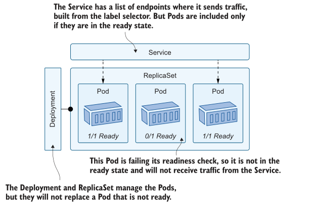
<center>图12.1 服务的端点列表排除了尚未准备好接收流量的pod </center>

Readiness 就绪探测是管理临时负载问题的好方法。有些 pod 可能过载，对每个请求返回 503 状态代码。如果 readiness 就绪探测检查了200响应，而这些pod返回503，那么它们将从 Service 中删除，并停止接收请求。Kubernetes在探测器失败后继续运行探测器，所以如果过载的 Pod 在休息时有机会恢复，探测器将再次成功，Pod将重新加入 Service。

我们在本书中使用的随机数生成器有几个特性，我们可以使用它来了解它是如何工作的。API可以在一种模式下运行，即在特定数量的请求后失败，并且它具有一个HTTP端点，该端点返回它是正常状态还是处于失败状态。我们将在没有准备 readiness 探测的情况下运行它，以便了解问题。

现在试试吧,使用多个副本运行API，看看当应用程序在没有任何容器探测进行测试的情况下失败时会发生什么。

```
# 进入章节目录:
cd ch12
# 部署 random-number API:
kubectl apply -f numbers/
# 等待就绪:
kubectl wait --for=condition=ContainersReady pod -l app=numbers-api
# 确认 Pod 注册作为 Service endpoints:
kubectl get endpoints numbers-api
# 将 api url 保存到文本文件:
kubectl get svc numbers-api -o jsonpath='http://{.status.loadBalancer
.ingress[0].*}:8013' > api-url.txt
# 访问 API—返回之后, 应用会显示不正常:
curl "$(cat api-url.txt)/rng"
# 检查 health 端点:
curl "$(cat api-url.txt)/healthz"; curl "$(cat api-url.txt)/healthz"
# 确认 service 使用的 Pods:
kubectl get endpoints numbers-api
```

从本练习中您将看到，Service 将两个pod都保存在其端点列表中，尽管其中一个不健康，并且总是返回500错误响应。图12.2中的输出在请求之前和之后显示了端点列表中的两个IP地址，这导致一个实例变得不健康。

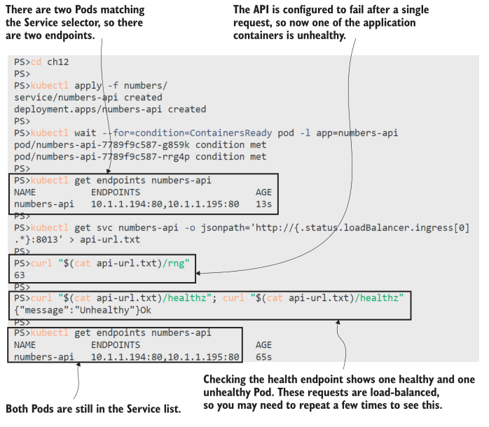
<center>图 12.2 应用程序容器可能不健康，但Pod保持就绪状态</center>

这是因为 Kubernetes 不知道其中一个pod是不健康的。Pod容器中的应用程序仍在运行，Kubernetes不知道有一个健康端点可以用来查看应用程序是否正常工作。你可以在Pod的容器 spec 中给它准备 readiness 探测的信息。清单12.1显示了API spec 的更新，其中包括健康检查。

> 清单 12.1 api-with-readiness.yaml, API 容器的 readiness 探测

```
spec: # 这是 Deployment 的 Pod spec 
  containers:
    - image: kiamol/ch03-numbers-api
      readinessProbe: # 探测在容器层面指定
        httpGet:
          path: /healthz # 这是一个 Get 路由
          port: 80
        periodSeconds: 5 # 探测每隔 5 秒钟触发
```

Kubernetes 支持不同类型的容器探测。这一个使用HTTP GET操作，这是完美的web应用程序和api。探测器告诉Kubernetes每5秒测试一次/healthz端点;如果响应的HTTP状态码在200到399之间，则探测成功;如果返回任何其他状态代码，它将失败。随机数API在不健康时返回500代码，因此我们可以看到准备就绪探测的工作。

现在试试吧，部署更新后的 spec ，并验证包含失败应用程序的Pod已从 Service 中删除。

```
# 部署清单 12.1 更新的 spec:
kubectl apply -f numbers/update/api-with-readiness.yaml
# 等待替换的 Pods 就绪:
kubectl wait --for=condition=ContainersReady pod -l app=numbers-api,version=v2
# 检查 endpoints:
kubectl get endpoints numbers-api
# 触发一个应用容器变成不健康状态:
curl "$(cat api-url.txt)/rng"
# 等待 readiness 探测生效:
sleep 10
# 再次检查 endpoints:
kubectl get endpoints numbers-api
```

如图12.3中的输出所示，readiness 探测检测到其中一个pod不健康，因为对HTTP请求的响应返回500。Pod的IP地址从服务端点列表中删除，因此它将不再接收任何流量。

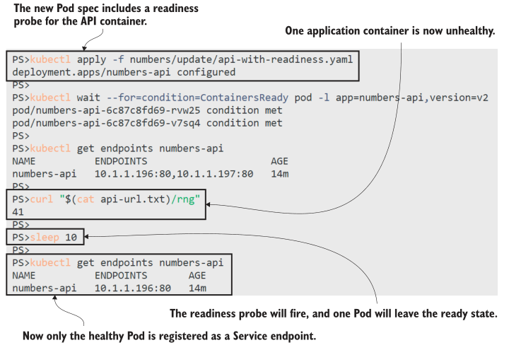
<center>图 12.3 就绪失败探测将pod移出就绪状态，从而将它们从服务中移除</center>

这个应用程序也是一个很好的例子，说明准备 readiness 探测本身是多么危险。随机数API中的逻辑意味着一旦失败，它将始终失败，因此不健康的Pod将被排除在服务之外，应用程序将以低于预期的容量运行。当探测失败时，部署不会替换离开就绪状态的pod，因此我们留下两个正在运行的pod，但只有一个接收流量。如果另一个Pod也失败了，情况会更糟。

现在试试吧,服务列表中只有一个Pod。你会发出一个请求，Pod也会变得不健康，所以两个Pod都会从服务中删除。
```
# 检查 Service endpoints:
kubectl get endpoints numbers-api
# 访问 API, 触发应用都变成不健康状态:
curl "$(cat api-url.txt)/rng"
# 等待 readiness 探测触发:
sleep 10
# 再次检查 endpoints:
kubectl get endpoints numbers-api
# 检查 Pod status:
kubectl get pods -l app=numbers-api
# 我们可以重置 API... 但是没有 Pods 可以接受请求，所以将会失败:
curl "$(cat api-url.txt)/reset"
```

现在我们有了一个解决方案——两个pod readiness 就绪探测都失败了，Kubernetes已经从服务端点列表中删除了它们。这样服务就没有端点了，所以应用程序处于离线状态，如图12.4所示。现在的情况是，任何试图使用API的客户端都会得到一个连接失败，而不是一个HTTP错误状态代码，对于试图使用特殊管理URL重置应用程序的管理员来说也是如此。

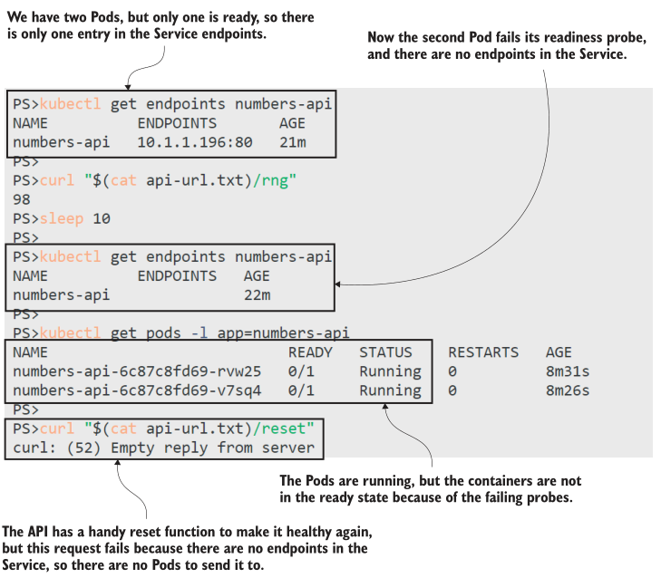
<center>图 12.4 探头应该帮助应用程序，但它们可以从一个服务中删除所有 Pods</center>

如果您认为“这不是一个自我修复应用程序”，那么您完全正确，但请记住，应用程序无论如何都处于失败状态。没有 readiness 就绪探测，应用程序仍然不能工作，但有了 readiness 就绪探测，它就不会受到攻击请求，直到它恢复并能够处理它们。您需要了解应用程序的失败模式，以了解当探测失败时会发生什么，以及应用程序是否可能自行恢复。

随机数API再也不会恢复正常，但我们可以通过重新启动Pod来修复失败状态。如果你在容器 spec 中包含另一个健康检查:一个 liveness 探测，Kubernetes将为你做这件事。

## 12.2 通过 liveness 探测重启不健康的 Pods
Liveness probes use the same healthcheck mechanism as readiness probes—the test configurations might be identical in your Pod spec—but the action for a failed probe is different. Liveness probes take action at the compute level, restarting Pods if they
become unhealthy. A restart is when Kubernetes replaces the Pod container with a new one; the Pod itself isn’t replaced; it continues to run on the same node but with a new container.

Listing 12.2 shows a liveness probe for the random-number API. This probe uses the same HTTP GET action to run the probe, but it has some additional configuration.


Restarting a Pod is more invasive than removing it from a Service, and the extra settings help to ensure that happens only when we really need it.

> Listing 12.2 api-with-readiness-and-liveness.yaml, adding a liveness probe

```
livenessProbe:
  httpGet: # HTTP GET actions can be used in liveness and
    path: /healthz # readiness probes—they use the same spec.
	port: 80
  periodSeconds: 10
  initialDelaySeconds: 10 # Wait 10 seconds before running the first probe.
  failureThreshold: 2 # Allow two probes to fail before taking action.
```

This is a change to the Pod spec, so applying the update will create new replacement Pods that start off healthy. This time, when a Pod becomes unhealthy after the application fails, it will be removed from the Service thanks to the readiness probe. It will be restarted thanks to the liveness probe, and then the Pod will be added back into the Service.

TRY IT NOW
Update the API, and verify that liveness and readiness checks combined keep the application healthy.

```
# update the Pod spec from listing 12.2:
kubectl apply -f numbers/update/api-with-readiness-and-liveness.yaml
# wait for the new Pods:
kubectl wait --for=condition=ContainersReady pod -l app=numbers-
api,version=v3
# check the Pod status:
kubectl get pods -l app=numbers-api -o wide
# check the Servivce endpoints:
kubectl get endpoints numbers-api # two
# cause one application to become unhealthy:
curl "$(cat api-url.txt)/rng"
# wait for the probes to fire, and check the Pods again:
sleep 20
kubectl get pods -l app=numbers-api
```

In this exercise, you see the liveness probe in action, restarting the Pod when the application fails. The restart is a new Pod container, but the Pod environment is the same—it has the same IP address, and if the container mounted an EmptyDir volume in the Pod, it would have access to the files written by the previous container. You can see in figure 12.5 that both Pods are running and ready after the restart, so Kubernetes fixed the failure and healed the application.

Restarts aren’t a permanent fix if the app keeps failing without a healthy streak, because Kubernetes won’t indefinitely restart a failing Pod. For transient issues, it works well, provided the application can restart successfully in a replacement container.  Probes are also useful to keep applications healthy during upgrades, because rollouts proceed only as new Pods enter the ready state, so if a readiness probe fails, that will pause the rollout.

We’ll show that with the to-do list application, with specifications that include liveness and readiness checks for the web  application Pod and the database. The web probes use the same HTTP GET action we’ve already seen, but the database doesn’t
have an HTTP endpoint we can use. Instead, the spec uses the other types of probe action that Kubernetes supports—the TCP socket action, which checks that a port is open and listening for incoming traffic, and the exec action, which runs a command inside the container. Listing 12.3 shows the probe setup.

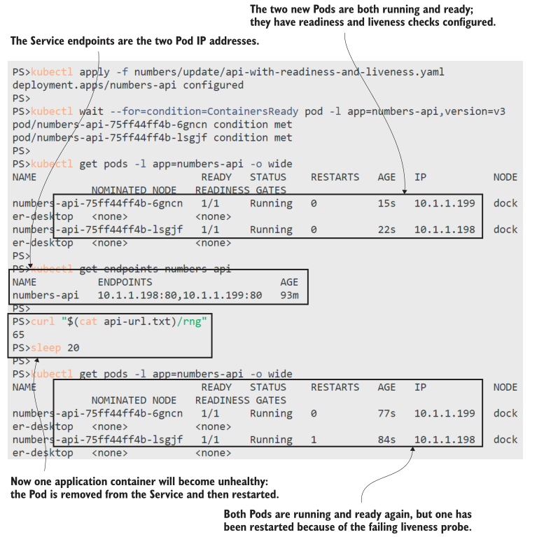
<center>图 12.5 Readiness probes and liveness probes combined help keep applications online</center>

> Listing 12.3 todo-db.yaml, using TCP and command probes

```
spec:
  containers:
	- image: postgres:11.6-alpine
	# full spec includes environment config
	readinessProbe:
	  tcpSocket: # The readiness probe tests the
		port: 5432 # database is listening on the port.
	  periodSeconds: 5
	livenessProbe: # The liveness probe runs a Postgres tool,
	  exec: # which confirms the database is running.
		command: ["pg_isready", "-h", "localhost"]
 	  periodSeconds: 10
	  initialDelaySeconds: 10
```

When you deploy this code, you’ll see the app works in the same way as always, but now it’s protected against transient failures in both the web and database components.

TRY IT NOW
Run the to-do list app with the new self-healing specification.

```
# deploy the web and database:
kubectl apply -f todo-list/db/ -f todo-list/web/
# wait for the app to be ready:
kubectl wait --for=condition=ContainersReady pod -l app=todo-web
# get the URL for the service:
kubectl get svc todo-web -o
jsonpath='http://{.status.loadBalancer.ingress[0].*}:8081'
# browse to the app, and add a new item
```

Nothing new here, as you can see in my output in figure 12.6. But the database probes mean Postgres won’t get any traffic until the database is ready, and if the Postgres server fails, then the database Pod will be restarted, with the replacement using the same data files in the EmptyDir volume in the Pod.

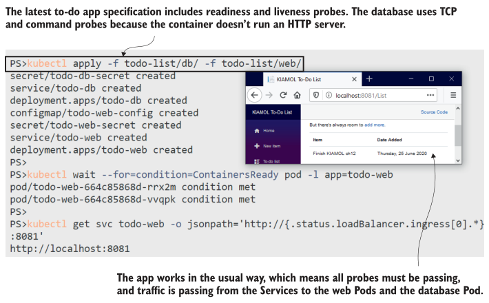
<center>图 12.6 Probes are firing and returning healthy responses, so the app works in the usual way</center>

Container probes can also keep an application running if an update goes wrong. There’s a new database spec for the to-do app that upgrades the version of Postgres, but it also overrides the container command, so it sleeps instead of starting Postgres. This is a classic left-over-from-debugging mistake: someone wanted to start a Pod with the correct configuration but without running the app so they could run a shell inside the container to check the environment, but they didn’t revert their change. If the Pod  didn’t have any probes, the update would succeed and take down the app. The sleep command keeps the Pod container running, but there’s no database server for the website to use. The probes stop that happening and keep the app available.

TRY IT NOW
Deploy the bad update, and verify that the failing probes in the new Pod prevent the original Pod from being removed.

```
# apply the update:
kubectl apply -f todo-list/db/update/todo-db-bad-command.yaml
# watch the Pod status changing:
kubectl get pods -l app=todo-db --watch
# refresh the app to check that it still works
# ctrl-c or cmd-c to exit the Kubectl watch
```

You can see my output in figure 12.7. The replacement database Pod is created, but it never enters the ready state because the readiness probe checks port 5342 for a process listening, and there isn’t one. The Pod will keep restarting, too, because the liveness probe runs a command that checks that Postgres is ready to receive client connections. While the new Pod keeps failing, the old one is left running, and the app keeps working.

If you leave this app running for another five minutes or so and check the Pod status again, you’ll see the new Pod goes into the CrashLoopBackOff status. This is how Kubernetes protects the cluster from wasting compute resources on applications that constantly fail: it adds a time delay between Pod restarts, and that delay increases with each restart. If you see a Pod in  CrashLoopBackOff, it usually means the app is beyond repair.

The to-do app is in the same situation now that we first saw in chapter 9 when rollouts fail. The Deployment is managing two ReplicaSets, and its goal is to scale down the old one to zero as soon as the new one is up to capacity. But the new ReplicaSet
never reaches capacity, because the probes in the new Pod constantly fail. The Deployment stays like this, hoping it can  eventually finish the rollout. Kubernetes doesn’t have an automatic rollback option, but Helm does, and you can extend your Helm charts to support healthy upgrades.

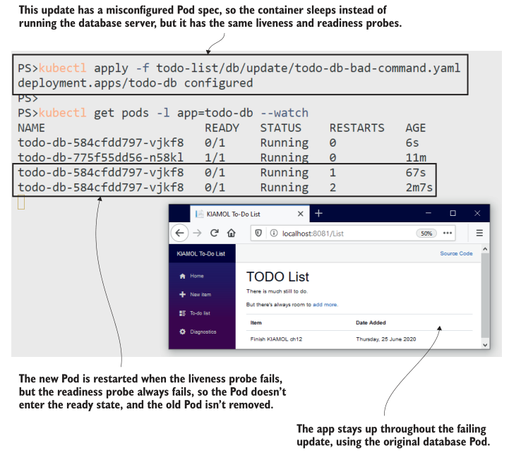
<center>图 12.7 Rollouts wait for new Pods to become ready, so probes protect against failed updates</center>

## 12.3 使用 Helm 安全地部署升级

A little bit of Helm goes a long way. You learned the basics in chapter 10, and you don’t need to dig too deeply into the templating  functions and the dependency management to make good use of Helm for safe application upgrades. Helm supports atomic  installs and upgrades, which automatically roll back if they fail, and it also has a deployment life cycle you can hook into to run validation jobs before and after installation.

The source folder for this chapter has multiple Helm charts for the to-do app, which represent different versions (normally that would be a single Helm chart that evolves with each release). The version 1 chart deploys the app using the same liveness and  readiness checks we used in section 12.2; the only difference is that the database uses a PersistentVolumeClaim, so data is preserved between upgrades. We’ll start by clearing down the previous exercises and installing the Helm version.

TRY IT NOW
Run the to-do app using the same Pod specs but deployed using a Helm chart.

```
# remove all existing apps from the chapter:
kubectl delete all -l kiamol=ch12
# install the Helm release:
helm install --atomic todo-list todo-list/helm/v1/todo-list/
# browse to the app, and add a new item
```

Version 1 of the app is now running through Helm, and there’s nothing new here except that the chart contains a file in the templates folder called NOTES.txt, which displays the helpful text you see after installation. My output is shown in figure 12.8. I
haven’t included an application screenshot, so you’ll just have to take my word that I browsed and added an item saying “finish chapter 12.”

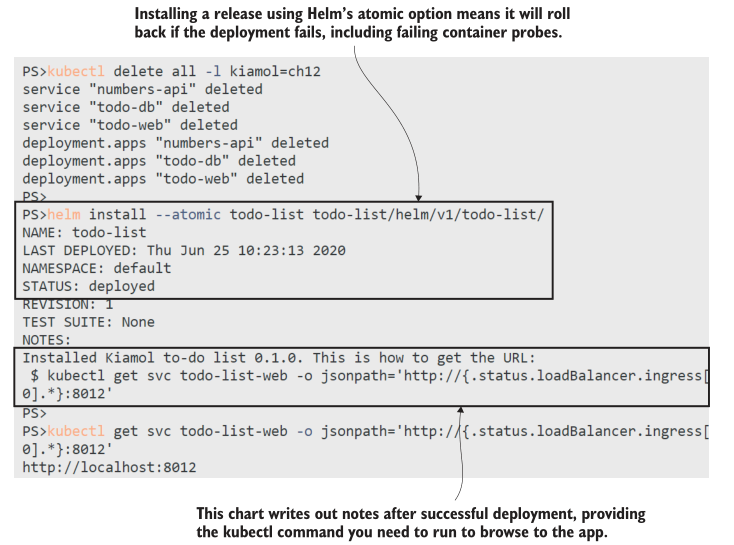
<center>图 12.8 Installing apps with Helm waits for container probes to be healthy</center>

Version 2 of the Helm chart attempts the same database image upgrade we saw in section 12.2, complete with the misconfiguration in the command for the Postgres container. When you deploy this with Helm, the same thing happens under the hood: Kubernetes updates the Deployment, which adds a new ReplicaSet, and that ReplicaSet never reaches capacity because the Pod readiness probe fails. But Helm checks the status of the rollout, and if it doesn’t succeed within a specific period, it  automatically rolls back.

TRY IT NOW
Upgrade the to-do app release using Helm. The upgrade fails because the Pod spec is misconfigured, and Helm rolls it back.

```
# list the current Pod status and container image:
kubectl get pods -l app=todo-list-db -o=custom-columns=NAME:.metadata
.name,STATUS:.status.phase,IMAGE:.spec.containers[0].image
# upgrade the release with Helm—this will fail:
helm upgrade --atomic --timeout 30s todo-list todo-list/helm/v2/todo-
list/
# list the Pods again:
kubectl get pods -l app=todo-list-db -o=custom-columns=NAME:.metadata
.name,STATUS:.status.phase,IMAGE:.spec.containers[0].image
# browse back to the app, and refresh the list
```

If you check the Pod list a few times in that exercise, you’ll see the rollback happening, as you can see in figure 12.9. At first,  there’s a single Pod running Postgres 11.6, and then it’s joined by a new Pod running 11.8, but that’s the Pod with the failing container probes. The Pod isn’t ready within the Helm timeout period, so the upgrade is rolled back, and the new Pod is removed; it doesn’t keep restarting and hit CrashLoopBackOff as it did with the kubectl update.

The to-do app has been online without interruption or reduced capacity during the failed upgrade to version 2. The next version fixes the upgrade by removing the bad container command in the Pod spec, and it also adds an extra template for a Kubernetes  Job, which you can run as a deployment test with Helm. Tests run on demand and not as part of the install, so they’re perfect for smoke tests—automated test suites that you run to confirm that a successful release is working correctly. Listing 12.4 shows a test for the to-do database.

> Listing 12.4 todo-db-test-job.yaml, a Kubernetes Job to run as a Helm test

```
apiVersion: batch/v1
kind: Job # This is a standard Job spec.
metadata:
  # metadata includes name and labels
  annotations:
    "helm.sh/hook": test # Tells Helm the Job can be run in the test
spec: # suite for the release
  completions: 1
  backoffLimit: 0 # The Job should run once and not retry.
```

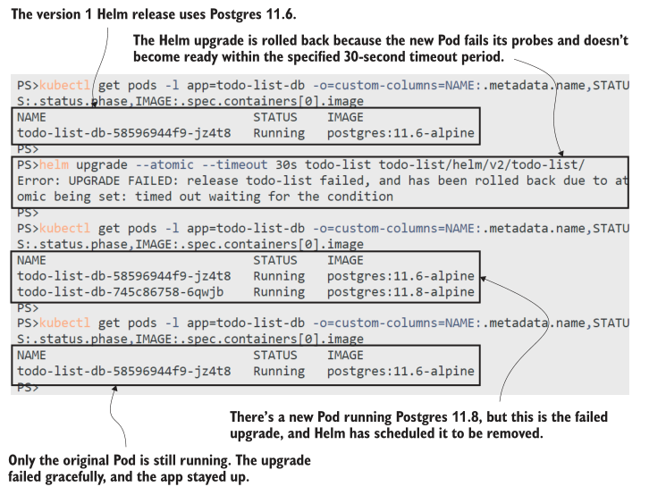
<center>图 12.9 The upgrade fails because the new Pod doesn’t become ready, and Helm rolls back</center>

```
template:
  spec: # The container spec runs a SQL query.
	containers:
	  - image: postgres:11.8-alpine
	    command: ["psql", "-c", "SELECT COUNT(*) FROM \"public\".\"ToDos\""]
```

We met Jobs in chapter 8, and Helm makes good use of them. Job specs include an expectation of how many times they should run to successful completion, and Helm uses that to evaluate if the test succeeds. The version 3 upgrade should succeed, and when it completes, you can run the test Job, which runs a SQL statement to confirm the to-do database is accessible.

TRY IT NOW
Upgrade to the version 3 chart, which fixes the Postgres update. Then run the test with Helm, and check the logs for the Job Pod.

```
# run the upgrade:
helm upgrade --atomic --timeout 30s todo-list todo-list/helm/v3/todo-list/

# list the database Pods and images:
kubectl get pods -l app=todo-list-db -o=custom-columns=NAME:.metadata.name,STATUS:.status.phase,IMAGE:.spec.containers[0].image,IP:.status.podIPs[].ip

# check the database Service endpoints:
kubectl get endpoints todo-list-db

# now run the test Job with Helm:
helm test todo-list

# check the output:
kubectl logs -l job-name=todo-list-db-test
```

I’ve snipped my output in figure 12.10, but the detail is all there—the upgrade is successful, but there are no tests as part of the upgrade command. The database is now

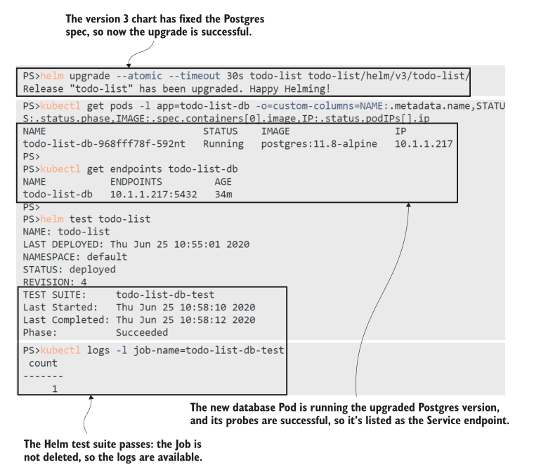
<center>图 12.10 Running test suites on demand with Helm lets you smoke-test your app at any time</center>

using the upgraded version of Postgres, and when the test runs, the Job connects to
the database and confirms the data is still there.

Helm manages Jobs for you. It doesn’t clean up completed Jobs, so you can check the Pod status and logs if you need to, but it replaces them when you repeat the test command, so you can rerun the test suite as often as you like. There’s one other use for Jobs that helps to make sure upgrades are safe, by running them before upgrades so you can check the current release is in a  valid state to be upgraded.

This capability is especially useful if you support multiple versions of your app, but only with incremental upgrades, so version 1.1  needs to upgrade to version 1.2 before it can upgrade to version 2. The logic for this might involve querying the API version for  different services or the schema version of a database, and Helm can run it all in a Job that has access to all the other Kubernetes objects sharing the same ConfigMaps and Secrets as the application Pods. Listing 12.5 shows a pre-upgrade test in version 4 of  the to-do Helm chart.	

> Listing 12.5 todo-db-check-job.yaml, a Job that runs before a Helm upgrade

```
apiVersion: batch/v1
kind: Job # The standard Job spec again
metadata:
  # metadata has name and labels
  annotations:
	"helm.sh/hook": pre-upgrade # This runs before an upgrade and
	"helm.sh/hook-weight": "10" # tells Helm the order in which to create
spec: # the object after the ConfigMap
  template: # that the Job requires
	spec:
	  restartPolicy: Never
	  containers:
		- image: postgres:11.8-alpine
		# env includes secrets
		command: ["/scripts/check-postgres-version.sh"]
		volumeMounts:
		  - name: scripts # Mounts the ConfigMap volume
		    mountPath: "/scripts"
```

There are two templates for the pre-upgrade check: one is the Job spec, and the other is a ConfigMap that contains the script to run in the Job. You use annotations to control where Jobs need to run in the Helm life cycle, and this Job will run only for upgrades, not as part of a new install. The weighting annotations make sure the ConfigMap is created before the Job. Life cycles and weights let you model complex validation steps in Helm, but this one is simple—it upgrades the database image but only if
the release is currently running version 11.6.

TRY IT NOW
The upgrade from version 3 to version 4 isn’t valid because version 3 has already upgraded the Postgres version. Run the upgrade to verify that it doesn’t get deployed.

```
# run the upgrade to version 4—this will fail:
helm upgrade --atomic --timeout 30s todo-list todo-list/helm/v4/todo-list/

# list the Jobs:
kubectl get jobs --show-labels

# print the output of the pre-upgrade Job:
kubectl logs -l job-name=todo-list-db-check

# confirm that the database Pod is unchanged:
kubectl get pods -l app=todo-list-db -o=custom-columns=NAME:.metadata.name,STATUS:.status.phase,IMAGE:.spec.containers[0].image
```

In this exercise, you’ll see that Helm effectively blocks the upgrade, because the preupgrade hook runs and the Job fails. That’s all recorded in the history for the release, which will show that the latest upgrade failed and the release was rolled back to the last  good revision. My output is shown in figure 12.11, and throughout this update, the app was still available.

It’s good to understand what Helm brings in terms of keeping your applications healthy, because pre-upgrade validation and automatic rollbacks help to keep your application upgrades self-healing, too. Helm isn’t a prerequisite for that, but if you’re

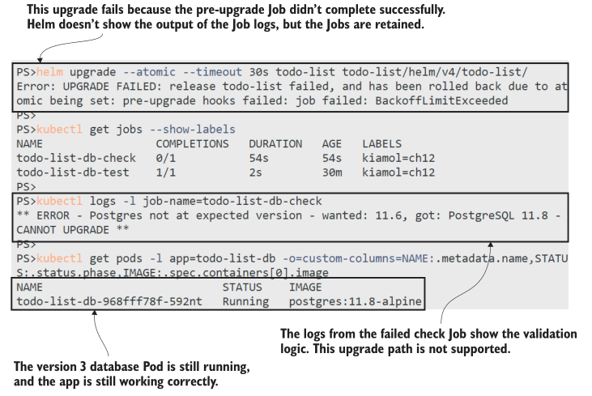
<center>图 12.11 Pre-upgrade Jobs in Helm charts let you validate that the release is suitable to upgrade</center>

not using Helm, you should consider implementing these features using kubectl in your deployment pipeline. There’s one more part of application health that we’ll cover in this chapter— managing the compute resources available to your Pod containers.

## 12.4 通过 resource limits 保护应用和节点

Containers are a virtualized environment for your application process. Kubernetes builds that environment, and you know that Kubernetes creates the container filesystem and sets up networking. The container environment also includes memory and CPU, and those can be managed by Kubernetes, too, but by default, they’re not. That means Pod containers get access to all the  memory and CPU on the node where they’re running, which is bad for two reasons: apps can max out on memory and crash, or they can starve the node of resources so other apps can’t run.

You can limit the resources available to a container in the Pod spec, and those limits are like container probes—you really shouldn’t go to production without them. Apps with memory leaks can ruin your cluster very quickly, and causing a CPU spike is a nice, easy attack vector for intruders. In this section, you’ll learn how to spec your Pods to prevent that, and we’ll start with a new  app that has a large appetite for memory.

TRY IT NOW
Clear down from the last exercise, and run the new app—it doesn’t do anything other than allocate memory and log how much it has allocated. This Pod runs without any container limits.

```
# remove the Helm release to free up resources:
helm uninstall todo-list

# print how much memory your nodes have:
kubectl get nodes -o jsonpath='{.items[].status.allocatable.memory}'

# deploy the memory-allocating app:
kubectl apply -f memory-allocator/

# wait a few minutes, and then see how much memory it has allocated:
kubectl logs -l app=memory-allocator --tail 1
```

The memory-allocator app grabs about 10 MB of memory every five seconds, and it will keep going until it uses all the memory in your lab cluster. You can see from my output in figure 12.12 that my Docker Desktop node has access to about 25 GB of memory, and the allocator app had grabbed almost 1.5 GB when I took the screenshot.

As long as the app is running, it will keep allocating memory, so we need to get on quickly before my machine dies and I lose the edits to this chapter. Listing 12.6 shows an updated Pod spec that includes resource limits, restricting the app to 50 MB of  memory.

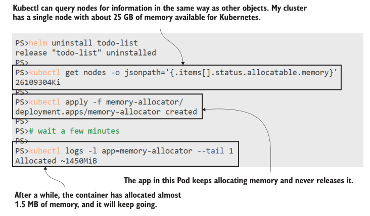
<center>图 12.12 Don’t run this app in production— it just keeps allocating memory until it has it all</center>

> Listing 12.6 memory-allocator-with-limit.yaml, adding memory limits to the container

```
spec: # The Pod spec in the Deployment
  containers:
	- image: kiamol/ch12-memory-allocator
	  resources:
	    limits: # Resource limits constrain the compute power
		  memory: 50Mi # for the container; this limits RAM to 50 MB.
```

Resources are specified at the container level, but this is a new Pod spec, so when you deploy the update, you’ll get a new Pod. The replacement will start off with zero memory allocated, and it will start allocating 10 MB every five seconds again. Now,  however, it will hit a limit at 50 MB, and Kubernetes will take action.

TRY IT NOW
Deploy an update to the memory-allocator app with the resource limits defined in listing 12.6. You should see the Pod is restarted, but only if your Linux host is running without swap memory enabled. K3s doesn’t have that setup (unless you’re using the Vagrant VM setup), so you won’t see the same results as Docker Desktop or a cloud Kubernetes service.

```
# appy the update:
kubectl apply -f memory-allocator/update/memory-allocator-with-limit.yaml

# wait for the app to allocate a chunk of memory:
sleep 20

# print the application logs:
kubectl logs -l app=memory-allocator --tail 1

# watch the status of the Pod:
kubectl get pods -l app=memory-allocator --watch
```

In this exercise, you’ll see that Kubernetes enforces the memory limit: when the app tries to allocate more than 50 MB of memory, the container is replaced, and you can see the Pod enters the OOMKilled status. Exceeding the limit causes a Pod restart, so this has the same drawback as a failing liveness probe—if the replacement containers keep failing, the Pod restarts will take longer and longer as Kubernetes applies CrashLoopBackOff, as you see in figure 12.13.

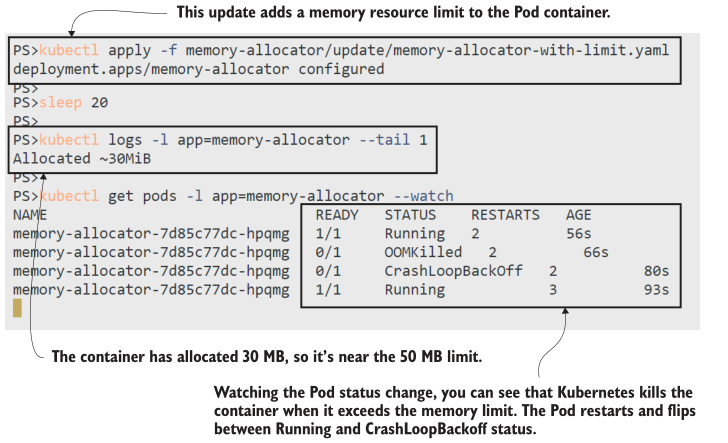
<center>图 12.13 Memory limits are hard limits—if a container exceeds them, it gets killed and the Pod restarts</center>

The hard part of applying resource constraints is working out what the limits should be. You’ll need to factor in some performance testing to see what your app can manage with—be aware that some application platforms will grab more than they need if they see lots of available memory. You should be generous with your initial releases and then look to bring the limits  down as you get more feedback from your monitoring.

You can apply resource limits in another way, too—by specifying maximum quotas for a namespace. This method is especially useful for shared clusters where you use namespaces to divide the cluster for different teams or environments; you can enforce limits on the total amount of resources the namespace can use. Listing 12.7 shows the spec for a ResourceQuota object, which restricts the total amount of memory available to 150 MB in the namespace called kiamol-ch12-memory.

> Listing 12.7 02-memory-quota.yaml, setting memory quota for a namespace

```
apiVersion: v1
kind: ResourceQuota # The ResourceQuota is applied
metadata: # at the specified namespace.
  name: memory-quota
  namespace: kiamol-ch12-memory
spec:
  hard: # Quotas can include CPU and memory.
	limits.memory: 150Mi
```

Container limits are reactive, so Pods are restarted when the memory limit is exceeded. Because resource quotas are proactive, Pods won’t be created if the limits they specify exceed what’s available in the quota. If there’s a quota in place, then every Pod  spec needs to include a resource section so Kubernetes can compare what the spec needs to what’s currently available in the  namespace. An updated version of the memory-allocator spec to demonstrate that follows, where the Pod specifies a limit that is greater than the quota.

TRY IT NOW
Deploy a new version of the memory allocator in its own namespace with a resource quota applied.

```
# delete the existing app:
kubectl delete deploy memory-allocator

# deploy namespace, quota, and new Deployment:
kubectl apply -f memory-allocator/namespace-with-quota/

# print the staus of the ReplicaSet:
kubectl get replicaset -n kiamol-ch12-memory

# show the events in the ReplicaSet:
kubectl describe replicaset -n kiamol-ch12-memory
```

You’ll see from the output of the ReplicaSet that it has zero Pods out of a desired total of one. It can’t create the Pod because it would exceed the quota for the namespace, as you can see in figure 12.14. The controller keeps trying to create the Pod, but it
won’t succeed unless enough quota becomes available, such as from other Pods terminating, but in this case there aren’t any, so it would need to be an update to the quota. Kubernetes can also apply CPU limits to containers and quotas, but they work in a
slightly different way. Containers with a CPU limit run with a fixed amount of processing power, and they can use as much of that CPU as they like—they aren’t replaced if they hit the limit. You can limit a container to one half of a CPU core, and it can run at  100% CPU while all the other cores on the node remain idle and available for other

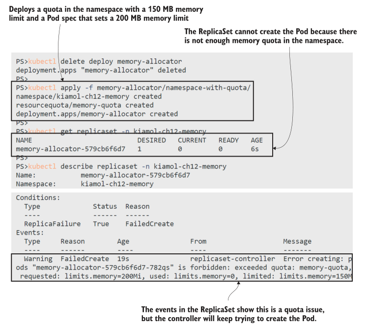
<center>图 12.14 Quotas with hard limits prevent Pods being created if they would exceed the quota</center>

containers. Calculating Pi is a compute-intensive operation, and we can see the effect of applying a CPU limit on the Pi application we’ve used before in the book.

TRY IT NOW
Run the Pi application with and without CPU limits, and compare its performance.

```
# show the total CPU available to the nodes:
kubectl get nodes -o jsonpath='{.items[].status.allocatable.cpu}'

# deploy Pi without any CPU limits:
kubectl apply -f pi/

# get the URL for the app:
kubectl get svc pi-web -o jsonpath='http://{.status.loadBalancer
.ingress[0].*}:8012/?dp=50000'

# browse to the URL, and see how long the calculation takesFigure

# now update the Pod spec with a CPU limit:
kubectl apply -f pi/update/web-with-cpu-limit.yaml

# refresh the Pi app, and see how long the calculation takes
```

My output is shown in figure 12.15. Your timings will be different, depending on how much CPU is available on your node. Mine has eight cores, and with no limits, the app calculates Pi to 50,000 decimal places consistently within 3.4 seconds. After the update, the app container is limited to one quarter of one core, and the same calculation takes 14.4 seconds.

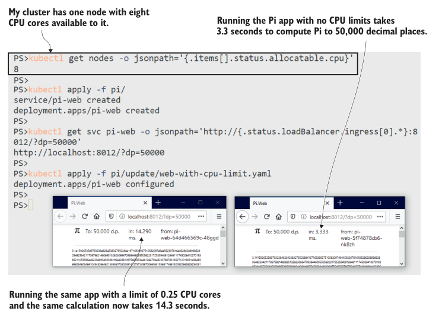
<center>图 12.15 Squint and you’ll see that limiting CPU has an impact on calculation speed</center>

Kubernetes defines CPU limits using a fixed unit, where one represents a single core. You can use multiples to give your app container access to many cores or divide a single core into “millicores,” where one millicore is one-thousandth of a core. Listing 12.8 shows the CPU limit applied to the Pi container from the previous exercise, where 250 millicores is one quarter of one core.

> Listing 12.8 web-with-cpu-limit.yaml

```
spec:
  containers:
	- image: kiamol/ch05-pi
	  command: ["dotnet", "Pi.Web.dll", "-m", "web"]
	  resources:
		limits:
		  cpu: 250m # 250 millicores limits the container to 0.25 cores.
```

I’m focusing on one resource at a time so you can clearly see the impact, but typically you should include both CPU and memory  limits so your apps don’t surge and starve the cluster. Resource specs can also include a requests section, which states how much
CPU and memory the container is expected to use. That helps Kubernetes decide which node should run the Pod, and we’ll cover it more when we get to scheduling in chapter 18.

We’ll finish this chapter with one more exercise to show how CPU limits can be applied to a quota for a namespace and what it means when the quota is exceeded. The new spec for the Pi application tries to run two replicas with 300 millicore CPU limits in a namespace that has a quota with a maximum of 500 millicores.

TRY IT NOW
Run an updated Pi application in its own namespace, which has a CPU quota applied.

```
# remove the existing app:
kubectl delete deploy pi-web

# deploy the namespace, quota, and new app spec:
kubectl apply -f pi/namespace-with-quota/

# print the ReplicaSet status:
kubectl get replicaset -n kiamol-ch12-cpu

# list the endpoints for the Service:
kubectl get endpoints pi-web -n kiamol-ch12-cpu

# show the events for the ReplicaSet:
kubectl describe replicaset -n kiamol-ch12-cpu
```

In this exercise, you can see that quotas apply across all Pods in the namespace. The ReplicaSet is running with one Pod instead of two, because the first Pod allocated 300 m CPU, which only left 200 m in the quota—not enough for the second Pod to run. Figure 12.16 shows the failure reason in the events for the ReplicaSet. The Pi app is still running but under capacity because there isn’t enough CPU available. 

Quotas are more for protecting your cluster than the apps themselves, but they’re a good way of  enforcing that all Pod specs have limits specified. If you’re not dividing up your cluster with namespaces, you can still apply a quota with large CPU and memory limits to the default namespace to make sure Pod specs include limits of their own.

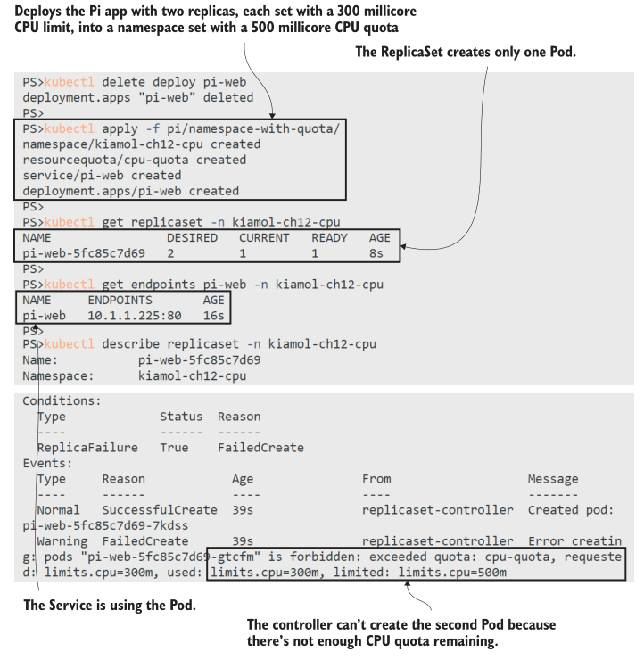

<center>图 12.16 Hard CPU limits in quotas are enforced to block objects from exceeding the total limit</center>

Resource limits, container probes, and atomic upgrades all help to keep your apps running in the face of normal failure conditions. These should be on your road map to production, but you also need to be aware that Kubernetes can’t repair every kind of failure.

## 12.5 了解自我修复应用的局限性

Kubernetes allocates a Pod to a node, and that’s the node where it will run. Pods aren’t replaced unless the node goes offline, so all the repair mechanisms we’ve seen in this chapter work by restarting the Pod—replacing the application container. You need to make sure your app can tolerate that, especially in the multicontainer scenarios we covered in chapter 7, because init containers are executed again and sidecars are replaced when a Pod restarts.

Pod restarts are fine for most scenarios with temporary failures, but repeated failures will end up in a CrashLoopBackOff state,  which can take your app offline. Kubernetes doesn’t provide any configuration options for how many restarts are allowed or the backoff period, and it doesn’t support replacing failed Pods with a new Pod on a different node. Those features are requested, but until they land, your nicely configured self-healing app still has the potential for all its Pods to be in a backoff state with no endpoints in the Service.

That edge case usually appears as a result of misconfigured specs or fatal problems with the application, which take more intervention than Kubernetes can manage by itself. For the typical failure states, the combination of container probes and resource limits go a long way to keeping your app running smoothly all by itself. And that’s all for self-healing apps, so we can tidy up the cluster in preparation for the lab.

TRY IT NOW
Remove the objects from this chapter.

```
# delete namespaces:
kubectl delete ns -l kiamol=ch12
kubectl delete all -l kiamol=ch12

# delete all the leftover objects:
kubectl delete secret,configmap,pvc -l kiamol=ch12
```

## 12.6 实验室

I’ve got a nice little capacity-planning exercise for you in this lab. The goal is to divide your cluster into three environments to run the Pi app: dev, test, and UAT. UAT should be limited to 50% of your node’s total CPU, and dev and test to 25% each. Your Pi Deployment should be set with limits so it can run at least four replicas in every environment, and then you need to verify how much you can scale up to in UAT.

- Start by deploying the namespaces and Services in the lab folder.
- Then work out the CPU capacity of your node, and deploy resource quotas to limit CPU in each namespace (you’ll need to write the quota specs).
- Update the Deployment spec in web.yaml to include a CPU limit that allows four replicas to run in each namespace.
- When everything’s running, scale up the UAT Deployment to eight replicas, and try to find out why they don’t all run.

This is a good exercise to help you understand how CPU resources get shared and to practice working with multiple namespaces. My solution is on GitHub for you to check: https://github.com/sixeyed/kiamol/blob/master/ch12/lab/README.md.