# 第十三章 使用 Fluentd 和 Elasticsearch 集中化日志

Applications generate lots of logs, which often aren’t very useful. As you scale up your apps across multiple Pods running in a  cluster, it’s difficult to manage those logs using standard Kubernetes tooling. Organizations usually deploy their own logging framework, which uses a collect-and-forward model to read container logs and send them to a central store where they can be indexed, filtered, and searched.You’ll learn how to do that in this chapter using the most popular technologies in this space: Fluentd and Elasticsearch. Fluentd is the collector component, and it has some nice integrations with Kubernetes; Elasticsearch is the storage component and can run either as Pods in the cluster or as an external service.

You should be aware of a couple of points before we start. The first is that this model assumes your application logs are written to the container’s standard output streams so Kubernetes can find them. We covered that in chapter 7, with sample apps that wrote to standard out directly or used a logging sidecar to relay logs. The second is that the logging model in Kubernetes is very different from Docker. Appendix D in the ebook shows you how to use Fluentd with Docker, but with Kubernetes, we’ll take

## 13.1 Kubernetes 如何存储日志条目
Kubernetes has a very simplistic approach to log management: it collects log entries from the container runtime and stores them as files on the node running the container. If you want to do anything more advanced, then you need to deploy your own log  management system, and, fortunately, you have a world-class container platform on which to run it. The moving pieces of the logging system collect

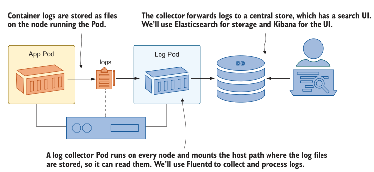

<center>图 13.1 Logging in Kubernetes uses a collector like Fluentd to read the log files from the node</center>

logs from the nodes, forward them to a centralized store, and provide a UI to search and filter them. Figure 13.1 shows the technologies we’ll use in this chapter. 

Nodes store log entries exactly as they come from the container, using filenames that include the namespace, Pod, and container names. The standard naming system makes it easy for the log collector to add metadata to the log entries to identify the source, and because the collector runs as a Pod itself, it can query the Kubernetes API server to get even more details. Fluentd adds Pod labels and the image tag as additional metadata, which you can use to filter or search the logs.

Deploying the log collector is straightforward. We’ll start by exploring the raw log files on the node to see what we’re working with. The prerequisite for any of this is to get application logs out of the container, whether the app writes those logs directly or you use a sidecar container. Start by deploying the timecheck app from chapter 7 in a couple of different configurations to  generate some logs.

TRY IT NOW
Run the timecheck app using different setups in different namespaces, and then check the logs to see how you work with them natively in kubectl.

```
# switch to the chapter’s folder:
cd ch13

# deploy the timecheck app in development and test namespaces:
kubectl apply -f timecheck/

# wait for the development namespace to spin up:
kubectl wait --for=condition=ContainersReady pod -l app=timecheck -n kiamol-ch13-dev

# check the logs:
kubectl logs -l app=timecheck --all-containers -n kiamol-ch13-dev --tail 1
```

You’ll see from that exercise that in a realistic cluster environment, it’s hard to work with container logs directly, as shown in my output in figure 13.2. You have to use one namespace at a time, you can’t identify the Pod that logged the message, and you can
filter only by a number of log entries or a time period.

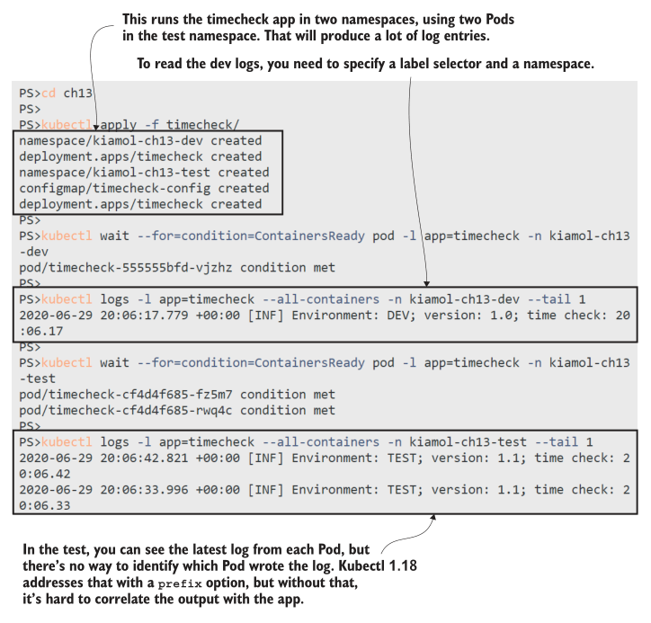

<center>图 13.2 Kubectl is great for quickly checking logs, but it’s harder with many Pods in many namespaces</center>

Kubectl is the simplest option for reading logs, but ultimately the log entries come from the files on each node, which means you have other options to work with logs. The source for this chapter includes a simple sleep Deployment that mounts the log path  on the node as a HostPath volume, and you can use that to explore the log files, even if you don’t have direct access to the nodes.

TRY IT NOW
Run a Pod with a volume mount for the host’s log directory, and explore the files using the mount.

```
# run the Deployment:
kubectl apply -f sleep.yaml

# connect to a session in the Pod container:
kubectl exec -it deploy/sleep -- sh

# browse to the host log mount:
cd /var/log/containers/

# list the timecheck log files:
ls timecheck*kiamol-ch13*_logger*

# view the contents of the dev log file:
cat $(ls timecheck*kiamol-ch13-dev_logger*) | tail -n 1

# exit from the session:
exit
```

Each Pod container has a file for its log output. The timecheck app uses a sidecar container called logger to relay the logs from the application container, and you can see in figure 13.3 the standard naming convention Kubernetes uses for log files: pod-name_namespace_container-name-container-id.log. The filename has enough data to identify the source of the logs, and the content of the file is the raw JSON log output from the container runtime.

Log files are retained after a Pod restart, but most Kubernetes implementations include a log rotation system running on the nodes—outside of Kubernetes—to prevent logs from swallowing up all your disk space. Collecting and forwarding logs to a central store lets you keep them for longer and isolate log storage in one place—that also applies to logs from core Kubernetes components. The Kubernetes DNS server, API server, and network proxy all run as Pods, and you can view and collect logs from
them in the same way as from application logs.

TRY IT NOW
Not every Kubernetes node runs the same core components, but you can use the sleep Pod to see which common components are running on your node.

```
# connect to a session in the Pod:
kubectl exec -it deploy/sleep -- sh

# browse to the host path volume:
cd /var/log/containers/

# the network proxy runs on every node:
cat $(ls kube-proxy*) | tail -n 1

# if your cluster uses Core DNS, you’ll see logs here:
cat $(ls coredns*) | tail -n 1

# if your node is running the API server, you’ll see these logs:
cat $(ls kube-apiserver*) | tail -n 1

# leave the session:
exit
```

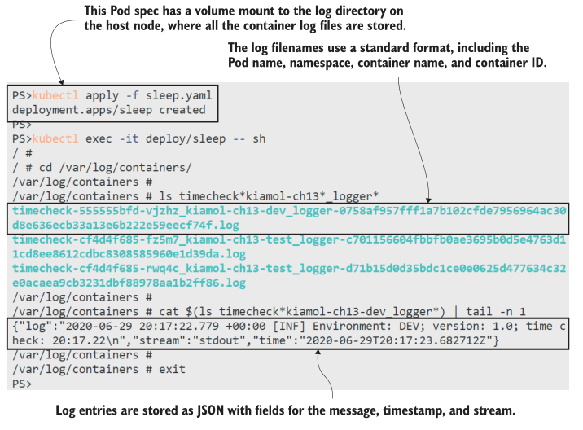

<center>图 13.3 For a modern platform, Kubernetes has an old-school approach to log storage</center>

You might get a different output from that exercise, depending on how your lab cluster is set up. The network proxy Pod runs on every node, so you should see those logs, but you’ll only see DNS logs if your cluster is using CoreDNS (which is the default DNS plugin), and you’ll only see API server logs if your node is running the API server. My output from Docker Desktop is shown in figure 13.4; if you see something different, you can run ls *.log to see all the Pod log files on your node.

Now that you know how container logs are processed and stored by Kubernetes, you can see how a centralized log system makes troubleshooting so much easier. A

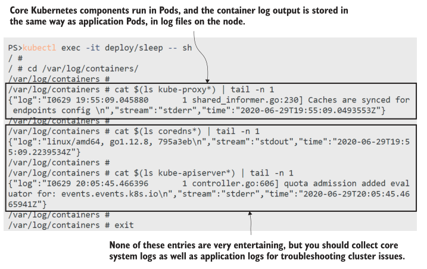

<center>图 13.4 Collecting and forwarding logs from the node will also include all the system Pod logs</center>

collector runs on every node, grabbing entries from the log files and forwarding them. In the rest of the chapter, you’ll learn how to implement that with the EFK stack: Elasticsearch, Fluentd, and Kibana.

## 13.2 使用 Fluentd 收集节点日志

Fluentd is a CNCF project, so it has a sound foundation behind it and is a mature and popular product. Alternative log collection components exist, but Fluentd is a good choice because it has a powerful processing pipeline to manipulate and filter log entries as well as a pluggable architecture, so it can forward logs to different storage systems. It also comes in two variants: the full Fluentd is fast and efficient and has more than 1,000 plugins, but we’ll be using the minimal alternative, called Fluent Bit.

Fluent Bit was originally developed as a lightweight version of Fluentd for embedded applications like IoT devices, but it has all the functionality you need for log aggregation in a full Kubernetes cluster. Every node will run a log collector, so it makes sense to keep the impact of that component small, and Fluent Bit happily runs in a few tens of megabytes of memory. The Fluent Bit architecture in Kubernetes is straightforward: a DaemonSet runs a collector Pod on every node, which uses a HostPath volume mount to access the log files, just like in the sleep example we’ve used. Fluent Bit supports different outputs, so we’ll start simple and just log to the console in the Fluent Bit Pod.

TRY IT NOW
Deploy Fluent Bit with a configuration set up to read the timecheck log files and write them to the standard output stream of the Fluent Bit container.

```
# deploy the DaemonSet and ConfigMap:
kubectl apply -f fluentbit/

# wait for Fluent Bit to start up:
kubectl wait --for=condition=ContainersReady pod -l app=fluent-bit -n kiamol-ch13-logging

# check the logs of the Fluent Bit Pod:
kubectl logs -l app=fluent-bit -n kiamol-ch13-logging --tail 2
```

My output is shown in figure 13.5, where you can see the logs from the timecheck containers being surfaced in the Fluent Bit container. The Pods creating the log entries are in different namespaces, but Fluent Bit reads them from the files on the node.
The content is the raw JSON plus a more precise timestamp, which Fluent Bit adds to each log entry.

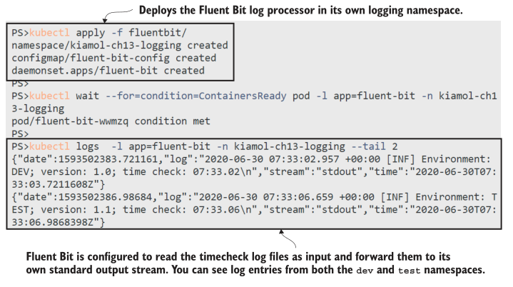

<center>图 13.5 A very basic Fluent Bit configuration can still aggregate log entries from multiple Pods</center>

There’s nothing in the DaemonSet spec for Fluent Bit that you haven’t already seen. I’m using a separate namespace for logging because you typically want it to run as a shared service used by all the applications running on the cluster, and a namespace is a good way to isolate all the objects. It’s simple to run the Fluent Bit Pods—the complexity comes in configuring the log-processing pipeline, and we’ll need to dive into that to get the most out of the logging model. Figure 13.6 shows the stages of the pipeline and how you can use them.

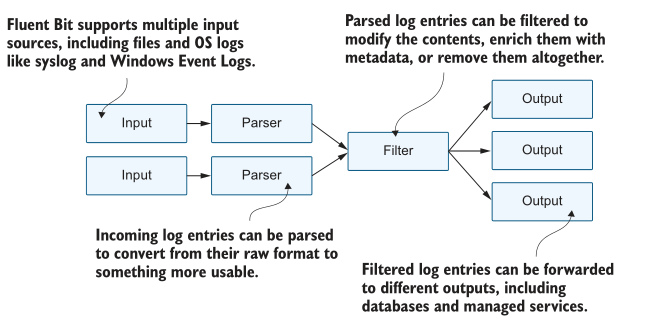

<center>图 13.6 Fluent Bit’s processing pipeline is super flexible and uses plugin modules for every stage</center>

We’re currently running a simple configuration with three stages: the input stage reads log files, the parser stage deconstructs the JSON log entries, and the output stage writes each log as a separate line to the standard output stream in the Fluent Bit container. The JSON parser is standard for all container logs and isn’t very interesting, so we’ll focus on the input and output configuration in listing 13.1.

> Listing 13.1 fluentbit-config.yaml, a simple Fluent Bit pipeline

```
[INPUT]
	Name tail # Reads from the end of a file
	Tag kube.* # Uses a prefix for the tag
	Path /var/log/containers/timecheck*.log
	Parser docker # Parses the JSON container logs
	Refresh_Interval 10 # Sets the frequency to check the file list
[OUTPUT]
	Name stdout # Writes to standard out
	Format json_lines # Formats each log as a line
	Match kube.* # Writes logs with a kube tag prefix
```

Fluent Bit uses tags to identify the source of a log entry. The tag is added at the input stage and can be used to route logs to other stages. In this configuration, the log file name is used as the tag, prefixed with kube. The match rule routes all the kube tagged entries to the output stage so every log is printed out, but the input stage reads only the timecheck log files, so those are the only log entries you see.

You don’t really want to filter the input files—that’s just a quick way to get started without flooding you with log entries. It’s better to read all the input and then route logs based on tags, so you store only the entries you’re interested in. Fluent Bit has built-in support for Kubernetes with a filter that can enrich log entries with metadata to identify the Pod that created it. The filter can also be configured to build a custom tag for each log that includes the namespace and Pod name; using that, you can alter the  pipeline so only the logs from the test namespace are written to standard out.

TRY IT NOW
Update the Fluent Bit ConfigMap to use the Kubernetes filter, restart the DaemonSet to apply the configuration change, and then print the latest log from the timecheck app to see what the filter does.

```
# update the data pipeline configuration files:
kubectl apply -f fluentbit/update/fluentbit-config-match.yaml

# restart the DaemonSet so a new Pod gets the changed configuration:
kubectl rollout restart ds/fluent-bit -n kiamol-ch13-logging

# wait for the new logging Pod:
kubectl wait --for=condition=ContainersReady pod -l app=fluent-bit -n kiamol-ch13-logging

# print the last log entry:
kubectl logs -l app=fluent-bit -n kiamol-ch13-logging --tail 1
```

You can see from my output in figure 13.7 that a lot more data is coming through Fluent Bit—the log entry is the same, but it’s  been enriched with the details of the source of the log. The Kubernetes filter fetches all that data from the API server, which gives
you the additional context you really need when you’re analyzing logs to track down issues. Seeing the image hash for the container will let you check the software version with complete certainty.

The Fluent Bit configuration for this is a little bit tricky. The Kubernetes filter works out of the box to fetch all the Pod metadata, but building a custom tag for routing needs some fiddly regular expressions. That’s all in the configuration files in the ConfigMap you deployed in the previous exercise, but I’m not going to focus on it because I really dislike regular expressions. There’s also no need—the setup is completely generic, so you can plug the input, filter, and parser configurations into your own cluster, and it  will work for your apps without any changes. 

The output configuration will be different because that’s how you configure the targets. We’ll look at one more feature of Fluent Bit before we plug in the log storage and search components—routing log entries to different outputs. The regular expression in the input configuration sets a custom tag for entries in the format kube.namespace.container_name.pod_name, and that can be used in matches to route logs differently based on their namespace or pod name. Listing 13.2 shows an updated output  configuration with multiple destinations.

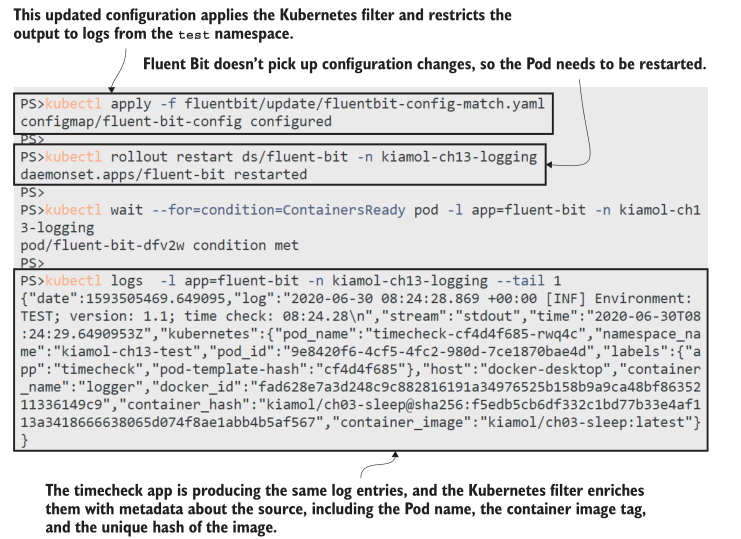

<center>图 13.7 Filters enrich log entries—the single log message now has 14 additional metadata fields</center>

> Listing 13.2 fluentbit-config-match-multiple.yaml, routing to multiple outputs

```
[OUTPUT]
	Name stdout # The standard out plugin will
	Format json_lines # print only log entries where
	Match kube.kiamol-ch13-test.* # the namespace is test.
[OUTPUT]
	Name counter # The counter prints a count of
	Match kube.kiamol-ch13-dev.* # logs from the dev namespace.
```

Fluent Bit supports many output plugins, from plain TCP to Postgres and cloud services like Azure Log Analytics. We’ve used the standard output stream so far, which just relays log entries to the console. The counter plugin is a simple output that just prints how many log entries have been collected. When you deploy the new configuration, you’ll continue to see the log lines from the test namespace, and you’ll also see a count of log entries from the dev namespace.

TRY IT NOW
Update the configuration to use multiple outputs, and print the logs from the Fluent Bit Pod.

```
# update the configuration and restart Fluent Bit:
kubectl apply -f fluentbit/update/fluentbit-config-match-multiple.yaml

kubectl rollout restart ds/fluent-bit -n kiamol-ch13-logging

kubectl wait --for=condition=ContainersReady pod -l app=fluent-bit -n kiamol-ch13-logging

# print the last two log lines:
kubectl logs -l app=fluent-bit -n kiamol-ch13-logging --tail 2
```

The counter in this exercise isn’t especially useful, but it’s there to show you that the complex bits in the early part of the pipeline make for easy routing later in the pipeline. Figure 13.8 shows I have different output for logs in different namespaces, and I can
configure that purely using match rules in the output stages. It should be clear how you can plug a sophisticated logging system on top of the simple log files that Kubernetes writes. The data pipeline in Fluent Bit lets you enrich log entries and route them to different outputs. If the output you want to use

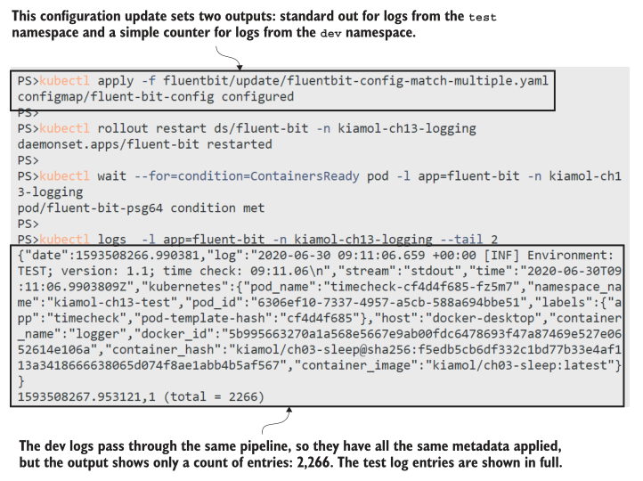

<center>图 13.8 Different outputs in Fluent Bit can reshape the data—the counter just shows a count</center>

isn’t supported by Fluent Bit, then you can switch to the parent Fluentd project, which has a larger set of plugins (including MongoDB and AWS S3)—the pipeline stages and configuration are very similar. We’ll be using Elasticsearch for storage, which is perfect for high-performance search and simple to integrate with Fluent Bit.

## 13.3 向 Elasticsearch 发送日志

Elasticsearch is a production-grade open source database. It stores items as documents in collections called indexes. It’s a very different storage model from a relational database because it doesn’t support a fixed schema for every document in an index—each data item can have its own set of fields. That works nicely for centralized logging where the log items from different systems will have different fields. Elasticsearch runs as a single component with a REST API to insert and query data. A companion product called Kibana provides a very usable frontend to query Elasticsearch. You can run both components in Kubernetes in the same shared logging namespace as Fluent Bit.

TRY IT NOW
Deploy Elasticsearch and Kibana—the storage and frontend components of the logging system.

```
# create the Elasticsearch deployment, and wait for the Pod:
kubectl apply -f elasticsearch/

kubectl wait --for=condition=ContainersReady pod -l app=elasticsearch -n kiamol-ch13-logging

# create the Kibana deployment, and wait for it to start:
kubectl apply -f kibana/

kubectl wait --for=condition=ContainersReady pod -l app=kibana -n kiamol-ch13-logging

# get the URL for Kibana:
kubectl get svc kibana -o jsonpath='http://{.status.loadBalancer.ingress[0].*}:5601' -n kiamol-ch13-logging
```

This basic deployment of Elasticsearch and Kibana uses a single Pod for each, as you see in figure 13.9. Logs are important, so you’ll want to model for high availability in production. Kibana is a stateless component so you can increase the replica count to
increase reliability. Elasticsearch works nicely as a StatefulSet across multiple Pods using persistent storage, or you can use a managed Elasticsearch service in the cloud. When you have Kibana running, you can browse to the URL. We’ll be using it in the
next exercise.

Fluent Bit has an Elasticsearch output plugin that creates a document for each log entry using the Elasticsearch REST API. The plugin needs to be configured with the domain name of the Elasticsearch server, and you can optionally specify the index where documents should be created. That lets you isolate log entries from different namespaces in different indexes, using multiple output stages. Listing 13.3 separates log entries from Pods in the test namespace and Kubernetes system Pods.

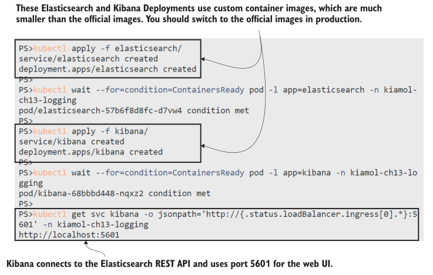

<center>图 13.9 Running Elasticsearch with a Service so Kibana and Fluent Bit can use the REST API</center>

> Listing 13.3 fluentbit-config-elasticsearch.yaml, storing logs in Elasticsearch indexes

```
[OUTPUT]
	Name es # Logs from the test namespace
	Match kube.kiamol-ch13-test.* # are routed to Elasticsearch
	Host elasticsearch # and created as documents in
	Index test # the "test" index.
[OUTPUT]
	Name es # System logs are created in
	Match kube.kube-system.* # the "sys" index in the same
	Host elasticsearch # Elasticsearch server.
```

If there are log entries that don’t match any output rules, they are discarded. When you deploy this updated configuration, the Kubernetes system logs and the test namespace logs are saved in Elasticsearch, but the logs from the dev namespace aren’t saved.

TRY IT NOW
Update the Fluent Bit configuration to send logs to Elasticsearch, and then connect to Kibana and set up a search over the test index.

```
# deploy the updated configuration from listing 13.3
kubectl apply -f fluentbit/update/fluentbit-config-elasticsearch.yaml

# update Fluent Bit, and wait for it to restart
kubectl rollout restart ds/fluent-bit -n kiamol-ch13-logging

kubectl wait --for=condition=ContainersReady pod -l app=fluent-bit -n kiamol-ch13-logging

# now browse to Kibana and set up the search:
# - click Discover on the left navigation panel
# - create a new index pattern
# - enter "test" as the index pattern
# - in the next step, select @timestamp as the time filter field
# - click Create Index Pattern
# - click Discover again on the left navigation panel to see the logs
```

This process contains a few manual steps because Kibana isn’t a great product to automate. My output in figure 13.10 shows the index pattern being created. When you finish that exercise, you’ll have a powerful, fast, and easy-to-use search engine for all the
container logs in the test namespace. The Discover tab in Kibana shows you the rate of documents stored over time—which is the rate that logs are processed—and you can drill down into each document to see the log details.

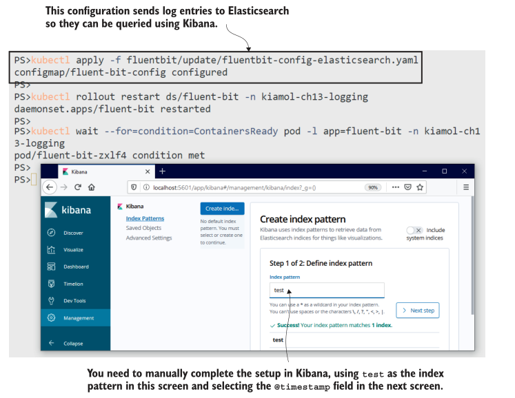

<center>图 13.10 Setting up Fluent Bit to send logs to Elasticsearch and Kibana to search the test index</center>

Elasticsearch and Kibana are well-established technologies but if you’re new to them, now is a good time to look around the Kibana UI. You’ll see a list of fields on the left of the Discover page that you can use to filter the logs. Those fields contain all the
Kubernetes metadata, so you can filter by Pod name, host node, container image, and more. You can build dashboards that show headline statistics for logs split by application, which would be useful to show a sudden spike in error logs. You can also search for specific values across all documents, which is a good way to find application logs when a user gives you the ID from an error message.

I won’t spend too long on Kibana, but one more exercise will show how useful it is to have a centralized logging system. We’ll  deploy a new application into the test namespace, and its logs will automatically get picked up by Fluent Bit and flow through
to Elasticsearch without any changes to configuration. When the app shows an error to the user, we can track that down easily in Kibana.

TRY IT NOW
Deploy the random-number API we’ve used before—the one that crashes after the first use—along with a proxy that caches the response and almost fixes the problem. Try the API, and when you get an error, you can search for the failure ID in Kibana.

```
# deploy the API and proxy:
kubectl apply -f numbers/

# wait for the app to start up:
kubectl wait --for=condition=ContainersReady pod -l app=numbers-api -n kiamol-ch13-test

# get the URL to use the API via the proxy:
kubectl get svc numbers-api-proxy -o jsonpath='http://{.status.loadBalancer.ingress[0].*}:8080/rng' -n kiamol-ch13-test

# browse to the API, wait 30 seconds, and refresh until you get an error
# browse to Kibana, and enter this query in the search bar:
# kubernetes.labels.app:numbers-api AND log:<failure-ID-from-the-API>
```

My output in figure 13.11 is tiny, but you can see what’s happening: I got a failure ID from the API, and I’ve pasted that into the search bar for Kibana, which returns a single match. The log entry contains all the information I need to investigate the Pod if I need to. Kibana also has a useful option to display documents before and after a match, which I could use to show the log entries surrounding the failure log.

Searchable, centralized logging removes a lot of the friction from troubleshooting, with the bonus that these components are all  open source so you can run the same logging stack in every environment. Using the same diagnostic tools in the development and test environments that you use in production should help product teams understand the level of logging that’s useful and improve the quality of the system logs. Good quality logging is important, but it seldom ranks highly in a product backlog,

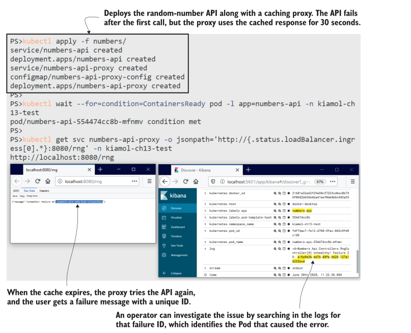

<center>图 13.11 The logging system in action—tracking down failures from user-facing error messages</center>

so in some applications, you’re going to be stuck with logs that aren’t very useful. Fluent Bit has a couple additional features that can help there, too.

## 13.4 解析和过滤日志条目

The ideal application would produce structured log data with fields for the severity of the entry and the name of the class writing the output, along with an ID for the type of event and the key data items of the event. You could use the values of those fields in
your Fluent Bit pipeline to filter messages, and the fields would be surfaced in Elasticsearch so you can build more precise  queries. Most systems don’t produce logs like that—they just emit text—but if the text uses a known format, then Fluent Bit can
parse it into fields as it passes through the pipeline.

The random-number API is a simple example. Log entries are lines of text that look like this: <6>Microsoft.Hosting.Lifetime[0] Now listening on: http://[::]:80.The first part, in angle brackets, is the priority of the message, followed by the name of the class and the event ID in square brackets, and then the actual content of the log. The format is the same for every log entry, so a Fluent Bit parser can split the log into individual fields. You have to use a regular expression for that, and listing 13.4 shows my best  effort, which extracts just the priority field and leaves everything else in the message field.

> Listing 13.4 fluentbit-config-parser.yaml, a custom parser for application logs

```
[PARSER]
	Name dotnet-syslog # Name of the parser
	Format regex # Parses with a regular expression
	Regex ^\<(?<priority>[0-9]+)\>*(?<message>.*)$ # Yuck
```

When you deploy this configuration, Fluent Bit will have a new custom parser called dotnet-syslog available to use, but it won’t  apply it to any logs. The pipeline needs to know which log entries should use custom parsers, and Fluent Bit lets you set that up
with annotations in your Pods. These act like hints, telling the pipeline to apply a named parser to any logs that have originated from this Pod. Listing 13.5 shows the parser annotation for the random-number API Pod—it’s as simple as that.

> Listing 13.5 api-with-parser.yaml, Pod spec with a custom Fluent Bit parser

```
# This is the Pod template in the Deployment spec.
template:
  metadata: # Labels are used for selectors and
	labels: # operations; annotations are often
	  app: numbers-api # used for integration flags.
	annotations:
	  fluentbit.io/parser: dotnet-syslog # Uses the parser for Pod logs
```

Parsers can be much more effective than my custom one, and the Fluent Bit team have some sample parsers in their documentation, including one for Nginx. I’m using Nginx as a proxy for the random-number API, and in the next exercise, we’ll add parsers to each component with annotations and see how structured logging makes for more targeted searching and filtering in Kibana.

TRY IT NOW
Update the Fluent Bit configuration to add parsers for the random-number app and the Nginx proxy, and then update those deployments to add annotations specifying the parser. Try the app, and check the logs in Kibana.

```
# update the pipeline configuration:
kubectl apply -f fluentbit/update/fluentbit-config-parser.yaml

# restart Fluent Bit:
kubectl rollout restart ds/fluent-bit -n kiamol-ch13-logging
kubectl wait --for=condition=ContainersReady pod -l app=fluent-bit -n kiamol-ch13-logging

# update the app Deployments, adding parser annotations:
kubectl apply -f numbers/update/

# wait for the API to be ready:
kubectl wait --for=condition=ContainersReady pod -l app=numbers-api -n kiamol-ch13-test

# use the API again, and browse to Kibana to see the logs
```

You can see in figure 13.12 that the promoted fields from the parser are available for Kibana to filter on, without me having to build up my own query. In my screenshot, I’ve filtered to show logs from one Pod that have a priority value of 4 (which is a warn-
ing level). When you run this yourself, you’ll see that you can also filter for the API

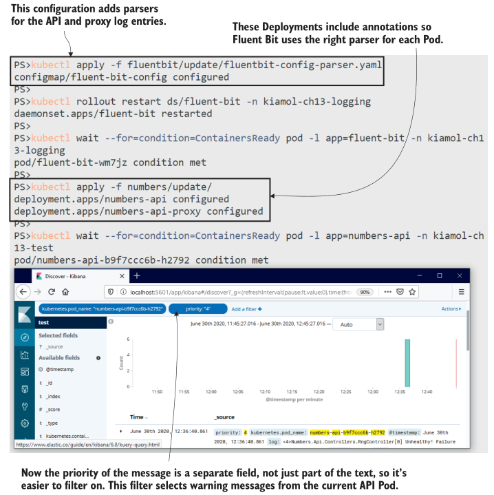

<center>图 13.12 Parsed fields from the logs are indexed, so filters and searches are faster and simpler</center>

proxy Pod. The log entries include fields for the HTTP request path and the response code, all parsed from Nginx text logs. 

There’s one final benefit of the centralized logging system with Fluent Bit: the data-processing pipeline is independent of the applications, and it can be a better place to apply filtering. That mythical ideal app would be able to increase or decrease logging levels on the fly, without an application restart. You know from chapter 4, however, that many apps need a Pod restart to pick up the latest configuration changes. That’s not good when you’re troubleshooting a live issue, because it means restarting the affected app if you need to increase the logging level.

Fluent Bit doesn’t support live configuration reloads itself, but restarting the log collector Pods is less invasive than restarting application Pods, and Fluent Bit will pick up where it left off, so you won’t miss any log entries. With this approach, you can log
at a more verbose level in your applications and filter in the Fluent Bit pipeline. Listing 13.6 shows a filter that includes logs from the random-number API only if the priority field has a value of 2, 3, or 4—it filters out lower priority entries.

> Listing 13.6 fluentbit-config-grep.yaml, filtering logs based on field values

```
[FILTER]
	Name grep 			 # grep is a search filter.
	Match kube.kiamol-ch13-test.api.numbers-api*
	Regex priority [234] # Even I can manage this regular
						 # expression.
```

More regular expression wrangling here, but you can see why it’s important to have text log entries split into fields that the pipeline can access. The grep filter can include or exclude logs by evaluating a regular expression over a field. When you deploy this updated configuration, the API can happily write log entries at level 6, but they are dropped by Fluent Bit, and only the more important entries will make it to Elasticsearch.

TRY IT NOW
Deploy the updated configuration so only high-priority logs from the random-number API are saved. Delete the API Pod, and in Kibana, you won’t see any of the startup log entries, but they’re still there in the Pod logs.

```
# apply the grep filter from listing 13.6:
kubectl apply -f fluentbit/update/fluentbit-config-grep.yaml

kubectl rollout restart ds/fluent-bit -n kiamol-ch13-logging

# delete the old API pod so we get a fresh set of logs:
kubectl delete pods -n kiamol-ch13-test -l app=numbers-api

kubectl wait --for=condition=ContainersReady pod -l app=numbers-api -n kiamol-ch13-test

# use the API, and refresh until you see a failure

# print the logs from the Pod:
kubectl logs -n kiamol-ch13-test -l app=numbers-api

# now browse to Kibana, and filter to show the API Pod logs
```

This exercise shows you how Fluent Bit can filter out logs effectively, forwarding only log entries you care about to the target output. It also shows that the lower level logging hasn’t disappeared—the raw container logs are all available to see with kubectl.
It’s only the subsequent log processing that stops them from going to Elasticsearch. In a real troubleshooting scenario, you may be able to use Kibana to identify the Pod causing the problem and then drill down with kubectl, as shown in figure 13.13.

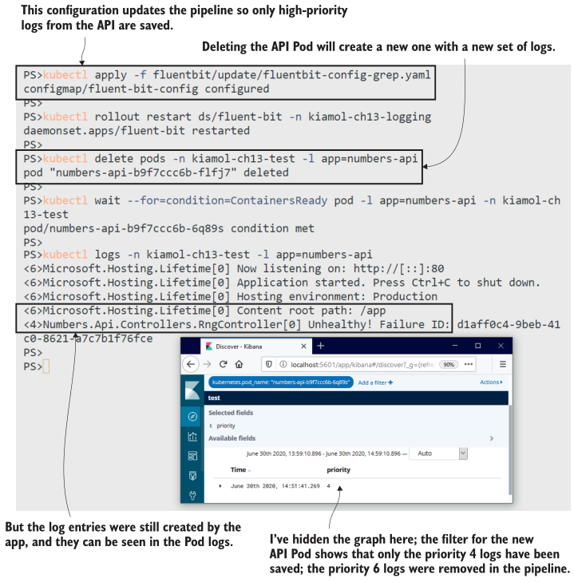

<center>图 13.13 Filtering log entries in Fluent Bit saves on storage, and you can easily change the filter</center>

There’s plenty more to Fluent Bit than we’ve covered in these simple pipelines: you can modify log contents, throttle the rate of incoming logs, and even run custom scripts triggered by log entries. But we’ve covered all the main features you’re likely to need, and we’ll wrap up by looking at the collect-and-forward logging model compared to other options.

## 13.5 了解 Kubernetes 中的日志记录选项

Kubernetes has an expectation that your application logs will come from the container’s standard output streams. It collects and stores all the content from those streams, and that powers the logging model we’ve covered in this chapter. It’s a generic and flexible approach, and the technology stack we’ve used is reliable and performant, but there are inefficiencies along the way. Figure 13.14 shows some of the issues in getting logs from containers into searchable storage.

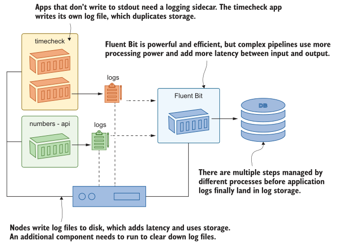

<center>图 13.14 The goal is to get application logs into Elasticsearch, but it takes many steps to get there</center>

You can use alternative architectures that are simpler and have fewer moving pieces. You could write logs directly to Elasticsearch from your application code, or you could run a sidecar in every application Pod that reads from whatever log sink the app uses and pushes entries to Elasticsearch. That would give you a lot more control over thelog data you store, without resorting to regular expressions to parse text strings. Doing this ties you to Elasticsearch (or whichever storage system you use), but that may not be a big concern if that system provides all you need.

A custom logging framework might be appealing for the first app you run on Kubernetes, but as you move more workloads to the cluster, it’s going to restrict you. Requiring apps to log directly to Elasticsearch won’t fit for existing apps that write to operating system logs, and you’ll soon find your logging sidecar isn’t flexible enough and needs tweaking for every new application. The advantage of the Fluentd/Fluent Bit model is that it’s a standard approach with a community behind it; fiddling with regular expressions is much less hassle than writing and maintaining your own log collection and forwarding code.

That’s all for application logs, so we can clear down the cluster to get ready for the lab.

TRY IT NOW
Remove this chapter’s namespaces and the remaining Deployment.

```
kubectl delete ns -l kiamol=ch13
kubectl delete all -l kiamol=ch13
```

## 13.6 实验室

In this lab, you play the part of an operator who needs to deploy a new app into a cluster that is using the logging model from this chapter. You’ll need to check the Fluent Bit configuration to find the namespace you should use for your app and then deploy the simple versioned website we’ve used before in the book. Here are the parts to this lab:

- Start by deploying the logging components in the lab/logging folder.
- Deploy the app from the vweb folder to the correct namespace so logs are collected, and verify you can see the logs in Kibana.
- You’ll see the logs are plain text, so the next step is to update your Deployment to use the correct parser. The app runs on Nginx, and an Nginx parser is already set up for you in the Fluent Bit configuration.
- When you confirm the new logs in Kibana, you’ll see several for which the status code is 304, which tells the browser to use its cached version of the page. Those logs aren’t interesting, so the final task is to update the Fluent Bit configuration to filter them out.

This is a very real-world task where you’ll need all the basic skills of navigating around Kubernetes to find and update all the pieces. My solution is in the usual place on GitHub for you to check: https://github.com/sixeyed/kiamol/blob/master/ch13/lab/README.md.