# 第十四章 使用 Prometheus 监控应用程序和 Kubernetes

监控是日志的伙伴:监视系统告诉您某些地方出了问题，然后您可以深入日志以找出详细信息。与日志记录一样，您希望有一个集中的系统来收集和可视化关于所有应用程序组件的指标。Kubernetes中已建立的监控方法使用另一个CNCF项目:Prometheus，这是一个收集和存储指标的服务器应用程序。在本章中，您将学习如何在Kubernetes中部署一个共享监控系统，使用 dashboard 面板显示单个应用程序和整个集群的健康状况。

Prometheus 在许多平台上运行，但它特别适合Kubernetes。您可以在一个Pod中运行Prometheus，该Pod可以访问Kubernetes API服务器，然后Prometheus查询API以找到它需要监视的所有目标。

当你部署新的应用程序时，你不需要做任何设置更改——prometheus会自动发现它们并开始收集指标。Kubernetes的应用程序也特别适合Prometheus。在本章中，你将看到如何很好地利用sidecar模式，因此每个应用程序都可以为Prometheus提供一些指标，即使应用程序本身还没有准备好。

## 14.1 Prometheus 如何监控 Kubernetes 的工作负载

Prometheus 中的度量完全是通用的:您想要监视的每个组件都有一个HTTP端点，该端点返回对该组件重要的所有值。web服务器包含它所服务的请求数量的指标，Kubernetes节点包含可用内存数量的指标。Prometheus并不关心度量标准中的内容;它只存储组件返回的所有内容。对普罗米修斯来说，重要的是它需要收集的目标列表。

图14.1显示了如何使用Prometheus的内置服务发现在Kubernetes中工作。

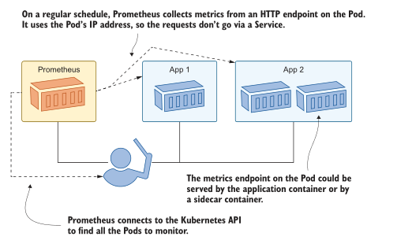
<center>图14.1普罗米修斯使用拉模型收集指标，自动找到目标</center>

本章的重点是让 Prometheus 与 Kubernetes 很好地合作，为您提供一个动态监控系统，当您的集群扩展到更多的节点，运行更多的应用程序时，该系统仍能保持工作。我不会详细介绍如何在应用程序中添加监控，或者应该记录哪些指标，电子书的附录B是《Learn Docker in a Month of lunch》中的“添加可观察性与容器化监控”一章，它将为您提供额外的细节。

我们将从启动普罗米修斯开始。Prometheus服务器是一个单独的组件，负责服务发现、指标收集和存储，它有一个基本的web UI，您可以使用它来检查系统的状态并运行简单的查询。

现在试试吧，将Prometheus部署在专用的监视命名空间中，配置为在 test 命名空间中查找应用程序(test 命名空间还不存在)。

```
# 切换到章节目录:
cd ch14

# 创建 Prometheus Deployment and ConfigMap:
kubectl apply -f prometheus/

# 等待 Prometheus to start:
kubectl wait --for=condition=ContainersReady pod -l app=prometheus -n kiamol-ch14-monitoring

# 获取 web UI 地址:
kubectl get svc prometheus -o jsonpath='http://{.status.loadBalancer.ingress[0].*}:9090' -n kiamol-ch14-monitoring
# 访问 UI, 查看 /targets page
```

Prometheus 称 metrics 收集为 scraping。当您访问 Prometheus UI 时，您将看到没有抓取目标，尽管有一个名为 testpods 的类别，它列出了零目标。图14.2显示了我的输出。test-pods 的名称来自您在ConfigMap中部署的Prometheus配置，Pod从中读取该配置。

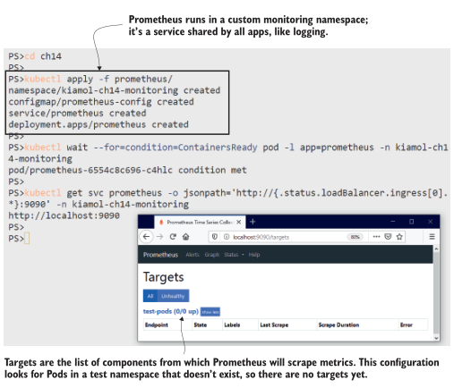
<center>图14.2 目前还没有目标，但Prometheus将继续检查Kubernetes API以寻找新的pod </center>

配置 Prometheus 以在 Kubernetes 中寻找目标是相当简单的，尽管术语一开始令人困惑。Prometheus 使用作业来定义一组相关的目标，这些目标可以是应用程序的多个组件。抓取配置可以简单到一个静态域名列表(Prometheus轮询该列表以获取指标)，也可以使用动态服务发现。清单14.1 向 Prometheus 展示了test-pods作业配置的开头，它使用Kubernetes API进行服务发现。

> 清单 14.1 prometheus-config.yaml, 使用Kubernetes scrape 配置

```
scrape_configs: # 这是 configmap 中的 yaml.
   - job_name: 'test-pods' # 用于 test apps
     kubernetes_sd_configs: # 从 kubernetes API 查找目标
     - role: pod # 搜寻 Pods
     relabel_configs: # 应用这些过滤规则
     - source_labels:
       - __meta_kubernetes_namespace
       action: keep # 只包含本章测试命名空间的 pods
       regex: kiamol-ch14-test 
```

需要解释的是 relabel_configs 部分。Prometheus使用标签存储度量，标签是标识源系统和其他相关信息的键值对。您将在查询中使用标签来选择或聚合指标，还可以在将指标存储到Prometheus之前使用它们来过滤或修改指标。这是重新标签，从概念上讲，它类似于Fluent bit中的数据管道——您有机会丢弃不想要的数据并重新塑造您想要的数据。正则表达式在 Prometheus 中也出现了不必要的复杂问题，但很少需要进行更改。你在重新标签阶段设置的管道应该足够通用，适用于所有应用程序。配置文件中的全管道应用如下规则:

- 只包含命名空间 kiamol-ch14-test 中的Pods。
- 使用 Pod 名称作为Prometheus实例标签的值。
- 使用 Pod 元数据中的app标签作为Prometheus作业标签的值。
- 在 Pod 元数据中使用可选注解配置抓取目标。

这种方法是由约定驱动的——只要您的应用程序被建模以适应规则，它们就会自动被选为监视目标。Prometheus使用规则来查找匹配的Pods，对于每个目标，它通过向/metrics路径发出HTTP GET请求来收集指标。Prometheus需要知道使用哪个网络端口，因此Pod规范需要显式地包括容器端口。这是一个很好的实践，因为它有助于记录应用程序的设置。让我们将一个简单的应用程序部署到test命名空间，看看Prometheus用它做了什么。

现在试试吧，将时间检查应用程序部署到测试命名空间。该规格匹配所有的普罗米修斯 scrape 规则，所以新的Pod应该被找到并添加为 scrape目标。

```
# 创建 test namespace 以及 timecheck Deployment:
kubectl apply -f timecheck/
# 等待 app 启动:
kubectl wait --for=condition=ContainersReady pod -l app=timecheck -n kiamol-ch14-test

# 刷新Prometheus界面中的 target 列表，并确认
# timecheck Pod，然后浏览到/graph页面，选择
# timecheck_total，然后单击“执行”
```

我的输出如图14.3所示，其中我打开了两个浏览器窗口，以便您可以看到部署应用程序时发生了什么。普罗米修斯看到时间检查Pod被创建，它符合重新标记阶段的所有规则，所以它被添加为目标。普罗米修斯配置设置为每30秒检查一次目标。时间检查应用程序有一个/metrics端点，它返回它写了多少时间检查日志的计数。当我在Prometheus中查询该指标时，应用程序已经写入了22个日志条目。

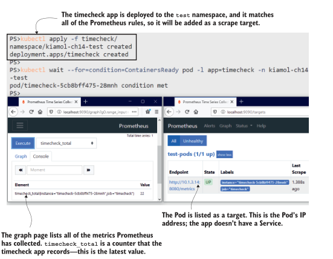
<center>图14.3 将应用程序部署到测试命名空间- prometheus找到它并开始收集指标. </center>

这里您应该认识到两个重要的事情:应用程序本身需要提供度量，因为Prometheus只是一个收集器，而那些度量代表应用程序实例的活动。时间检查应用程序不是一个web应用程序——它只是一个后台进程——所以没有服务将流量导向它。普罗米修斯在查询Kubernetes API时获得Pod的IP地址，并直接向Pod发出HTTP请求。您也可以配置Prometheus来查询Services，但是这样您就会得到一个目标，它是跨多个Pod的负载均衡器，并且您希望Prometheus独立地抓取每个Pod。

你可以使用Prometheus中的指标来增强仪表板，显示应用程序的整体健康状况，你可以汇总所有pod来获得标题值。您还需要能够向下钻取，以查看pod之间是否有差异。这将帮助您确定某些实例是否执行不良，并将反馈到您的运行状况检查中。我们可以放大时间检查应用程序，看看在单个Pod级别收集的重要性。

现在试试吧，添加另一个副本到时间检查应用程序。这是一个新的Pod，符合普罗米修斯规则，所以它将被发现并添加为另一个 scrape 目标。

```
# 缩放部署以添加另一个Pod:
kubectl scale deploy/timecheck --replicas 2 -n kiamol-ch14-test
# 等待新的 pod 启动:
kubectl wait --for=condition=ContainersReady pod -l app=timecheck -n kiamol-ch14-test
# 回到普罗米修斯，检查 target 列表，在 graph 页面，
# 执行timecheck_total和dotnet_total_memory_bytes的查询
```

在这个练习中，你会看到普罗米修斯发现了新的 pod，并开始采集它。两个Pod记录相同的指标，Pod名称被设置为每个指标上的标签。对timecheck_total指标的查询现在返回两个结果——每个Pod一个结果——在图14.4中可以看到，一个Pod比另一个Pod完成了更多的工作。


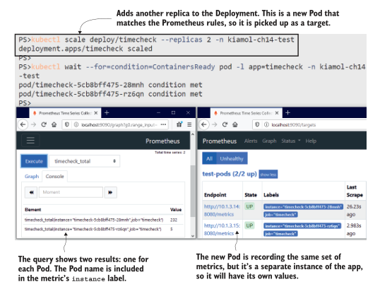
<center>图14.4 每个实例都记录自己的指标，因此您需要从每个Pod收集数据。 </center>

时间检查计数器是在应用程序代码中显式捕获的度量。大多数语言都有一个Prometheus客户端库，您可以将其插入到您的构建中。这些库允许您像这样捕获特定于应用程序的细节，它们还收集有关应用程序运行时的一般信息。这是一个.net应用程序，Prometheus客户端库记录运行时细节，比如正在使用的内存和CPU数量以及正在运行的线程数量。在下一节中，我们将运行一个分布式应用程序，其中每个组件都公开Prometheus指标，我们将看到当应用程序仪表板包括运行时性能和应用程序详细信息时，它是多么有用。

## 14.2 监视使用 Prometheus 客户端库构建的应用程序

电子书的附录B介绍了如何向一个应用程序添加指标，该应用程序显示了来自NASA“每日天文照片”(APOD)服务的图片。该应用程序的组件在Java、Go和Node.js中，它们都使用Prometheus客户端库来公开运行时和应用程序指标。本章包括部署到test 命名空间的应用程序的Kubernetes清单，因此所有应用程序Pods将被Prometheus发现。

现在试试吧，将APOD应用程序部署到测试命名空间，并确认应用程序的三个组件被添加为Prometheus目标。

```
# 部署 app:
kubectl apply -f apod/
# 等待启动成功:
kubectl wait --for=condition=ContainersReady pod -l app=apod-api -n kiamol-ch14-test
# 获取 app URL:
kubectl get svc apod-web -o jsonpath='http://{.status.loadBalancer.ingress[0].*}:8014' -n kiamol-ch14-test

# 访问 app, 然后刷新 Prometheus targets 界面
```

你可以在图 14.5 中看到我的输出，其中有一个非常令人愉快的图像，叫做林德斯暗星云1251。应用程序如预期的那样运行，普罗米修斯已经发现了所有新的pod。在部署应用程序的30秒内，你应该会看到所有新目标的状态都是正常的，这意味着普罗米修斯已经成功地抓取了它们。

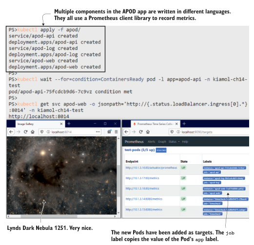
<center>图14.5 APOD组件都有服务，但它们仍然在Pod级别被抓取</center>

在这个练习中，我还有两件重要的事情要指出。首先，Pod规范都包括一个容器端口，它说明应用程序容器正在监听端口80，这就是Prometheus找到要抓取的目标的方法。web UI的Service实际上监听端口8014，但是Prometheus直接访问Pod端口。其次，API目标没有使用标准/度量路径，因为Java客户机库使用不同的路径。我在Pod规范中使用了注释来说明正确的路径。

基于约定的发现很棒，因为它消除了大量重复的配置和潜在的错误，但并不是每个应用都符合约定。我们在普罗米修斯中使用的重标签管道为我们提供了一个很好的平衡。默认值适用于任何符合约定的应用程序，但任何不符合约定的应用程序都可以用注释覆盖默认值。清单14.2显示了如何配置覆盖以设置度量的路径。

> 清单 14.2 prometheus-config.yaml, 使用 annotations 覆盖默认值

```
- source_labels: # 这个是 test-pods job 中的 relabel 配置.
  - __meta_kubernetes_pod_annotationpresent_prometheus_io_path
  - __meta_kubernetes_pod_annotation_prometheus_io_path
regex: true;(.*) # 如果 pod 具有一个名为 prometheus.io/path 的 annotation

target_label: __metrics_path__ #从 annotation 中获取设置 target path
```

这远没有看起来那么复杂。规则是这样的:如果 pod 有一个叫 prometheus.io/path 注释，然后就使用该注释的值作为度量路径。Prometheus使用标签来完成这一切，因此每个Pod注释都成为一个名称为meta_kubernetes_pod_annotation_<annotation-name>的标签，并且有一个附带的标签名为meta_kubernetes_pod_annotationpresent_<annotation-name>，您可以使用它来检查注释是否存在。任何使用自定义指标路径的应用程序都需要添加注释。清单14.3显示了APOD API。

> Listing 14.3 api.yaml,  path annotation

```
template: # 这是 deployment 的 pod spec 配置
   metadata:
     labels:
       app: apod-api # 在 prometheus 中用作 job 标签
     annotations:
       prometheus.io/path: "/actuator/prometheus" # 设置 metrics path
```

复杂性集中在 Prometheus 配置中，应用程序清单非常容易指定覆盖。当您多使用一些重新标记规则时，它们就不那么复杂了，并且通常遵循完全相同的模式。完整的Prometheus配置包括类似的规则，应用程序可以覆盖指标端口，并选择完全退出抓取。

当你在读这篇文章的时候，普罗米修斯一直在忙着抓取时间支票和APOD应用程序。看看Prometheus UI的Graph页面上的指标，可以看到大约有200个指标正在被收集。UI非常适合运行查询并快速查看结果，但你不能用它来构建一个仪表板，在一个屏幕上显示应用程序的所有关键指标。为此，您可以使用Grafana，它是容器生态系统中的另一个开源项目，由Prometheus团队推荐。

现在试试吧，使用ConfigMaps部署Grafana，它建立了与Prometheus的连接，并包括APOD应用程序的仪表板。

```
# 在监控命名空间中部署Grafana:
kubectl apply -f grafana/
# 等待启动:
kubectl wait --for=condition=ContainersReady pod -l app=grafana -n
kiamol-ch14-monitoring
# 获取 dashboard url:
kubectl get svc grafana -o jsonpath='http://{.status.loadBalancer.ingress[0].*}:3000/d/kb5nhJAZk' -n kiamol-ch14-monitoring

# 浏览到URL;使用用户名kiamol和密码kiamol登录
```

图14.6所示的仪表板很小，但它让您了解了如何将原始指标转换为系统活动的信息视图。仪表板由Prometheus查询驱动，Grafana在后台运行该查询。每个组件都有一行，其中包括运行时指标(处理器和内存使用)和应用程序指标(http请求和缓存使用)的混合。

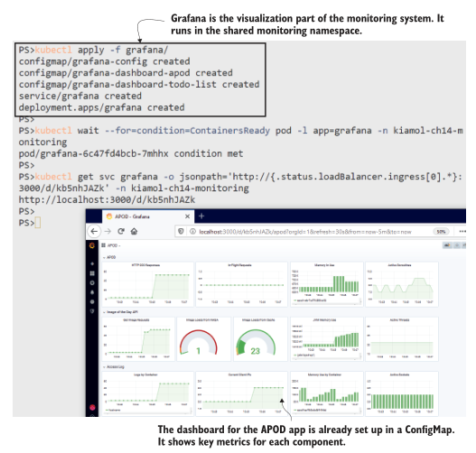
<center>图14.6应用程序仪表板提供了对性能的快速洞察。这些图表都是由Prometheus metrics提供的</center>

像这样的仪表板将是贯穿整个组织的共同努力。支持团队将设置他们需要看到的需求，应用程序开发和运营团队确保应用程序捕获数据并在仪表板上显示它。就像我们在第13章中看到的日志系统一样，这是一个由轻量级开源组件构建的解决方案，因此开发人员可以在他们的笔记本电脑上运行与在生产环境中运行的相同的监控系统。这有助于在开发和测试中进行性能测试和调试。

使用Prometheus转移到集中监视将需要开发工作，但是它可以是一个增量过程，您从基本的度量开始，并随着团队开始提出更多的需求而添加它们。我在本章的待办事项列表应用程序中添加了对普罗米修斯的支持，这大约花了十几行代码。在Grafana中有一个简单的应用程序仪表板，所以当你部署应用程序时，你将能够看到一个仪表板的起点，它将在未来的版本中得到改进。

现在试试吧,运行启用指标的待办事项列表应用程序，并使用该应用程序生成一些指标。在Grafana中已经有一个仪表盘来可视化指标。

```
# 部署 app:
kubectl apply -f todo-list/

# 等待启动:
kubectl wait --for=condition=ContainersReady pod -l app=todo-web -n
kiamol-ch14-test

# 访问应用，插入待办项
# 然后在 windows 中运行脚本:
.\loadgen.ps1
# 或者 macOS/Linux:
chmod +x ./loadgen.sh && ./loadgen.sh

# 获取新的 dashboard 地址:
kubectl get svc grafana -o jsonpath='http://{.status.loadBalancer.ingress[0].*}:3000/d/Eh0VF3iGz' -n kiamol-ch14-monitoring

# 浏览 dashboard
```

仪表板上没有太多东西，但它比没有仪表板的信息要多得多。它告诉你应用程序在容器内使用了多少CPU和内存，创建任务的速率，以及HTTP请求的平均响应时间。您可以在图14.7中看到我的输出，其中我添加了一些任务，并使用负载生成脚本发送了一些流量。

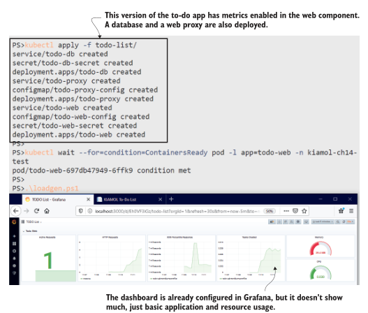
<center>图14.7 一个由 Prometheus 客户端库和几行代码驱动的简单仪表板 </center>

所有这些指标都来自待办事项应用程序Pod。在这个版本中，应用程序还有另外两个组件:一个用于存储的Postgres数据库和一个Nginx代理。这两个组件都没有对Prometheus的本地支持，因此它们被排除在目标列表之外。否则，普罗米修斯将继续尝试着获取度量标准并失败。对应用程序进行建模的人员的工作是了解一个组件不公开指标，并指定应该排除它。清单14.4显示了使用一个简单注释完成的操作。

> 清单 14.4 proxy.yaml, 一个 pod spec 排除 监控

```
template: # 这是 deployment pod spec 配置
   metadata:
     labels:
       app: todo-proxy
     annotations: # 排除 target
       prometheus.io/scrape: "false"
```

组件不需要对Prometheus提供本地支持，并提供自己的度量端点以包含在监视系统中。Prometheus有自己的生态系统——除了可以用来向自己的应用程序添加指标的客户端库之外，一整套 exporter 可以为第三方应用程序提取和发布指标。我们可以使用 exporter 为代理和数据库组件添加缺少的指标。

## 14.3 通过 metrics exporters 来监控第三方应用

大多数应用程序都以某种方式记录指标，但较老的应用程序不会以Prometheus格式收集和公开它们。Exporters 是独立的应用程序，了解目标应用程序如何进行监视，并可以将这些指标转换为Prometheus格式。Kubernetes提供了完美的方式来运行一个exporter 与应用程序的每个实例使用 sidecar 容器。这就是我们在第7章中介绍的适配器模式。

Nginx和Postgres都有可用的 exporters ，我们可以作为sidecars来运行，以改善待办应用程序的监控仪表板。Nginx exporter 从Nginx服务器上的状态页面读取数据，并将数据转换为Prometheus格式。记住，Pod中的所有容器都共享网络命名空间，因此exporter 容器可以在本地主机地址访问Nginx容器。exporter 为自定义端口上的指标提供了自己的HTTP端点，因此完整的Pod spec 包括sidecar容器和指定指标端口的注释。清单14.5显示了关键部分。

> 清单 14.5 proxy-with-exporter.yaml, 添加 metrics exporter 容器

```
template: # Deployment 中的 pod spec
   metadata:
      labels:
         app: todo-proxy
      annotations: 
         prometheus.io/port: "9113" # 指定 metrics port
   spec:
      containers:
         - name: nginx
           # ... nginx spec 没有变化
         - name: exporter # exporter 作为 sidecar 运行.
           image: nginx/nginx-prometheus-exporter:0.8.0
           ports:
             - name: metrics
               containerPort: 9113 # 指定 metrics port
           args: # 从 ngins load metrics
             - -nginx.scrape-uri=http://localhost/stub_status
```

排除 scrape 已经被移除，所以当你部署这个更新，普罗米修斯将scrape 端口9113上的Nginx Pod，在那里exporter 正在监听。所有的Nginx指标将由Prometheus存储，Grafana仪表板可以更新为代理添加一行。在本章中，我们不打算讨论Prometheus查询语言(PromQL)或构建Grafana仪表板——仪表板可以从JSON文件导入，并且有一个更新的仪表板可以部署。

现在试试吧，更新 proxy deployment 以添加 sidecar，并将更新后的仪表板加载到Grafana ConfigMap中。

```
# 添加 proxy sidecar:
kubectl apply -f todo-list/update/proxy-with-exporter.yaml

# 等待启动:
kubectl wait --for=condition=ContainersReady pod -l app=todo-proxy -n
kiamol-ch14-test

# 输出 exporter 日志:
kubectl logs -l app=todo-proxy -n kiamol-ch14-test -c exporter

# 更新 app dashboard:
kubectl apply -f grafana/update/grafana-dashboard-todo-list-v2.yaml

# 重启 Grafana load 新 dashboard:
kubectl rollout restart deploy grafana -n kiamol-ch14-monitoring

# 刷新 dashboard
```

Nginx exporter 没有提供大量的信息，但基本的细节都在那里。你可以在图14.8中看到，我们得到了HTTP请求的数量，以及Nginx如何处理连接请求的底层分解。即使使用这个简单的仪表板，你也可以看到Nginx正在处理的流量和web应用程序正在处理的流量之间的相关性，这表明代理没有缓存响应，而是对每个请求都调用web应用程序。

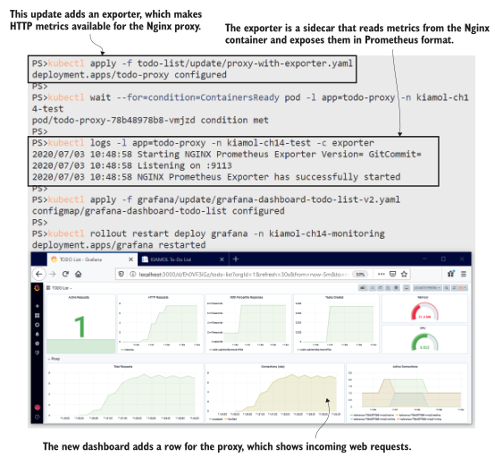
<center>图14.8使用导出器收集代理指标为仪表板添加了另一层细节. </center>

如果能从Nginx得到更多的信息就好了——比如响应中HTTP状态码的分解——但是 exporter 只能从源系统中转可用的信息，这对Nginx来说并不多。其他 exporter 提供更多细节，但您需要集中您的仪表板，以便显示关键指标。超过12个左右的可视化和仪表板变得势不可挡，而且，如果它不能一眼传达有用的信息，那么它就没有做得很好。

还有一个组件要添加到待办事项列表仪表板中:Postgres数据库。Postgres将各种有用的信息存储在数据库中的表和函数中，exporter 运行查询来支持其metrics端点。Postgres exporter 的设置遵循我们在Nginx中看到的相同模式。在这种情况下，sidecar被配置为访问本地主机上的Postgres，使用与Postgres容器用于admin密码相同的Kubernetes Secret。我们将对应用程序仪表板进行最后的更新，以显示来自 exporter 的关键数据库指标。


现在试试,更新数据库部署规范，添加Postgres exporter 作为 sidecar 容器。然后用更新待办事项列表仪表板以显示数据库性能。

```
# 添加 Postgres exporter sidecar:
kubectl apply -f todo-list/update/db-with-exporter.yaml

# 等待 pod 启动:
kubectl wait --for=condition=ContainersReady pod -l app=todo-db -n
kiamol-ch14-test

# 输出 exporter 日志:
kubectl logs -l app=todo-db -n kiamol-ch14-test -c exporter

# 更新 dashboard 重启 Grafana:
kubectl apply -f grafana/update/grafana-dashboard-todo-list-v3.yaml
kubectl rollout restart deploy grafana -n kiamol-ch14-monitoring
```

在图14.9中，我缩小并向下滚动，这样您就可以看到新的可视化效果，但是在全屏模式下，整个仪表板都是赏心悦目的。一个页面显示了代理的流量，应用程序的工作强度，用户实际在做什么，以及数据库内部发生了什么。您可以在自己的应用程序中使用客户端库和 exporter 获得相同级别的细节，而这只需要几天的努力。

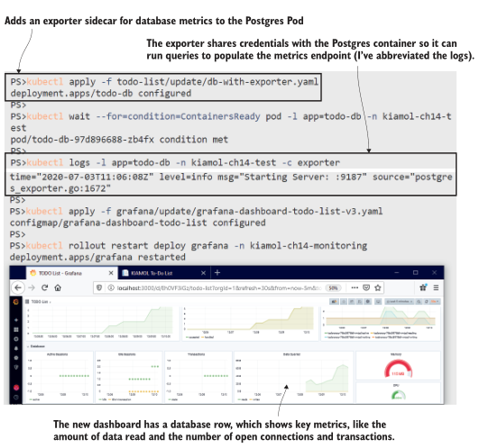
<center> 图 14.9 数据库 exporter 记录有关数据活动的度量，这将向仪表板添加详细信息. </center>

exporter 在那里为没有普罗米修斯支持的应用程序添加指标。如果您的目标是将一组现有的应用程序转移到Kubernetes上，那么您可能没有一个奢侈的开发团队来添加自定义指标。对于这些应用程序，您可以使用Prometheus blackbox exporter，这是一种极端的方法，即有监控总比没有好。

blackbox exporter 可以在sidecar中运行，向应用程序容器发出TCP或HTTP请求，并提供一个基本的度量端点来说明应用程序是否启动。这种方法类似于在Pod规范中添加容器探测，除了 blackbox exporter 仅供参考。如果应用程序不适合Kubernetes 的自我修复机制，你可以运行一个仪表板来显示应用程序的状态，比如我们在本书中使用的随机数API。

现在试试吧,使用 blackbox exporter 和最简单的Grafana仪表板部署随机数API。您可以通过重复使用API来破坏它，然后重置它，使其重新工作，仪表板跟踪状态。

```
# 部署 API 程序到测试命名空间:
kubectl apply -f numbers/

# 添加新的 dashboard 到 grafana:
kubectl apply -f grafana/update/numbers-api/

# 获得 API URL:
kubectl get svc numbers-api -o jsonpath='#app - http://{.status.loadBalancer.ingress[0].*}:8016/rng' -n kiamol-ch14-test

# 通过访问/rng URL来使用API
# 它将在三次调用后中断;
# 然后访问 /reset 来修复它
# 获取仪表盘的URL，并在Grafana中加载它:
kubectl get svc grafana -o jsonpath='# dashboard - http://{.status
.loadBalancer.ingress[0].*}:3000/d/Tb6isdMMk' -n kiamol-ch14-
monitoring
```

随机数API不支持Prometheus，但是运行 blackbox exporter 作为sidecar容器可以基本了解应用程序状态。图14.10显示了一个大部分为空的仪表板，但这两个可视化显示了应用程序是否健康，以及应用程序在不健康和被重置之间切换时状态的历史趋势。

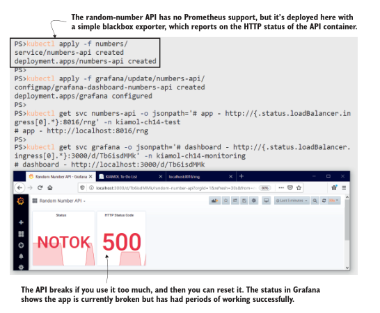
<center>图14.10 即使是一个简单的仪表盘也是有用的。这显示了API的当前和历史状态。 </center>

随机数API的Pod规范遵循与待办应用中的Nginx和Postgres类似的模式: blackbox exporter 被配置为一个额外的容器，并指定暴露指标的端口。Pod 注释自定义度量URL的路径，因此当Prometheus从sidecar中抓取度量时，它调用 blackbox exporter ，该导出器检查API是否响应HTTP请求。

现在我们有三个不同的应用程序的仪表板，它们有不同的细节级别，因为应用程序组件与它们收集的数据不一致。但是所有的组件都有一个共同点:它们都在 kubernetes 容器中运行.在下一节中，您将学习如何通过配置Prometheus从集群本身收集平台指标。

## 14.4 监控容器以及 kubernetes 对象

Prometheus与Kubernetes集成用于服务发现，但它不从API收集任何指标。你可以从另外两个组件获得关于Kubernetes对象和容器活动的指标:cAdvisor(谷歌开源项目)和kube-state-metrics (Kubernetes组织的一部分)。两者都作为集群中的容器运行，但它们从不同的来源收集数据。cAdvisor从容器运行时收集度量，因此它作为一个DaemonSet运行，每个节点上都有一个Pod，以报告该节点的容器。kube-state-metrics查询Kubernetes API，因此它可以作为 Deployment 运行，在任何节点上都有一个副本。

现在试试吧,为 cAdvisor 和 kube-state-metrics 部署度量收集器，并更新Prometheus配置以将它们包括为抓取目标。

```
# 部署 cAdvisor 和 kube-state-metrics:
kubectl apply -f kube/
# 等待 cAdvisor 启动:
kubectl wait --for=condition=ContainersReady pod -l app=cadvisor -n kube-system
# 更新 Prometheus config:
kubectl apply -f prometheus/update/prometheus-config-kube.yaml
# 等待 ConfigMap 更新生效:
sleep 30
# 使用 HTTP POST 请求重新加载 Prometheus 配置:
curl -X POST $(kubectl get svc prometheus -o
jsonpath='http://{.status.loadBalancer.ingress[0].*}:9090/-/reload'
-n kiamol-ch14-monitoring)

# 访问 Prometheus UI— 在 Graph 页面你将看到包含 容器以及 kubernetes 对象的 metrics 信息
```

在本练习中，您将看到 Prometheus 正在收集数以千计的新度量。原始数据包括每个容器使用的计算资源和每个Pod的状态。我的输出如图14.11所示。当您运行这个练习时，您可以检查Prometheus UI中的Targets页面，以确认新的目标正在被抓取。Prometheus不会自动重新加载配置，因此在练习中，会有一个延迟，让Kubernetes有时间传播ConfigMap更新，并且curl命令强制Prometheus重新加载配置。

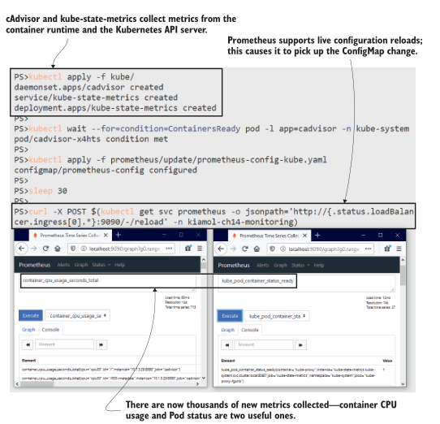
<center>图 14.11 新指标显示集群和容器级别的活动. </center>

刚刚部署的更新后的Prometheus配置包括两个新的作业定义，如清单14.6所示。kube-state-metrics使用服务的完整DNS名称指定为静态目标。一个Pod收集所有的指标，所以这里不存在负载平衡问题。cAdvisor使用Kubernetes服务发现来查找DaemonSet中的每个Pod，这将为多节点集群中的每个节点提供一个目标。

> 清单 14.6 prometheus-config-kube.yaml,  Prometheus 新的采集 target

```
- job_name: 'kube-state-metrics'    # Kubernetes metrics 使用静态的 DNS 配置
  static_configs:                   
  - targets:
    - kube-state-metrics.kube-system.svc.cluster.local:8080
    - kube-state-metrics.kube-system.svc.cluster.local:8081

- job_name: 'cadvisor'              # Container metrics 使用 kubernetes 服务发现
  kubernetes_sd_configs:            # 来找到所有的 DaemonSet Pods,加上命名空间以及标签参数
  - role: pod                      
  relabel_configs:                 
    - source_labels:
      - __meta_kubernetes_namespace
      - __meta_kubernetes_pod_labelpresent_app
      - __meta_kubernetes_pod_label_app
    action: keep
    regex: kube-system;true;cadvisor
```

现在我们遇到了与随机数仪表板相反的问题:新指标中有太多信息，所以平台仪表板需要高度选择性，如果它想要有用的话。我准备了一个示例仪表板，这是一个很好的开始。它包括集群的当前资源使用情况和所有可用资源数量，以及按命名空间划分的一些高级分解和节点运行状况的警告指示器。

现在试试吧，为关键集群指标部署一个仪表板，并对Grafana进行更新，以便它加载新的仪表板。

```
# 创建仪表板ConfigMap并更新Grafana:
kubectl apply -f grafana/update/kube/
# 等待 grafana 加载:
kubectl wait --for=condition=ContainersReady pod -l app=grafana -n
kiamol-ch14-monitoring
# 获取新的 dashboard url:
kubectl get svc grafana -o
jsonpath='http://{.status.loadBalancer.ingress[0].*}:3000/d/oWe9aYxmk' -n kiamol-ch14-monitoring

# 浏览 dashboard
```

这是另一个用于大屏幕的仪表板，因此图 14.12 中的屏幕截图并不能准确地显示它。当您运行这个练习时，您可以更仔细地检查它。上面一行显示内存使用情况，中间一行显示CPU使用情况，下面一行显示Pod容器的状态。

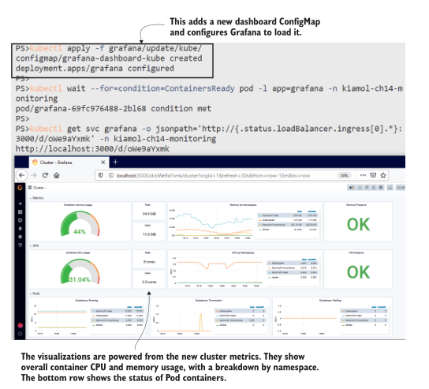
<center>图14.12 另一个小截图—在您自己的集群中运行练习以查看完整的大小. </center>

像这样的平台 dashboard 级别相当低——它实际上只是显示您的集群是否接近饱和点。支持这个仪表板的查询将更有用，可以作为警报，在资源使用失控时发出警告。Kubernetes 的压力指示器在那里很有用。内存压力和进程压力值显示在仪表板中，还有一个磁盘压力指示器。这些值很重要，因为如果节点受到计算压力，它可以终止Pod容器。这些都是值得注意的良好指标，因为如果您达到了这个阶段，您可能需要呼叫某人来看护集群恢复正常。

平台指标还有另一个用途:在应用程序本身无法提供足够详细指标的情况下，为应用程序仪表板添加细节。平台仪表板显示整个集群中聚合的计算资源使用情况，但cAdvisor在容器级别上收集它。kube-state-metrics也是如此，您可以过滤特定工作负载的指标，以便向应用程序仪表板添加平台信息。我们将在本章中进行最后一次仪表板更新，将平台的详细信息添加到随机数应用程序中。

现在试试吧,为随机数API更新仪表板，以添加来自平台的指标。这只是一个Grafana更新;应用程序本身和普罗米修斯都没有变化。

```
# 更新 dashboard:
kubectl apply -f grafana/update/grafana-dashboard-numbers-api-v2.yaml
# 重新启动Grafana，让它重新加载仪表板:
kubectl rollout restart deploy grafana -n kiamol-ch14-monitoring
# 等待 pod 启动:
kubectl wait --for=condition=ContainersReady pod -l app=grafana -n
kiamol-ch14-monitoring

# 浏览随机数API仪表板
```

如图14.13所示，仪表板仍然是基础信息，但至少我们现在有了一些细节，可以帮助关联任何问题。如果HTTP状态代码显示为503，我们可以快速查看CPU是否也处于峰值状态。如果Pod标签包含一个应用程序版本(这是应该的)，我们可以确定哪个版本的应用程序遇到了问题。

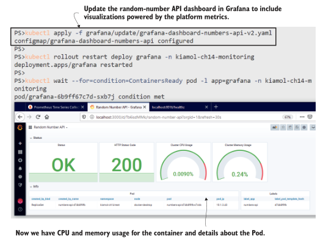
<center>图14.13 使用容器和Pod指标增强基本运行状况统计可以增加相关性. </center>

关于监控，还有很多我不会在这里介绍的内容，但是现在您已经对Kubernetes和Prometheus如何协同工作有了一个坚实的基础。您缺少的主要部分是在服务器级收集指标和配置警报。服务器指标提供磁盘和网络使用情况等数据。您可以通过直接在节点上运行 exporter 来收集它们(对于Linux服务器使用Node export，对于Windows服务器使用Windows export)，并使用服务发现将节点添加为抓取目标。Prometheus 有一个复杂的警报系统，它使用 PromQL 查询定义警报规则。您可以配置警报，以便当规则被触发时，Prometheus 将发送电子邮件、创建Slack消息或通过PagerDuty发送通知。

我们将通过查看《Kubernetes》中普罗米修斯的完整架构来结束本章，并深入研究哪些部分需要定制工作以及需要在哪里努力。

## 14.5 了解您在监控方面所做的投资

When you step outside of core Kubernetes and into the ecosystem, you need to under- stand whether the project you take a dependency on will still exist in five years, or one year, or by the time the chapter you’re writing makes it to the printing press. I’ve been careful in this book to include only those ecosystem components that are open source, are heavily used, and have an established history and governance model. The monitoring architecture in figure 14.14 uses components that all meet those criteria.

I make that point because the move to Prometheus will involve development work. You need to record interesting metrics for your applications to make your dashboards truly useful. You should feel confident about making that investment because Prometheus is the most popular tool for monitoring containerized applications, and the project was the second to graduate in the CNCF—after Kubernetes itself. There’s also work underway to take the Prometheus metric format into an open standard (called

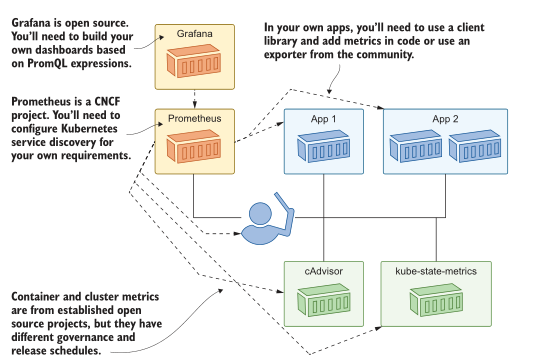
<center>Figure14.14 Monitoring doesn’t come for free—it needs development and dependencies on opensource projects. </center>

OpenMetrics), so other tools will be able to read application metrics exposed in the Prometheus format.

What you include in those metrics will depend on the nature of your applications, but a good general approach is to follow the guidelines from Google’s Site Reliability Engineering practice. It’s usually pretty simple to add the four golden signals to your app metrics: latency, traffic, errors, and saturation. (Appendix B in the ebook walks through how those look in Prometheus.) But the real value comes when you think about application performance from the user experience perspective. A graph that shows heavy disk usage in your database doesn’t tell you much, but if you can see that a high percentage of users don’t complete a purchase because your website’s check- out page takes too long to load, that’s worth knowing.

That’s all for monitoring now, so we can clear down the cluster to get ready for the lab.

TRY IT NOW 
Delete the namespaces for this chapter, and the objects created in the system namespace.

当你走出核心Kubernetes，进入生态系统时，你需要了解你所依赖的项目是否在五年后，或一年后，或在你所写的章节付印时仍然存在。在这本书中，我一直很小心地只包括那些开源的、被大量使用的、具有既定历史和治理模型的生态系统组件。图14.14中的监视体系结构使用了全部满足这些标准的组件。

我提出这一点是因为迁移到普罗米修斯将涉及开发工作。您需要为您的应用程序记录有趣的指标，以使您的仪表板真正有用。您应该对投资有信心，因为Prometheus是监视容器应用程序最流行的工具，并且该项目是cncf继Kubernetes之后第二个毕业的项目。目前正在进行的工作是将普罗米修斯公制格式引入一个开放标准(称为普罗米修斯公制)


<center>图14.14监控不是免费的——它需要开发并依赖于开源项目. </center>

OpenMetrics)，因此其他工具将能够读取以Prometheus格式公开的应用程序指标。

你在这些指标中包含什么将取决于你的应用程序的性质，但是一个好的通用方法是遵循谷歌网站可靠性工程实践的指导方针。在应用指标中添加四个黄金信号通常非常简单:延迟、流量、错误和饱和度。(电子书的附录B介绍了这些在《普罗米修斯》中的样子。)但真正的价值来自于从用户体验的角度考虑应用程序性能。一个显示数据库中磁盘使用率很高的图表并不能告诉你太多东西，但是如果你能看到有很大比例的用户因为你网站的结帐页面加载时间太长而没有完成购买，这是值得了解的。

监控到此结束，我们可以清理集群为实验室做准备了。

现在试试吧
删除本章的命名空间，以及system命名空间下创建的对象。

```
kubectl delete ns -l kiamol=ch14
kubectl delete all -n kube-system -l kiamol=ch14
```

## 14.6 实验室
Another investigative lab for this chapter. In the lab folder, there’s a set of manifests for a slightly simpler deployment of Prometheus and a basic deployment of Elasticsearch. The goal is to run Elasticsearch with metrics flowing into Prometheus. Here are the details:

- Elasticsearch doesn’t provide its own metrics, so you’ll need to find a component that does that for you.
- The Prometheus configuration will tell you which namespace you need to use for Elasticsearch and the annotation you need for the metrics path.
- You should include a version label in your Elasticsearch Pod spec, so Prometheus will pick that up and add it to the metric labels.
You’ll need to hunt around the documentation for Prometheus to get started, and that should show you the way. My solution is on GitHub for you to check in the usual place: <https://github.com/sixeyed/kiamol/blob/master/ch14/lab/README.md>.

本章的另一个调查实验室。在lab文件夹中，有一组清单，用于稍微简单一点的Prometheus部署和Elasticsearch的基本部署。我们的目标是运行Elasticsearch，并将度量流到Prometheus中。以下是细节:

- Elasticsearch不提供自己的指标，所以你需要找到一个组件来为你做这件事。
- Prometheus配置将告诉您需要为Elasticsearch使用哪个名称空间，以及您需要为度量路径使用注释。
- 你应该在你的Elasticsearch Pod规格中包含一个版本标签，这样Prometheus就会把它添加到度量标签中。

您需要搜索Prometheus的文档才能开始，它应该会为您指明方向。我的解决方案在GitHub上，你可以在通常的地方检查:<https://github.com/sixeyed/kiamol/blob/master/ch14/lab/README.md>。
