# 第十五章 使用 Ingress 管理流入流量

Services 将网络流量引入 Kubernetes，您可以拥有多个具有不同公共 IP 地址的 LoadBalancer 服务，以使您的 Web 应用程序可供全世界使用。这样做会给管理带来麻烦，因为这意味着为每个应用程序分配一个新的 IP 地址，并将地址映射到您的 DNS 提供商的应用程序。将流量转移到正确的应用程序是一个路由问题，但您可以使用 Ingress 在 Kubernetes 内部管理它。 Ingress 使用一组规则将域名和请求路径映射到应用程序，因此您可以为整个集群使用一个 IP 地址并在内部路由所有流量。

域名路由是一个老问题，通常已经用反向代理解决了，而 Kubernetes 对 Ingress 使用了可插拔的架构。您将路由规则定义为标准资源，并部署您选择的反向代理来接收流量并根据规则执行操作。所有主要的反向代理都有 Kubernetes 支持，以及一种新的容器感知反向代理。它们都有不同的功能和工作模型，在本章中，您将学习如何使用 Ingress 在集群中托管多个应用程序，其中两个应用程序是最流行的：Nginx 和 Traefik。

## 15.1 Kubernetes 如何使用 Ingress 路由流量

我们已经在本书中多次使用 Nginx 作为反向代理（据我统计 17 次），但我们总是一次将它用于一个应用程序。我们在第 6 章中使用了一个反向代理来缓存来自 Pi 应用程序的响应，在第 13 章中使用了另一个用于缓存随机数 API 的响应。Ingress 将反向代理移至中心角色，将其作为称为 ingress 控制器的组件运行，但方法是相同：代理从 LoadBalancer 服务接收外部流量，并使用 ClusterIP 服务从应用程序中获取内容。图 15.1 显示了架构。

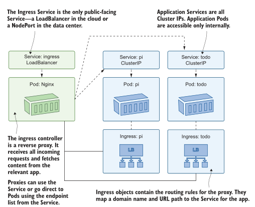
<center>图 15.1 Ingress 控制器是集群的入口点，根据 Ingress 规则路由流量。</center>

这张图中最重要的是 ingress 控制器，它是可插入的反向代理——它可能是 Nginx、HAProxy、Contour 和 Traefik 等十几个选项之一。 Ingress 对象以通用方式存储路由规则，控制器将这些规则提供给代理。代理具有不同的功能集，并且 Ingress 规范不会尝试对每个可能的选项进行建模，因此控制器使用注释添加对这些功能的支持。您将在本章中了解到，路由和 HTTPS 支持的核心功能使用起来很简单，但复杂性在于 ingress 控制器部署及其附加功能。

我们将从运行第 2 章中的基本 Hello, World Web 应用程序开始，将其作为具有 ClusterIP 服务的内部组件，并使用 Nginx ingress 控制器来路由流量。

立即尝试,运行 Hello, World 应用程序，并确认它只能在集群内部或外部使用 kubectl 中的端口转发访问。

```
# 进入本章目录:
cd ch15
# 部署 web app:
kubectl apply -f hello-kiamol/
# 确认服务是集群内部的:
kubectl get svc hello-kiamol
# 启动到应用程序的端口转发:
kubectl port-forward svc/hello-kiamol 8015:80
# 访问 http://localhost:8015
# 然后按Ctrl-C/Cmd-C退出端口转发
```

该应用程序的部署或服务规范中没有任何新内容——没有特殊标签或注释，没有您尚未使用过的新字段。您可以在图 15.2 中看到该服务没有外部 IP 地址，只有在运行端口转发时我才能访问该应用程序。

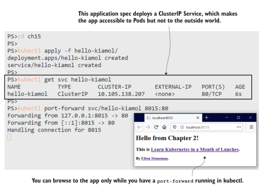
<center>ClusterIP 服务使应用程序在内部可用——它可以通过 Ingress 公开。</center>

要使用 Ingress 规则使应用程序可用，我们需要一个 Ingress 控制器。控制器管理其他对象。你知道 Deployments 管理 ReplicaSets 和ReplicaSets 管理 Pod。Ingress 控制器略有不同；它们在标准 Pod 中运行并监控 Ingress 对象。当他们看到任何变化时，他们会更新代理中的规则，我们将从 Nginx ingress 控制器开始，它是更广泛的 Kubernetes 项目的一部分。控制器有一个生产就绪的 Helm chart，但我使用的部署要简单得多。即便如此，清单中仍有一些我们尚未涵盖的安全组件，但我现在不会详细介绍它们。 （如果您想调查，YAML 中有注释。）

立即尝试,部署 Nginx ingress 控制器。这使用服务中的标准 HTTP 和 HTTPS 端口，因此您的计算机上需要有可用的端口 80 和 443。

```
# 为Nginx Ingress 控制器创建部署和服务:
kubectl apply -f ingress-nginx/
# 确认该服务是公开可用的:
kubectl get svc -n kiamol-ingress-nginx
# 获取代理的URL:
kubectl get svc ingress-nginx-controller -o jsonpath='http://{.status.loadBalancer.ingress[0].*}' -n kiamol-ingress-nginx
# 访问 URL—你将发现 error
```

当你运行这个练习时，你会在浏览时看到一个 404 错误页面。这证明服务正在接收流量并将其定向到 ingress 控制器，但是还没有任何路由规则，因此 Nginx 没有内容可显示，它返回默认的未找到页面。我的输出如图 15.3 所示，您可以在其中看到服务正在使用标准 HTTP 端口。

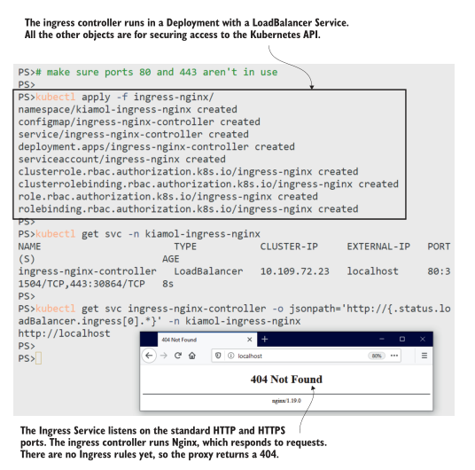
<center>图 15.3 控制器接收传入流量，但它们需要路由规则来知道如何处理它 </center>

现在我们有一个正在运行的应用程序和一个 Ingress 控制器，我们只需要部署一个带有路由规则的 ingress 对象来告诉控制器每个传入请求使用哪个应用程序服务。清单 15.1 显示了 Ingress 对象的最简单规则，它将每个进入集群的请求路由到 Hello, World 应用程序。

> 清单 15.1 localhost.yaml，Hello, World 应用程序的路由规则

```
apiVersion: networking.k8s.io/v1beta1 # Beta API版本意味着规范不是最终的，可能会改变。
kind: Ingress 
metadata:
  name: hello-kiamol
spec:
  rules:
  - http: # Ingress 仅用于HTTP/S流量
      paths:
        - path: / # 将每个传入请求映射到hello-kiamol服务
          backend:
            serviceName: hello-kiamol
            servicePort: 80
```

Ingress 控制器正在监视新的和更改的 ingress 对象，因此当您部署任何对象时，它会将规则添加到 Nginx 配置中。在 Nginx 术语中，它将设置一个代理服务器，其中 hello-kiamol 服务是上游（内容的来源），它将为根路径的传入请求提供该内容。

立即尝试,创建通过 ingress 控制器发布 Hello, World 应用程序的入口规则。

```
# 部署 rule:
kubectl apply -f hello-kiamol/ingress/localhost.yaml
# 确认Ingress对象已经创建:
kubectl get ingress
# 从前面的练习中刷新浏览器
```

好吧，这很简单——在 Ingress 对象中为应用程序映射到后端服务的路径，控制器负责处理其他所有事情。我在图 15.4 中的输出显示了本地主机地址，它之前返回了 404 错误，现在返回了 Hello, World 应用程序的所有荣耀。

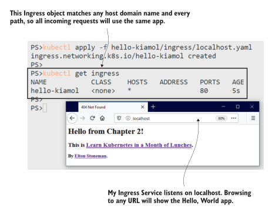
<center>图 15.4 Ingress 对象规则将 Ingress 控制器链接到应用服务。</center>

Ingress 通常是集群中的集中服务，例如日志记录和监控。管理团队可能会部署和管理 Ingress 控制器，而每个产品团队都拥有将流量路由到其应用程序的 Ingress 对象。这个过程可能会产生冲突—— ingress 规则不必是唯一的，一个团队的更新最终可能会将另一个团队的所有流量重定向到其他应用程序。这种情况不会发生，因为这些应用程序将托管在不同的域中，并且 Ingress 规则将包含一个域名来限制它们的范围。

## 15.2 使用 Ingress rules 路由 Http 流量

Ingress 仅适用于 Web 流量（HTTP 和 HTTPS 请求），因为它需要使用请求中指定的路由将其与后端服务相匹配。 HTTP 请求中的路由包含两部分：主机和路径。主机是域名，如 www.manning.com，路径是资源的位置，如每日交易页面的 /dotd。清单 15.2 显示了对使用特定主机名的 Hello, World Ingress 对象的更新。现在，仅当传入请求是针对主机 hello.kiamol.local 时，路由规则才适用。

> 清单 15.2 hello.kiamol.local.yaml，为 Ingress 规则指定主机域

```
spec:
  rules:
  - host: hello.kiamol.local # 将规则的范围限制到特定的域
    http:
      paths:
      - path: / # 该域中的所有路径都将从同一个服务中获取。
        backend: 
          serviceName: hello-kiamol
          servicePort: 80
```

当您部署此代码时，您将无法访问应用程序，因为域名 hello.kiamol.local 不存在。 Web 请求通常从公共 DNS 服务器查找域名的 IP 地址，但所有计算机在主机文件中也有自己的本地列表。在下一个练习中，您将部署更新的 Ingress 对象并在本地主机文件中注册域名——为此您需要在终端会话中具有管理员访问权限。

立即尝试 编辑主机文件受到限制。您需要为 Windows 中的终端会话使用“以管理员身份运行”选项，并使用 Set-ExecutionPolicy 命令启用脚本。准备好在 Linux 或 macOS 中输入您的管理员 (sudo) 密码。

```
# 添加域到主机- Windows上:
./add-to-hosts.ps1 hello.kiamol.local ingress-nginx
# 或者 Linux/macOS:
chmod +x add-to-hosts.sh && ./add-to-hosts.sh hello.kiamol.local
ingress-nginx
# 更新Ingress对象，添加主机名:
kubectl apply -f hello-kiamol/ingress/hello.kiamol.local.yaml
# 确认更新:
kubectl get ingress
# 访问 http://hello.kiamol.local
```

在本练习中，现有的 Ingress 对象已更新，因此仍然只有一个路由规则供 ingress 控制器映射。现在该规则仅限于显式域名。您可以在图 15.5 中看到对 hello.kiamol.local 的请求返回了应用程序，我还浏览了位于 localhost 的 ingress 控制器，它返回了 404 错误，因为没有 localhost 域的规则。

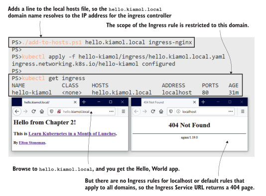
<center>图 15.5 您可以使用 Ingress 规则通过域名发布应用程序，并通过编辑您的主机文件在本地使用它们</center>
路由是一个基础架构级别的问题，但与我们在本书的这一部分看到的其他共享服务一样，它在轻量级容器中运行，因此您可以在开发、测试和生产环境中使用完全相同的设置。这使您可以使用友好的域名在非生产集群中运行多个应用程序，而不必使用不同的端口—— ingress 控制器的服务为每个应用程序使用标准的 HTTP 端口。

如果你想在你的实验室环境中运行具有不同域的多个应用程序，你需要摆弄你的主机文件。通常，所有域都将解析为 127.0.0.1，这是您机器的本地地址。组织可能在测试环境中运行自己的 DNS 服务器，因此任何人都可以从公司网络访问 hello.kiamol.test，它将解析为在数据中心运行的测试集群的 IP 地址。然后，在生产中，DNS 解析来自公共 DNS 服务，因此 hello.kiamol.net 解析为在云中运行的 Kubernetes 集群。

您可以在 Ingress 规则中组合主机名和路径，为您的应用程序提供一组一致的地址，尽管您可以在后端使用不同的组件。您可能有一个 REST API 和一个在单独的 Pod 中运行的网站，您可以使用 Ingress 规则使 API 在子域 (api.rng.com) 上可用或作为主域 (rng.com/api) 上的路径.清单 15.3 显示了第 9 章中简单版本化 Web 应用程序的 Ingress 规则，其中应用程序的两个版本都可以从一个域获得。

> 清单 15.3 vweb/ingress.yaml，带有主机名和路径的入口规则

```
apiVersion: networking.k8s.io/v1beta1
kind: Ingress
metadata:
  name: vweb # 在Nginx中配置一个特定的特性
  annotations: 
    nginx.ingress.kubernetes.io/rewrite-target: /
spec:
  rules:
  - host: vweb.kiamol.local # 所有规则适用于此域。
    http:
      paths:
      - path: / # 对根路径的请求是由版本2应用程序代理的。
        backend: 
          serviceName: vweb-v2
          servicePort: 80
      - path: /v1 # 对/v1路径的请求是从版本1应用程序代理的。
        backend: 
          serviceName: vweb-v1
          servicePort: 80
```

建模路径增加了复杂性，因为您呈现的是虚假 URL，需要对其进行修改以匹配服务中的真实 URL。在这种情况下，ingress 控制器将响应 http://vweb.kiamol.local/v1 的请求并从 vweb-v1 服务获取内容。但是应用程序在 /v1 中没有任何内容，因此代理需要重写传入的 URL——清单 15.3 中的注释就是这样做的。这是一个忽略请求中的路径并始终使用后端中的根路径的基本示例。您不能使用 Ingress 规范来表达 URL 重写，因此它需要来自 ingress 控制器的自定义支持。更现实的重写规则将使用正则表达式将请求的路径映射到目标路径。

我们将部署这个简单版本以避免任何正则表达式，并查看 ingress 控制器如何使用路由规则来识别后端服务并修改请求路径。

立即尝试,使用新的 Ingress 规则部署一个新应用程序，并向您的主机文件添加一个新域，以查看 ingress控制器为来自同一域的多个应用程序提供服务。

```
# 在Windows上添加新的域名:
./add-to-hosts.ps1 vweb.kiamol.local ingress-nginx
# 或者在 Linux/macOS:
./add-to-hosts.sh vweb.kiamol.local ingress-nginx
# 部署 app, Service, and Ingress:
kubectl apply -f vweb/
# 确认 Ingress domain:
kubectl get ingress
# 访问http://vweb.kiamol.local
# 以及 http://vweb.kiamol.local/v1
```

在图 15.6 中，您可以看到两个单独的应用程序在同一个域名下可用，使用请求路径在不同组件之间进行路由，这些组件是本练习中应用程序的不同版本。

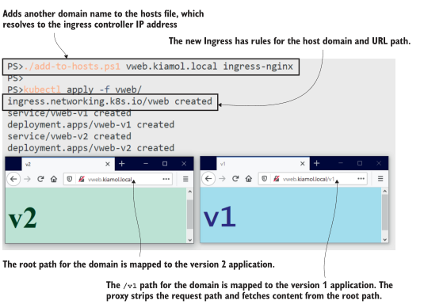
<center>图 15.6 主机名和路径上的 Ingress 路由显示了同一域名上的多个应用程序. </center>


映射路由规则是将新应用发布到 ingress 控制器中最复杂的部分，但它确实给了你很多控制权。 Ingress 规则是您应用程序的公开面孔，您可以使用它们来组合多个组件——或限制对功能的访问。在本书的这一部分，我们已经看到，如果应用程序具有用于容器探测的健康端点和用于 Prometheus 抓取的指标端点，那么它们在 Kubernetes 中运行得更好，但这些应用程序不应该公开可用。你可以使用 Ingress 来控制它，使用精确的路径映射，所以只有明确的路径列出的在集群外可用。清单 15.4 显示了待办事项列表应用程序的示例。它被删减了，因为这种方法的缺点是您需要指定要发布的每个路径，因此任何未指定的路径都会被阻止。

> 清单 15.4 ingress-exact.yaml，使用精确路径匹配来限制访问

```
rules:
  - host: todo.kiamol.local
    http:
      paths:
      - pathType: Exact # 精确匹配意味着只匹配/new路径—对于/list和根路径还有其他规则。
        path: /new 
        backend: 
          serviceName: todo-web
          servicePort: 80
      - pathType: Prefix # 前缀匹配意味着任何以/static开头的路径都将被映射，包括/static/app.css这样的子路径。
        path: /static
        backend: 
          serviceName: todo-web
          servicePort: 80
```

待办事项列表应用程序有几个不应该在集群外部可用的路径以及 /metrics，有一个 /config 端点列出了所有应用程序配置和一个诊断页面。这些路径都没有包含在新的 Ingress 规范中，我们可以看到在应用规则时它们被有效地阻止了。 PathType 字段是后来添加到 Ingress 规范中的，因此您的 Kubernetes 集群至少需要运行 1.18 版本；否则，您将在本练习中出错。

立即尝试,使用允许所有访问的 Ingress 规范部署待办事项列表应用程序，然后使用精确路径匹配更新它，并确认敏感路径不再可用。

```
# 在Windows上为应用程序添加一个新域:
./add-to-hosts.ps1 todo.kiamol.local ingress-nginx
# 或者在 Linux/macOS:
./add-to-hosts.sh todo.kiamol.local ingress-nginx
# 使用允许所有路径的Ingress对象部署应用程序:
kubectl apply -f todo-list/
# 访问 http://todo.kiamol.local/metrics
# 用精确的路径更新Ingress:
kubectl apply -f todo-list/update/ingress-exact.yaml
# 再次浏览-应用程序工作，但指标和诊断阻塞
```

当您运行此练习时，您会看到部署更新的 Ingress 规则时所有敏感路径都被阻止。我的输出如图 15.7 所示。这不是一个完美的解决方案，但您可以扩展 ingress 控制器以显示友好的 404 错误页面，而不是 Nginx 默认值。 （Docker 有一个很好的例子：试试 https://www.docker.com/not-real-url 。）应用程序仍然显示诊断页面的菜单，因为它不是删除页面的应用程序设置；它发生在这个过程的早期。

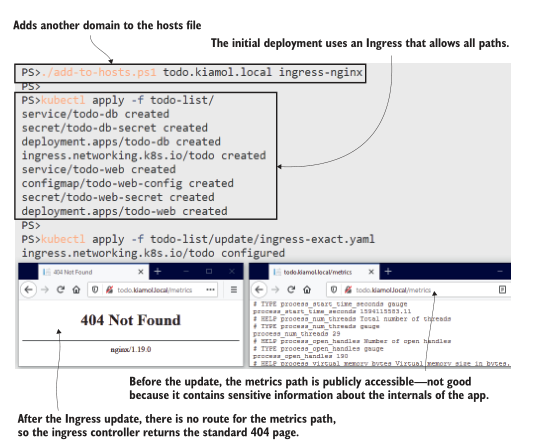
<center>图 15.7 Ingress 规则中的精确路径匹配可用于阻止对功能的访问。 </center>

Ingress 规则和 ingress 控制器之间的分离使得比较不同的代理实现变得容易，并查看哪个为您提供了您满意的功能和可用性组合。但它带有警告，因为没有严格的Ingress 控制器规范，并且并非每个控制器都以相同的方式实现入口规则。一些控制器会忽略 PathType 字段，因此如果您依靠它来构建具有确切路径的访问列表，如果您切换到不同的Ingress 控制器，您可能会发现您的站点变成了访问所有区域。

Kubernetes 确实允许您运行多个Ingress 控制器，并且在复杂的环境中，您可以这样做为不同的应用程序提供不同的功能集。
## 15.3 比较 Ingress 控制器

Ingress 控制器分为两类：反向代理，已经存在了很长时间，工作在网络级别，使用主机名获取内容；和现代代理，它们是平台感知的并且可以与其他服务集成（云控制器可以提供外部负载平衡器）。在它们之间进行选择取决于功能集和您自己的技术偏好。如果您与 Nginx 或 HAProxy 建立了关系，则可以在 Kubernetes 中继续这种关系。或者，如果您与 Nginx 或 HAProxy 建立了良好的关系，您可能会很乐意尝试更轻量级、更现代的选择。


您的Ingress 控制器成为集群中所有应用程序的单一公共入口点，因此它是集中常见问题的好地方。所有控制器都支持 SSL 终止，因此代理提供了安全层，并且您可以为所有应用程序获取 HTTPS。大多数控制器都支持 Web 应用程序防火墙，因此您可以在代理层提供针对 SQL 注入和其他常见攻击的保护。一些控制器具有特殊的能力——我们已经使用 Nginx 作为缓存代理，您也可以将它用于入口级别的缓存。

立即尝试，使用 Ingress 部署 Pi 应用程序，然后更新 Ingress 对象，以便 Pi 应用程序使用Ingress 控制器中的 Nginx 缓存。

```
# 将Pi应用程序域添加到hosts文件- windows:
./add-to-hosts.ps1 pi.kiamol.local ingress-nginx
# 或者 Linux/macOS:
./add-to-hosts.sh pi.kiamol.local ingress-nginx
# 部署应用程序和一个简单的Ingress:
kubectl apply -f pi/
# 访问 http://pi.kiamol.local?dp=30000
# 刷新并确认页面加载需要相同的时间，将更新部署到Ingress以使用缓存:
kubectl apply -f pi/update/ingress-with-cache.yaml
# 再次浏览30K Pi计算-第一次加载需要几秒钟，但现在刷新会很快
```

您将在本练习中看到Ingress 控制器是集群中的一个强大组件。您只需指定新的 Ingress 规则即可将缓存添加到您的应用程序中——无需更新应用程序本身，也无需管理新组件。唯一的要求是来自您的应用程序的 HTTP 响应包含正确的缓存标头，无论如何它们都应该包含这些标头。图 15.8 显示了我的输出，其中 Pi 计算耗时 1.2 秒，但响应来自Ingress 控制器的缓存，因此页面几乎立即加载。

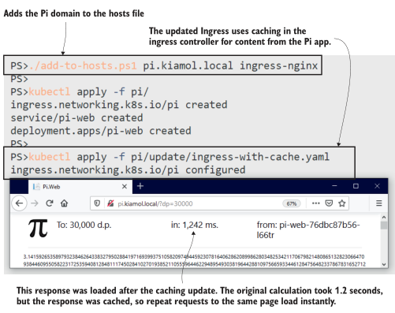
<center>图 15.8 如果你的Ingress 控制器支持响应缓存，那很容易提升性能. </center>

并非每个Ingress 控制器都提供响应缓存，因此这不是入口规范的特定部分。任何自定义配置都会应用注释，控制器会拾取这些注释。清单 15.5 显示了您在上一个练习中应用的更新缓存设置的元数据。如果您熟悉 Nginx，您会认出这些是您通常在配置文件中设置的代理缓存设置。

> 清单 15.5 ingress-with-cache.yaml，在Ingress 控制器中使用 Nginx 缓存

```
apiVersion: networking.k8s.io/v1beta1
kind: Ingress
metadata: # The ingress controller looks in annotations for
 name: pi # custom configuration—this adds proxy caching.
annotations:
  nginx.ingress.kubernetes.io/proxy-buffering: "on"
  nginx.ingress.kubernetes.io/configuration-snippet: |
    proxy_cache static-cache;
    proxy_cache_valid 10m;
```

Ingress 对象中的配置适用于它的所有规则，但如果您的应用程序的不同部分需要不同的功能，您可以有多个 Ingress 规则。待办事项列表应用程序也是如此，它需要来自Ingress 控制器的更多帮助才能大规模正常工作。如果一个服务有很多 Pod，Ingress 控制器使用负载平衡，但是待办事项应用程序有一些跨站点伪造保护，如果创建新项目的请求被发送到与最初呈现的应用程序容器不同的应用程序容器，它就会中断新项目页面。许多应用程序都有这样的限制，代理使用粘性会话来解决。

粘性会话是Ingress 控制器将请求从同一最终用户发送到同一容器的一种机制，这通常是组件不是无状态的旧应用程序的要求。这是要尽可能避免的事情，因为它限制了集群负载平衡的潜力，所以在待办事项列表应用程序中，我们希望将其限制在一页上。图 15.9 显示了我们将应用的 Ingress 规则，以获得应用程序不同部分的不同功能。

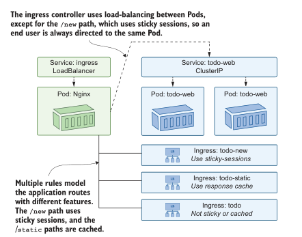
<center>图 15.9 一个域可以映射到多个 Ingress 规则，使用不同的代理功能</center>

我们现在可以扩展待办事项应用程序以了解问题，然后应用更新的 Ingress 规则来修复它。

立即尝试，扩大待办事项应用程序以确认它在没有粘性会话的情况下中断，然后部署图 15.9 中更新的 Ingress 规则并再次确认一切正常。

```
: 放大-控制器之间的负载平衡
kubectl scale deploy/todo-web --replicas 3
# 等待新的 pod 启动:
kubectl wait --for=condition=ContainersReady pod -l app=todo-web
# 访问 http://todo.kiamol.local/new, 然后添加一个项目，这将失败，并显示一个400错误页面
# 打印应用程序日志查看问题:
kubectl logs -l app=todo-web --tail 1 --since 60s
# 更新入口以添加粘滞会话:
kubectl apply -f todo-list/update/ingress-sticky.yaml
# 再次浏览，并添加一个新项目——这一次可以正常工作
```

你可以在图 15.10 中看到我的输出，但除非你自己运行这个练习，否则你必须相信我的话，哪个是“之前”，哪个是“之后”的截图。扩展应用程序副本意味着来自Ingress 控制器的请求是负载平衡的，这会触发防伪错误。应用粘性会话会停止新项目路径上的负载平衡，因此用户的请求总是被路由到同一个 Pod，并且伪造检查通过。

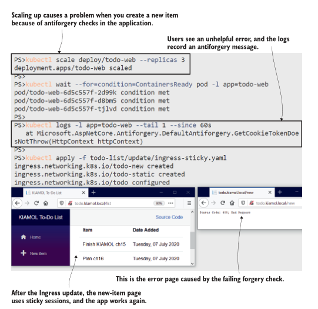
<center>图 15.10 代理功能可以解决问题并提高性能. </center>


待办事项应用程序的 Ingress 资源使用主机、路径和注释的组合来设置要应用的所有规则和功能。在幕后，控制器的工作是将这些规则转换为代理配置，在 Nginx 的情况下意味着编写配置文件。控制器进行了大量优化，以最大限度地减少文件写入和配置重新加载的次数，但结果是，Nginx 配置文件非常复杂。如果你选择 Nginx Ingress 控制器是因为你有 Nginx 经验并且你会很舒服地调试配置文件，你会遇到一个不愉快的惊喜。

立即尝试，Nginx 配置位于Ingress 控制器 Pod 中的一个文件中。在 Pod 中运行一个命令来检查文件的大小。

```
# 运行wc命令查看文件中有多少行:
kubectl exec -n kiamol-ingress-nginx deploy/ingress-nginx-controller -- sh -c 'wc -l /etc/nginx/nginx.conf'
```

图 15.11 显示我的 Nginx 配置文件中有 1,700 多行。如果你运行 cat 而不是 wc，你会发现内容很奇怪，即使你很熟悉Nginx。 （控制器使用 Lua 脚本，因此它可以在不重新加载配置的情况下更新端点。）

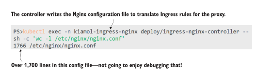
<center>图 15.11 生成的 Nginx 配置文件不是很人性化. </center>

Ingress 控制器拥有这种复杂性，但它是您解决方案的关键部分，您需要对如何对代理进行故障排除和调试感到满意。这时您可能想要考虑一个替代的Ingress 控制器，它是平台感知的并且不从复杂的配置文件运行。我们将在本章中介绍 Traefik——它是一个开源代理，自 2015 年推出以来越来越受欢迎。Traefik 了解容器，它从平台 API 构建路由列表，原生支持 Docker 和 Kubernetes，所以它没有要维护的配置文件。

Kubernetes 支持在单个集群中运行多个 Ingress 控制器。它们将作为 LoadBalancer 服务公开，因此在生产中，不同的Ingress 控制器可能有不同的 IP 地址，并且您需要在 DNS 配置中将域映射到入口。在我们的实验室环境中，我们将重新使用不同的端口。我们将从使用Ingress 控制器服务的自定义端口部署 Traefik 开始。

立即尝试,将 Traefik 部署为集群中的附加Ingress 控制器。

```
# 创建Traefik部署、服务和安全资源:
kubectl apply -f ingress-traefik/
# 获取运行在 ingress 控制器中的Traefik UI的URL:
kubectl get svc ingress-traefik-controller -o
jsonpath='http://{.status.loadBalancer.ingress[0].*}:8080' -n
kiamol-ingress-traefik
# 浏览到管理UI查看Traefik映射的路由
```

你会在那个练习中看到 Traefik 有一个管理 UI。它向您显示代理正在使用的路由规则，并且当流量通过时，它可以收集并显示性能指标。它比 Nginx 配置文件更容易使用。图 15.12 显示了两个路由器，它们是 Traefik 管理的传入路由。如果您浏览仪表板，您会看到那些不是 Ingress 路由；它们是 Traefik 自己的仪表板的内部路由——Traefik 没有选择集群中任何现有的 Ingress 规则。

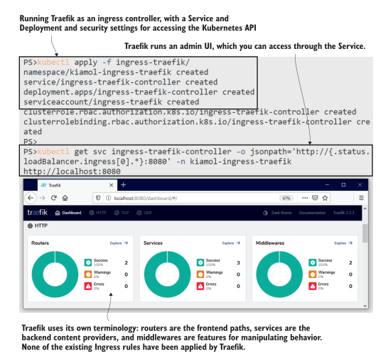
<center>图 15.12 Traefik 是一个容器原生代理，它从平台构建路由规则并有一个 UI 来显示它们. </center>

为什么 Traefik 没有为待办事项列表或 Pi 应用程序构建一套路由规则？如果我们以不同的方式配置它，那么所有现有路由都可以通过 Traefik 服务使用，但这不是您使用多个Ingress 控制器的方式，因为它们最终会争夺传入请求。您运行多个控制器以提供不同的代理功能，并且您需要应用程序选择使用哪一个。您可以使用入口类来做到这一点，入口类是与存储类类似的概念。 Traefik 已经部署了一个命名 ingress 类，只有请求该类的入口对象才会通过 Traefik 进行路由。

ingress 类并不是Ingress 控制器之间的唯一区别，您可能需要为不同的代理完全不同地建模路由。图 15.13 显示了如何在 Traefik 中配置待办事项应用程序。 Traefik 中没有响应缓存，因此我们不会获取静态资源的缓存，并且粘性会话是在服务级别配置的，因此我们需要为新项目路由提供额外的服务。

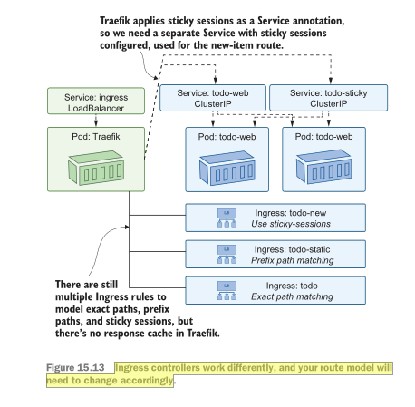
<center>图 15.13 Ingress 控制器的工作方式不同，您的路由模型将需要相应地更改。 </center>

该模型与图 15.9 中的 Nginx 路由明显不同，因此如果您确实计划运行多个Ingress 控制器，您需要意识到配置错误的高风险，因为团队会混淆不同的功能和方法。 Traefik 使用 Ingress 资源上的注解来配置路由规则。清单 15.6 显示了新项目路径的规范，它选择 Traefik 作为 ingress类并使用注释进行精确路径匹配，因为 Traefik 不支持 PathType 字段。

> 清单 15.6 ingress-traefik.yaml，选择带有 Traefik 注解的 ingress 类

```
apiVersion: networking.k8s.io/v1beta1
kind: Ingress
metadata: # 注释选择Traefik ingress 类并应用精确的路径匹配。
  name: todo2-new 
  annotations: 
    kubernetes.io/ingress.class: traefik
    traefik.ingress.kubernetes.io/router.pathmatcher: Path
spec:
  rules:
  - host: todo2.kiamol.local # 使用不同的主机，所以应用程序通过Nginx保持可用
    http: 
      paths:
      - path: /new
        backend:
          serviceName: todo-web-sticky # 使用为Traefik配置了会话保持的服务
          servicePort: 80 
```
我们将使用不同的主机名部署一组新的 Ingress 规则，因此我们可以通过 Nginx 或 Traefik 将流量路由到同一组待办事项列表 Pod。

立即尝试,使用图 15.13 中建模的入口路由，通过 Traefik Ingress 控制器发布待办事项应用程序。
   
```
# 在Windows上为应用程序添加一个新域 :
./add-to-hosts.ps1 todo2.kiamol.local ingress-traefik
# 或则在 Linux/macOS:
./add-to-hosts.sh todo2.kiamol.local ingress-traefik
# 应用新的入口规则和粘性服务:
kubectl apply -f todo-list/update/ingress-traefik.yaml
# 刷新Traefik管理员界面确认新路由
# 访问 http://todo2.kiamol.local:8015
```

Traefik 监视来自 Kubernetes API 服务器的事件并自动刷新其路由列表。当您部署新的 Ingress 对象时，您会在 Traefik 仪表板中看到显示为路由器的路径，链接到后端服务。图 15.14 显示了路由列表的一部分，以及通过新 URL 可用的待办事项应用程序。

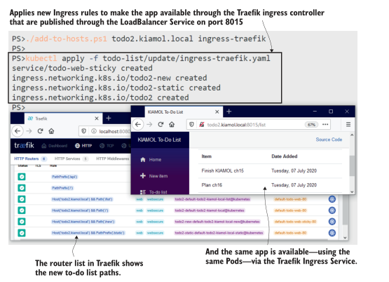
<center>图 15.14 Ingress 控制器通过不同的配置模型实现相同的目标。 </center>

如果您正在评估Ingress 控制器，您应该查看应用程序路径建模的难易程度，以及故障排除方法和代理的性能。专用环境中的双运行控制器对此有所帮助，因为您可以隔离其他因素并使用相同的应用程序组件进行比较。更现实的应用程序将具有更复杂的 Ingress 规则，并且您需要熟悉控制器如何实现速率限制、URL 重写和客户端 IP 访问列表等功能。

Ingress 的另一个主要功能是通过 HTTPS 发布应用程序，而无需在应用程序中配置证书和安全设置。这是Ingress 控制器之间一致的一个区域，在下一节中，我们将在 Traefik 和 Nginx 中看到它。
## 15.4 使用 Ingress 通过 HTTPS 保护您的应用程序

您的 Web 应用程序应通过 HTTPS 发布，但加密需要服务器证书，而证书是敏感数据项。使 HTTPS 成为入口问题是一种很好的做法，因为它集中了证书管理。 Ingress资源可以在Kubernetes Secret中指定一个TLS证书（TLS是Transport Layer Security，HTTPS的加密机制）。将 TLS 远离应用程序团队意味着您可以使用标准方法来配置、保护和更新证书，并且您不必花时间解释为什么将证书打包在容器映像中是个坏主意。

所有Ingress 控制器都支持从 Secret 加载 TLS 证书，但 Traefik 使它更容易。如果您想在开发和测试环境中使用 HTTPS 而无需提供任何 Secrets，Traefik 可以在运行时生成自己的自签名证书。您可以在 Ingress 规则中使用注释对其进行配置，以启用 TLS 和默认证书解析器。

立即尝试,使用 Traefik 生成的证书是通过 HTTPS 测试您的应用程序的快速方法。它在 Ingress 对象中启用了更多注释。
   
```
# 更新Ingress以使用Traefik自己的证书:
kubectl apply -f todo-list/update/ingress-traefik-certResolver.yaml
# 访问 https://todo2.kiamol.local:9443
# 您将在浏览器中看到一个警告
```

浏览器不喜欢自签名证书，因为任何人都可以创建它们——没有可验证的授权链。当您第一次浏览该网站时，您会看到一个很大的警告，告诉您它不安全，但您可以继续，待办事项列表应用程序将加载。如图 15.15 所示，该站点使用 HTTPS 加密，但带有警告，因此您知道它并不真正安全。

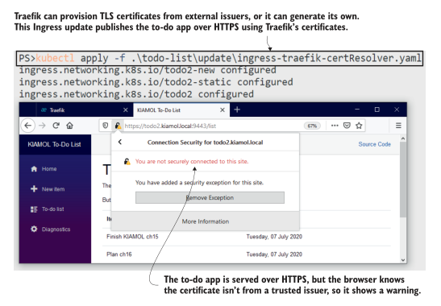
<center>图 15.15 并非所有 HTTPS 都是安全的——自签名证书适用于开发和测试环境。 </center>

您的组织可能对证书有自己的想法。如果您能够拥有供应过程，您可以拥有一个完全自动化的系统，您的集群在其中从证书颁发机构 (CA) 获取短期证书，安装它们，并在需要时更新它们。 Let's Encrypt 是一个不错的选择：它通过一个易于自动化的过程颁发免费证书。 Traefik 与 Let's Encrypt 原生集成；对于其他Ingress 控制器，您可以使用开源证书管理器工具 ( https://cert-manager.io )，这是一个 CNCF 项目。

不过，并不是每个人都准备好进行自动配置过程。一些颁发者需要人工下载证书文件，或者您的组织可能会从其自己的证书颁发机构为非生产域创建证书文件。然后，您需要将 TLS 证书和密钥文件部署为集群中的 Secret。这种情况很常见，因此我们将在下一个练习中逐步完成，生成我们自己的证书。

立即尝试,运行生成自定义 TLS 证书的 Pod，并连接到 Pod 以将证书文件部署为 Secret。 Pod 规范配置为连接到它运行的 Kubernetes API 服务器。
   
```
# 运行pod——这将在启动时生成证书:
kubectl apply -f ./cert-generator.yaml
# 连接到 pod:
kubectl exec -it deploy/cert-generator -- sh
# 在Pod中，确认证书文件已经创建:
ls
# 重命名证书文件——kubernetes需要特定的名称:
mv server-cert.pem tls.crt
mv server-key.pem tls.key
# 从证书文件中创建并标记一个Secret :
kubectl create secret tls kiamol-cert --key=tls.key --cert=tls.crt
kubectl label secret/kiamol-cert kiamol=ch15
# 退出 Pod:
exit
# 回到主机上，确认Secret在那里:
kubectl get secret kiamol-cert --show-labels
```

该练习模拟了某人将 TLS 证书作为一对 PEM 文件提供给您的情况，您需要将其重命名并用作在 Kubernetes 中创建 TLS Secret 的输入。证书生成全部使用名为 OpenSSL 的工具完成，在 Pod 中运行它的唯一原因是打包该工具和脚本以使其易于使用。图 15.16 显示了我的输出，其中在集群中创建了一个可供 Ingress 对象使用的 Secret。

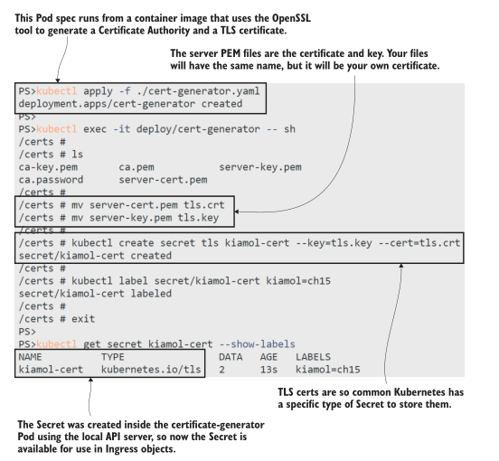
<center>图 15.16  如果您从证书颁发者那里获得 PEM 文件，您可以将它们创建为 TLS Secret。 </center>

HTTPS 支持通过Ingress 控制器很简单。您将 TLS 部分添加到 Ingress 规范并声明要使用的 Secret 的名称——仅此而已。清单 15.7 显示了对 Traefik ingress 的更新，它将新证书应用于 todo2.kiamol.local host 。

> 清单 15.7 ingress-traefik-https.yaml，使用标准的 Ingress HTTPS 特性

```
spec:
  rules:
  - host: todo2.kiamol.local
    http:
      paths:
      - path: /new
        backend:
          serviceName: todo-web-sticky
          servicePort: 80
  tls: # TLS部分使用这个Secret中的证书开启HTTPS。
    - secretName: kiamol-cert 
```

带有 Secret 名称的 TLS 字段就是您所需要的，它可以跨所有Ingress 控制器移植。当您部署更新的 Ingress 规则时，该站点将使用您的自定义证书通过 HTTPS 提供服务。你仍然会从浏览器中收到安全警告，因为证书颁发机构不受信任，但如果你的组织有自己的 CA，那么你的机器将信任它，并且组织的证书将有效。

立即尝试,更新待办事项列表 ingress 对象以使用 Traefik Ingress 控制器和您自己的 TLS 证书发布 HTTPS。

```
# 应用 Ingress 更新:
kubectl apply -f todo-list/update/ingress-traefik-https.yaml
# 访问 https://todo2.kiamol.local:9443
# 仍然有一个警告，但这一次是因为KIAMOL CA不可信
```

你可以在图 15.17 中看到我的输出。我在一个屏幕上打开了证书详细信息，以确认这是我自己的“kiamol”证书。我接受了第二个屏幕中的警告，待办事项列表流量现在已使用自定义证书加密。这生成证书的脚本将它设置为我们在本章中使用的所有 kiamol.local 域，因此证书对地址有效，但它不是来自受信任的颁发者。

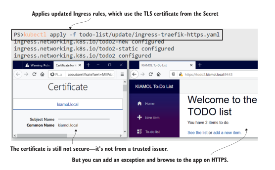
<center>图 15.17 Ingress 控制器可以应用来自 Kubernetes Secrets 的 TLS 证书。如果证书来自受信任的颁发者，则该站点将是安全的 </center>

我们将切换回 Nginx 进行最后的练习——使用与 Nginx Ingress 控制器相同的证书，只是为了表明过程是相同的。更新后的 Ingress 规范使用与之前 Nginx 部署相同的规则，但现在他们添加了与清单 15.7 具有相同 Secret 名称的 TLS 字段。

立即尝试，更新 Nginx 的待办事项 ingress 规则，以便通过标准端口 443 使用 HTTPS 访问应用程序，Nginx Ingress 控制器正在使用该端口。

```
# 更新 Ingress 资源:
kubectl apply -f todo-list/update/ingress-https.yaml
# 访问 https://todo.kiamol.local
# 接受警告以查看站点，确认HTTP请求被重定向到HTTPS:
curl http://todo.kiamol.local
```

当我运行该练习并将 Kiamol CA 添加到浏览器中我的可信发行者列表时，我作弊了。您可以在图 15.18 中看到该站点显示为安全的，没有任何警告，这是您在组织自己的证书中看到的。你也可以看到Ingress 控制器将 HTTP 请求重定向到 HTTPS——curl 命令中的 308 重定向响应由 Nginx 处理。

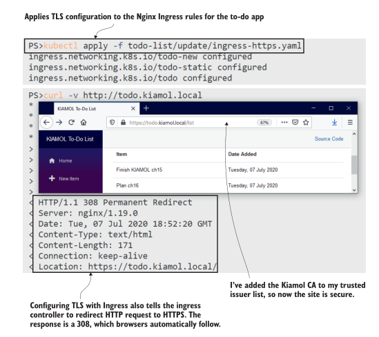
<center>图 15.18 TLS 入口配置与 Nginx Ingress 控制器的工作方式相同。</center>

Ingress 的 HTTPS 部分可靠且易于使用，很高兴以高调进入本章末尾。但是使用Ingress 控制器具有很多复杂性，在某些情况下，您将花费更多时间来制定入口规则，而不是为应用程序的部署建模。

## 15.5 理解 Ingress 及 Ingress 控制器

You’ll almost certainly run an ingress controller in your cluster, because it centralizes routing for domain names and moves TLS certificate management away from the applications. The Kubernetes model uses a common Ingress spec and a pluggable implementation that is very flexible, but the user experience is not straightforward. The Ingress spec records only the most basic routing details, and to use more advanced features from your proxy, you’ll need to add chunks of configuration as annotations.
您几乎肯定会在集群中运行Ingress 控制器，因为它集中了域名路由并将 TLS 证书管理从应用程序中移开。 Kubernetes 模型使用通用的 Ingress 规范和非常灵活的可插拔实现，但用户体验并不直接。 Ingress 规范仅记录最基本的路由详细信息，要使用代理的更多高级功能，您需要添加配置块作为注释。

Those annotations are not portable, and there is no interface specification for the features an ingress controller must support. There will be a migration project if you want to move from Nginx to Traefik or HAProxy or Contour (an open source project accepted into the CNCF on the very day I wrote this chapter), and you may find the features you need aren’t all available. The Kubernetes community is aware of the limitations of Ingress and is working on a long-term replacement called the Service API, but as of 2021, that’s still in the early stages.

这些注释不可移植，并且没有针对Ingress 控制器必须支持的功能的接口规范。如果你想从 Nginx 迁移到 Traefik 或 HAProxy 或 Contour（在我写这章的那天，一个开源项目被 CNCF 接受），将会有一个迁移项目，你可能会发现你需要的功能并不是全部可用的。 Kubernetes 社区意识到了 Ingress 的局限性，并正在研究称为服务 API 的长期替代品，但截至 2021 年，它仍处于早期阶段。

That’s not to say that Ingress should be avoided—it’s the best option right now, and it’s likely to be the production choice for many years. It’s worth evaluating different ingress controllers and then settling on a single option. Kubernetes supports multiple ingress controllers, but the trouble will really start if you use different implementations and have to manage sets of Ingress rules with incompatible feature sets invoked through incomprehensible annotations. In this chapter, we looked at Nginx and Traefik, which are both good options, but there are plenty of others, including commercial options backed with support contracts.
这并不是说应该避免使用 Ingress——它是目前最好的选择，而且它可能会成为未来很多年的生产选择。评估不同的Ingress 控制器然后选择一个选项是值得的。 Kubernetes 支持多个Ingress 控制器，但如果您使用不同的实现并且必须管理具有通过难以理解的注释调用的不兼容功能集的入口规则集，那么麻烦就会真正开始。在本章中，我们研究了 Nginx 和 Traefik，它们都是不错的选择，但还有很多其他选择，包括以支持合同为后盾的商业选择。

We’re done with Ingress now, so we can tidy up the cluster to get ready for the lab.
我们现在已经完成了 Ingress，所以我们可以整理集群为实验室做好准备。

TRY IT NOW 
Clear down the Ingress namespaces and the application resources.
立即尝试 清除 Ingress 命名空间和应用程序资源。

```
kubectl delete ns,all,secret,ingress -l kiamol=ch15
```

## 15.6 实验室

Here is a nice lab for you to do, following the pattern from chapters 13 and 14. Your job is to build the Ingress rules for the Astronomy Picture of the Day app. Simple . . .
这是一个不错的实验，您可以按照第 13 章和第 14 章中的模式进行操作。您的工作是为 Astronomy Picture of the Day 应用程序构建入口规则。简单的...
- Start by deploying the ingress controller in the lab/ingress-nginx folder.
- 首先在 lab/ingress-nginx 文件夹中部署Ingress 控制器。
- The ingress controller is restricted to look for Ingress objects in one namespace, so you’ll need to figure out which one and deploy the lab/apod/ folder to that namespace.
- Ingress 控制器仅限于在一个命名空间中查找入口对象，因此您需要找出是哪一个并将 lab/apod/ 文件夹部署到该命名空间。
- The web app should be published at www.apod.local and the API at api.apod.local.
- Web 应用程序应发布在 www.apod.local，API 应发布在 api.apod.local。
- We want to prevent distributed denial-of-service attacks, so you should use the rate-limiting feature in the ingress controller to prevent too many requests from the same IP address.
- 我们要防止分布式拒绝服务攻击，因此您应该在Ingress 控制器中使用限速功能来防止来自同一 IP 地址的过多请求。
- The ingress controller uses a custom class name, so you’ll need to find that, too. 
- Ingress 控制器使用自定义类名，因此您也需要找到它。

This is partly about digging into the ingress controller configuration and partly about the documentation for the controller—be aware that there are two Nginx ingress controllers. We’ve used the one from the Kubernetes project in this chapter, but there’s an alternative published by the Nginx project. My solution is ready for you to check against:
<https://github.com/sixeyed/kiamol/blob/master/ch15/lab/README.md>.
这部分是关于深入研究Ingress 控制器配置，部分是关于控制器的文档——请注意有两个 Nginx Ingress 控制器。我们在本章中使用了 Kubernetes 项目中的一个，但 Nginx 项目发布了一个替代方案。我的解决方案已准备好供您检查： https://github.com/sixeyed/kiamol/blob/master/ch15/lab/README.md 。