# 第十六章 使用策略上下文和准入控制保护应用程序

容器是围绕应用程序进程的轻量级包装器。它们启动迅速并且几乎不会增加应用程序的开销，因为它们使用运行它们的机器的操作系统内核。这使它们非常高效，但代价是强隔离——容器可能会受到损害，而受到损害的容器可能会提供对服务器及其上运行的所有其他容器的不受限制的访问。 Kubernetes 有许多功能可以保护您的应用程序，但默认情况下都没有启用。在本章中，您将学习如何使用 Kubernetes 中的安全控制以及如何设置您的集群，以便您的所有工作负载都需要这些控制。

保护 Kubernetes 中的应用程序就是限制容器可以执行的操作，因此如果攻击者利用应用程序漏洞在容器中运行命令，他们将无法越过该容器。我们可以通过限制对其他容器和 Kubernetes API 的网络访问、限制主机文件系统的挂载以及限制容器可以使用的操作系统功能来做到这一点。我们将介绍基本方法，但安全空间很大且不断发展。本章比其他章节更长——您将学到很多东西，但这只是您通往安全 Kubernetes 环境之旅的开始。

## 16.1 使用网络策略(network policies)保护通信

限制网络访问是保护应用程序的最简单方法之一。 Kubernetes 有一个扁平的网络模型，其中每个 Pod 都可以通过其 IP 地址访问每个其他 Pod，并且服务可以在整个集群中访问。 Pi web 应用程序没有理由访问待办事项列表数据库，或者 Hello, World web 应用程序为什么应该使用 Kubernetes API，但默认情况下，它们可以。您在第 15 章中学习了如何使用 Ingress 资源来控制对 HTTP 路由的访问，但这仅适用于进入集群的外部流量。您还需要控制集群内的访问，为此，Kubernetes 提供了网络策略(Network policy)。

网络策略像防火墙规则一样工作，在端口级别阻止进出 Pod 的流量。规则很灵活，使用标签选择器来识别对象。您可以部署一揽子拒绝所有策略来阻止所有 Pod 的传出流量，或者您可以部署一个策略来限制传入流量到 Pod 的指标端口，以便只能从监控命名空间中的 Pod 访问它。图 16.1 显示了它在集群中的样子。

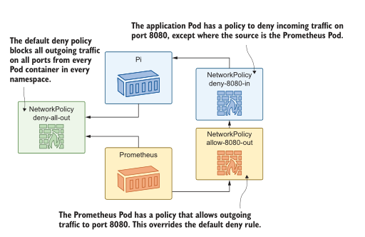
<center>图 16.1 网络策略规则是细粒度的——您可以应用集群范围内的默认设置和 Pod 覆盖。 </center>

NetworkPolicy 对象是独立的资源，这意味着它们可以由安全团队在应用程序外部建模，也可以由产品团队构建。或者，当然，每个团队都可能认为另一个团队已经涵盖了它，并且应用程序在没有任何策略的情况下投入生产，这是一个问题。我们将部署一个没有策略的应用程序，并查看它存在的问题。

现在就试试，部署 Astronomy Picture of the Day (APOD) 应用程序，并确认任何 Pod 都可以访问该应用程序组件。

```
# 进入本章节目录:
cd ch16
# 部署 APOD app:
kubectl apply -f apod/
# 等待运行:
kubectl wait --for=condition=ContainersReady pod -l app=apod-web
# 通过 8016端口访问 service ,查看今天的图片
# 现在运行一个 sleep Pod:
kubectl apply -f sleep.yaml
# 确认 sleep pod 可以使用 API:
kubectl exec deploy/sleep -- curl -s http://apod-api/image
# 查看 access log 的 metrics 信息:
kubectl exec deploy/sleep -- sh -c 'curl -s http://apod-log/metrics |
head -n 2'
```

你可以清楚地看到这个练习中的问题——整个集群是完全开放的，所以你可以从 sleep Pod 访问 APOD API 和来自访问日志组件的指标图 ,16.2 显示了我的输出。让我们明确一点，没有什么特别的关于 sleep pod；这只是演示问题的一种简单方法。集群中的任何容器都可以做同样的事情。

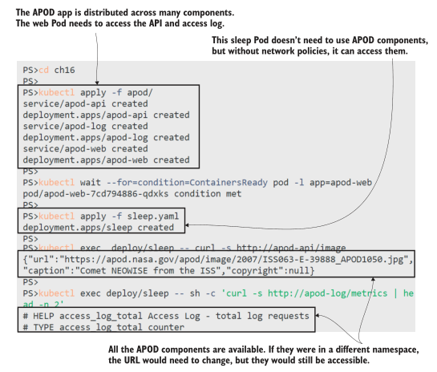
<center>图 16.2 Kubernetes 扁平网络模型的缺点是每个 Pod 都是可访问的。</center>

Pod 应该是隔离的，以便它们只从需要访问它们的组件接收流量，并且它们只将流量发送到它们需要访问的组件。网络策略使用限制传入流量的入口规则（不要将它们与入口资源混淆）和限制传出流量的出口规则建模。在 APOD 应用程序中，唯一应该有权访问 API 的组件是 Web 应用程序。清单 16.1 将其显示为 NetworkPolicy 对象中的入口规则。

> 清单 16.1 networkpolicy-api.yaml，通过标签限制对 Pod 的访问

```
apiVersion: networking.k8s.io/v1
kind: NetworkPolicy
metadata:
  name: apod-api
spec:
  podSelector: # 规则生效的 POD
    matchLabels:
      app: apod-api
  ingress: # 规则默认是拒绝策略, 所以这个规则 this rule
    from: # 拒绝所有的流入流量 除了
    - podSelector: # 来自匹配标签 apod-web 的 pod 流量
      matchLabels:
        app: apod-web
    ports: # 限定端口
    - port: api # 这个端口名字是 API pod 中 spec 中配置的
```

NetworkPolicy 规范相当简单，并且可以在应用程序之前部署规则，因此一旦 Pod 启动它就是安全的。入口和出口规则遵循相同的模式，并且都可以使用命名空间选择器和 Pod 选择器。您可以创建全局规则，然后在应用程序级别使用更细粒度的规则覆盖它们。

网络策略的一个大问题——当你部署规则时，它们可能不会做任何事情。就像 Ingress 对象需要一个入口控制器来对它们进行操作一样，NetworkPolicy 对象依赖于集群中的网络实现来强制执行它们。当您在下一个练习中部署此策略时，您可能会失望地发现 APOD API 仍不限于 Web 应用程序。

现在就试试， 应用网络策略，看看您的集群是否真正执行了它。

```
# 创建 policy:
kubectl apply -f apod/update/networkpolicy-api.yaml
# 确认已创建:
kubectl get networkpolicy
# 尝试从 sleep pod 访问 API—这是不被策略所允许的:
kubectl exec deploy/sleep -- curl http://apod-api/image
```

您可以在图 16.3 中看到 sleep Pod 可以访问 API——限制进入 Web Pod 的 NetworkPolicy 被完全忽略。我在 Docker Desktop 上运行它，但你会在 K3s、AKS 或 EKS 中使用默认设置获得相同的结果。

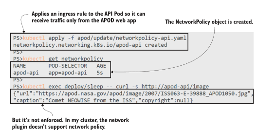
<center>图 16.3 Kubernetes 集群中的网络设置可能不会强制执行网络策略 </center>

Kubernetes 中的网络层是可插入的，并非每个网络插件都支持 NetworkPolicy 实施。标准集群部署中的简单网络不受支持，因此您会陷入这种棘手的情况，您可以部署所有 NetworkPolicy 对象，但除非您对其进行测试，否则您不知道它们是否被强制执行。云平台在这里有不同级别的支持。您可以在创建 AKS 群集时指定网络策略选项；使用 EKS，您需要在创建集群后手动安装不同的网络插件。

这对你进行这些练习（以及我编写它们）来说非常令人沮丧，但它会给组织带来更危险的脱节在生产中使用 Kubernetes。您应该在构建周期的早期采用安全控制，以便在您的开发和测试环境中应用 NetworkPolicy 规则使用接近生产的配置运行应用程序的环境。错误配置的网络策略很容易破坏您的应用程序，但如果您的非生产环境不执行策略，您将不会知道这一点。

如果您想了解 NetworkPolicy 的实际应用，下一个练习将使用 Kind 和 Calico 创建一个自定义集群，Calico 是一个实施策略的开源网络插件。为此，您需要安装 Docker 和 Kind 命令行。请注意：此练习会更改 Docker 的 Linux 配置，并会使您的原始集群无法使用。 Docker Desktop 用户可以使用 Reset Kubernetes 按钮修复所有问题，Kind 用户可以用新集群替换旧集群，但其他设置可能就没那么幸运了。跳过这些练习并通读我的输出就可以了；我们将在下一节中切换回您的普通集群。

现在就试试，使用 Kind 创建一个新集群，并部署一个自定义网络插件。
   
```
# install the Kind command line using instructions at
# https://kind.sigs.k8s.io/docs/user/quick-start/
# create a new cluster with a custom Kind configuration:
# 按照说明安装 kind 命令行https://kind.sigs.k8s.io/docs/user/quick-start/ 使用自定义类配置创建新群集
kind create cluster --image kindest/node:v1.18.4 --name kiamol-ch16
--config kind/kind-calico.yaml
# 安装 Calico 网络 plugin:
kubectl apply -f kind/calico.yaml
# 等待 Calico 启动:
kubectl wait --for=condition=ContainersReady pod -l k8s-app=calico-
node -n kube-system
# 确认集群已 ready:
kubectl get nodes
```

我在图 16.4 中的输出是缩写的；您会看到在 Calico 部署中创建了更多对象。最后，我有一个执行网络策略的新集群。不幸的是，要知道您的集群是否使用执行策略的网络插件的唯一方法是使用您知道执行策略的网络插件设置您的集群。

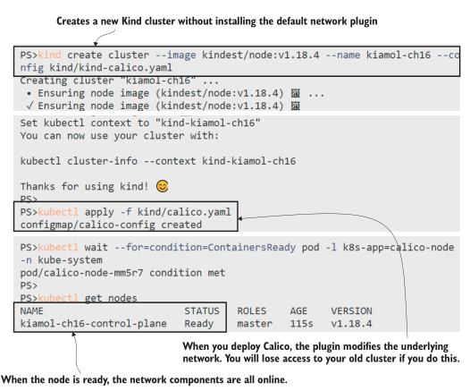
<center>图 16.4 安装 Calico 为您提供了一个具有网络策略支持的集群——以您的其他集群为代价。</center>

现在我们可以再试一次。这个集群是全新的，没有任何运行应用，但是，当然，Kubernetes 清单是可移植的，所以我们可以快速再次部署 APOD 应用程序并进行试用。 （Kind 支持运行具有不同配置的不同 Kubernetes 版本的多个集群，因此它是测试环境的绝佳选择，但它不像 Docker Desktop 或 K3s 那样对开发人员友好）。

现在就试试，重复 APOD 和sleep 部署，并确认网络策略阻止未经授权的流量。

```
# 部署 APOD app 到新集群:
kubectl apply -f apod/
# 等待启动:
kubectl wait --for=condition=ContainersReady pod -l app=apod-web
# 部署 sleep Pod:
kubectl apply -f sleep.yaml
# 确认  sleep Pod 可以访问 APOD API:
kubectl exec deploy/sleep -- curl -s http://apod-api/image
# 创建 network policy:
kubectl apply -f apod/update/networkpolicy-api.yaml
```


```
# 确认 sleep Pod 无法访问 API:
kubectl exec deploy/sleep -- curl -s http://apod-api/image
# 确认 APOD web app 仍然可以:
kubectl exec deploy/apod-web -- wget -O- -q http://apod-api/image
```

图 16.5 显示了我们第一次的预期：只有 APOD 网络应用程序可以访问 API，并且 sleep 应用程序在尝试连接时超时，因为网络插件阻止了流量。

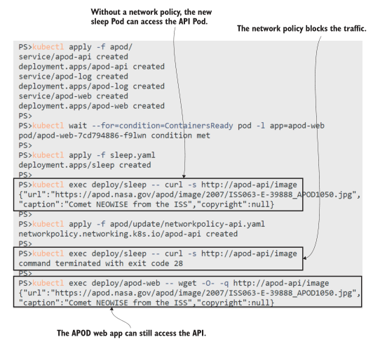
<center>图 16.5 Calico 强制执行策略，因此只允许从 Web Pod 到 API Pod 的流量。</center>

网络策略是 Kubernetes 中重要的安全控制，它们对习惯于防火墙和隔离网络的基础设施团队很有吸引力。但是，如果您确实选择采用政策，则需要了解政策在哪些方面适合您的开发人员工作流程。如果工程师在没有强制执行的情况下运行他们自己的集群，而您只是在管道的后期应用策略，那么您的环境具有非常不同的配置，并且某些东西会被破坏。

我在这里只介绍了 NetworkPolicy API 的基本细节，因为集群配置比策略资源更复杂。如果您想进一步探索，有一个很棒的 GitHub 存储库，其中包含由 Google 工程师 Ahmet Alp Balkan 发布的网络策略配方： https://github.com/ahmetb/kubernetes-network-policy-recipes 。

现在让我们清理新集群，看看你的旧集群是否仍然有效。

现在就试试，删除 Calico 集群，并查看旧集群是否仍可访问。

```
# 删除新集群:
kind delete cluster --name kiamol-ch16
# 查看你的 Kubernetes contexts:
kubectl config get-contexts
# 切换到之前的集群:
kubectl config set-context <your_old_cluster_name>
# 查看:
kubectl get nodes
```

由于 Calico 所做的网络更改，您之前的集群可能无法再访问，即使 Calico 现在没有运行。图 16.6 显示我即将点击 Docker Desktop 中的 Reset Kubernetes 按钮；如果您使用的是 Kind，则需要删除并重新创建您的原始集群，如果您使用的是其他集群并且它不起作用。 . .我确实警告过你。

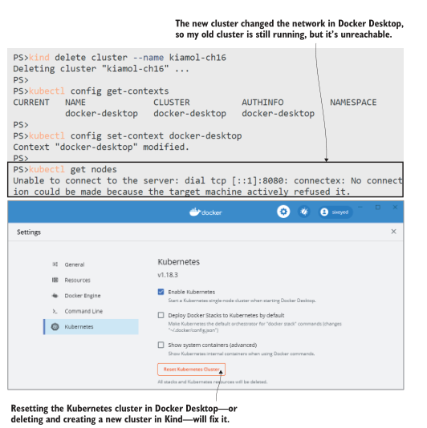
<center>图 16.6 在容器中运行的 Calico 能够重新配置我的网络并破坏一切。</center>

现在我们都恢复正常了（希望如此），我们可以继续保护容器本身，这样应用程序就没有像重新配置网络堆栈这样的特权了。

## 16.2 使用安全上下文(security contets)限制容器功能

容器安全性实际上是关于 Linux 安全性和容器用户的访问模型（Windows Server 容器具有不同的用户模型，但不存在相同的问题）。 Linux 容器通常以 root 超级管理员帐户运行，除非您明确配置用户，否则容器内的 root 也是主机上的 root。如果攻击者可以突破以 root 身份运行的容器，他们现在就可以控制您的服务器。这是所有容器运行时的问题，但 Kubernetes 本身又增加了一些问题。

在下一个练习中，您将使用基本部署配置运行 Pi Web 应用程序。该容器镜像打包在 Microsoft 的官方 .NET Core 应用程序运行时镜像之上。 Pod 规范并非故意不安全，但您会发现默认设置并不令人鼓舞。

现在就试试，运行一个简单的应用程序，并检查默认的安全情况。

```
# 部署 app:
kubectl apply -f pi/
# 等待容器启动:
kubectl wait --for=condition=ContainersReady pod -l app=pi-web
# 输出 pod 容器的用户名:
kubectl exec deploy/pi-web -- whoami
# 尝试访问 Kubernetes API server:
kubectl exec deploy/pi-web -- sh -c 'curl -k -s
https://kubernetes.default | grep message'
# 输出 API access token:
kubectl exec deploy/pi-web -- cat /run/secrets/kubernetes.io/
serviceaccount/token
```

行为很可怕：应用程序以 root 身份运行，它可以访问 Kubernetes API 服务器，它甚至设置了一个令牌，以便它可以通过 Kubernetes 进行身份验证。图 16.7 展示了这一切。以 root 身份运行会放大攻击者可以在应用程序代码或运行时中找到的任何漏洞。访问 Kubernetes API 意味着攻击者甚至不需要突破容器——他们可以使用令牌查询 API 并做一些有趣的事情，比如获取 Secrets 的内容（取决于 Pod 的访问权限） ，您将在第 17 章中了解）。

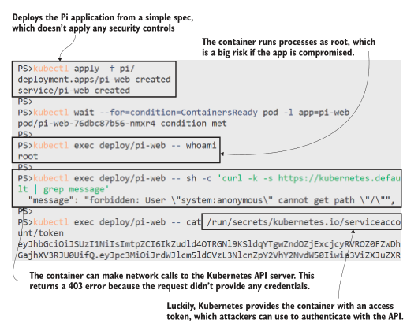
<center>图 16.7 如果您听说过“默认安全”这句话，那么它并不是关于 Kubernetes 的</center>

Kubernetes 在 Pod 和容器级别提供多种安全控制，但默认情况下未启用它们，因为它们可能会破坏您的应用程序。您可以以不同的用户身份运行容器，但某些应用程序只有在以 root 用户身份运行时才能运行。您可以删除 Linux 功能以限制容器可以执行的操作，但某些应用程序功能可能会失败。这就是自动化测试的用武之地，因为您可以越来越多地加强应用程序的安全性，在每个阶段运行测试以确认一切仍然有效。

您将使用的主要控件是 SecurityContext 字段，它在 Pod 和容器级别应用安全性。清单 16.2 显示了一个明确设置用户和 Linux 组（用户集合）的 Pod SecurityContext，因此 Pod 中的所有容器都以未知用户而不是 root 身份运行。

> 清单 16.2 deployment-podsecuritycontext.yaml，作为特定用户运行

```
spec: # 这是 deployment 的spec
  securityContext: # 此控制生效到所有POd 的容器
    runAsUser: 65534 # 以 “unknown” 用户运行
    runAsGroup: 3000 # 以不存在的 group 运行
```

这很简单，但是离开 root 会产生影响，并且 Pi spec 需要做更多的改变。该应用程序在容器内侦听端口 80，而 Linux 需要提升权限才能侦听该端口。 Root有权限，新用户没有权限，所以应用会启动失败。它需要在环境变量中进行一些额外的配置，以将应用程序设置为侦听端口 5001，这对新用户有效。这是您需要为每个应用程序或每个类别的应用程序推出的那种细节，只有当应用程序停止工作时，您才会找到这些要求。


现在就试试，部署受保护的 Pod 规范。这使用非 root 用户和不受限制的端口，但服务中的端口映射向消费者隐藏了该详细信息。

```
# 添加非 root SecurityContext:
kubectl apply -f pi/update/deployment-podsecuritycontext.yaml
# 等待新 Pod 启动:
kubectl wait --for=condition=ContainersReady pod -l app=pi-web
# 确认用户:
kubectl exec deploy/pi-web -- whoami
# 查看 API token 文件:
kubectl exec deploy/pi-web -- ls -l /run/secrets/kubernetes.io/
serviceaccount/token
# 输出 access token
kubectl exec deploy/pi-web -- cat /run/secrets/kubernetes.io/
serviceaccount/token
```

以非 root 用户身份运行解决了应用程序漏洞升级为完全服务器接管的风险，但如图 16.8 所示，它并没有解决所有问题。 Kubernetes API 令牌的安装权限允许任何帐户读取它，因此攻击者仍然可以在此设置中使用该 API。他们可以用 API 做什么取决于你的集群是如何配置的——在 Kubernetes 的早期版本中，他们可以做任何事情。访问 API 服务器的身份与 Linux 用户不同，它可能在集群中具有管理员权限，即使容器进程以最低权限用户身份运行。

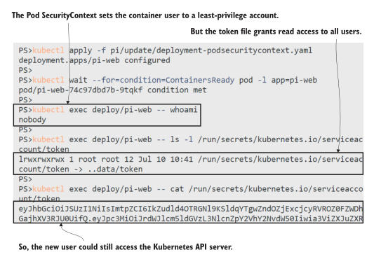
<center>图 16.8 您需要一种深入的 Kubernetes 安全方法；一种设置是不够的。</center>

Pod spec 中的一个选项阻止 Kubernetes 安装访问令牌，你应该为每个实际上不需要使用 Kubernetes API 的应用程序包含访问令牌——这几乎是所有的东西，除了像入口控制器这样的工作负载，它需要找到服务端点。这是一个安全的设置选项，但下一级运行时控制将需要更多的测试和评估。容器 spec 中的 SecurityContext 字段允许比 Pod 级别更细粒度的控制。清单 16.3 显示了一组适用于 Pi 应用程序的选项

> 清单 16.3 deployment-no-serviceaccount-token.yaml，更严格的安全策略

```
spec:
  automountServiceAccountToken: false # 卸掉 API token
  securityContext: # 生效到所有 containers
    runAsUser: 65534
    runAsGroup: 3000
  containers:
  - image: kiamol/ch05-pi
    # …
    securityContext: # 仅针对当前容器
      allowPrivilegeEscalation: false # 上下文设置阻止进程
      capabilities: # 升级到更高的权限，
        drop: # 并删除所有附加功能。
          - all
```

capabilities 字段允许您显式添加和删除 Linux 内核功能。此应用程序可以在所有功能被删除的情况下正常运行，但其他应用程序将需要重新添加一些功能。此应用程序不支持的一项功能是 readOnlyRootFilesystem 选项。如果您的应用程序可以使用只读文件系统，那么这是一个强大的功能，因为这意味着攻击者无法写入文件，因此他们无法下载恶意脚本或二进制文件。你能走多远取决于你的组织的安全配置文件。您可以要求所有应用程序都需要以非 root 用户身份运行，放弃所有功能并使用只读文件系统，但这可能意味着您需要重写大部分应用程序。

一种务实的方法是在容器级别尽可能严密地保护现有应用程序，并确保围绕其余策略和流程提供深入的安全保护。 Pi 应用程序的最终规范并不完全安全，但它是对默认设置的重大改进——应用程序仍然可以运行。

现在就试试，使用最终的安全配置更新 Pi 应用程序。

```
# 更新清单 16.3 中的 pod spec:
kubectl apply -f pi/update/deployment-no-serviceaccount-token.yaml
# 确认 API token 不存在了:
kubectl exec deploy/pi-web -- cat /run/secrets/kubernetes.io/
serviceaccount/token
# 确认 API Server 任然可以访问:
kubectl exec deploy/pi-web -- sh -c 'curl -k -s
https://kubernetes.default | grep message'
# 获得 url 检查 app 任然正常工作:
kubectl get svc pi-web -o jsonpath='http://{.status.loadBalancer
.ingress[0].*}:8031'
```

如图 16.9 所示，应用程序仍然可以访问 Kubernetes API 服务器，但它没有访问令牌，因此攻击者需要做更多的工作才能发送有效的 API 请求。应用 NetworkPolicy 拒绝进入 API 服务器将完全删除该选项。

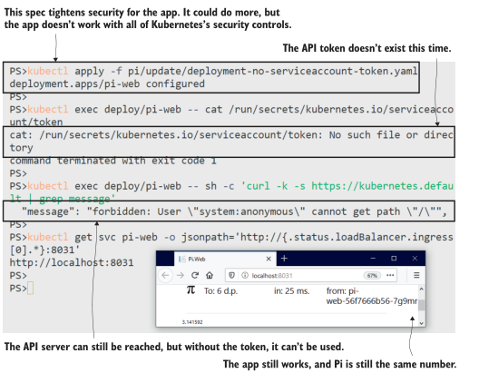
<center>图 16.9 受保护的应用程序对用户来说是一样的，但对攻击者来说乐趣却少得多。</center>

您需要投资以增加应用程序的安全性，但如果您的应用程序平台范围相当小，则可以构建通用配置文件：您可能会发现所有 .NET 应用程序都可以非根用户运行但需要可写文件系统，并且您所有的 Go 应用程序都可以使用只读文件系统运行，但需要添加一些 Linux 功能。那么，挑战在于确保您的配置文件实际得到应用，而 Kubernetes 有一个很好的功能：准入控制（admission control）。

## 16.3 使用 webhook 阻止和修改工作负载

您在 Kubernetes 中创建的每个对象都会经过一个过程来检查集群是否可以运行该对象。这个过程就是准入控制，我们在第 12 章中看到了一个准入控制器在工作，它试图部署一个 Pod 规范，该规范请求的资源多于命名空间可用的资源。 ResourceQuota 准入控制器是一个内置控制器，它会在工作负载超过配额时停止运行，并且 Kubernetes 有一个插件系统，因此您可以添加自己的准入控制规则。

其他两个控制器增加了这种可扩展性：ValidatingAdmissionWebhook，它像 ResourceQuota 一样工作以允许或阻止对象创建，以及 MutatingAdmissionWebhook，它实际上可以编辑对象规范，因此创建的对象与请求不同。两个控制器的工作方式相同：您创建一个配置对象指定要控制的对象生命周期和应用规则的 Web 服务器的 URL。图 16.10 显示了这些片段是如何组合在一起的。

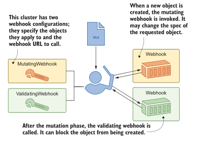
<center>图 16.10 Admission webhooks 允许您在创建对象时应用自己的规则。</center>

Admission webhooks 非常强大，因为 Kubernetes 调用您自己的代码，这些代码可以以您喜欢的任何语言运行，并且可以应用您需要的任何规则。在本节中，我们将应用一些我用 Node.js 编写的 webhook。您不需要编辑任何代码，但您可以在清单 16.4 中看到代码并不是特别复杂。

> 清单 16.4 validate.js，用于验证 webhook 的自定义逻辑

```
   # 传入的请求具有对象规范——这将检查服务令牌挂载属性是否设置为false;
   # 如果不是，响应将停止创建对象:
   if (object.spec.hasOwnProperty("automountServiceAccountToken")) {
     admissionResponse.allowed =
     (object.spec.automountServiceAccountToken == false);
   }
```

Webhook 服务器可以在任何地方运行——集群内部或外部——但它们必须在 HTTPS 上提供服务。如果您想在集群内运行由您自己的证书颁发机构 (CA) 签名的 webhook，唯一的麻烦就来了，因为 webhook 配置需要一种信任 CA 的方法。这是一个常见的场景，所以我们将在接下来的练习中逐步介绍这种复杂性。

现在就试试，首先创建证书并部署 webhook 服务器以使用该证书。

```
# 运行 Pod 生成 certificate:
kubectl apply -f ./cert-generator.yaml
# 当容器 ready, certificate 就生成了:
kubectl wait --for=condition=ContainersReady pod -l app=cert-generator
# POD 已经将 cert 部署作为 TLS Secret:
kubectl get secret -l kiamol=ch16
# 部署 webhook server, 使用 TLS Secret:
kubectl apply -f admission-webhook/
# 输出 CA certificate:
kubectl exec -it deploy/cert-generator -- cat ca.base64
```

该练习中的最后一个命令将用 Base64 编码的文本填充您的屏幕，您将在下一个练习中需要它（不过不要担心写下来；我们将自动执行所有步骤）。您现在已经运行了 webhook 服务器，它由自定义 CA 颁发的 TLS 证书保护。我的输出如图 16.11 所示。

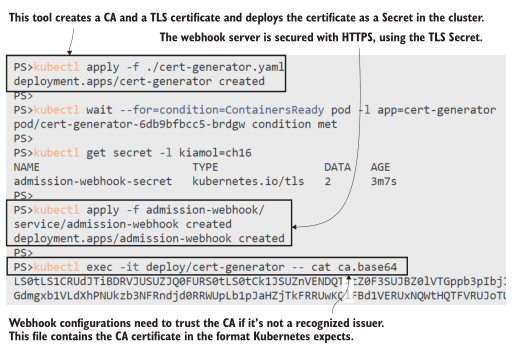
<center>图 16.11 Webhooks 具有潜在危险，因此需要使用 HTTPS 对其进行保护。</center>

Node.js 应用程序正在运行并具有两个端点：一个验证 webhook，它检查所有 Pod 规范是否将 automountServiceAccountToken 字段设置为 false，以及一个变异 webhook，它应用设置了 runAsNonRoot 标志的容器 SecurityContext。这两个策略旨在协同工作以确保所有应用程序的基本安全级别。清单 16.5 显示了 ValidatingWebhookConfiguration 对象的规范。

> 清单 16.5 validatingWebhookConfiguration.yaml，应用 webhook

```
apiVersion: admissionregistration.k8s.io/v1beta1
kind: ValidatingWebhookConfiguration
metadata:
  name: servicetokenpolicy
webhooks:
  - name: servicetokenpolicy.kiamol.net
    rules: # 这些是
      - operations: [ "CREATE", "UPDATE" ] # 调用webhook-all pod
        apiGroups: [""] # 的对象类型和操作。
        apiVersions: ["v1"]
        resources: ["pods"]
        clientConfig:
          service:
            name: admission-webhook # 要调用的webhook服务
            namespace: default
            path: "/validate" # webhook URL
          caBundle: {{ .Values.caBundle }} # CA certificate
```

Webhook 配置灵活：可以设置操作的类型和webhook操作的对象类型。您可以为同一个对象配置多个 webhooks——验证 webhooks 都是并行调用的，其中任何一个都可以阻止操作。这个 YAML 文件是我为这个配置对象使用的 Helm chart 的一部分，作为注入 CA 证书的简单方法。更高级的 Helm chart 将包括生​​成证书和部署 webhook 服务器以及配置的作业——但是你不会看到它们是如何组合在一起的。

现在就试试，部署 webhook 配置，将 CA 证书作为值从生成器 Pod 传递到本地 Helm chart。然后尝试部署一个应用程序，但该策略未通过该策略。

```
# 安装 configuration object:
helm install validating-webhook admission-webhook/helm/validating-
webhook/ --set caBundle=$(kubectl exec -it deploy/cert-generator
-- cat ca.base64)
# 确认已创建:
kubectl get validatingwebhookconfiguration
# 部署一个app:
kubectl apply -f vweb/v1.yaml
# 检查 webhook logs:
kubectl logs -l app=admission-webhook --tail 3
# 显示 app ReplicaSet status :
kubectl get rs -l app=vweb-v1
# 查看详情:
kubectl describe rs -l app=vweb-v1
```

在本练习中，您可以看到验证 webhook 的优势和局限性。 webhook 在 Pod 级别运行，如果 Pod 与服务令牌规则不匹配，它会停止创建 Pod。但尝试创建 Pod 的是 ReplicaSet 和 Deployment，它们不会被准入控制器阻止，因此您必须更深入地挖掘才能找到应用程序未运行的原因。我的输出如图 16.12 所示，其中 describe 命令被删减以仅显示错误行。

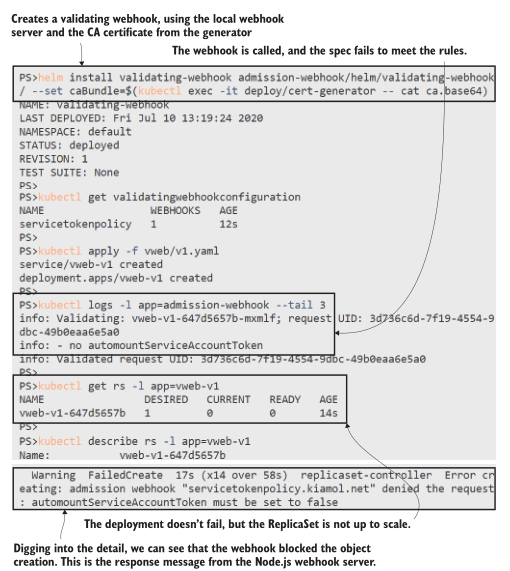
<center>图 16.2 验证 webhook 可以阻止对象的创建，无论它是由用户还是控制器发起的。</center>

您需要仔细考虑您希望 webhook 执行的对象和操作。这种验证可以在 Deployment 级别进行，这将提供更好的用户体验，但它会错过直接创建的 Pod 或由其他类型的控制器创建的 Pod。在 webhook 响应中返回一条明确的消息也很重要，这样用户就知道如何解决问题。 ReplicaSet 将继续尝试创建 Pod 并失败（在我写这篇文章时它在我的集群上尝试了 18 次），但失败消息告诉我该怎么做，而且这个很容易修复。

admission webhooks 的问题之一是它们在可发现性方面的得分非常低。您可以使用 kubectl 检查是否配置了任何验证 webhook，但这并没有告诉您任何关于实际规则的信息，因此您需要在集群外部记录这些内容。变异的 webhook 使情况变得更加混乱，因为如果它们按预期工作，它们会为用户提供与他们试图创建的对象不同的对象。在下一个练习中，您将看到一个善意的变异 webhook 可以破坏应用程序。

现在就试试，使用相同的 webhook 服务器但不同的 URL 路径配置可变 webhook。此 webhook 将安全设置添加到 Pod 规范。部署另一个应用程序，您会看到来自 webhook 的更改使应用程序停止运行。

```
# 部署 webhook configuration:
helm install mutating-webhook admission-webhook/helm/mutating-webhook/
--set caBundle=$(kubectl exec -it deploy/cert-generator -- cat
ca.base64)
# 确认已创建:
kubectl get mutatingwebhookconfiguration
# 部署一个新的 web app:
kubectl apply -f vweb/v2.yaml
# 输出 webhook server logs:
kubectl logs -l app=admission-webhook --tail 5
# 查看 ReplicaSet 状态:
kubectl get rs -l app=vweb-v2
# 查看详情:
kubectl describe pod -l app=vweb-v2
```

哦亲爱的。可变 webhook 将 SecurityContext 添加到 Pod 规范，其中 runAsNonRoot 字段设置为 true。该标志告诉 Kubernetes 不要在 Pod 中运行任何容器，如果它们被配置为以 root 运行——这个应用程序就是这样，因为它基于官方 Nginx 镜像，它确实使用 root。正如你在图 16.13 中看到的，描述 Pod 告诉你问题是什么，但它并没有说明规范已经改变。当用户再次检查他们的 YAML 并发现没有 runAsNonRoot 字段时，他们会非常困惑。

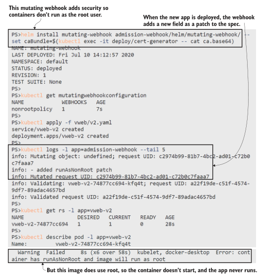
<center>图 16.13 变异的 webhooks 会导致应用程序故障，这很难调试。</center>

变异 webhook 中的逻辑完全取决于您——您可能会不小心更改对象以设置它们永远不会部署的无效规范。为您的 webhook 配置设置一个限制性更强的对象选择器是个好主意。清单 16.5 适用于每个 Pod，但您可以添加命名空间和标签选择器来缩小范围。这个 webhook 是用合理的规则构建的，如果 Pod 规范已经包含一个 runAsNonRoot 值，webhook 就不会管它，所以应用程序可以被建模为明确需要 root 用户。

Admission Controller webhooks 是一个有用的工具，可以让你做一些很酷的事情。您可以使用可变 webhook 将 sidecar 容器添加到 Pod，这样您就可以使用标签来识别所有写入日志文件的应用程序，并让 webhook 自动将日志记录 sidecar 添加到这些 Pod。 Webhooks 可能很危险，您可以通过配置对象中的良好测试和选择性规则来缓解这种情况，但它们将始终不可见，因为逻辑隐藏在 webhook 服务器内部。

在下一节中，我们将研究另一种方法，该方法在底层使用验证 webhook，但将它们包装在管理层中。 Open Policy Agent (OPA) 允许您在 Kubernetes 对象中定义规则，这些对象在集群中是可发现的并且不需要自定义代码。

## 16.4 使用 Open Policy Agent 控制准入

OPA 是编写和实施策略的统一方法。目标是提供一种标准语言来描述各种策略和集成，以在不同平台上应用策略。你可以描述数据访问策略并将它们部署在 SQL 数据库中，你可以描述 Kubernetes 对象的准入控制策略。 OPA 是另一个 CNCF 项目，它为使用 OPA Gatekeeper 的自定义验证 webhooks 提供了更简洁的替代方案。

OPA Gatekeeper 具有三个部分：您在集群中部署 Gatekeeper 组件，其中包括一个 webhook 服务器和一个通用的 ValidatingWebhookConfiguration；然后创建一个约束模板，它描述了准入控制策略；然后根据模板创建特定约束。这是一种灵活的方法，您可以为“所有 Pod 必须具有预期的标签”策略构建一个模板，然后部署一个约束来说明在哪个命名空间中需要哪些标签。

我们将首先删除我们添加的自定义 webhook 并部署 OPA Gatekeeper，准备应用一些准入策略。

现在就试试，卸载 webhook 组件，并部署 Gatekeeper。

```
# 卸载:
helm uninstall mutating-webhook
helm uninstall validating-webhook
# 删除 Node.js webhook server:
kubectl delete -f admission-webhook/
# 部署 Gatekeeper:
kubectl apply -f opa/
```

我在图 16.14 中简化了我的输出——当您运行该练习时，您会看到 OPA Gatekeeper 部署安装了更多的对象，包括我们尚未遇到的称为 CustomResourceDefinitions (CRD) 的对象。当我们着眼于扩展 Kubernetes 时，我们将在第 20 章中更详细地介绍这些内容，但就目前而言，知道 CRD 可以让您定义 Kubernetes 为您存储和管理的新对象类型就足够了。

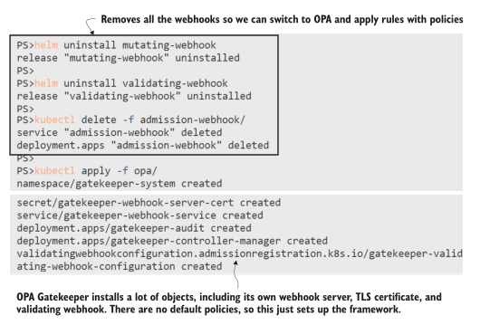
<center>图 16.14 OPA Gatekeeper 负责处理运行 webhook 服务器的所有棘手部分。</center>

Gatekeeper 使用 CRD，因此您可以创建模板和约束作为普通 Kubernetes 对象，在 YAML 中定义并使用 kubectl 部署。该模板包含使用称为 Rego（发音为“ray-go”）的语言的通用策略定义。它是一种表达性语言，可让您评估某些输入对象的属性以检查它们是否满足您的要求。学习是另一回事，但 Rego 有一些很大的优势：策略相当容易阅读，并且它们存在于您的 YAML 文件中，因此它们不会隐藏在自定义 webhook 的代码中；并且有很多示例 Rego 策略来执行我们在本章中看到的那种规则。清单 16.6 显示了要求对象具有标签的 Rego 策略。

> 清单 16.6 requiredLabels-template.yaml，一个基本的 Rego 策略

```
# 这将获取对象上的所有标签以及约束中所需的所有标签;
# 如果缺少必需的标签，就会妨碍对象的创建.
violation[{"msg": msg, "details": {"missing_labels": missing}}] {
  provided := {label | input.review.object.metadata.labels[label]}
  required := {label | label := input.parameters.labels[_]}
  missing := required - provided
  count(missing) > 0
  msg := sprintf("you must provide labels: %v", [missing])
}
```

您使用 Gatekeeper 部署该策略作为约束模板，然后部署强制执行该模板的约束对象。在这种情况下，名为 RequiredLabels 的模板使用参数来定义所需的标签。清单 16.7 显示了所有 Pod 具有应用和版本标签的特定约束。

> 清单 16.7 requiredLabels.yaml，来自 Gatekeeper 模板的约束

```
apiVersion: constraints.gatekeeper.sh/v1beta1
kind: RequiredLabels # API和Kind将其识别为RequiredLabels模板中的Gatekeeper约束。
metadata: 
  name: requiredlabels-app 
spec:
  match:
  kinds:
    - apiGroups: [""]
      kinds: ["Pod"] # 该约束适用于所有pod
  parameters:
    labels: ["app", "version"] # 需要设置两个标签
```

这更容易阅读，并且您可以从同一个模板部署许多约束。 OPA 方法允许您构建一个标准策略库，用户可以在他们的应用程序规范中应用该库，而无需深入研究 Rego。在下一个练习中，您将部署清单 16.7 中的约束和另一个要求所有 Deployments、Services 和 ConfigMaps 都具有 kiamol 标签的约束。然后，您将尝试部署一个不符合所有这些政策的待办事项应用程序版本。

现在就试试，使用 Gatekeeper 部署所需的标签策略，并查看它们的应用方式。

```
# 首先创建约束模板:
kubectl apply -f opa/templates/requiredLabels-template.yaml
# 然后创建约束:
kubectl apply -f opa/constraints/requiredLabels.yaml
# 待办事项列表规范不符合策略:
kubectl apply -f todo-list/
# 确认应用程序没有部署:
kubectl get all -l app=todo-web
```

您可以在图 16.15 中看到这种用户体验很干净——我们尝试创建的对象没有所需的标签，因此它们被阻止了，我们在 kubectl 的输出中看到了来自 Rego 策略的消息。

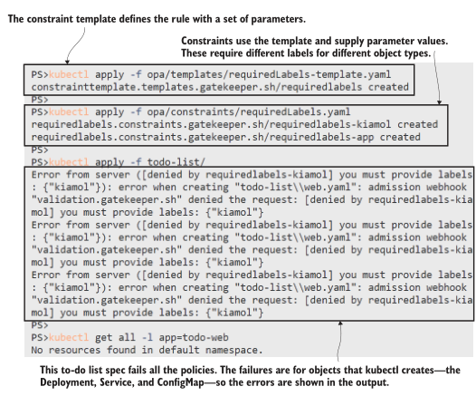
<center>图 16.15 部署失败显示从 Rego 策略返回的明确错误消息。</center>

Gatekeeper 使用验证 webhook 评估约束，当您创建的对象出现故障时，这一点非常明显。当控制器创建的对象验证失败时不太清楚，因为控制器本身可能没问题。我们在 16.3 节中看到，由于 Gatekeeper 使用相同的验证机制，因此存在相同的问题。您会看到，如果您更新待办事项应用程序，那么 Deployment 会满足标签要求，但 Pod 规范不会。

现在就试试，部署更新的待办事项列表规范，其中包含除 Pod 之外的所有对象的正确标签。

```
# 部署更新的清单:
kubectl apply -f todo-list/update/web-with-kiamol-labels.yaml
# 显示ReplicaSet的状态:
kubectl get rs -l app=todo-web
```


```
   # 输出 detail:
   kubectl describe rs -l app=todo-web
   # 删除待办事项应用程序，为下一个练习做准备:
   kubectl delete -f todo-list/update/web-with-kiamol-labels.yaml
```

在本练习中，您会发现准入策略有效，但只有当您深入了解失败的 ReplicaSet 的描述时，您才会发现问题，如图 16.16 所示。那不是很好的用户体验。您可以使用更复杂的策略来解决此问题，该策略适用于 Deployment 级别并检查 Pod 模板中的标签——这可以通过约束模板的 Rego 中的扩展逻辑来完成。

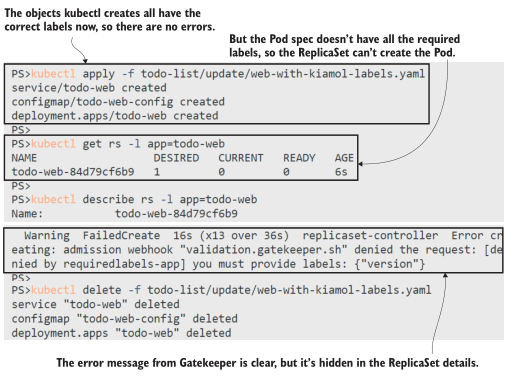
<center>图 16.16 OPA Gatekeeper 实现了更好的流程，但它仍然是验证 webhook 的包装器。 </center>

我们将以下面一组涵盖更多生产最佳实践的准入政策来结束本节，所有这些都有助于提高您的应用程序的安全性：
- 所有 Pod 都必须定义容器探测器。这是为了保持您的应用程序健康，但失败的健康检查也可能表明来自攻击的意外活动。
- Pod 只能从已批准的镜像存储库运行容器。将容器限制在一组具有安全生产镜像的“黄金”存储库中，可确保无法部署恶意负载。
- 所有容器都必须设置内存和 CPU 限制。这可以防止受损容器最大化节点的计算资源并使所有其他 Pod 挨饿。

这些通用政策几乎适用于每个组织。您可以向它们添加约束，要求每个应用程序的网络策略和每个 Pod 的安全上下文。正如您在本章中了解到的，并非所有规则都是通用的，因此您可能需要选择如何应用这些约束。在下一个练习中，您将把生产约束集应用到单个命名空间。

现在就试试，部署一组新的约束和一个待办应用程序版本，其中 Pod 规范不符合大多数策略。

```
# 为生产约束创建模板:
kubectl apply -f opa/templates/production/
# 创建约束:
kubectl apply -f opa/constraints/production/
# 部署新的待办事项规范:
kubectl apply -f todo-list/production/
# 确认pod没有创建:
kubectl get rs -n kiamol-ch16 -l app=todo-web
#显示错误细节:
kubectl describe rs -n kiamol-ch16 -l app=todo-web
```

图 16.17 显示 Pod 规范不符合所有规则，除了一个——我的镜像存储库策略允许来自 kiamol 组织中的 Docker Hub 的任何镜像，因此待办事项应用程序镜像是有效的。但是没有版本标签，没有健康探测，也没有资源限制，这个规范不适合生产。

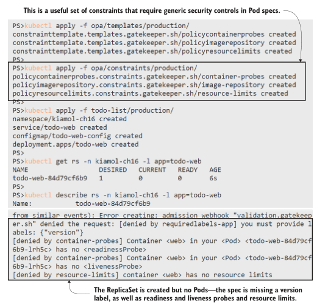
<center>图 16.17 计算所有约束，您可以在 Rego 输出中看到完整的错误列表。 </center>

只是为了证明这些政策是可以实现的，并且 OPA Gatekeeper 实际上会让待办事项应用程序运行，您可以应用满足所有生产规则的更新规范。如果比较生产文件夹和更新文件夹中的 YAML 文件，您会看到新规范只是将必填字段添加到 Pod 模板；应用程序没有重大变化。

现在就试试，应用待办事项规范的生产就绪版本，并确认应用程序真正运行。

```
# 此规范满足所有生产策略:
kubectl apply -f todo-list/production/update
# 等待Pod启动:
kubectl wait --for=condition=ContainersReady pod -l app=todo-web -n
kiamol-ch16
# 确认它正在运行:
kubectl get pods -n kiamol-ch16 --show-labels
# 获取应用程序的URL并浏览:
kubectl get svc todo-web -n kiamol-ch16 -o jsonpath='http://{.status
.loadBalancer.ingress[0].*}:8019'
```

图 16.18 显示了在 OPA Gatekeeper 允许更新部署后应用程序正在运行。

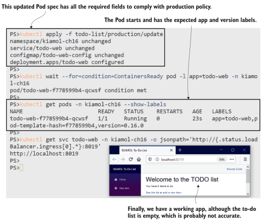
<center>图 16.18 约束很强大，但您需要确保应用程序能够真正遵守。  </center>

Open Policy Agent 是一种比自定义验证 webhook 更简洁的应用准入控制的方法，我们查看的示例策略只是一些简单的想法，可以帮助您入门。 Gatekeeper 没有突变功能，但如果您有明确的修改规范的案例，您可以将其与您自己的 webhooks 结合使用。您可以使用约束来确保每个 Pod 规范都包含一个应用程序配置文件标签，然后根据您的配置文件改变规范——将您的 .NET Core 应用程序设置为以非根用户身份运行，并为所有 Go 应用程序切换到只读文件系统。

保护你的应用程序就是关闭漏洞利用路径，一个彻底的方法包括我们在本章中介绍的所有工具等等。最后，我们将了解一个安全的 Kubernetes 环境。

## 16.5 深入了解 Kubernetes 中的安全性

构建管道可能会遭到破坏，容器镜像可能会被修改，容器可能会以特权用户身份运行易受攻击的软件，而有权访问 Kubernetes API 的攻击者甚至可能会控制您的集群。在您的应用程序被替换之前，您不会知道它是 100% 安全的，并且您可以确认在其运行期间没有发生安全漏洞。到达那个快乐的地方意味着在整个软件供应链中深入应用安全性。本章的重点是在运行时保护应用程序，但您应该在此之前扫描容器镜像以查找已知漏洞。

安全扫描器查看镜像内部，识别二进制文件，并在 CVE（常见漏洞和暴露）数据库中检查它们。扫描会告诉您是否存在已知漏洞位于镜像中的应用程序堆栈、依赖项或操作系统工具中。商业扫描器与托管注册表集成（您可以将 Aqua Security 与 Azure 容器注册表结合使用），或者您可以运行自己的（Harbor 是 CNCF 注册表项目，它支持开源扫描器 Clair 和 Trivy；Docker Desktop 与Snyk 用于本地扫描）。

您可以设置一个管道，只有在扫描清晰时镜像才会被推送到生产存储库。将其与存储库准入策略相结合，您可以有效地确保容器仅在镜像安全时运行。不过，在安全配置的容器中运行的安全镜像仍然是一个目标，您应该使用一种工具来查看运行时安全性，该工具可以监视容器的异常活动，并可以生成警报或关闭可疑行为。 Falco 是用于运行时安全的 CNCF 项目，Aqua 和 Sysdig（以及其他）提供支持的商业选项。

现在就试试，删除我们创建的所有对象：

```
kubectl delete -f opa/constraints/ -f opa/templates/ -f
opa/gatekeeper.yaml
kubectl delete all,ns,secret,networkpolicy -l kiamol=ch16
```

## 16.6 实验室

在本章开头，我说过主机路径的卷挂载是一个潜在的攻击向量，但我们没有在练习中解决这个问题，所以我们将在实验室中进行。这是准入控制的完美场景，如果 Pod 使用在主机上挂载敏感路径的卷，则应该阻止它们。我们将使用 OPA Gatekeeper，我已经为您编写了 Rego，因此您只需编写一个约束即可。

- 首先在实验室文件夹中部署 gatekeeper.yaml。
- 然后在 restrictedPaths-template.yaml 中部署约束模板，您需要查看规范以了解如何构建约束。
- 编写并部署使用模板并限制这些主机路径的约束：/、/bin 和 /etc。该约束应仅适用于标签为 kiamol=ch16-lab 的 Pod。
- 在实验室文件夹中部署 sleep.yaml。您的约束应该阻止创建 Pod，因为它使用受限的卷安装。

这一个相当简单，尽管您需要阅读匹配表达式，这就是 Gatekeeper 实现标签选择器的方式。我的解决方案在 GitHub 上： https://github.com/yyong-brs/learn-kubernetes/tree/master/kiamol/ch16/lab/README.md 。