# 第二章 Pods & Deployment 在 Kubernetes 中的应用

Kubernetes 通过容器来运行应用的工作负载，但是容器并不是在 Kubernetes 场景下你需要工作处理的对象。每个容器都属于某个叫做 Pod 的对象，它用于管理一个或多个容器，然后另外一个方面 Pods 被其它类型的资源所管理。这些高层级的对象抽象了具体的容器，它们提供了自我修复的程序并且提供了目标状态的工作流程：你告诉 Kubernetes 你想要实现的内容，然后 Kubernetes 来决定如何实现。
 
在本章中，我们将从 Kubernetes 基础的构建块开始：Pods 用于运行容器，以及 Deployments 用于管理 Pods。我们将使用一个简单的 Web app 进行练习，让你亲自动手使用 Kubernetes 命令行工具来管理应用并且使用 Kubernetes YAML 配置文件来定义应用程序。

## 2.1 Kubernetes 如何运行并管理容器

一个容器通常情况下作为虚拟环境来运行单个应用程序的组件。Kubernetes 将容器包装在另一个虚拟环境中： Pod。Pod 是一个计算单元，它在集群中的单个节点上运行。Pod 拥有受 Kubernetes 管理的的虚拟 IP 地址，并且就算Pods 运行在不同节点，它们之间也可以通过 Kubernetes 的虚拟网络进行通信。
 
正常情况下你只会在一个 Pod 中运行一个容器，但是你可以在一个 Pod 中运行多个容器，这将会开启一些有趣的部署选项。一个 Pod 中的所有容器将拥有相同的虚拟环境，所以它们共享相同的网络地址并且可以通过 localhost 通信。图 2.1 显示了容器与 Pods 之间的关系。

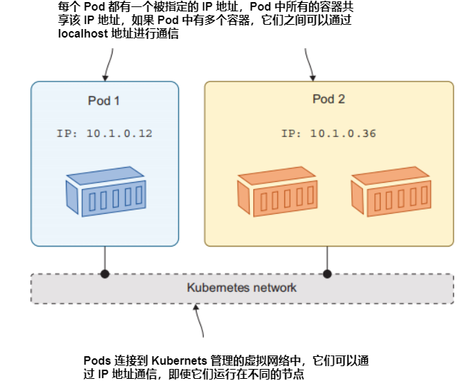
<center>图2.1 容器在 Pod 内运行。你管理 Pods, Pods 管理容器 </center>

多容器 Pods 的业务在早期介绍有点多，但如果我掩盖它，只谈论单容器 Pods，你会理所当然地问：为什么 Kubernetes 使用 Pods 而不是容器。让我们运行一个Pod，然后看看使用容器上的这种抽象是什么样子的。

<b>现在就试试</b> 你可以通过 Kubernetes 命令行运行一个简单的 Pod(无需编写 YAML 文件)。语法类似于 Docker 运行容器: 你需要说明你要使用的容器的镜像以及任何用于配置 Pod 行为的其他参数。

```
# 运行一个单容器 Pod; restart 参数代表如果退出，不重启:
kubectl run hello-kiamol --image=kiamol/ch02-hello-kiamol --restart=Never
# 等待 Pod 就绪:
kubectl wait --for=condition=Ready pod hello-kiamol
# 查询所有的 Pod 清单:
kubectl get pods
# 查看 Pod 详细信息:
kubectl describe pod hello-kiamol
```

你可以看到图 2.2 是我执行时的输出，当你自己运行它时，你将在其中看到很多看起来晦涩难懂的信息，比如节点选择符和容错。他们都是 Pod 配置规范，Kubernetes 已将缺省值应用于我们没有在 Run 命令中指定的配置。


<center>图2.2 运行最简单的 Pods 并且使用 Kubectl 检查它的状态 </center>

现在你的集群中拥有一个应用容器，它运行在一个 Pod 内。如果你之前接触过 Docker，这是一个熟悉的工作流程，事实证明 Pods 并不像看起来那么复杂。你的大多数 Pods 都会运行单个容器(直到您开始探索更高级的选项)，因此你可以有效地将 Pod 视为 Kubernetes 用来运行容器的一种机制。
 
Kubernetes 并不真正运行容器，它把这个责任交给节点上的容器运行时，可能会是 Docker 或者其他之类的。这就是为什么是抽象的：它是 Kubernetes 管理的资源，而容器则是 Kubernetes 之外的某个东西管理。你可以通过 Kubectl 来获取有关 Pod 的信息。

<b>现在就试试</b> Kubectl 从 get pod 命令返回基本的信息,你可以通过指定输出相关的参数来请求返回更多的内容。你可以说出要在输出参数中看到的各个字段,可以使用 JSONPath 查询语言或者 Go 模板来得到复杂的输出。

```
# 获取 Pod 基本信息:
kubectl get pod hello-kiamol
# 指定输出的自定义列, 选择了网络相关信息:
kubectl get pod hello-kiamol --output custom-
    columns=NAME:metadata.name,NODE_IP:status.hostIP,POD_IP:status.podIP 
# 指定查询 JSONPath ,
# 选择 Pod 中第一个容器的 ID:
kubectl get pod hello-kiamol -o 
    jsonpath='{.status.containerStatuses[0].containerID}'
```

我的输出如图 2.3 所示。我在 windows 上的 Docker Desktop 运行了一个单节点的 Kubernetes 集群，第二条命令中的节点 IP 是我的 Linux 虚机的 Ip 地址，然后 Pod IP 是集群中的 Pod 虚拟地址。第三条命令输出的 container ID 以容器运行时的名字作为前缀，我的是 Docker。

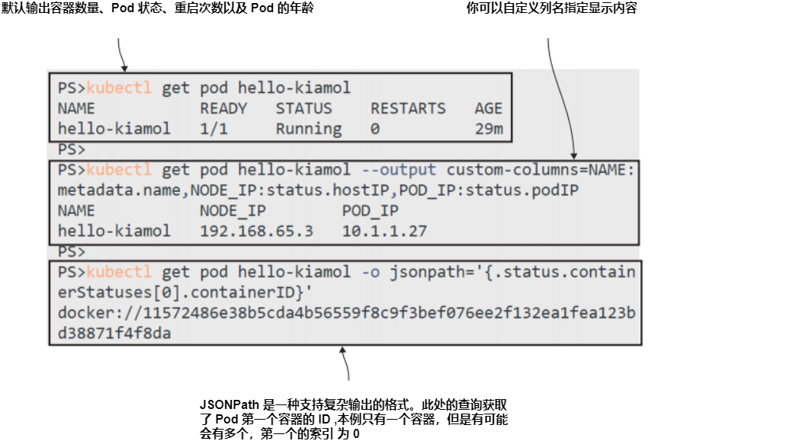
<center>图2.3 Kubectl 有很多选项可以自定义各种对象包括 Pods 的输出 </center>

这可能会让人觉得很枯燥，但它有两个重要的要点。首先，kubectl 是一个非常强大的工具，作为你与 Kubernetes 的主要联系点，你将花费大量时间使用它，非常值得去理解它能做什么。查询命令的输出是查看您关心的信息的有用方法，因为您可以访问所有资源的详细信息，这对自动化也很有用。第二个要点是提醒 Kubernetes不运行容器，Pod 中的容器 ID 是引用自另一个运行容器的系统。

Pods 在创建时被分配给一个节点，该节点负责管理 Pod 及其容器，它通过使用容器运行时中的称为容器运行时接口（CRI）的已知API 来实现此操作。CRI 让节点以相同的方式为所有不同的容器运行时管理容器。它使用一个标准API来创建和删除容器并查询它们的状态。当 Pod 运行时，节点与容器运行时一起工作，以确保 Pod 有它需要的所有容器。

<b>现在就试试</b> 所有 Kubernetes 环境都使用相同的 CRI 机制来管理容器，但不是所有的容器运行时都允许您访问 Kubernetes 之外的容器。本练习向您展示Kubernetes 节点如何确保其 Pod 容器的运行，这里使用的是 Docker 容器运行时进行演示。

```
# 查询 Pod 中的容器:
docker container ls -q --filter 
    label=io.kubernetes.container.name=hello-kiamol
# 现在，删除容器:
docker container rm -f $(docker container ls -q --filter 
    label=io.kubernetes.container.name=hello-kiamol)
# 检查 Pod 状态:
kubectl get pod hello-kiamol
# 可以再次看到容器:
docker container ls -q --filter 
    label=io.kubernetes.container.name=hello-kiamol
```

从图 2.4 中可以看到，当我删除 Docker 容器时，Kubernetes做出了反应，一时间 Pod 没有了容器，但 Kubernetes 立即创建了一个替代容器来修复 Pod 并将其恢复到正确的状态。

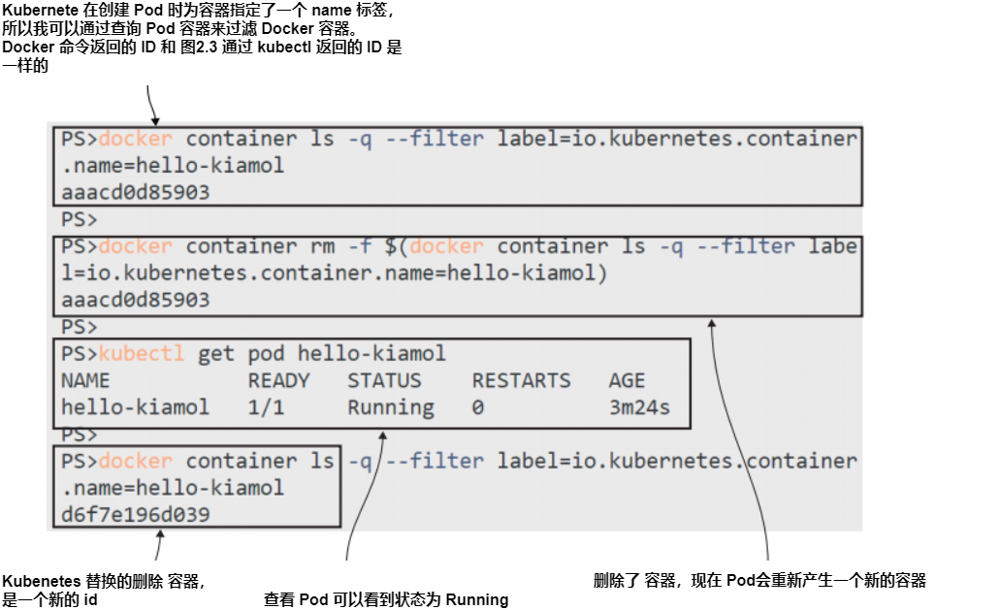
<center>图2.4 Kubernetes 确保 Pods 可以始终拥有它所需的容器 </center>

从容器到 Pods 的抽象可以让 Kubernetes 修复此类问题。一个失败的容器可能是临时的故障；Pod 仍然存在，并且 Pod 可以用一个新的容器使其符合目标。这只是 Kubernetes 提供的自我修复的一个级别，Kubernetes 在 Pods 之上提供了进一步的抽象，使你的应用程序更具弹性。

其中一个抽象是 Deployment，我们将在下一节中讨论。在我们继续之前，让我们看看Pod中到底在运行什么。这是一个 web 应用程序，但你还不能访问它，因为我们还没有配置 Kubernetes 来路由网络到 Pod 的流量。我们可以使用 kubectl 的另一个特性来解决这个问题。

<b>现在就试试</b> Kubectl 可以将流量从节点转发到Pod，这是一个从集群外部与 Pod 通信的快速方式。你可以监听在计算机上的特定端口，该端口是集群中的单个节点上的——并将流量转发到 Pod 中运行的应用程序。

```
# 监听你机器的 8080 端口，并将流量发送到 Pod 的 80 端口
kubectl port-forward pod/hello-kiamol 8080:80
# 现在访问 http://localhost:8080
# 当你结束之后，可以通过 ctrl-c 结束端口转发
```

我的输出如图 2.5 所示，你可以发现它是一个非常基本的 web 网站。这个 Web服务器和所有的内容都已打包到 Docker Hub 上的容器镜像中，该镜像是公开可用的。所有CRI-兼容的容器运行时可以提取镜像并从中运行容器，因此当您运行应用程序是，它对你的工作方式与对我的工作方式是相同的。
 
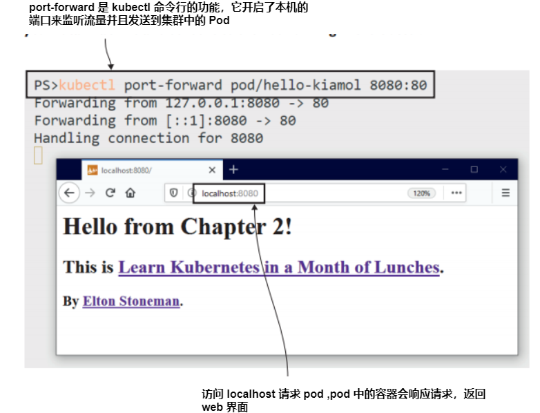
<center>图 2.5 这个应用并没有配置接收网络流量，但是 Kubectl 可以转发网络流量 </center>

现在我们很好地了解了Pod，它是Kubernetes 中最小的计算单元。你需要了解这一切是如何运作的，但Pod是一个原始的资源，在正常使用中，您永远不会直接运行Pod；您总是创建一个控制器对象来管理 Pod。

## 2.2 通过控制器运行 Pods

这只是第二章的第二节，我们即将开始讨论另一个 Kubernetes 对象，它是对其他对象的抽象。Kubernetes 确实很快就会变得复杂，但这种复杂性是这种强大且可配置系统的必要组成部分。
 
单独使用 Pods 太简单了；它们是应用程序的隔离实例，每个 Pod 都分配给一个节点。如果该节点离线，Pod 将丢失，Kubernetes 不会替换它。您可以通过运行多个 Pods 来尝试获得高可用性，但不能保证 Kubernetes 不会将它们全部运行在同一个节点上。即使您将 Pods 分散在多个节点上，您仍需要自己管理它们。当您有一个可以为您管理它们的编排器时，为什么要这样做呢？

那就是控制器的作用了。控制器是一种 Kubernetes 资源，用于管理其他资源。它与 Kubernetes API 一起工作，以观察系统的当前状态，将其与其资源的期望状态进行比较，并进行任何必要的更改。Kubernetes 有许多控制器，但用于管理 Pods 的主要控制器是 Deployment，它可以解决我刚才描述的问题。如果一个节点离线并且你失去了一个 Pod，Deployment 就会在另一个节点上创建一个替换 Pod；如果你想扩展你的 Deployment，你可以指定你想要多少 Pods，Deployment 控制器会将它们运行在许多节点上。图 2.6 显示了 Deployments、Pods 和容器之间的关系。
 
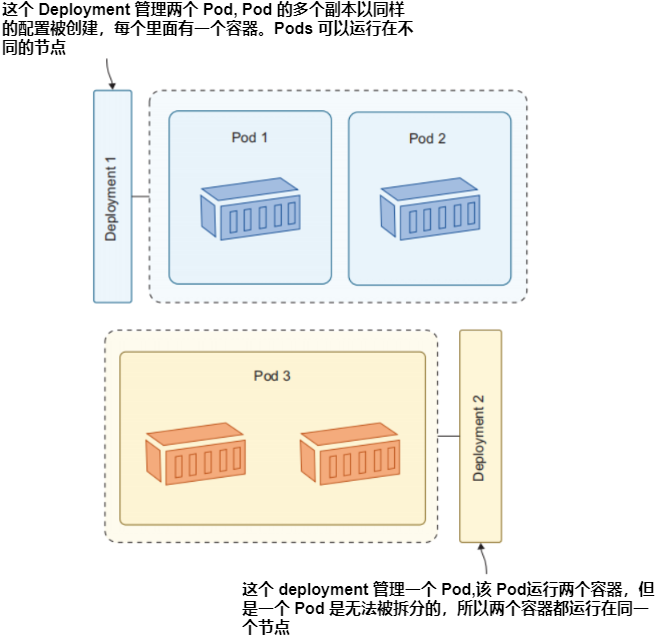
<center>图2.6 Deployment 控制器管理 Pods, Pods 管理 容器</center>

您可以使用 kubectl 创建 Deployment 资源，指定要运行的容器镜像和 Pod 的任何其他配置。Kubernetes 创建 Deployment，Deployment 创建 Pod。

<b>现在就试试</b> 使用 Deployment 创建另一个 web 应用的实例。唯一需要的参数是 Deployment 的名称和要运行的镜像。

```
# 创建名为 "hello-kiamol-2" 的 deployment, 运行同样的 web 应用:
kubectl create deployment hello-kiamol-2 --image=kiamol/ch02-hello-kiamol
# 查询所有的 Pods:
kubectl get pods
```

您可以在图 2.7 中查看我的输出。现在您的集群中有两个 Pod：使用 kubectl run 命令创建的原始 Pod，以及由 Deployment 创建的新 Pod。由 Deployment 管理的 Pod 具有 Kubernetes 生成的名称，该名称是 Deployment 名称后面跟随一个随机后缀。
 
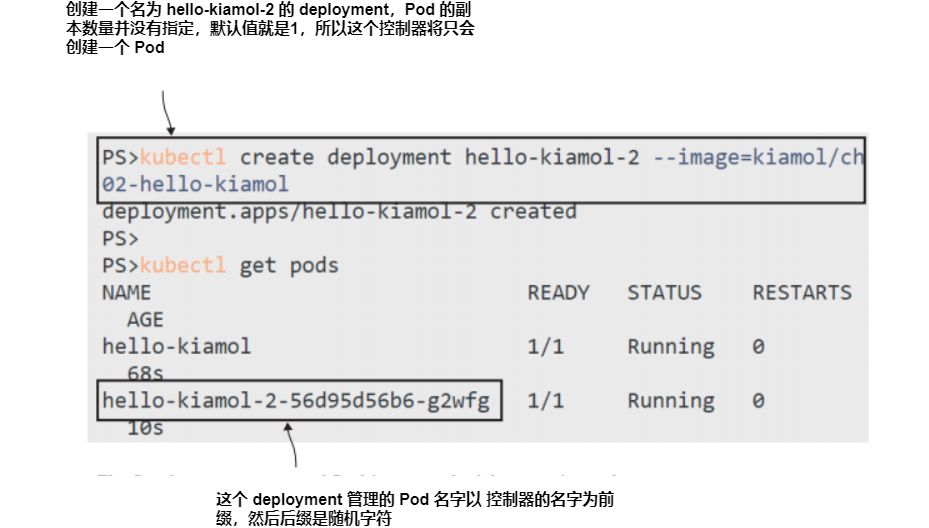
<center>图2.7 创建一个控制器资源, 它负责创建自己的资源—Deployments 创建 Pods</center>

从这次练习中需要意识到的一个重要事情：您创建了 Deployment，但您没有直接创建 Pod。Deployment 规范描述了您想要的 Pod，并由 Deployment 创建了该 Pod。Deployment 是一个控制器，它使用 Kubernetes API 检查哪些资源正在运行，意识到应该管理的 Pod 不存在，并使用 Kubernetes API 创建它。确切的机制并不重要；您可以只与 Deployment 一起工作，并依靠它来创建您的 Pod。
 
但是，Deployment 是如何跟踪其资源的确很重要，因为这是 Kubernetes 经常使用的一种模式。任何 Kubernetes 资源都可以应用简单的键值对标签。您可以添加标签来记录您自己的数据。例如，您可以为 Deployment 添加一个名为 release 的标签，并将值设置为 20.04，表示这个 Deployment 来自 20.04 发行周期。Kubernetes 也使用标签来松散耦合资源，映射 Deployment 及其 Pods 之类对象之间的关系。

<b>现在就试试</b> Deployment 在它管理的 Pods 上添加了标签，使用 Kubectl 来输出 Deployment 添加的标签，然后查询标签匹配的 Pods:
```
# 打印 Deployment 添加到 Pods 上的标签:
kubectl get deploy hello-kiamol-2 -o 
    jsonpath='{.spec.template.metadata.labels}'
# 列出标签匹配的 Pods:
kubectl get pods -l app=hello-kiamol-2
```

我的输出如图 2.8 所示，您可以看到资源的配置方式的一些内部细节。Deployments 使用模板来创建 Pods，该模板的一部分是元数据字段，其中包括 Pod 的标签。在这种情况下，Deployment 向 Pod 添加了一个名为 app 的标签，值为 hello-kiamol-2。查询具有匹配标签的 Pod 会返回由 Deployment 管理的单个 Pod。
 
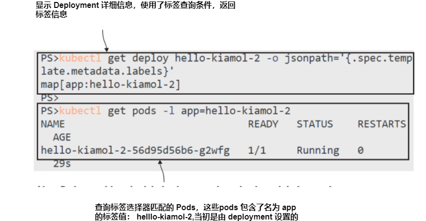
<center> 图2.8 当 Deployments 创建 Pods 时添加标签, 然后你可以使用这些标签进行过滤 </center>

使用标签来识别资源之间的关系是 Kubernetes 中的核心模式，因此值得显示一个图表来确保它是明确的。资源在创建时可以应用标签，然后在其生命周期内添加、删除或编辑。控制器使用标签选择器来识别其管理的资源。这可以是一个匹配具有特定标签的资源的简单查询，如图 2.9 所示。
 
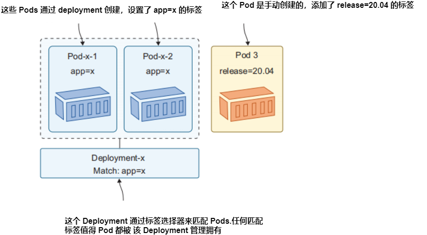
<center>图2.9 Controllers identify the resources they manage by using labels and selectors.</center>

这个过程是灵活的，因为这意味着控制器不需要维护它们管理的所有资源的列表；标签选择器是控制器规范的一部分，控制器可以通过查询 Kubernetes API 来随时找到匹配的资源。这也是您需要小心的地方，因为您可以编辑资源的标签，最终导致它与其控制器之间的关系中断。

<b>现在就试试</b> Deployment 与它创建的 Pod 之间没有直接关系；它只需要知道一个带有与其标签选择器匹配的标签的 Pod。如果您编辑了 Pod 的标签，Deployment 就不再识别它了。

```
# 查询所有 Pods, 显示 Pod 名称和标签:
kubectl get pods -o custom-
    columns=NAME:metadata.name,LABELS:metadata.labels
# 更新 Deployment 的 Pod "app" 标签:
kubectl label pods -l app=hello-kiamol-2 --overwrite app=hello-kiamol-x
# 再次查询 Pods:
kubectl get pods -o custom-
    columns=NAME:metadata.name,LABELS:metadata.labels
```

您期望发生什么？您可以从图2.10中显示的输出中看出，更改 Pod 标签有效地将 Pod 从 Deployment 中删除。在那个时候，Deployment 看到没有匹配其标签选择器的 Pod 存在，因此它创建了一个新的 Pod。Deployment 已经完成了它的工作，但通过直接编辑 Pod，您现在拥有了一个不受管理的 Pod。
 
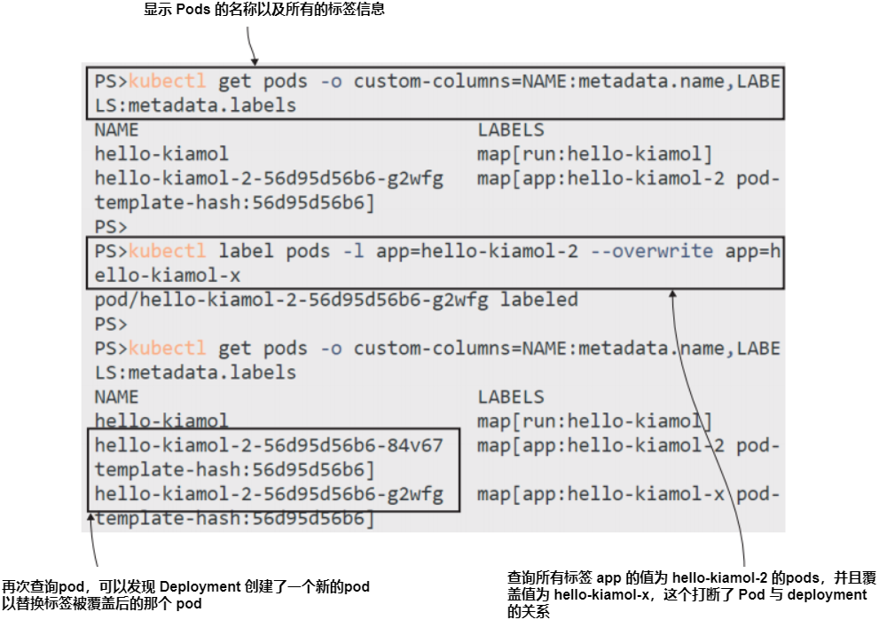
<center>图2.10 如果您干扰了 Pod 上的标签，您可以将其从部署的控制中删除</center>

在调试中，这可能是一种有用的技术——将 Pod 从控制器中删除，这样您就可以连接并调查问题，而控制器启动了一个新的 Pod，这样您的应用程序就可以按照所需的规模运行。您也可以做相反的事情：编辑 Pod 的标签，使控制器被骗到把该 Pod 作为其管理的集合的一部分。

<b>现在就试试</b> 将原始 Pod 通过将其 app 标签设置为与标签选择器匹配来返回 Deployment 的控制。

```
# 查询包含标签 “app” 的 Pods, 显示 Pod 名称和标签:
kubectl get pods -l app -o custom-
    columns=NAME:metadata.name,LABELS:metadata.labels
# 更新不受管理的 Pod 的 “app” 标签:
kubectl label pods -l app=hello-kiamol-x --overwrite app=hello-kiamol-2
# 再次查询 Pods:
kubectl get pods -l app -o custom-
    columns=NAME:metadata.name,LABELS:metadata.labels
```

此练习实际上逆转了前一个练习，将 app 标签重新设置为 Deployment 中原始 Pod 的 hello-kiamol-2。现在，当 Deployment 控制器与 API 检查时，它会看到两个与其标签选择器匹配的 Pod。然而，它应该只管理一个 Pod，因此它删除了其中一个（使用一组删除规则来决定哪一个）。您可以在图2.11中看到，Deployment 删除了第二个 Pod，并保留了原始 Pod。现在您拥有一个不受管理的 Pod。
 
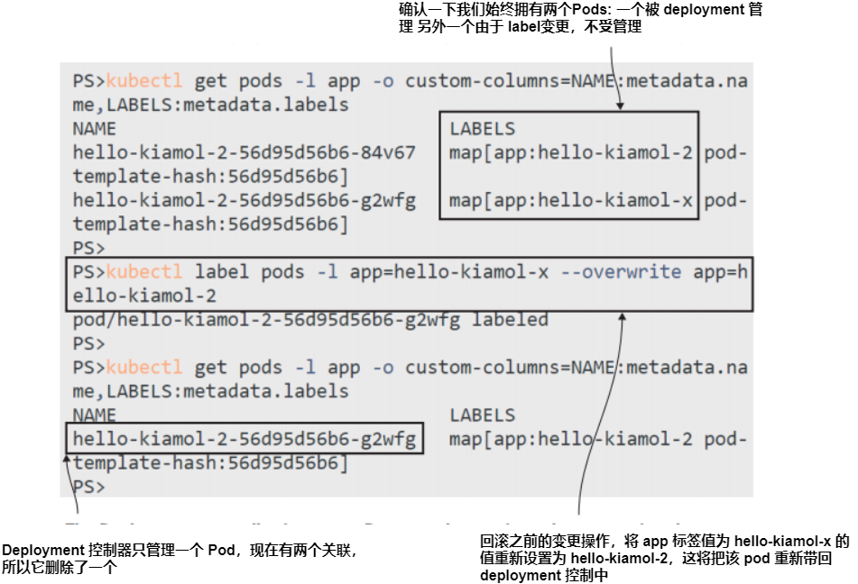
<center>图2.11 更多标签干扰—如果标签匹配，您可以强制部署采用 Pod </center>

Pod 运行您的应用程序容器，但与容器一样，Pod 的生命周期也很短。您通常会使用更高级别的资源（如 Deployment）来为您管理 Pod。这样做会使 Kubernetes 在容器或节点出现问题时更容易维护您的应用程序，但最终 Pod 运行的容器与您自己运行的容器相同，而您的应用程序的最终用户体验也是相同的。

<b>现在就试试</b> Kubectl 的 port-forward 命令将流量发送到 Pod，但您不必为 Deployment 找到随机的 Pod 名称。您可以在 Deployment 资源上配置端口转发，并且 Deployment 会选择其中一个 Pod 作为目标。

```
# 在你的本地机器运行一个 Deployment 的端口转发:
kubectl port-forward deploy/hello-kiamol-2 8080:80
# 访问 http://localhost:8080
# 结束之后, 通过 ctrl-c 退出
```

您可以看到我的输出，如图2.12所示，容器中运行的同一个应用程序来自同一个 Docker 镜像，但这一次，它在由 Deployment 管理的 Pod 中运行。
 
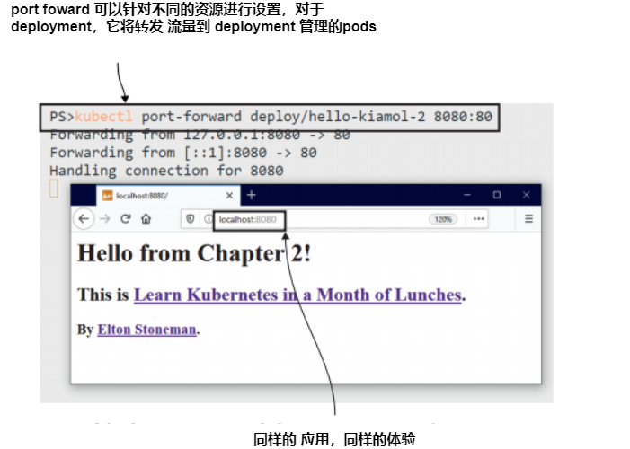
<center>图2.12 Pod 和 Deployment 是容器上面的一层，但应用程序仍然在容器中运行</center>

Pod 和 Deployment 是本章中唯一要介绍的资源。您可以使用 kubectl run 和 create 命令部署非常简单的应用程序，但更复杂的应用程序需要更多的配置，而这些命令将无法完成。是时候进入 Kubernetes YAML 的世界了。

## 2.3 在清单文件中定义 Deployments

 Manifests can be written in JSON or YAML; JSON is the native language of the
Kubernetes API, but YAML is preferred for manifests because it’s easier to read, lets you
define multiple resources in a single file, and, most important, can record comments in
the specification. Listing 2.1 is the simplest app manifest you can write. It defines a single Pod using the same container image we’ve already used in this chapter.

应用程序清单是 Kubernetes 最具吸引力的方面之一，但也是最令人沮丧的方面之一。当您在几百行 YAML 中挣扎时，试图找到破坏应用程序的小配置错误，可能会认为 API 是故意写来混淆和激怒您的。在这些时候，请记住 Kubernetes 清单是应用程序的完整描述，可以对其进行版本控制并跟踪源控制，并且在任何 Kubernetes 集群上部署相同的应用程序。

清单可以用 JSON 或 YAML 编写；JSON 是 Kubernetes API 的原生语言，但 YAML 更适合清单，因为它更容易阅读，允许您在单个文件中定义多个资源，最重要的是，它可以在规范中记录注释。清单 2.1 是您可以编写的最简单的应用程序清单。它定义了一个使用本章已经使用过的相同容器镜像的单个 Pod。

> 清单 2.1 pod.yaml, 单个 Pod 运行单个容器
```
# 清单同时指定了 Kubernetes API 的版本以及资源类型
apiVersion: v1
kind: Pod
# 资源的元数据包括名称(必填项)和标签(可选)
metadata:
  name: hello-kiamol-3
# spec 是资源的实际规格，对于 Pod 最小值是要运行的容器：包括容器名称以及镜像
spec:
  containers:
   - name: web
     image: kiamol/ch02-hello-kiamol
 ```

这比 kubectl run 命令所需的信息要多得多，但应用程序清单的大优势是它是声明性的。Kubectl run 和 create 是命令性操作——你告诉 Kubernetes 做些什么。清单是声明性的——你告诉 Kubernetes 最终结果应该是什么，它就会去决定它需要做什么来使这种情况发生。

<b>现在就试试</b> 您仍然使用 kubectl 从清单文件部署应用程序，但您使用 apply 命令，告诉 Kubernetes 将文件中的配置应用于集群。使用与清单 2.1 相同的内容的 YAML 文件运行本章示例应用程序的另一个 pod。

```
# 切换到第二章练习源码目录:
cd ch02
# 基于清单文件部署应用:
kubectl apply -f pod.yaml
# 查询 Pods:
kubectl get pods
```

新的 Pod 与使用 kubectl run 命令创建的 Pod 工作方式相同：它分配给一个节点，并运行容器。图2.13 的输出显示，当我应用清单时，Kubernetes 决定需要创建一个 Pod 来使集群的当前状态达到我的期望状态。这是因为清单指定了一个名为 hello-kiamol-3 的 Pod，但没有这样的 Pod。
 
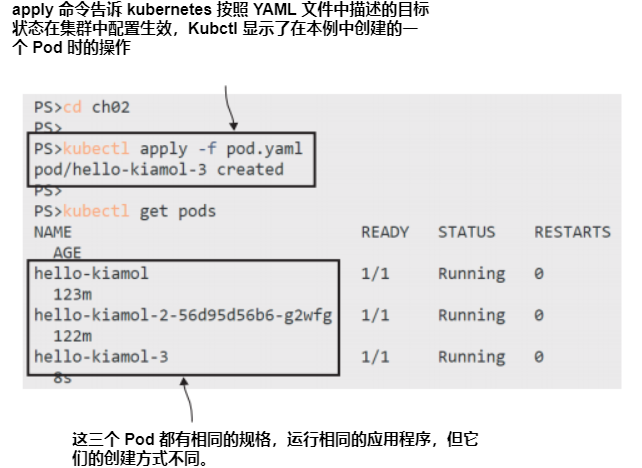
<center>图2.13 应用清单将YAML文件发送到Kubernetes API，该API应用更改</center>

现在 Pod 正在运行，您可以使用 kubectl 以相同的方式进行管理：通过列出 Pod 的详细信息并运行端口转发来向 Pod 发送流量。大的不同在于清单易于共享，基于清单的部署是可重复的。我可以多次运行相同的 kubectl apply 命令和相同的清单，结果总是一样的：一个名为 hello-kiamol-3 的 Pod 运行我的 web 容器。

<b>现在就试试</b> Kubectl 并不一定需要本地的清单文件，它可以获取远程的 URL 信息，让我们通过 GitHub 中的文件来部署同样的 Pod。

```
# 从清单文件部署:
kubectl apply -f https://github.com/yyong-brs/learn-kubernetes/blob/master/kiamol/ch02/pod.yaml
```

图2.14 显示了输出。资源定义与集群中运行的 Pod 匹配，因此 Kubernetes 不需要做任何事情，而 kubectl 显示匹配的资源未更改。
 
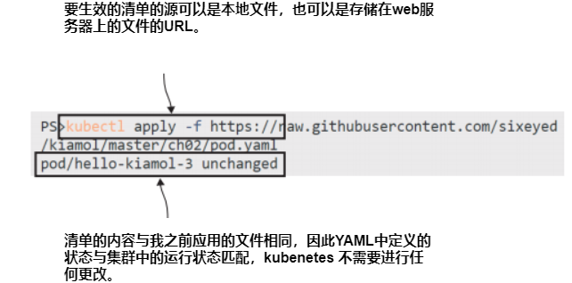
<center>图2.14 Kubectl 可以通过从远程服务器下载清单文件，并发送到 Kubernetes API 执行</center>

应用程序清单在与高级资源一起工作时变得更有趣。当您在 YAML 文件中定义 Deployment 时，其中一个必填字段是 Deployment 应运行的 Pod 的规范。该 Pod 规范是独立定义 Pod 的相同 API，因此 Deployment 定义是一个复合体，包括 Pod spec。清单 2.2 显示了运行同一个 web 应用程序的另一个版本的 Deployment 资源的最小定义。

> 清单 2.2 deployment.yaml, Deployment 及 Pod 配置

```
# Deployments 是 apps 版本v1 API 规范的一部分
apiVersion: apps/v1
kind: Deployment
# Deployments 需要一个名称
metadata:
  name: hello-kiamol-4
# spec 包括 Deployment 使用的标签选择器来找到它自己的资源 - 我正在使用 app 标签，但这可能是任何组合的键值对.
spec:
  selector:
    matchLabels:
      app: hello-kiamol-4
    # template 在 Deployment 创建 Pod 模板时使用.
    # PDeployment 中的 Pods 没有名称，但它们需要指定与选择器匹配的标签
      labels:
        app: hello-kiamol-4
  # Pod 规范列出容器名称和镜像规范
  containers:
    - name: web
      image: kiamol/ch02-hello-kiamol
```

这个清单是用于一个完全不同的资源（它只是运行相同应用程序的巧合），但所有 Kubernetes 清单都是使用 kubectl apply 以相同方式部署的。这为您的所有应用程序提供了一个很好的一致性层，无论它们有多复杂，您都可以在一个或多个 YAML 文件中定义它们，并使用相同的 kubectl 命令部署它们。

<b>现在就试试</b> 这个指令是要求将 Deployment 清单应用于创建一个新的 Deployment，这样可以创建一个新的 Pod。
```
# 使用 deployment 清单运行应用程序:
kubectl apply -f deployment.yaml
# 找到新 deployment 管理的 Pods:
kubectl get pods -l app=hello-kiamol-4
```

图 2.15 输出结果与使用 kubectl create 创建的 Deployment 相同，但整个应用程序规范都定义在单个 YAML 文件中。
 
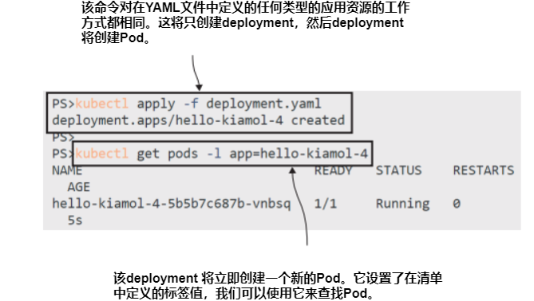
<center>图2.15 通过 deployment 清单可以创建一个 deployment，因为没有匹配的资源存在</center>

随着应用程序复杂度的增加，我需要指定我想要的副本数量，应用的 CPU 和内存限制，以及 Kubernetes 如何检查应用程序是否健康，应用程序配置设置来自哪里，数据写入哪里——我可以通过添加 YAML 来实现所有这些。

## 2.4 应用在 Pods 中运行

## 2.5 了解 Kubernetes 资源管理

## 2.6 实验室