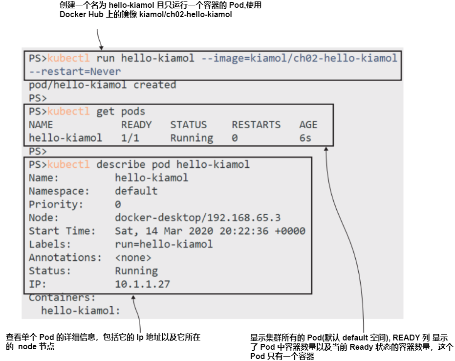

# 第二章 Pods & Deployment 在 Kubernetes 中的应用

Kubernetes runs containers for your application workloads, but the containers
themselves are not objects you need to work with. Every container belongs to a Pod,
which is a Kubernetes object for managing one or more containers, and Pods, in
turn, are managed by other resources. These higher-level resources abstract away
the details of the container, which powers self-healing applications and lets you use
a desired-state workflow: you tell Kubernetes what you want to happen, and it
decides how to make it happen.
 
 In this chapter, we’ll get started with the basic building blocks of Kubernetes:
Pods, which run containers, and Deployments, which manage Pods. We’ll use a simple web app for the exercises, and you’ll get hands-on experience using the Kubernetes command-line tool to manage applications and using the Kubernetes YAML
specification to define applications.

## 2.1 Kubernetes 如何运行并管理容器

A container is a virtualized environment that typically runs a single application
component. Kubernetes wraps the container in another virtualized environment:
the Pod. A Pod is a unit of compute, which runs on a single node in the cluster. The
Pod has its own virtual IP address, which is managed by Kubernetes, and Pods in
the cluster can communicate with other Pods over that virtual network, even if
they’re running on different nodes. 
 
 You normally run a single container in a Pod, but you can run multiple containers in one Pod, which opens up some interesting deployment options. All the containers in a Pod are part of the same virtual environment, so they share the same network address and can communicate using localhost. Figure 2.1 shows the relationship between containers and Pods.


<center>图2.1 Containers run inside Pods. You manage the Pods, and the Pods manage the containers. </center>

This business of multicontainer Pods is a bit much to introduce this early on, but if I
glossed over it and talked only about single-container Pods, you’d be rightfully asking
why Kubernetes uses Pods at all instead of just containers. Let’s run a Pod and see
what it looks like to work with this abstraction over containers. 

TRY IT NOW You can run a simple Pod using the Kubernetes command line
without needing a YAML specification. The syntax is similar to running a con-
tainer using Docker: you state the container image you want to use and any
other parameters to configure the Pod behavior.

```
# run a Pod with a single container; the restart flag tells Kubernetes
# to create just the Pod and no other resources:
kubectl run hello-kiamol --image=kiamol/ch02-hello-kiamol --restart=Never
# wait for the Pod to be ready:
kubectl wait --for=condition=Ready pod hello-kiamol
# list all the Pods in the cluster:
kubectl get pods
# show detailed information about the Pod:
kubectl describe pod hello-kiamol
```

You can see my output in figure 2.2, where I’ve abridged the response from the final
describe pod command. When you run it yourself, you’ll see a whole lot more obscure-
sounding information in there, like node selectors and tolerations. They’re all part of
the Pod specification, and Kubernetes has applied default values for everything that
we didn’t specify in the run command.


<center>图2.2 Running the simplest of Pods and checking its status using kubectl </center>

Now you have a single application container in your cluster, running inside a single
Pod. If you’re used to working with Docker, this is a familiar workflow, and it turns out
that Pods are not as complicated as they might seem. The majority of your Pods will
run single containers (until you start to explore more advanced options), and so you
can effectively think of the Pod as the mechanism Kubernetes uses to run a container.
 
 Kubernetes doesn’t really run containers, though—it passes the responsibility
for that to the container runtime installed on the node, which could be Docker or
containerd or something more exotic. That’s why the Pod is an abstraction: it’s the
resource that Kubernetes manages, whereas the container is managed by something
outside of Kubernetes. You can get a sense of that by using kubectl to fetch specific
information about the Pod.

TRY IT NOW Kubectl returns basic information from the get pod command,
but you can request more by applying an output parameter. You can name
individual fields you want to see in the output parameter, and you can use the
JSONPath query language or Go templates for complex output.

```
# get the basic information about the Pod:
kubectl get pod hello-kiamol
# specify custom columns in the output, selecting network details:
kubectl get pod hello-kiamol --output custom-
    columns=NAME:metadata.name,NODE_IP:status.hostIP,POD_IP:status.podIP 
# specify a JSONPath query in the output,
# selecting the ID of the first container in the Pod:
kubectl get pod hello-kiamol -o 
    jsonpath='{.status.containerStatuses[0].containerID}'
```

My output is shown in figure 2.3. I’m running a single-node Kubernetes cluster using
Docker Desktop on Windows. The node IP in the second command is the IP address
of my Linux VM, and the Pod IP is the virtual address of the Pod in the cluster. The
container ID returned in the third command is prefixed by the name of the container runtime; mine is Docker.


<center>图2.3 Kubectl has many options for customizing its output for Pods and other objects. </center>

That may have felt like a pretty dull exercise, but it comes with two important take-
aways. The first is that kubectl is a hugely powerful tool—as your main point of con-
tact with Kubernetes, you’ll be spending a lot of time with it, and it’s worth getting a
solid understanding of what it can do. Querying the output from commands is a use-
ful way to see the information you care about, and because you can access all the
details of the resource, it’s great for automation too. The second takeaway is a
reminder that Kubernetes does not run containers—the container ID in the Pod is a
reference to another system that runs containers.
 
 Pods are allocated to one node when they’re created, and it’s that node’s responsi-
bility to manage the Pod and its containers. It does that by working with the container
runtime using a known API called the Container Runtime Interface (CRI). The CRI
lets the node manage containers in the same way for all the different container run-
times. It uses a standard API to create and delete containers and to query their state.
While the Pod is running, the node works with the container runtime to ensure the
Pod has all the containers it needs.

TRY IT NOW All Kubernetes environments use the same CRI mechanism to
manage containers, but not all container runtimes allow you to access con-
tainers outside of Kubernetes. This exercise shows you how a Kubernetes
node keeps its Pod containers running, but you’ll only be able to follow it if
you’re using Docker as your container runtime.
```
# find the Pod’s container:
docker container ls -q --filter 
    label=io.kubernetes.container.name=hello-kiamol
# now delete that container:
docker container rm -f $(docker container ls -q --filter 
    label=io.kubernetes.container.name=hello-kiamol)
# check the Pod status:
kubectl get pod hello-kiamol
# and find the container again:
docker container ls -q --filter 
    label=io.kubernetes.container.name=hello-kiamol
```

You can see from figure 2.4 that Kubernetes reacted when I deleted my Docker con-
tainer. For an instant, the Pod had zero containers, but Kubernetes immediately cre-
ated a replacement to repair the Pod and bring it back to the correct state.


<center>图2.4 Kubernetes makes sure Pods have all the containers they need. </center>
 
 It’s the abstraction from containers to Pods that lets Kubernetes repair issues like
this. A failed container is a temporary fault; the Pod still exists, and the Pod can be
brought back up to spec with a new container. This is just one level of self-healing that
Kubernetes provides, with further abstractions on top of Pods giving your apps even
more resilience.

One of those abstractions is the Deployment, which we’ll look at in the next section.
Before we move on, let’s see what’s actually running in that Pod. It’s a web application,
but you can’t browse to it because we haven’t configured Kubernetes to route network
traffic to the Pod. We can get around that using another feature of kubectl.

TRY IT NOW Kubectl can forward traffic from a node to a Pod, which is a
quick way to communicate with a Pod from outside the cluster. You can listen
on a specific port on your machine—which is the single node in your cluster—
and forward traffic to the application running in the Pod.
```
# listen on port 8080 on your machine and send traffic
# to the Pod on port 80:
kubectl port-forward pod/hello-kiamol 8080:80
# now browse to http://localhost:8080
# when you’re done press ctrl-c to end the port forward
```

My output is shown in figure 2.5, and you can see it’s a pretty basic website (don’t con-
tact me for web design consultancy). The web server and all the content are packaged
into a container image on Docker Hub, which is publicly available. All the CRI-
compatible container runtimes can pull the image and run a container from it, so I
know that for whichever Kubernetes environment you’re using, when you run the
app, it will work in the same way for you as it does for me.
 

<center>图2.5 This app isn’t configured to receive network traffic, but kubectl can forward it </center>
 
 Now we have a good handle on the Pod, which is the smallest unit of compute in
Kubernetes. You need to understand how that all works, but the Pod is a primitive
resource, and in normal use, you’d never run a Pod directly; you’d always create a con-
troller object to manage the Pod for you.


## 2.2 通过控制器运行 Pods

It’s only the second section of the second chapter, and we’re already on to a new
Kubernetes object, which is an abstraction over other objects. Kubernetes does get
complicated quickly, but that complexity is a necessary part of such a powerful and
configurable system. The learning curve is the entrance fee for access to a world-class
container platform. 
 
 Pods are too simple to be useful on their own; they are isolated instances of an
application, and each Pod is allocated to one node. If that node goes offline, the Pod
is lost, and Kubernetes does not replace it. You could try to get high availability by run-
ning several Pods, but there’s no guarantee Kubernetes won’t run them all on the
same node. Even if you do get Pods spread across several nodes, you need to man-
age them yourself. Why do that when you have an orchestrator that can manage
them for you?
 
 That’s where controllers come in. A controller is a Kubernetes resource that man-
ages other resources. It works with the Kubernetes API to watch the current state of
the system, compares that to the desired state of its resources, and makes any changes
necessary. Kubernetes has many controllers, but the main one for managing Pods is
the Deployment, which solves the problems I’ve just described. If a node goes offline
and you lose a Pod, the Deployment creates a replacement Pod on another node; if
you want to scale your Deployment, you can specify how many Pods you want, and the
Deployment controller runs them across many nodes. Figure 2.6 shows the relation-
ship between Deployments, Pods, and containers.
 

<center>图2.6 Deployment controllers manage Pods, and Pods manage containers</center>

You can create Deployment resources with kubectl, specifying the container image
you want to run and any other configuration for the Pod. Kubernetes creates the
Deployment, and the Deployment creates the Pod. 

TRY IT NOW Create another instance of the web application, this time using a
Deployment. The only required parameters are the name for the Deployment
and the image to run.
```
# create a Deployment called "hello-kiamol-2", running the same web app:
kubectl create deployment hello-kiamol-2 --image=kiamol/ch02-hello-kiamol
# list all the Pods:
kubectl get pods
```

You can see my output in figure 2.7. Now you have two Pods in your cluster: the origi-
nal one you created with the kubectl run command, and the new one created by the
Deployment. The Deployment-managed Pod has a name generated by Kubernetes,
which is the name of the Deployment followed by a random suffix.
 

<center>图2.7 Create a controller resource, and it creates its own resources—Deployments create Pods</center>

One important thing to realize from this exercise: you created the Deployment, but
you did not directly create the Pod. The Deployment specification described the
Pod you wanted, and the Deployment created that Pod. The Deployment is a control-
ler that checks with the Kubernetes API to see which resources are running, realizes
the Pod it should be managing doesn’t exist, and uses the Kubernetes API to create it.
The exact mechanism doesn’t really matter; you can just work with the Deployment
and rely on it to create your Pod.
 
 How the deployment keeps track of its resources does matter, though, because it’s
a pattern that Kubernetes uses a lot. Any Kubernetes resource can have labels applied
that are simple key-value pairs. You can add labels to record your own data. For example,
you might add a label to a Deployment with the name release and the value 20.04 to
indicate this Deployment is from the 20.04 release cycle. Kubernetes also uses labels to
loosely couple resources, mapping the relationship between objects like a Deploy-
ment and its Pods.

TRY IT NOW The Deployment adds labels to Pods it manages. Use kubectl as
follows to print the labels the Deployment adds, and then list the Pods that
match that label:
```
# print the labels that the Deployment adds to the Pod:
kubectl get deploy hello-kiamol-2 -o 
    jsonpath='{.spec.template.metadata.labels}'
# list the Pods that have that matching label:
kubectl get pods -l app=hello-kiamol-2
```

My output is shown in figure 2.8, where you can see some internals of how the
resources are configured. Deployments use a template to create Pods, and part of that
template is a metadata field, which includes the labels for the Pod(s). In this case, the
Deployment adds a label called app with the value hello-kiamol-2 to the Pod. Querying
Pods that have a matching label returns the single Pod managed by the Deployment.
 

<center>图2.8 Deployments add labels when they create Pods, and you can use those labels as filters.</center>

Using labels to identify the relationship between resources is such a core pattern in
Kubernetes that it’s worth showing a diagram to make sure it’s clear. Resources can
have labels applied at creation and then added, removed, or edited during their life-
time. Controllers use a label selector to identify the resources they manage. That can
be a simple query matching resources with a particular label, as shown in figure 2.9.
 

<center>图2.9 Controllers identify the resources they manage by using labels and selectors.</center>

This process is flexible because it means controllers don’t need to maintain a list of all
the resources they manage; the label selector is part of the controller specification,
and controllers can find matching resources at any time by querying the Kubernetes
API. It’s also something you need to be careful with, because you can edit the labels
for a resource and end up breaking the relationship between it and its controller.

TRY IT NOW The Deployment doesn’t have a direct relationship with the Pod
it created; it only knows there needs to be one Pod with labels that match its
label selector. If you edit the labels on the Pod, the Deployment no longer
recognizes it.
```
# list all Pods, showing the Pod name and labels:
kubectl get pods -o custom-
    columns=NAME:metadata.name,LABELS:metadata.labels
# update the "app" label for the Deployment’s Pod:
kubectl label pods -l app=hello-kiamol-2 --overwrite app=hello-kiamol-x
# fetch Pods again:
kubectl get pods -o custom-
    columns=NAME:metadata.name,LABELS:metadata.labels
```

What did you expect to happen? You can see from the output shown in figure 2.10
that changing the Pod label effectively removes the Pod from the Deployment. At that
point, the Deployment sees that no Pods that match its label selector exist, so it cre-
ates a new one. The Deployment has done its job, but by editing the Pod directly, you
now have an unmanaged Pod.
 

<center>图2.10 If you meddle with the labels on a Pod, you can remove it from the control of the Deployment.</center>

This can be a useful technique in debugging—removing a Pod from a controller so
you can connect and investigate a problem, while the controller starts a replacement
Pod, which keeps your app running at the desired scale. You can also do the opposite:
editing the labels on a Pod to fool a controller into acquiring that Pod as part of the
set it manages.
TRY IT NOW Return the original Pod to the control of the Deployment by set-
ting its app label back so it matches the label selector.
```
# list all Pods with a label called "app," showing the Pod name and
# labels:
kubectl get pods -l app -o custom-
    columns=NAME:metadata.name,LABELS:metadata.labels
# update the "app" label for the the unmanaged Pod:
kubectl label pods -l app=hello-kiamol-x --overwrite app=hello-kiamol-2
# fetch the Pods again:
kubectl get pods -l app -o custom-
    columns=NAME:metadata.name,LABELS:metadata.labels
```
This exercise effectively reverses the previous exercise, setting the app label back to
hello-kiamol-2 for the original Pod in the Deployment. Now when the Deployment
controller checks with the API, it sees two Pods that match its label selector. It’s sup-
posed to manage only a single Pod, however, so it deletes one (using a set of deletion
rules to decide which one). You can see in figure 2.11 that the Deployment removed
the second Pod and retained the original.
now have an unmanaged Pod.
 

<center>图2.11 More label meddling—you can force a Deployment to adopt a Pod if the labels match.</center>

Pods run your application containers, but just like containers, Pods are meant to be
short-lived. You will usually use a higher-level resource like a Deployment to manage
Pods for you. Doing so gives Kubernetes a better chance of keeping your app running
if there are issues with containers or nodes, but ultimately the Pods are running the
same containers you would run yourself, and the end-user experience for your apps
will be the same.

TRY IT NOW Kubectl’s port-forward command sends traffic to a Pod, but you
don’t have to find the random Pod name for a Deployment. You can config-
ure the port forward on the Deployment resource, and the Deployment
selects one of its Pods as the target.
```
# run a port forward from your local machine to the Deployment:
kubectl port-forward deploy/hello-kiamol-2 8080:80
# browse to http://localhost:8080
# when you’re done, exit with ctrl-c
```

You can see my output, shown in figure 2.12, of the same app running in a container
from the same Docker image, but this time, in a Pod managed by a Deployment.
 

<center>图2.12 Pods and Deployments are layers on top of containers, but the app still runs in a container.</center>

Pods and Deployments are the only resources we’ll cover in this chapter. You can
deploy very simple apps by using the kubectl run and create commands, but more
complex apps need lots more configuration, and those commands won’t do. It’s time
to enter the world of Kubernetes YAML.

## 2.3 在清单文件中定义 Deployments

Application manifests are one of the most attractive aspects of Kubernetes, but also
one of the most frustrating. When you’re wading through hundreds of lines of YAML
trying to find the small misconfiguration that has broken your app, it can seem like
the API was deliberately written to confuse and irritate you. At those times, remember
that Kubernetes manifests are a complete description of your app, which can be ver-
sioned and tracked in source control, and result in the same deployment on any
Kubernetes cluster.
 
 Manifests can be written in JSON or YAML; JSON is the native language of the
Kubernetes API, but YAML is preferred for manifests because it’s easier to read, lets you
define multiple resources in a single file, and, most important, can record comments in
the specification. Listing 2.1 is the simplest app manifest you can write. It defines a sin-
gle Pod using the same container image we’ve already used in this chapter.

> Listing 2.1 pod.yaml, a single Pod to run a single container
```
# Manifests always specify the version of the Kubernetes API
# and the type of resource.
apiVersion: v1
kind: Pod
# Metadata for the resource includes the name (mandatory) 
# and labels (optional).
metadata:
  name: hello-kiamol-3
# The spec is the actual specification for the resource.
# For a Pod the minimum is the container(s) to run, 
# with the container name and image.
spec:
  containers:
   - name: web
     image: kiamol/ch02-hello-kiamol
 ```

That’s a lot more information than you need for a kubectl run command, but the big
advantage of the application manifest is that it’s declarative. Kubectl run and create
are imperative operations—it’s you telling Kubernetes to do something. Manifests are
declarative—you tell Kubernetes what you want the end result to be, and it goes off
and decides what it needs to do to make that happen.

TRY IT NOW You still use kubectl to deploy apps from manifest files, but you
use the apply command, which tells Kubernetes to apply the configuration in
the file to the cluster. Run another pod for this chapter’s sample app using a
YAML file with the same contents as listing 2.1.
```
# switch from the root of the kiamol repository to the chapter 2 folder:
cd ch02
# deploy the application from the manifest file:
kubectl apply -f pod.yaml
# list running Pods:
kubectl get pods
```

The new Pod works in the same way as a Pod created with the kubectl run command:
it’s allocated to a node, and it runs a container. The output in figure 2.13 shows that
when I applied the manifest, Kubernetes decided it needed to create a Pod to get the
current state of the cluster up to my desired state. That’s because the manifest speci-
fies a Pod named hello-kiamol-3, and no such Pod existed.
 

<center>图2.13 Applying a manifest sends the YAML file to the Kubernetes API, which  applies changes.</center>

Now that the Pod is running, you can manage it in the same way with kubectl: by list-
ing the details of the Pod and running a port forward to send traffic to the Pod. The
big difference is that the manifest is easy to share, and manifest-based Deployment is
repeatable. I can run the same kubectl apply command with the same manifest any
number of times, and the result will always be the same: a Pod named hello-kiamol-3
running my web container.

TRY IT NOW Kubectl doesn’t even need a local copy of a manifest file. It can
read the contents from any public URL. Deploy the same Pod definition
direct from the file on GitHub.
```
# deploy the application from the manifest file:
kubectl apply -f https://raw.githubusercontent.com/sixeyed/kiamol/
    master/ch02/pod.yaml
```

Figure 2.14 shows the output. The resource definition matches the Pod running in
the cluster, so Kubernetes doesn’t need to do anything, and kubectl shows that the
matching resource is unchanged.
 

<center>图2.14 Kubectl can download manifest files from  a web server and send them  to the Kubernetes API.</center>
 
 Application manifests start to get more interesting when you work with higher-level
resources. When you define a Deployment in a YAML file, one of the required fields is
the specification of the Pod that the Deployment should run. That Pod specification is
the same API for defining a Pod on its own, so the Deployment definition is a compos-
ite that includes the Pod spec. Listing 2.2 shows the minimal definition for a Deploy-
ment resource, running yet another version of the same web app.

> Listing 2.2 deployment.yaml, a Deployment and Pod specification

```
# Deployments are part of the apps version 1 API spec.
apiVersion: apps/v1
kind: Deployment
# The Deployment needs a name.
metadata:
  name: hello-kiamol-4
# The spec includes the label selector the Deployment uses 
# to find its own managed resources—I’m using the app label,
# but this could be any combination of key-value pairs.
spec:
  selector:
    matchLabels:
      app: hello-kiamol-4
    # The template is used when the Deployment creates a Pod template.
    # Pods in a Deployment don’t have a name, 
    # but they need to specify labels that match the selector
    # metadata.
      labels:
        app: hello-kiamol-4
  # The Pod spec lists the container name and image spec.
  containers:
    - name: web
      image: kiamol/ch02-hello-kiamol
```

This manifest is for a completely different resource (which just happens to run the
same application), but all Kubernetes manifests are deployed in the same way using
kubectl apply. That gives you a nice layer of consistency across all your apps—no mat-
ter how complex they are, you’ll define them in one or more YAML files and deploy
them using the same kubectl command.

TRY IT NOW Apply the Deployment manifest to create a new Deployment,
which in turn will create a new Pod.
```
# run the app using the Deployment manifest:
kubectl apply -f deployment.yaml
# find Pods managed by the new Deployment:
kubectl get pods -l app=hello-kiamol-4
```

The output in figure 2.15 shows the same end result as creating a Deployment with
kubectl create, but my whole app specification is clearly defined in a single YAML file.
 

<center>图2.15 Applying a manifest creates the Deployment because no matching resource existed.</center>

As the app grows in complexity, I need to specify how many replicas I want, what CPU
and memory limits should apply, how Kubernetes can check whether the app is healthy,
and where the application configuration settings come from and where it writes data—
I can do all that just by adding to the YAML. 

## 2.4 应用在 Pods 中运行

## 2.5 了解 Kubernetes 资源管理

## 2.6 实验室