# 第三章 通过 Service 网络连接 Pods

Pods are the basic building blocks of an application running in Kubernetes. Most
applications are distributed across multiple components, and you model those in
Kubernetes using a Pod for each component. For example, you may have a website
Pod and an API Pod, or you may have dozens of Pods in a microservice architecture. They all need to communicate, and Kubernetes supports the standard networking protocols, TCP and UDP. Both protocols use IP addresses to route traffic,
but IP addresses change when Pods are replaced, so Kubernetes provides a network
address discovery mechanism with Services.
 
 Services are flexible resources that support routing traffic between Pods, into
Pods from the world outside the cluster, and from Pods to external systems. In
this chapter, you’ll learn all the different Service configurations Kubernetes provides to glue systems together, and you’ll understand how they work transparently
for your apps.

## 3.1 Kubernetes 如何路由网络流量

You learned two important things about Pods in the previous chapter: a Pod is a virtual environment that has an IP address assigned by Kubernetes, and Pods are disposable resources whose lifetime is controlled by another resource. If one Pod
wants to communicate with another, it can use the IP address. That’s problematic
for two reasons, however: first, the IP address changes if the Pod is replaced, and
second, there’s no easy way to find a Pod’s IP address—it can be discovered only
using the Kubernetes API.

TRY IT NOW If you deploy two Pods, you can ping one Pod from the other,
but you first need to find its IP address.

```
# start up your lab environment—run Docker Desktop if it's not running—
# and switch to this chapter’s directory in your copy of the source code:
cd ch03
# create two Deployments, which each run one Pod:
kubectl apply -f sleep/sleep1.yaml -f sleep/sleep2.yaml
# wait for the Pod to be ready:
kubectl wait --for=condition=Ready pod -l app=sleep-2
# check the IP address of the second Pod:
kubectl get pod -l app=sleep-2 --output 
    jsonpath='{.items[0].status.podIP}'
# use that address to ping the second Pod from the first:
kubectl exec deploy/sleep-1 -- ping -c 2 $(kubectl get pod -l app=sleep-2 
    --output jsonpath='{.items[0].status.podIP}')
```

My output appears in figure 3.1. The ping inside the container works fine, and the
first Pod is able to successfully reach the second Pod, but I had to find the IP address
using kubectl and pass it into the ping command.


The virtual network in Kubernetes spans the whole cluster, so Pods can communicate
via IP address even if they’re running on different nodes. This example works in the
same way on a single-node K3s cluster and a 100-node AKS cluster. It’s a useful exercise to help you see that Kubernetes doesn’t do any special networking magic; it just
uses the standard protocols your apps already use. You wouldn’t normally do this,
because the IP address is specific to one Pod, and when the Pod is replaced, the
replacement will have a new IP address.

TRY IT NOW These Pods are managed by Deployment controllers. If you delete
the second Pod, its controller will start a replacement with a new IP address.

```
# check the current Pod’s IP address:
kubectl get pod -l app=sleep-2 --output 
    jsonpath='{.items[0].status.podIP}'
# delete the Pod so the Deployment replaces it:
kubectl delete pods -l app=sleep-2
# check the IP address of the replacement Pod:
kubectl get pod -l app=sleep-2 --output 
    jsonpath='{.items[0].status.podIP}'
```

In figure 3.2, my output shows that the replacement Pod has a different IP address,
and if I tried to ping the old address, the command would fail.

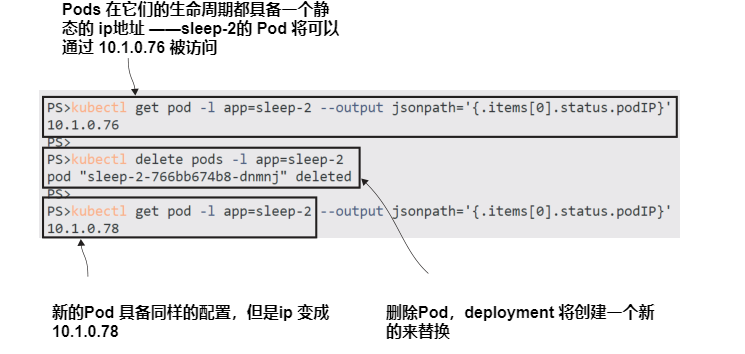

The problem of needing a permanent address for resources that can change is an old
one—the internet solved it using DNS (the Domain Name System), mapping friendly
names to IP addresses, and Kubernetes uses the same system. A Kubernetes cluster has
a DNS server built in, which maps Service names to IP addresses. Figure 3.3 shows how
a domain name lookup works for Pod-to-Pod communication.

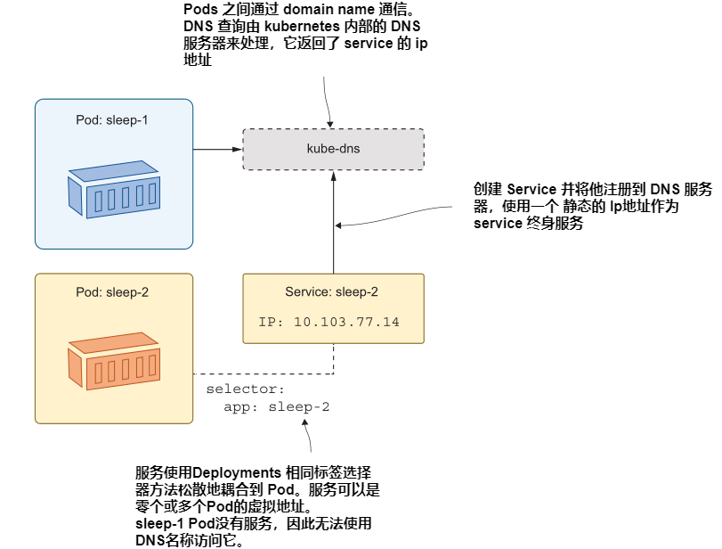

This type of Service is an abstraction over a Pod and its network address, just like a
Deployment is an abstraction over a Pod and its container. The Service has its own
IP address, which is static. When consumers make a network request to that address,
Kubernetes routes it to the actual IP address of the Pod. The link between the Service and its Pods is set up with a label selector, just like the link between Deployments and Pods. 
 
 Listing 3.1 shows the minimal YAML specification for a Service, using the app label
to identify the Pod which is the ultimate target of the network traffic.

> Listing 3.1 sleep2-service.yaml, the simplest Service definition
```
apiVersion: v1 # Services use the core v1 API.
kind: Service
metadata:
  name: sleep-2 # The name of a Service is used as the DNS domain name.
# The specification requires a selector and a list of ports.
spec:
  selector:
    app: sleep-2 # Matches all Pods with an app label set to sleep-2.
  ports:
    - port: 80 # Listens on port 80 and sends to port 80 on the Pod
```

This Service definition works with one of the Deployments we have running from the
previous exercise. When you deploy it, Kubernetes creates a DNS entry called sleep-2,
which routes traffic into the Pod created by the sleep-2 Deployment. Other Pods can
send traffic to that Pod using the Service name as the domain name.

TRY IT NOW You deploy a Service using a YAML file and the usual kubectl
apply command. Deploy the Service, and verify the network traffic is routed
to the Pod.

```
# deploy the Service defined in listing 3.1:
kubectl apply -f sleep/sleep2-service.yaml
# show the basic details of the Service:
kubectl get svc sleep-2
# run a ping command to check connectivity—this will fail:
kubectl exec deploy/sleep-1 -- ping -c 1 sleep-2
```
My output is shown in figure 3.4, where you can see that the name resolution worked
correctly, although the ping command didn’t work as expected because ping uses a
network protocol that isn’t supported in Kubernetes Services.

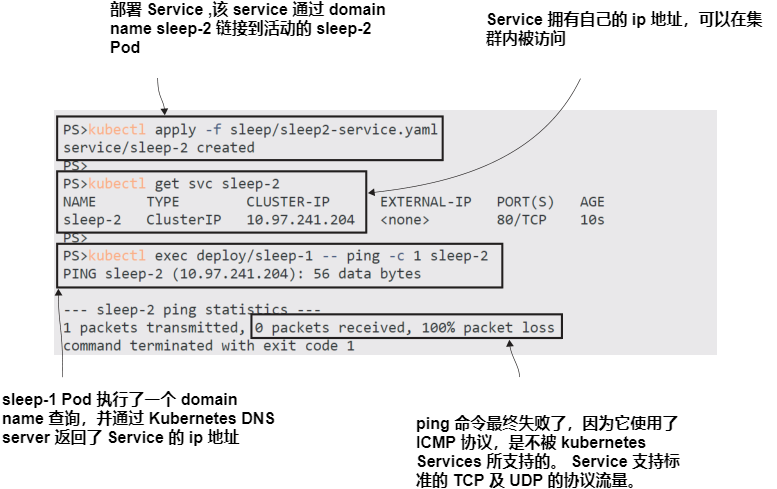

That’s the basic concept behind Service discovery in Kubernetes: deploy a Service
resource and use the name of the Service as the domain name for components to
communicate. 

 Different types of Service support different networking patterns, but you work with
them all in the same way. Next, we’ll look more closely at Pod-to-Pod networking, with
a working example of a simple distributed app.

## 3.2 在 Pods 间路由流量

The default type of Service in Kubernetes is called ClusterIP. It creates a clusterwide
IP address that Pods on any node can access. The IP address works only within the
cluster, so ClusterIP Services are useful only for communicating between Pods. That’s
exactly what you want for a distributed system where some components are internal
and shouldn’t be accessible outside of the cluster. We’ll use a simple website that uses
an internal API component to demonstrate that.

TRY IT NOW Run two Deployments, one for the web application and one for
the API. This app has no Services yet, and it won’t work correctly because the
website can’t find the API.

```
# run the website and API as separate Deployments: 
kubectl apply -f numbers/api.yaml -f numbers/web.yaml
# wait for the Pod to be ready:
kubectl wait --for=condition=Ready pod -l app=numbers-web
# forward a port to the web app:
kubectl port-forward deploy/numbers-web 8080:80
# browse to the site at http://localhost:8080 and click the Go button
# —you'll see an error message
# exit the port forward:
ctrl-c
```

You can see from my output shown in figure 3.5 that the app fails with a message stating the API is unavailable.
 
 The error page also shows the domain name where the site is expecting to find the
API—http:/ /numbers-api. That’s not a fully qualified domain name (like blog.sixeyed
.com); it’s an address that should be resolved by the local network, but the DNS server
in Kubernetes doesn’t resolve it because there is no Service with the name numbersapi. The specification in listing 3.2 shows a Service with the correct name and a label
selector that matches the API Pod.

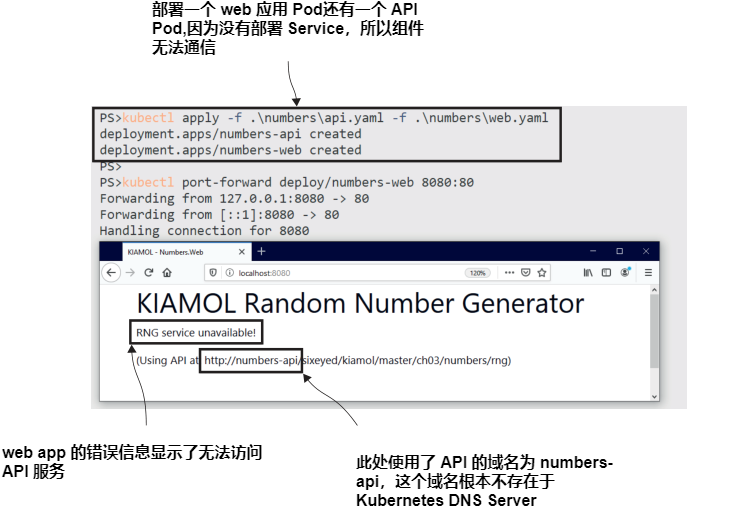

> Listing 3.2  api-service.yaml, a Service for the random-number API
```
apiVersion: v1
kind: Service
metadata:
  name: numbers-api # The Service uses the domain name numbers-api.
spec:
  ports:
    - port: 80
  selector:
    app: numbers-api # Traffic is routed to Pods with this label.
  type: ClusterIP # This Service is available only to other Pods.
```
This Service is similar to that in listing 3.1, except that the names have changed and
the Service type of ClusterIP is explicitly stated. That can be omitted because it’s the
default Service type, but I think it makes the spec clearer if you include it. Deploying
the Service will route the traffic between the web Pod and the API Pod, fixing the app
without any changes to the Deployments or Pods.

TRY IT NOW Create a Service for the API so the domain lookup works and
traffic is sent from the web Pod to the API Pod.

```
# deploy the Service from listing 3.2:
kubectl apply -f numbers/api-service.yaml
# check the Service details:
kubectl get svc numbers-api
# forward a port to the web app:
kubectl port-forward deploy/numbers-web 8080:80
# browse to the site at http://localhost:8080 and click the Go button
# exit the port forward:
ctrl-c
```
My output, shown in figure 3.6, shows the app working correctly, with the website displaying a random-number generated by the API.

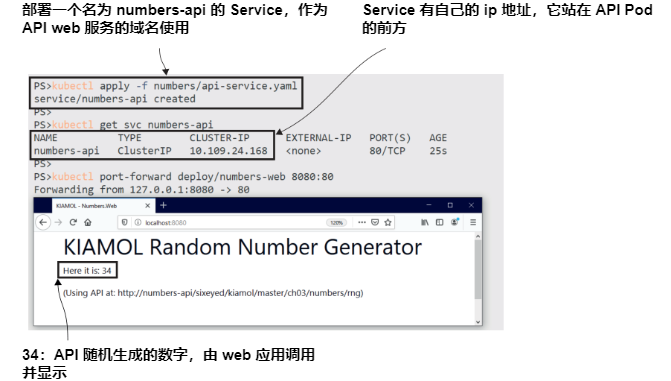

The important lesson here, beyond Services, Deployments, and Pods, is that your
YAML specifications describe your whole application in Kubernetes—that’s all the
components and the networking between them. Kubernetes doesn’t make assumptions about your application architecture; you need to specify it in the YAML. This
simple web app needs three Kubernetes resources defined for it to work in its current
state—two Deployments and a Service—but the advantage of having all these moving
parts is increased resilience.

TRY IT NOW The API Pod is managed by a Deployment controller, so you can
delete the Pod and a replacement will be created. The replacement is also a
match for the label selector in the API Service, so traffic is routed to the new
Pod, and the app keeps working.

```
# check the name and IP address of the API Pod:
kubectl get pod -l app=numbers-api -o custom-columns=NAME:metadata.name,POD_IP:status.podIP
# delete that Pod:
kubectl delete pod -l app=numbers-api
# check the replacement Pod:
kubectl get pod -l app=numbers-api -o custom-columns=NAME:metadata.name,POD_IP:status.podIP 
# forward a port to the web app:
kubectl port-forward deploy/numbers-web 8080:80
# browse to the site at http://localhost:8080 and click the Go button
# exit the port forward:
ctrl-c
```

Figure 3.7 shows that a replacement Pod is created by the Deployment controller. It’s
the same API Pod spec but running in a new Pod with a new IP address. The IP
address of the API Service hasn’t changed, though, and the web Pod can reach the
new API Pod at the same network address.

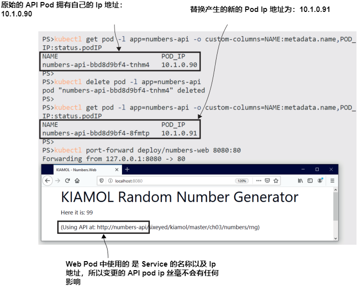

We’re manually deleting Pods in these exercises to trigger the controller to create a
replacement, but in the normal life cycle of a Kubernetes application, Pod replacement happens all the time. Anytime you update a component of your app—to add
features, fix bugs, or release an update to a dependency—you’re replacing Pods. Any
time a node goes down, its Pods are replaced on other nodes. The Service abstraction
keeps apps communicating through these replacements.

 This demo app isn’t complete yet because it doesn’t have anything configured to
receive traffic from outside the cluster and send it in to the web Pod. We’ve used port
forwarding so far, but that’s really a trick for debugging. The real solution is to deploy
a Service for the web Pod, too.

## 3.3 路由外部流量到 Pods

You have several options to configure Kubernetes to listen for traffic coming into the
cluster and forward it to a Pod. We’ll start with a simple and flexible approach, which
is fine for everything from local development to production. It’s a type of a Service
called LoadBalancer, which solves the problem of getting traffic to a Pod that might
be running on a different node from the one that received the traffic; figure 3.8 shows
how it looks.

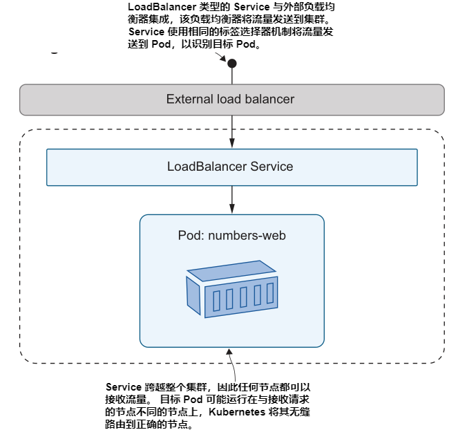

It looks like a tricky problem, especially because you might have many Pods that
match the label selector for the Service, so the cluster needs to choose a node to
send the traffic to and then choose a Pod on that node. All that trickiness is taken
care of by Kubernetes—that’s world-class orchestration for you—so all you need to
do is deploy a LoadBalancer Service. Listing 3.3 shows the Service specification for
the web application.

> Listing 3.3 web-service.yaml, a LoadBalancer Service for external traffic
```
apiVersion: v1
kind: Service
metadata:
  name: numbers-web
spec:
  ports:
    - port: 8080 # The port the Service listens on
      targetPort: 80 # The port the traffic is sent to on the Pod
  selector:
    app: numbers-web
  type: LoadBalancer # This Service is available for external traffic.
```

This Service listens on port 8080 and sends traffic to the web Pod on port 80. When
you deploy it, you’ll be able to use the web app without setting up a port forward in
kubectl, but the exact details of how you reach the app will depend on how you’re
running Kubernetes.

TRY IT NOW Deploy the Service, and then use kubectl to find the address of
the Service.

```
# deploy the LoadBalancer Service for the website—if your firewall checks
# that you want to allow traffic, then it is OK to say yes:
kubectl apply -f numbers/web-service.yaml
# check the details of the Service:
kubectl get svc numbers-web
# use formatting to get the app URL from the EXTERNAL-IP field:
kubectl get svc numbers-web -o
    jsonpath=’http://{.status.loadBalancer.ingress[0].*}:8080’
```

Figure 3.9 shows my output from running the exercise on my Docker Desktop Kuber-
netes cluster, where I can browse to the website at the address http://localhost:8080.

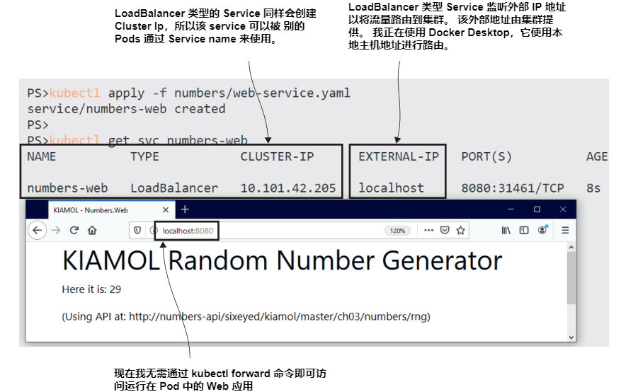

The output is different using K3s or a managed Kubernetes cluster in the cloud,
where the Service deployment creates a dedicated external IP address for the load
balancer. Figure 3.10 shows the output of the same exercise (using the same YAML
specifications) using the K3s cluster on my Linux VM—here the website is at http://
172.28.132.127:8080.

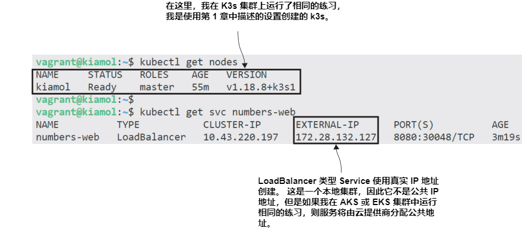

How can the results be different with the same application manifests? I said in
chapter 1 that you can deploy Kubernetes in different ways and it’s all the same Kubernetes
(my emphasis), but that’s not strictly true. Kubernetes contains a lot of extension
points, and distributions have flexibility in how they implement certain features.
LoadBalancer Services represent a good example of where implementations differ,
suited to the goals of the distribution.
- Docker Desktop is a local development environment. It runs on a single machine
and integrates with the network stack so LoadBalancer Services are available at
the localhost address. Every LoadBalancer Service publishes to localhost, so you’ll
need to use different ports if you deploy many load balancers.
- K3s supports LoadBalancer Services with a custom component that sets up rout-
ing tables on your machine. Every LoadBalancer Service publishes to the IP
address of your machine (or VM), so you can access Services with localhost or
from a remote machine on your network. Like Docker Desktop, you’ll need to
use different ports for each load balancer.
- Cloud Kubernetes platforms like AKS and EKS are highly available multinode
clusters. Deploying a Kubernetes LoadBalancer Service creates an actual load
balancer in your cloud, which spans all the nodes in your cluster—the cloud
load balancer sends incoming traffic to one of the nodes and then Kubernetes
routes it to a Pod. You’ll get a different IP address for each LoadBalancer Ser-
vice, and it will be a public address, accessible from the internet.

This is a pattern we’ll see again in other Kubernetes features where distributions have
different resources available and different aims. Ultimately, the YAML manifests are
the same and the end results are consistent, but Kubernetes allows distributions to
diverge in how they get there.

Back in the world of standard Kubernetes, there’s another Service type you can use
that listens for network traffic coming into the cluster and directs it to a Pod—the
NodePort. NodePort Services don’t require an external load balancer—every node in
the cluster listens on the port specified in the Service and sends traffic to the target
port on the Pod. Figure 3.11 shows how it works.


NodePort Services don’t have the flexibility of LoadBalancer Services because you
need a different port for each Service, your nodes need to be publicly accessible,
and you don’t achieve load-balancing across a multinode cluster. NodePort Services
also have different levels of support in the distributions, so they work as expected in
K3s and Docker Desktop but not so well in Kind. Listing 3.4 shows a NodePort spec
for reference.

> Listing 3.4 web-service-nodePort.yaml, a NodePort Service specification
```
apiVersion: v1
kind: Service
metadata:
  name: numbers-web-node
spec:
  ports:
    - port: 8080 # The port on which the Service is available to
                 # other Pods
      targetPort: 80 # The port on which the traffic is sent to on
      # the Pod
      nodePort: 30080 # The port on which the Service is available
                      # externally
  selector:
    app: numbers-web
  type: NodePort # This Service is available on node IP addresses.
```

There isn’t an exercise to deploy this NodePort Service (although the YAML file is in
the chapter’s folder if you want to try it out). This is partly because it doesn’t work in the
same way on every distribution, so this section would end with lots of if branches that
you’d need to try to make sense of. But there’s a more important reason—you don’t
typically use NodePorts in production, and it’s good to keep your manifests as consis-
tent as possible across different environments. Sticking with LoadBalancer Services
means you have the same specs from development up to production, which means
fewer YAML files to maintain and keep in sync.

We’ll finish this chapter by digging into how Services work under the hood, but
before that, we’ll look at one more way you can use Services, which is to communicate
from Pods to components outside of the cluster.


## 3.4 将流量路由到 Kubernetes 外面

You can run almost any server software in Kubernetes, but that doesn’t mean you
should. Storage components like databases are typical candidates for running outside
of Kubernetes, especially if you’re deploying to the cloud and you can use a managed
database service instead. Or you may be running in the datacenter and need to inte-
grate with existing systems that won’t be migrating to Kubernetes. Whatever architec-
ture you’re using, you can still use Kubernetes Services for domain name resolution to
components outside the cluster.

The first option for that is to use an ExternalName Service, which is like an alias
from one domain to another. ExternalName Services let you use local names in your
application Pods, and the DNS server in Kubernetes resolves the local name to a fully
qualified external name when the Pod makes a lookup request. Figure 3.12 shows how
that works, with a Pod using a local name that resolves to an external system address.

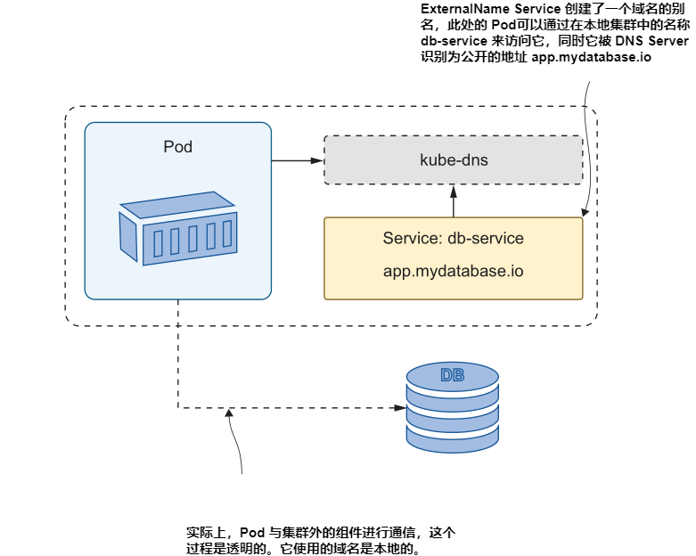

The demo app for this chapter expects to use a local API to generate random num-
bers, but it can be switched to read a static number from a text file on GitHub just by
deploying an ExternalName Service.

TRY IT NOW You can’t switch a Service from one type to another in every ver-
sion of Kubernetes, so you’ll need to delete the original ClusterIP Service for
the API before you can deploy the ExternalName Service.

```
# delete the current API Service:
kubectl delete svc numbers-api
# deploy a new ExternalName Service:
kubectl apply -f numbers-services/api-service-externalName.yaml
# check the Service configuration:
kubectl get svc numbers-api
# refresh the website in your browser and test with the Go button
```

My output is shown in figure 3.13. You can see the app works in the same way, and
it’s using the same URL for the API. If you refresh the page, however, you’ll find that
it always returns the same number because it’s not using the random-number API
anymore.

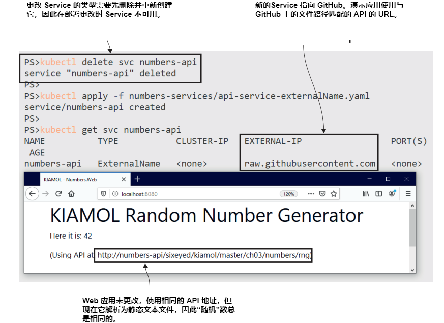

ExternalName Services can be a useful way to deal with differences between envi-
ronments that you can’t work around in your app configuration. Maybe you have an
app component that uses a hardcoded string for the name of the database server. In
development environments, you could create a ClusterIP Service with the expected
domain name, which resolves to a test database running in a Pod; in production
environments, you can use an ExternalName Service that resolves to the real domain
name of the database server. Listing 3.5 shows the YAML spec for the API external
name.

> Listing 3.5 api-service-externalName.yaml, an ExternalName Service
```
apiVersion: v1
kind: Service
metadata:
  name: numbers-api # The local domain name of the Service in the cluster
spec:
  type: ExternalName
  externalName: raw.githubusercontent.com # The domain to resolve
```
Kubernetes implements ExternalName Services using a standard feature of DNS—
canonical names (CNAMEs). When the web Pod makes a DNS lookup for the numbers-
api domain name, the Kubernetes DNS server returns with the CNAME, which is
raw.githubusercontent.com. Then the DNS resolution continues using the DNS
server configured on the node, so it will reach out to the internet to find the IP
address of the GitHub servers.

TRY IT NOW Services are part of the clusterwide Kubernetes Pod network, so
any Pod can use a Service. The sleep Pods from the first exercise in this chap-
ter have a DNS lookup command in the container image, which you can use to
check the resolution of the API Service.

```
# run the DNS lookup tool to resolve the Service name:
kubectl exec deploy/sleep-1 -- sh -c ’nslookup numbers-api | tail -n 5’
```

When you try this, you may get scrambled results that look like errors, because the
Nslookup tool returns a lot of information and it’s not in the same order every time
you run it. The data you want is in there, though. I repeated the command a few times
to get the fit-for-print output you see in figure 3.14.

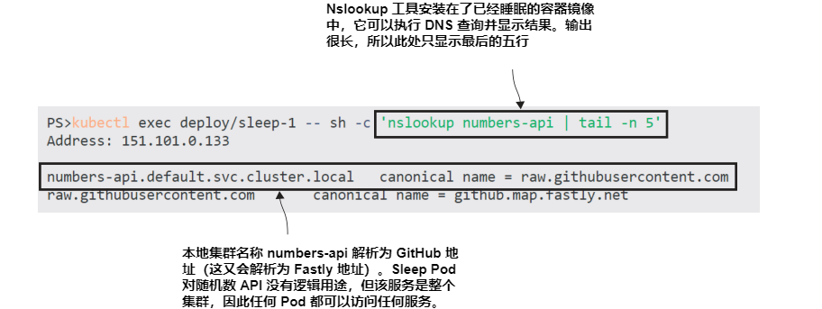

There’s one important thing to understand about ExternalName Services, which you
can see from this exercise: they ultimately just give your app an address to use, but
they don’t actually change the requests your application makes. That’s fine for compo-
nents like databases, which communicate over TCP, but it’s not so simple for HTTP
services. HTTP requests include the target host name in a header field, and that won’t
match the actual domain from the ExternalName response, so the client call will
probably fail. The random-number app in this chapter has some hacky code to get
around this issue, manually setting the host header, but this approach is best for non-
HTTP services.

There’s one other option for routing local domain names in the cluster to external
systems. It doesn’t fix the HTTP header issue, but it does let you use a similar
approach to ExternalName Services when you want to route to an IP address rather
than a domain name. These are headless Services, which are defined as a ClusterIP Service
type but without a label selector so they will never match any Pods. Instead, the service
is deployed with an endpoint resource that explicitly lists the IP addresses the Service
should resolve.

Listing 3.6 shows a headless Service with a single IP address in the endpoint. It also
shows a new use of YAML, with multiple resources defined, separated by three dashes.

> Listing 3.6 api-service-headless.yaml, a Service with explicit addresses
```
apiVersion: v1
kind: Service
metadata:
  name: numbers-api
spec:
  type: ClusterIP # No selector field makes this a headless Service.
  ports:
    - port: 80
---
kind: Endpoints # The endpoint is a separate resource.
apiVersion: v1
metadata:
  name: numbers-api
subsets:
  - addresses: # It has a static list of IP addresses . . .
    - ip: 192.168.123.234
    ports:
      - port: 80 # and the ports they listen on.
```

The IP address in that endpoint specification is a fake one, but Kubernetes doesn’t
validate that the address is reachable, so this code will deploy without errors.

TRY IT NOW Replace the ExternalName Service with this headless Service. It
will cause the app to fail because the API domain name now resolves to an
inaccessible IP address.

```
# remove the existing Service:
kubectl delete svc numbers-api
# deploy the headless Service:
kubectl apply -f numbers-services/api-service-headless.yaml
# check the Service:
kubectl get svc numbers-api
# check the endpoint:
kubectl get endpoints numbers-api
# verify the DNS lookup:
kubectl exec deploy/sleep-1 -- sh -c ’nslookup numbers-api | grep
    "^[^*]"’
# browse to the app—it will fail when you try to get a number
```
My output, shown in figure 3.15, confirms that Kubernetes will happily let you deploy
a Service change that breaks your application. The domain name resolves the internal
cluster IP address, but any network calls to that address fail because they are routed to
the actual IP address in the endpoint that doesn’t exist.

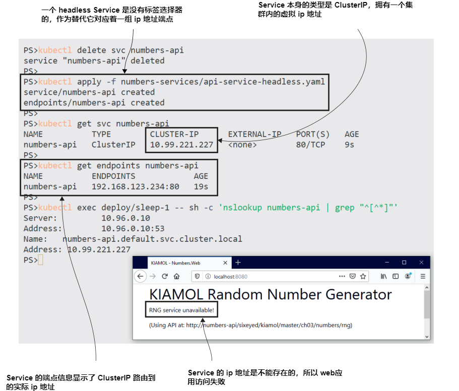

The output from that exercise raises a couple of interesting questions: How come the
DNS lookup returns the cluster IP address instead of the endpoint address? Why does
the domain name end with .default.svc.cluster.local? You don’t need a background in
network engineering to work with Kubernetes Services, but it will help you track down
issues if you understand how Service resolution actually works—and that’s how we’ll
finish the chapter.

## 3.5 理解 Kubernetes Service 解析

Kubernetes supports all the network configurations your app is likely to need using
Services, which build on established networking technologies. Application components run in Pods and communicate with other Pods using standard transfer protocols and DNS names for discovery. You don’t need any special code or libraries; your
apps work in the same way in Kubernetes as if you deployed them on physical servers
or VMs.

We’ve covered all the Service types and their typical use cases in this chapter, so
now you have a good understanding of the patterns you can use. If you’re feeling that
there’s an awful lot of detail here, be assured that the majority of times you’ll be
deploying ClusterIP Services, which require little configuration. They mostly work
seamlessly, but it is useful to go one level deeper to understand the stack. Figure 3.16
shows that next level of detail.

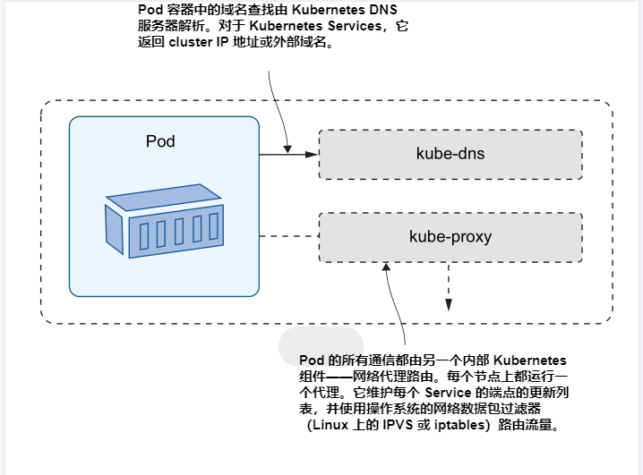

The key takeaway is that the ClusterIP is a virtual IP address that doesn’t exist on the
network. Pods access the network through the kube-proxy running on the node, and
that uses packet filtering to send the virtual IP to the real endpoint. Kubernetes Services
keep their IP addresses as long as they exist, and Services can exist independently of any
other parts of your app. Services have a controller that keeps the endpoint list updated
whenever there are changes to Pods, so clients always use the static virtual IP address and
the kube-proxy always has the up-to-date endpoint list.

TRY IT NOW You can see how Kubernetes keeps the endpoint list immediately
updated when Pods change by listing the endpoints for a Service between Pod
changes. Endpoints use the same name as Services, and you can view end-
point details using kubectl.

```
# show the endpoints for the sleep-2 Service:
kubectl get endpoints sleep-2
# delete the Pod:
kubectl delete pods -l app=sleep-2
# check the endpoint is updated with the IP of the replacement Pod:
kubectl get endpoints sleep-2
# delete the whole Deployment:
kubectl delete deploy sleep-2
# check the endpoint still exists, with no IP addresses:
kubectl get endpoints sleep-2
```

You can see my output in figure 3.17, and it’s the answer to the first question—
Kubernetes DNS returns the cluster IP address and not the endpoint, because end-
point addresses change.

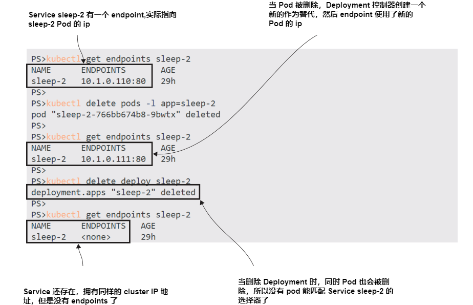

Using a static virtual IP means clients can cache the DNS lookup response indefinitely
(which many apps do as misguided performance-saving), and that IP address will continue to work no matter how many Pod replacements occur over time. The second
question—about the domain name suffix—needs to be answered with a sideways step
to look at Kubernetes namespaces.

Every Kubernetes resource lives inside a namespace, which is a resource you can
use to group other resources. Namespaces are a way to logically partition a Kubernetes
cluster—you could have one namespace per product, one per team, or a single shared
namespace. We won’t use namespaces for a while yet, but I’m introducing them here
because they have a part to play in DNS resolution. Figure 3.18 shows where the namespace comes into the Service name.

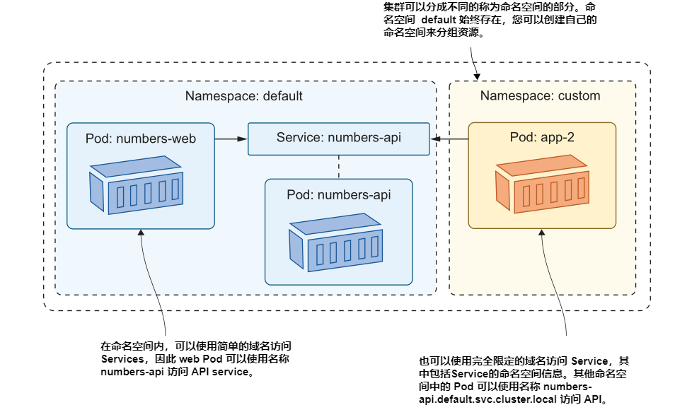

You already have several namespaces in your cluster—all the resources we’ve deployed
so far have been created in the default namespace (which is the default; that’s why
we haven’t needed to specify a namespace in our YAML files). Internal Kubernetes
components like the DNS server and the Kubernetes API also run in Pods in the
kube-system namespace.

TRY IT NOW
Kubectl is namespace-aware—you can use the namespace flag to
work with resources outside of the default namespace.

```
# check the Services in the default namespace:
kubectl get svc --namespace default
# check Services in the system namespace:
kubectl get svc -n kube-system
# try a DNS lookup to a fully qualified Service name:
kubectl exec deploy/sleep-1 -- sh -c 'nslookup numbers-
  api.default.svc.cluster.local | grep "^[^*]"'
# and for a Service in the system namespace:
kubectl exec deploy/sleep-1 -- sh -c 'nslookup kube-dns.kube-
  system.svc.cluster.local | grep "^[^*]"'
```

My output, shown in figure 3.19, answers the second question—the local domain
name for a Service is just the Service name, but that’s an alias for the fully qualified
domain name that includes the Kubernetes namespace.

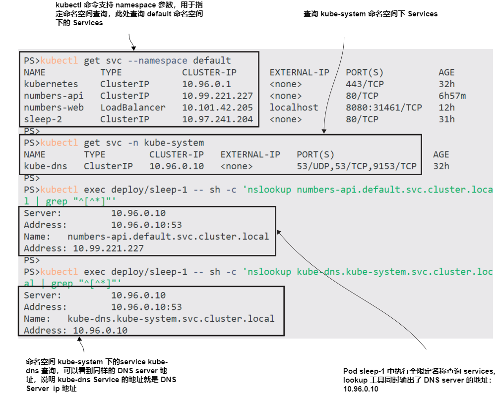

It’s important to know about namespaces early in your Kubernetes journey, if only
because it helps you see that core Kubernetes features run as Kubernetes applications
too, but you don’t see them in kubectl unless you explicitly set the namespace. Namespaces are a powerful way to subdivide your cluster to increase utilization without
compromising security, and we’ll return to them in chapter 11.

For now we’re done with namespaces and Services. In this chapter, you’ve learned
that every Pod has its own IP address, and Pod communication ultimately uses that
address with standard TCP and UDP protocols. You never use the Pod IP address
directly, though—you always create a Service resource, which Kubernetes uses to provide Service discovery with DNS. Services support multiple networking patterns, with
different Service types configuring network traffic between Pods, into Pods from the
outside world, and from Pods to the world outside. You also learned that Services have
their own life cycle, independent of Pods and Deployments, so the last thing to do is
clean up before we move on.

TRY IT NOW Deleting a Deployment also deletes all its Pods, but there’s no
cascading delete for Services. They’re independent objects that need to be
removed separately.
```
# delete Deployments:
kubectl delete deploy --all
# and Services:
kubectl delete svc --all
# check what’s running:
kubectl get all
```

Now your cluster is clear again, although, as you can see in figure 3.20, you need to be
careful with some of these kubectl commands.

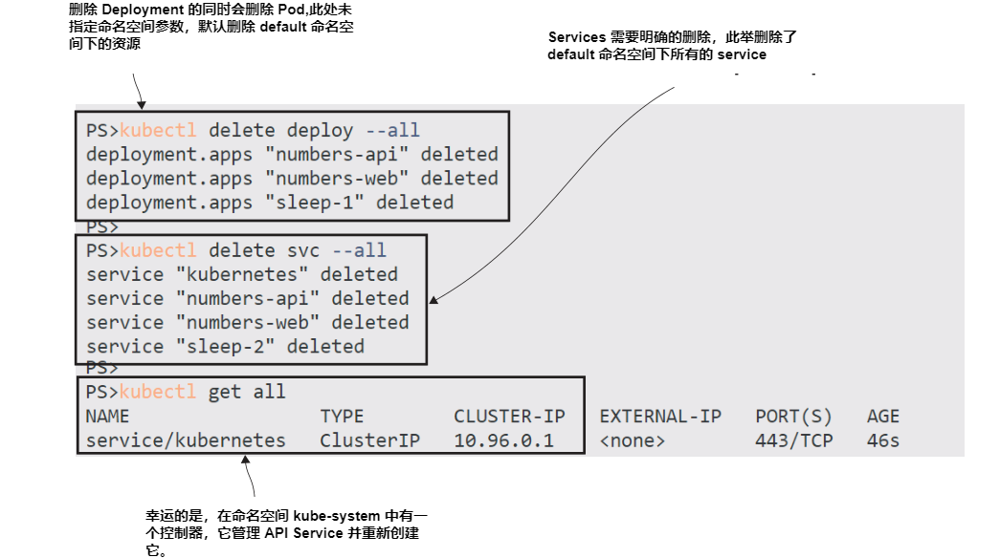

## 3.6 实验室

This lab is going to give you some practice creating Services, but it’s also going to get
you thinking about labels and selectors, which are powerful features of Kubernetes.
The goal is to deploy Services for an updated version of the random-number app,
which has had a UI makeover. Here are your hints:
- The lab folder for this chapter has a deployments.yaml file. Use that to deploy
the app with kubectl.
- Check the Pods—there are two versions of the web application running.
- Write a Service that will make the API available to other Pods at the domain
name numbers-api.
- Write a Service that will make version 2 of the website available externally, on
port 8088.
- You’ll need to look closely at the Pod labels to get the correct result.

This lab is an extension of the exercises in the chapter, and if you want to check my
solution, it’s up on GitHub in the repository for the book: https://github.com/sixeyed/
kiamol/blob/master/ch03/lab/README.md.