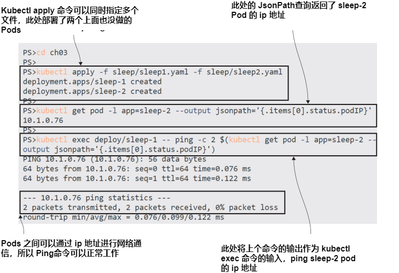
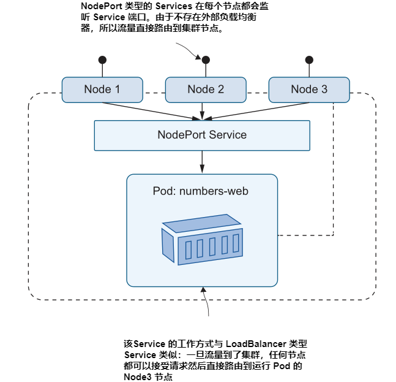

# 第三章 通过 Service 网络连接 Pods

Pods 是 Kubernetes 中运行的应用程序的基本构建块。大多数应用是跨多组件分布式运行的，你通过在 kubernetes 中模式化pods 来对应每个组件。例如，你可能有一个 web 站点 Pod 以及一个 API Pod，或者你有一打微服务架构的 Pods。它们之间需要通信，kubernetes 支持标准的网络协议，tcp 以及 UDP，它们都通过 IP 地址来路由流量，但是当 Pods 被替换之后 IP 就变了，所以 Kubernetes 通过 Services 对象来提供网络地址发现机制。
 
Services 是支持 Pods 之间路由流量的灵活资源，可实现路由集群外的流量到 Pods 中，以及 Pods 到外部系统的流量。在本章，您将了解 Kubernetes 为将系统粘合在一起提供的所有不同 Service 配置, 你将会明白它们是如何透明地为你的应用程序工作的。

## 3.1 Kubernetes 如何路由网络流量

在前一章，你学到了两个关于 Pods 的重点：一个 Pod 一个拥有 Kubernetes 指定的 IP 地址的虚拟环境，以及 Pods 的生命周期是可以被其它类型资源自由控制的。如果一个 Pod 想要和其它 Pod 通信，可以使用 Ip 地址。然而这么干是有问题的，两个原因：第一，当 Pod 被替换时 Ip 会改变，第二，查找 Pod 的IP地址没有简单的方法，只能通过 Kubernetes API。

<b>现在就试试</b> 如果你部署了两个 Pods，你可以由其中一个 Ping 另外一个，前提是需要知道 IP 地址。

```
# 启动你的实验环境— 运行 Docker Desktop ，然后进入本章的源码目录:
cd ch03
# 创建两个 Deployments, 它们每一个都运行了一个 Pod:
kubectl apply -f sleep/sleep1.yaml -f sleep/sleep2.yaml
# 等待 Pod 到达 ready 状态:
kubectl wait --for=condition=Ready pod -l app=sleep-2
# 检查第二个 Pod 的 Ip 地址:
kubectl get pod -l app=sleep-2 --output 
    jsonpath='{.items[0].status.podIP}'
# 使用返回的 ip 地址，在 第一个 Pod ping 该 ip 地址:
kubectl exec deploy/sleep-1 -- ping -c 2 $(kubectl get pod -l app=sleep-2 
    --output jsonpath='{.items[0].status.podIP}')
```

我的输出如图 3.1 所示. 容器中的 Ping 工作的很好, 第一个 Pod 成功 ping 通第二个 Pod, 前提是我必须使用 kubectl 获取ip地址，并作为 ping命令的入参。



Kubernetes 中的虚拟网络覆盖整个集群，因此 Pods 即使在不同的节点上运行，也可以通过IP地址进行通信。此示例在单节点 K3s 集群和 100 节点AKS集群上的工作方式相同。这是一个有用的练习，可以帮助您了解Kubernetes没有任何特殊的网络魔力；它只是使用你的应用程序已经使用的标准协议。但是您通常不会这样做，因为IP地址是特定于一个Pod的，并且当Pod被替换时，替换将具有新的IP地址。

<b>现在就试试</b> 这些 Pods 由 Deployment 控制器管理。如果您删除了第二个Pod，它的控制器将开始使用新的IP地址进行 POD 替换。

```
# 检查当前 Pod 的 IP 地址:
kubectl get pod -l app=sleep-2 --output 
    jsonpath='{.items[0].status.podIP}'
# 删除 pod，deployment 将替换创建新的 pod:
kubectl delete pods -l app=sleep-2
# 检查替换产生的 POD ip:
kubectl get pod -l app=sleep-2 --output 
    jsonpath='{.items[0].status.podIP}'
```

在图 3.2, 我的输出显示了新的 POD 拥有了新的 IP 地址，如果你 ping 旧的地址，将会失败。


需要一个可以更改的资源的永久地址的问题是一个老问题，互联网使用DNS（域名系统）解决了这个问题，将友好名称映射到IP地址，Kubernetes使用相同的系统。Kubernetes集群内置了DNS服务器，它将服务名称映射到IP地址。图3.3显示了域名查找如何用于Pod-to-Pod通信。


这种类型的 Service 是对Pod及其网络地址的抽象，就像 Deployment 是对Pod及其容器的抽象一样。Service 有自己的IP地址，它是静态的。当消费者向该地址发出网络请求时，Kubernetes将其路由到Pod的实际IP地址。Service 和它的Pod之间的链接是用标签选择器设置的，就像Deployments和Pods之间的链接一样。

 清单 3.1 显示了 Service 的最小YAML规范，使用 app 标签标识Pod，Pod是网络流量的最终目标。

> 清单 3.1 sleep2-service.yaml, 最简单的 Service 定义
```
apiVersion: v1 
kind: Service
metadata:
  name: sleep-2 # Service 的名称用作DNS域名
# 该spec 配置需要一个选择器和一个端口列表。
spec:
  selector:
    app: sleep-2 # 匹配所有 app 标签值为 sleep-2 的 pods
  ports:
    - port: 80 # 监听端口 80 并发送到 Pod 上的端口80
```

此 Service 定义适用于我们在上一练习中运行的一个 Deployments。当您部署它时，Kubernetes会创建一个名为sleep-2的DNS条目，将流量路由到sleep-2 Deployment 创建的Pod中。其他Pod可以使用 Service 名称作为域名向该Pod发送流量。

<b>现在就试试</b> 使用 YAML 文件和通常的kubectl apply命令部署 Service，并验证网络流量是否路由到Pod。

```
# 部署清单 3.1 中的 Service :
kubectl apply -f sleep/sleep2-service.yaml
# 查看 service 基本信息:
kubectl get svc sleep-2
# 运行 ping 命令检查连通性—这将会失败:
kubectl exec deploy/sleep-1 -- ping -c 1 sleep-2
```
我的输出如图 3.4 所示, 你可以看到名称查找正常, ping命令没有按预期工作，因为ping使用的是Kubernetes Services不支持的网络协议。


这是Kubernetes中服务发现背后的基本概念：部署Service 资源，并使用 Service 名称作为组件通信的域名。

不同类型的 Service 支持不同的网络模式，但您可以以相同的方式使用它们。接下来，我们将通过一个简单的分布式应用程序的工作示例，更深入地研究Pod到Pod的网络。

## 3.2 在 Pods 间路由流量

Kubernetes 中的默认 Service 类型称为ClusterIP。它创建了一个集群范围的IP地址，任何节点上的Pods都可以访问该地址。IP地址仅在集群内工作，因此ClusterIP Service 仅用于Pod之间的通信。这正是您想要的分布式系统，其中一些组件是内部的，不应该在集群外部访问。我们将使用一个使用内部API组件的简单网站来演示这一点。

<b>现在就试试</b> 运行两个Deployments，一个用于web应用程序，另一个用于API。此应用程序还没有 Service ，无法正常工作，因为 Web 网站找不到API。

```
# 部署两个分类的 deployment : 
kubectl apply -f numbers/api.yaml -f numbers/web.yaml
# 等待 Pod ready:
kubectl wait --for=condition=Ready pod -l app=numbers-web
# 转发端口到 web app:
kubectl port-forward deploy/numbers-web 8080:80
# 访问网站 http://localhost:8080 然后点击 Go 按钮
# —你将会看到错误消息
# 退出端口转发:
ctrl-c
```

您可以从图3.5所示的输出中看到，应用程序失败，并显示一条消息，说明API不可用。


错误页面还显示了站点希望在其中查找API http://numbers-api 的域名。这不是一个完全限定的域名（比如blog.sixeed.com）；这是一个应该由本地网络解析的地址，但Kubernetes中的DNS服务器无法解析它，因为没有名称为numbersapi的Service。清单3.2中的配置显示了一个名称正确的Service，以及一个与API Pod匹配的标签选择器。

> 清单 3.2  api-service.yaml
```
apiVersion: v1
kind: Service
metadata:
  name: numbers-api # Service 使用域名 numbers-api.
spec:
  ports:
    - port: 80
  selector:
    app: numbers-api # 流量被路由到带有此标签的Pods.
  type: ClusterIP # 此Services 仅适用于其他Pod 通信.
```

此 Service 与清单3.1中的 Service 类似，只是名称已更改，并且明确说明了ClusterIP的服务类型。这可以省略，因为它是默认的服务类型，但我认为如果包含它，它会使配置更清晰，Service 将在web Pod和API Pod之间路由流量，在不更改 Deployment 或 Pod的情况下修复应用程序。

<b>现在就试试</b> 为 API 创建一个 Service，以便域查找可以正常工作，并将流量从web Pod发送到API Pod。

```
# 部署清单 3.2 中的 Service:
kubectl apply -f numbers/api-service.yaml
# 查看Service 信息:
kubectl get svc numbers-api
# 转发端口到 web app:
kubectl port-forward deploy/numbers-web 8080:80
# 访问 http://localhost:8080 然后点击 Go 按钮
# 退出端口转发:
ctrl-c
```
我的输出如图3.6所示，显示了应用程序正常工作，网站显示了API生成的随机数。


除了 Services、Deployments 和Pods之外，这里的重要教训是，YAML 规范描述了Kubernetes中的整个应用程序，包括所有组件和它们之间的网络。Kubernetes不会对应用程序架构进行假设；您需要在YAML中指定它。这个简单的web应用程序需要定义三个Kubernetes资源，以便在当前状态下工作—两个Deployments和一个Service—但拥有所有这些移动部件的优势是增加了弹性。

<b>现在就试试</b> API Pod由 Deployment 控制器管理，因此您可以删除Pod并创建替换。该替换也与API服务中的标签选择器相匹配，因此流量被路由到新的Pod，应用程序继续工作。

```
# 检查 API Pod 的名字和 ip 地址:
kubectl get pod -l app=numbers-api -o custom-columns=NAME:metadata.name,POD_IP:status.podIP
# 删除 Pod:
kubectl delete pod -l app=numbers-api
# 检查替换的 Pod:
kubectl get pod -l app=numbers-api -o custom-columns=NAME:metadata.name,POD_IP:status.podIP 
# 转发端口到 web app:
kubectl port-forward deploy/numbers-web 8080:80
# 访问 http://localhost:8080 然后点击 Go 按钮
# 退出端口转发:
ctrl-c
```

图3.7显示了 Deployment 控制器创建的替换Pod。它是相同的API Pod规范，但在具有新IP地址的新Pod中运行。不过，API Service的IP地址没有改变，web Pod可以在相同的网络地址到达新的API Pod。


我们在这些练习中手动删除Pod，以触发控制器创建替换，但在Kubernetes应用程序的正常生命周期中，Pod替换总是发生。每当您更新应用程序的组件以添加功能、修复错误或发布对依赖项的更新时，您都将替换Pods。每当一个节点宕机时，它的Pod就会在其他节点上被替换。Service 抽象以通过这些替换保持应用程序的通信。

这个演示应用程序还没有完成，因为它没有任何配置来从集群外部接收流量并将其发送到web Pod。到目前为止，我们已经使用了端口转发，但这确实是一个调试技巧。真正的解决方案是为web Pod部署 Service。

## 3.3 路由外部流量到 Pods

You have several options to configure Kubernetes to listen for traffic coming into the
cluster and forward it to a Pod. We’ll start with a simple and flexible approach, which
is fine for everything from local development to production. It’s a type of a Service
called LoadBalancer, which solves the problem of getting traffic to a Pod that might
be running on a different node from the one that received the traffic; figure 3.8 shows
how it looks.


It looks like a tricky problem, especially because you might have many Pods that
match the label selector for the Service, so the cluster needs to choose a node to
send the traffic to and then choose a Pod on that node. All that trickiness is taken
care of by Kubernetes—that’s world-class orchestration for you—so all you need to
do is deploy a LoadBalancer Service. Listing 3.3 shows the Service specification for
the web application.

> Listing 3.3 web-service.yaml, a LoadBalancer Service for external traffic
```
apiVersion: v1
kind: Service
metadata:
  name: numbers-web
spec:
  ports:
    - port: 8080 # The port the Service listens on
      targetPort: 80 # The port the traffic is sent to on the Pod
  selector:
    app: numbers-web
  type: LoadBalancer # This Service is available for external traffic.
```

This Service listens on port 8080 and sends traffic to the web Pod on port 80. When
you deploy it, you’ll be able to use the web app without setting up a port forward in
kubectl, but the exact details of how you reach the app will depend on how you’re
running Kubernetes.

TRY IT NOW Deploy the Service, and then use kubectl to find the address of
the Service.

```
# deploy the LoadBalancer Service for the website—if your firewall checks
# that you want to allow traffic, then it is OK to say yes:
kubectl apply -f numbers/web-service.yaml
# check the details of the Service:
kubectl get svc numbers-web
# use formatting to get the app URL from the EXTERNAL-IP field:
kubectl get svc numbers-web -o
    jsonpath=’http://{.status.loadBalancer.ingress[0].*}:8080’
```

Figure 3.9 shows my output from running the exercise on my Docker Desktop Kuber-
netes cluster, where I can browse to the website at the address http://localhost:8080.


The output is different using K3s or a managed Kubernetes cluster in the cloud,
where the Service deployment creates a dedicated external IP address for the load
balancer. Figure 3.10 shows the output of the same exercise (using the same YAML
specifications) using the K3s cluster on my Linux VM—here the website is at http://
172.28.132.127:8080.


How can the results be different with the same application manifests? I said in
chapter 1 that you can deploy Kubernetes in different ways and it’s all the same Kubernetes
(my emphasis), but that’s not strictly true. Kubernetes contains a lot of extension
points, and distributions have flexibility in how they implement certain features.
LoadBalancer Services represent a good example of where implementations differ,
suited to the goals of the distribution.
- Docker Desktop is a local development environment. It runs on a single machine
and integrates with the network stack so LoadBalancer Services are available at
the localhost address. Every LoadBalancer Service publishes to localhost, so you’ll
need to use different ports if you deploy many load balancers.
- K3s supports LoadBalancer Services with a custom component that sets up rout-
ing tables on your machine. Every LoadBalancer Service publishes to the IP
address of your machine (or VM), so you can access Services with localhost or
from a remote machine on your network. Like Docker Desktop, you’ll need to
use different ports for each load balancer.
- Cloud Kubernetes platforms like AKS and EKS are highly available multinode
clusters. Deploying a Kubernetes LoadBalancer Service creates an actual load
balancer in your cloud, which spans all the nodes in your cluster—the cloud
load balancer sends incoming traffic to one of the nodes and then Kubernetes
routes it to a Pod. You’ll get a different IP address for each LoadBalancer Ser-
vice, and it will be a public address, accessible from the internet.

This is a pattern we’ll see again in other Kubernetes features where distributions have
different resources available and different aims. Ultimately, the YAML manifests are
the same and the end results are consistent, but Kubernetes allows distributions to
diverge in how they get there.

Back in the world of standard Kubernetes, there’s another Service type you can use
that listens for network traffic coming into the cluster and directs it to a Pod—the
NodePort. NodePort Services don’t require an external load balancer—every node in
the cluster listens on the port specified in the Service and sends traffic to the target
port on the Pod. Figure 3.11 shows how it works.



NodePort Services don’t have the flexibility of LoadBalancer Services because you
need a different port for each Service, your nodes need to be publicly accessible,
and you don’t achieve load-balancing across a multinode cluster. NodePort Services
also have different levels of support in the distributions, so they work as expected in
K3s and Docker Desktop but not so well in Kind. Listing 3.4 shows a NodePort spec
for reference.

> Listing 3.4 web-service-nodePort.yaml, a NodePort Service specification
```
apiVersion: v1
kind: Service
metadata:
  name: numbers-web-node
spec:
  ports:
    - port: 8080 # The port on which the Service is available to
                 # other Pods
      targetPort: 80 # The port on which the traffic is sent to on
      # the Pod
      nodePort: 30080 # The port on which the Service is available
                      # externally
  selector:
    app: numbers-web
  type: NodePort # This Service is available on node IP addresses.
```

There isn’t an exercise to deploy this NodePort Service (although the YAML file is in
the chapter’s folder if you want to try it out). This is partly because it doesn’t work in the
same way on every distribution, so this section would end with lots of if branches that
you’d need to try to make sense of. But there’s a more important reason—you don’t
typically use NodePorts in production, and it’s good to keep your manifests as consis-
tent as possible across different environments. Sticking with LoadBalancer Services
means you have the same specs from development up to production, which means
fewer YAML files to maintain and keep in sync.

We’ll finish this chapter by digging into how Services work under the hood, but
before that, we’ll look at one more way you can use Services, which is to communicate
from Pods to components outside of the cluster.


## 3.4 将流量路由到 Kubernetes 外面

You can run almost any server software in Kubernetes, but that doesn’t mean you
should. Storage components like databases are typical candidates for running outside
of Kubernetes, especially if you’re deploying to the cloud and you can use a managed
database service instead. Or you may be running in the datacenter and need to inte-
grate with existing systems that won’t be migrating to Kubernetes. Whatever architec-
ture you’re using, you can still use Kubernetes Services for domain name resolution to
components outside the cluster.

The first option for that is to use an ExternalName Service, which is like an alias
from one domain to another. ExternalName Services let you use local names in your
application Pods, and the DNS server in Kubernetes resolves the local name to a fully
qualified external name when the Pod makes a lookup request. Figure 3.12 shows how
that works, with a Pod using a local name that resolves to an external system address.


The demo app for this chapter expects to use a local API to generate random num-
bers, but it can be switched to read a static number from a text file on GitHub just by
deploying an ExternalName Service.

TRY IT NOW You can’t switch a Service from one type to another in every ver-
sion of Kubernetes, so you’ll need to delete the original ClusterIP Service for
the API before you can deploy the ExternalName Service.

```
# delete the current API Service:
kubectl delete svc numbers-api
# deploy a new ExternalName Service:
kubectl apply -f numbers-services/api-service-externalName.yaml
# check the Service configuration:
kubectl get svc numbers-api
# refresh the website in your browser and test with the Go button
```

My output is shown in figure 3.13. You can see the app works in the same way, and
it’s using the same URL for the API. If you refresh the page, however, you’ll find that
it always returns the same number because it’s not using the random-number API
anymore.


ExternalName Services can be a useful way to deal with differences between envi-
ronments that you can’t work around in your app configuration. Maybe you have an
app component that uses a hardcoded string for the name of the database server. In
development environments, you could create a ClusterIP Service with the expected
domain name, which resolves to a test database running in a Pod; in production
environments, you can use an ExternalName Service that resolves to the real domain
name of the database server. Listing 3.5 shows the YAML spec for the API external
name.

> Listing 3.5 api-service-externalName.yaml, an ExternalName Service
```
apiVersion: v1
kind: Service
metadata:
  name: numbers-api # The local domain name of the Service in the cluster
spec:
  type: ExternalName
  externalName: raw.githubusercontent.com # The domain to resolve
```
Kubernetes implements ExternalName Services using a standard feature of DNS—
canonical names (CNAMEs). When the web Pod makes a DNS lookup for the numbers-
api domain name, the Kubernetes DNS server returns with the CNAME, which is
raw.githubusercontent.com. Then the DNS resolution continues using the DNS
server configured on the node, so it will reach out to the internet to find the IP
address of the GitHub servers.

TRY IT NOW Services are part of the clusterwide Kubernetes Pod network, so
any Pod can use a Service. The sleep Pods from the first exercise in this chap-
ter have a DNS lookup command in the container image, which you can use to
check the resolution of the API Service.

```
# run the DNS lookup tool to resolve the Service name:
kubectl exec deploy/sleep-1 -- sh -c ’nslookup numbers-api | tail -n 5’
```

When you try this, you may get scrambled results that look like errors, because the
Nslookup tool returns a lot of information and it’s not in the same order every time
you run it. The data you want is in there, though. I repeated the command a few times
to get the fit-for-print output you see in figure 3.14.


There’s one important thing to understand about ExternalName Services, which you
can see from this exercise: they ultimately just give your app an address to use, but
they don’t actually change the requests your application makes. That’s fine for compo-
nents like databases, which communicate over TCP, but it’s not so simple for HTTP
services. HTTP requests include the target host name in a header field, and that won’t
match the actual domain from the ExternalName response, so the client call will
probably fail. The random-number app in this chapter has some hacky code to get
around this issue, manually setting the host header, but this approach is best for non-
HTTP services.

There’s one other option for routing local domain names in the cluster to external
systems. It doesn’t fix the HTTP header issue, but it does let you use a similar
approach to ExternalName Services when you want to route to an IP address rather
than a domain name. These are headless Services, which are defined as a ClusterIP Service
type but without a label selector so they will never match any Pods. Instead, the service
is deployed with an endpoint resource that explicitly lists the IP addresses the Service
should resolve.

Listing 3.6 shows a headless Service with a single IP address in the endpoint. It also
shows a new use of YAML, with multiple resources defined, separated by three dashes.

> Listing 3.6 api-service-headless.yaml, a Service with explicit addresses
```
apiVersion: v1
kind: Service
metadata:
  name: numbers-api
spec:
  type: ClusterIP # No selector field makes this a headless Service.
  ports:
    - port: 80
---
kind: Endpoints # The endpoint is a separate resource.
apiVersion: v1
metadata:
  name: numbers-api
subsets:
  - addresses: # It has a static list of IP addresses . . .
    - ip: 192.168.123.234
    ports:
      - port: 80 # and the ports they listen on.
```

The IP address in that endpoint specification is a fake one, but Kubernetes doesn’t
validate that the address is reachable, so this code will deploy without errors.

TRY IT NOW Replace the ExternalName Service with this headless Service. It
will cause the app to fail because the API domain name now resolves to an
inaccessible IP address.

```
# remove the existing Service:
kubectl delete svc numbers-api
# deploy the headless Service:
kubectl apply -f numbers-services/api-service-headless.yaml
# check the Service:
kubectl get svc numbers-api
# check the endpoint:
kubectl get endpoints numbers-api
# verify the DNS lookup:
kubectl exec deploy/sleep-1 -- sh -c ’nslookup numbers-api | grep
    "^[^*]"’
# browse to the app—it will fail when you try to get a number
```
My output, shown in figure 3.15, confirms that Kubernetes will happily let you deploy
a Service change that breaks your application. The domain name resolves the internal
cluster IP address, but any network calls to that address fail because they are routed to
the actual IP address in the endpoint that doesn’t exist.


The output from that exercise raises a couple of interesting questions: How come the
DNS lookup returns the cluster IP address instead of the endpoint address? Why does
the domain name end with .default.svc.cluster.local? You don’t need a background in
network engineering to work with Kubernetes Services, but it will help you track down
issues if you understand how Service resolution actually works—and that’s how we’ll
finish the chapter.

## 3.5 理解 Kubernetes Service 解析

Kubernetes supports all the network configurations your app is likely to need using
Services, which build on established networking technologies. Application components run in Pods and communicate with other Pods using standard transfer protocols and DNS names for discovery. You don’t need any special code or libraries; your
apps work in the same way in Kubernetes as if you deployed them on physical servers
or VMs.

We’ve covered all the Service types and their typical use cases in this chapter, so
now you have a good understanding of the patterns you can use. If you’re feeling that
there’s an awful lot of detail here, be assured that the majority of times you’ll be
deploying ClusterIP Services, which require little configuration. They mostly work
seamlessly, but it is useful to go one level deeper to understand the stack. Figure 3.16
shows that next level of detail.


The key takeaway is that the ClusterIP is a virtual IP address that doesn’t exist on the
network. Pods access the network through the kube-proxy running on the node, and
that uses packet filtering to send the virtual IP to the real endpoint. Kubernetes Services
keep their IP addresses as long as they exist, and Services can exist independently of any
other parts of your app. Services have a controller that keeps the endpoint list updated
whenever there are changes to Pods, so clients always use the static virtual IP address and
the kube-proxy always has the up-to-date endpoint list.

TRY IT NOW You can see how Kubernetes keeps the endpoint list immediately
updated when Pods change by listing the endpoints for a Service between Pod
changes. Endpoints use the same name as Services, and you can view end-
point details using kubectl.

```
# show the endpoints for the sleep-2 Service:
kubectl get endpoints sleep-2
# delete the Pod:
kubectl delete pods -l app=sleep-2
# check the endpoint is updated with the IP of the replacement Pod:
kubectl get endpoints sleep-2
# delete the whole Deployment:
kubectl delete deploy sleep-2
# check the endpoint still exists, with no IP addresses:
kubectl get endpoints sleep-2
```

You can see my output in figure 3.17, and it’s the answer to the first question—
Kubernetes DNS returns the cluster IP address and not the endpoint, because end-
point addresses change.


Using a static virtual IP means clients can cache the DNS lookup response indefinitely
(which many apps do as misguided performance-saving), and that IP address will continue to work no matter how many Pod replacements occur over time. The second
question—about the domain name suffix—needs to be answered with a sideways step
to look at Kubernetes namespaces.

Every Kubernetes resource lives inside a namespace, which is a resource you can
use to group other resources. Namespaces are a way to logically partition a Kubernetes
cluster—you could have one namespace per product, one per team, or a single shared
namespace. We won’t use namespaces for a while yet, but I’m introducing them here
because they have a part to play in DNS resolution. Figure 3.18 shows where the namespace comes into the Service name.


You already have several namespaces in your cluster—all the resources we’ve deployed
so far have been created in the default namespace (which is the default; that’s why
we haven’t needed to specify a namespace in our YAML files). Internal Kubernetes
components like the DNS server and the Kubernetes API also run in Pods in the
kube-system namespace.

TRY IT NOW
Kubectl is namespace-aware—you can use the namespace flag to
work with resources outside of the default namespace.

```
# check the Services in the default namespace:
kubectl get svc --namespace default
# check Services in the system namespace:
kubectl get svc -n kube-system
# try a DNS lookup to a fully qualified Service name:
kubectl exec deploy/sleep-1 -- sh -c 'nslookup numbers-
  api.default.svc.cluster.local | grep "^[^*]"'
# and for a Service in the system namespace:
kubectl exec deploy/sleep-1 -- sh -c 'nslookup kube-dns.kube-
  system.svc.cluster.local | grep "^[^*]"'
```

My output, shown in figure 3.19, answers the second question—the local domain
name for a Service is just the Service name, but that’s an alias for the fully qualified
domain name that includes the Kubernetes namespace.


It’s important to know about namespaces early in your Kubernetes journey, if only
because it helps you see that core Kubernetes features run as Kubernetes applications
too, but you don’t see them in kubectl unless you explicitly set the namespace. Namespaces are a powerful way to subdivide your cluster to increase utilization without
compromising security, and we’ll return to them in chapter 11.

For now we’re done with namespaces and Services. In this chapter, you’ve learned
that every Pod has its own IP address, and Pod communication ultimately uses that
address with standard TCP and UDP protocols. You never use the Pod IP address
directly, though—you always create a Service resource, which Kubernetes uses to provide Service discovery with DNS. Services support multiple networking patterns, with
different Service types configuring network traffic between Pods, into Pods from the
outside world, and from Pods to the world outside. You also learned that Services have
their own life cycle, independent of Pods and Deployments, so the last thing to do is
clean up before we move on.

TRY IT NOW Deleting a Deployment also deletes all its Pods, but there’s no
cascading delete for Services. They’re independent objects that need to be
removed separately.
```
# delete Deployments:
kubectl delete deploy --all
# and Services:
kubectl delete svc --all
# check what’s running:
kubectl get all
```

Now your cluster is clear again, although, as you can see in figure 3.20, you need to be
careful with some of these kubectl commands.


## 3.6 实验室

This lab is going to give you some practice creating Services, but it’s also going to get
you thinking about labels and selectors, which are powerful features of Kubernetes.
The goal is to deploy Services for an updated version of the random-number app,
which has had a UI makeover. Here are your hints:
- The lab folder for this chapter has a deployments.yaml file. Use that to deploy
the app with kubectl.
- Check the Pods—there are two versions of the web application running.
- Write a Service that will make the API available to other Pods at the domain
name numbers-api.
- Write a Service that will make version 2 of the website available externally, on
port 8088.
- You’ll need to look closely at the Pod labels to get the correct result.

This lab is an extension of the exercises in the chapter, and if you want to check my
solution, it’s up on GitHub in the repository for the book: https://github.com/sixeyed/
kiamol/blob/master/ch03/lab/README.md.