 # 第四章 通过 ConfigMaps 和 Secrets 配置应用程序

 在容器中运行应用程序的最大优势之一是消除了环境之间的差距。部署过程在所有测试环境直到生产环境中都使用相同的容器镜像，因此每个部署都使用与前一个环境完全相同的二进制文件集。您再也不会看到生产部署失败，因为服务器缺少某人手动安装在测试服务器上并且忘记记录的依赖项。当然，环境之间确实存在差异，您可以通过将配置设置注入到容器中来提供这种差异。

Kubernetes支持两种资源类型的配置注入:ConfigMap和Secrets。这两种类型都可以以任何合理的格式存储数据，并且这些数据独立于任何其他资源存在于集群中。可以通过访问ConfigMaps和Secrets中的数据来定义Pods，并为数据如何展现提供不同的选项。在本章中，您将学习在Kubernetes中管理配置的所有方法，这些方法足够灵活，可以满足任何应用程序的需求。

 ## 4.1 Kubernetes 如何为应用提供配置

 使用 kubectl 创建ConfigMap和Secret对象，就像在kubernete中创建其他资源一样，可以使用create命令，也可以应用YAML规范。不像其他资源，它们什么都不做;它们只是存储少量数据的存储单元。这些存储单元可以加载到Pod中，成为容器环境的一部分，因此容器中的应用程序可以读取数据。在讨论这些对象之前，我们先来看看提供配置设置的最简单方法:使用环境变量。

<b>现在就试试</b> 环境变量是Linux和Windows中的核心操作系统特性，它们可以在机器级别设置，以便任何应用程序都可以读取它们。环境变量是常用的，所有容器都有一些环境变量，由容器内的操作系统和Kubernetes设置。确保您的Kubernetes实验室已经启动并运行。

```
# 切换到本章练习目录:
cd ch04
# 使用 sleep image 部署一个没有额外配置的 Pod:
kubectl apply -f sleep/sleep.yaml
# 等待 pod ready:
kubectl wait --for=condition=Ready pod -l app=sleep
# 检查容器中的一些环境变量:
kubectl exec deploy/sleep -- printenv HOSTNAME KIAMOL_CHAPTER
```

从图4.1所示的输出中可以看到，容器中存在hostname变量，并由Kubernetes填充，但自定义Kiamol变量不存在。

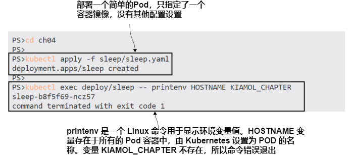

在本练习中，应用程序只是Linux printenv工具，但原理对任何应用程序都是相同的。许多技术栈使用环境变量作为基本配置系统。在Kubernetes中提供这些设置的最简单方法是在Pod Spec 中添加环境变量。清单4.1显示了 sleep Deployment 的更新后的 Pod Spec，其中添加了Kiamol环境变量。

> Listing 4.1 sleep-with-env.yaml, 一个 Pod Spec 带了环境变量

```
spec:
  containers:
    - name: sleep
      image: kiamol/ch03-sleep
      env:                    # 设置环境变量
      - name: KIAMOL_CHAPTER  # 定义环境变量名称
        value: "04"           # 定义环境变量值
```

环境变量在Pod的生命周期中是静态的;在Pod运行时，你不能更新任何值。如果需要更改配置，则需要使用替换Pod执行更新。你应该习惯这样的想法:部署不仅仅是为了新特性的发布;你也会使用它们来进行配置更改和软件补丁，你必须设计你的应用程序来处理频繁的Pod更换。

<b>现在就试试</b> 使用清单4.1中的新Pod 配置更新 sleep Deployment，添加一个Pod容器内可见的环境变量。

```
# 更新 Deployment:
kubectl apply -f sleep/sleep-with-env.yaml
# 在新的 Pod 中检查同样的环境变量:
kubectl exec deploy/sleep -- printenv HOSTNAME KIAMOL_CHAPTER
```

我的输出(如图4.2所示)显示了结果——一个设置了Kiamol环境变量的新容器，在一个新的Pod中运行。

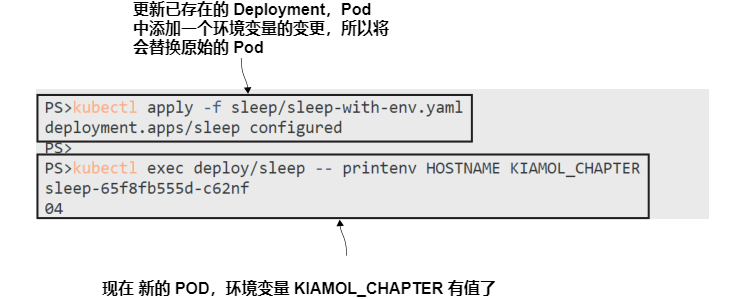

关于前面的练习，重要的是新应用程序使用相同的Docker 镜像;这是一个具有相同二进制文件的相同应用程序——只是配置设置在部署之间发生了更改。在Pod Spec 中内联设置环境值对于简单设置很好，但实际应用程序通常有更复杂的配置需求，这就是使用ConfigMaps时的情况。

ConfigMap只是一个资源，它存储了一些可以加载到Pod中的数据。数据可以是一组键-值对、文本简介，甚至是二进制文件。您可以使用键-值对加载带有环境变量的Pods，使用文本加载任何类型的配置文件—json、XML、YAML、TOML、ini—以及二进制文件加载许可密钥。一个Pod可以使用多个ConfigMap，每个ConfigMap可以被多个Pod使用。图4.3显示了其中的一些选项。

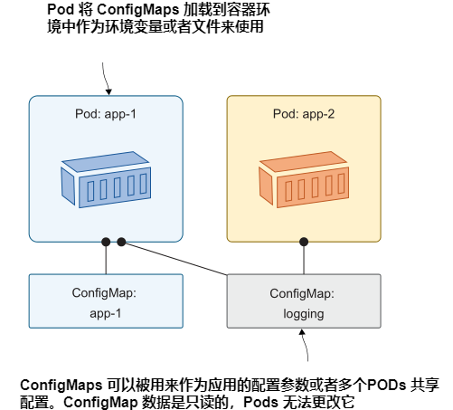

我们将继续使用简单的 sleep Deployment，以展示创建和使用configmap的基础知识。清单4.2显示了更新后Pod Spec的环境部分，其中使用了一个在YAML中定义的环境变量和一个从ConfigMap中加载的环境变量。

> 清单 4.2 sleep-with-configMap-env.yaml, 加载 ConfigMap 到 Pod 中

```
env:                             # 容器 Spec 环境变量配置部分
- name: KIAMOL_CHAPTER
  value: "04"                    # 变量值.
- name: KIAMOL_SECTION
  valueFrom:
    configMapKeyRef:             # 值来自于 ConfigMap.
      name: sleep-config-literal # ConfigMap 名称
      key: kiamol.section        # 加载的数据项名称
```
如果在 Pod Spec 中引用了ConfigMap，那么在部署Pod之前，ConfigMap必须已经存在。该配置期望在数据中找到一个名为sleep-config-literal的具有键值对的ConfigMap，最简单的创建方法是将键和值传递给kubectl命令。

<b>现在就试试</b> 通过指定命令中的数据创建ConfigMap，然后检查数据并部署更新后的sleep 应用程序来使用ConfigMap。

```
# 基于命令行创建 ConfigMap:
kubectl create configmap sleep-config-literal --from-literal=kiamol.section='4.1'
# 检查 ConfigMap 详情:
kubectl get cm sleep-config-literal
# 显示 ConfigMap 友好的描述信息:
kubectl describe cm sleep-config-literal
# 基于 清单 4.2 部署更新后的 Pod 配置:
kubectl apply -f sleep/sleep-with-configMap-env.yaml
# 检查 Kiamol 环境变量:
kubectl exec deploy/sleep -- sh -c 'printenv | grep "^KIAMOL"'
```

在本书中，我们不会经常使用kubectl describe 命令，因为输出通常很冗长，会占用大部分屏幕，但它绝对是值得尝试的东西。描述Services和Pods以可读的格式为您提供了许多有用的信息。您可以在图4.4中看到我的输出，其中包括描述ConfigMap时显示的键值数据。

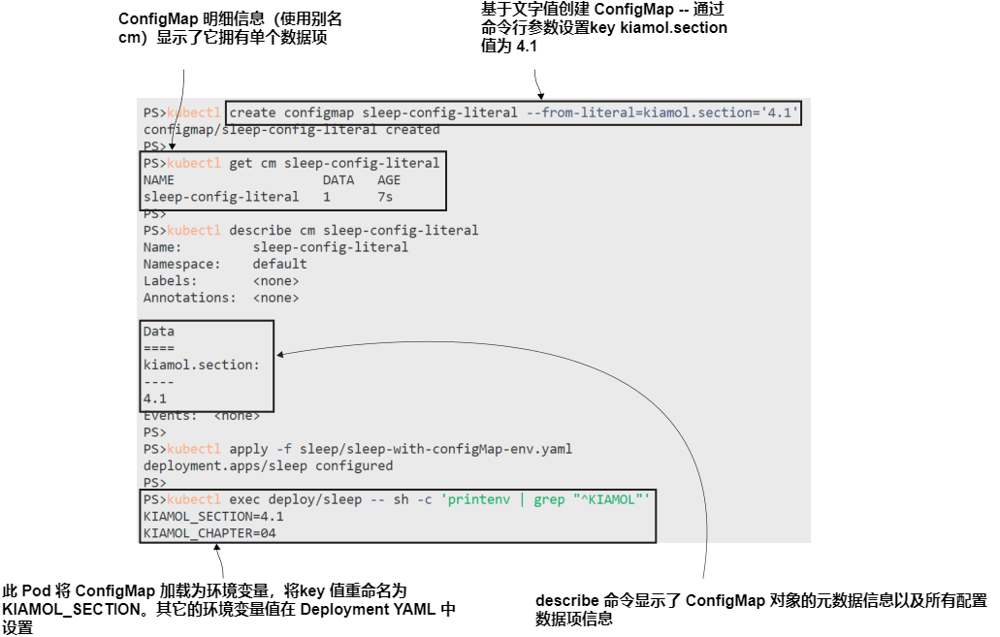

从文字值创建 ConfigMap 对于单独的设置来说很好，但是如果您有很多配置数据，它会变得非常麻烦。除了在命令行上指定文本值外，Kubernetes还允许你从文件中加载configmap。

 ## 4.2 在 ConfigMaps 中存储和使用配置文件

在许多 Kubernetes 版本中，创建和使用configmap的选项已经得到了发展，所以它们现在几乎支持您能想到的所有配置变体。这些 sleep Pod 练习是展示变化的好方法，但它们有点无聊，所以在我们进入更有趣的内容之前，我们再做一个。清单4.3显示了一个环境文件——一个具有键-值对的文本文件，可以加载它来创建一个带有多个数据项的ConfigMap。

> 清单 4.3 ch04.env, 一个包含环境变量的文件

```
# 环境变量文件，使用每个新行定义每个变量
KIAMOL_CHAPTER=ch04
KIAMOL_SECTION=ch04-4.1
KIAMOL_EXERCISE=try it now
```

环境文件是将多个设置分组的有效方法，Kubernetes明确支持将它们加载到ConfigMaps中，并将所有设置作为Pod容器中的环境变量呈现出来。

<b>现在就试试</b> 创建一个从清单4.3中的环境文件填充的新的ConfigMap，然后将更新部署到 sleep 应用程序以使用新的设置。

```
# 加载环境变量到新的 ConfigMap:
kubectl create configmap sleep-config-env-file --from-env-file=sleep/ch04.env
# 检查 ConfigMap 明细信息:
kubectl get cm sleep-config-env-file
# 更新 Pod 使用新的 ConfigMap:
kubectl apply -f sleep/sleep-with-configMap-env-file.yaml
# 在容器中检查值:
kubectl exec deploy/sleep -- sh -c 'printenv | grep "^KIAMOL"'
```

在图4.5中，我的输出显示 printenv 命令读取所有环境变量并显示具有Kiamol名称的变量，但这可能不是您所期望的结果。

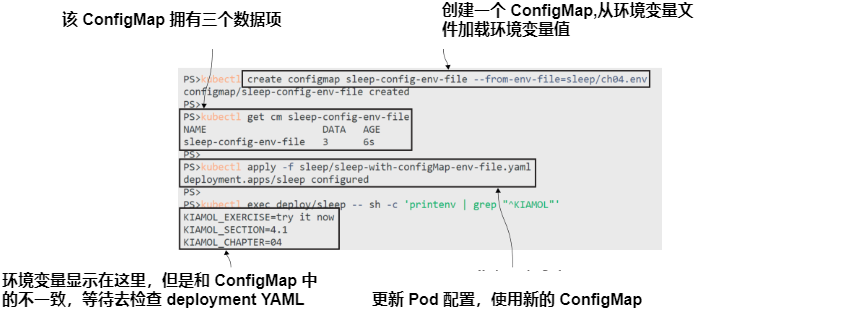

这个练习向您展示了如何从文件创建ConfigMap。它还向您展示了Kubernetes在应用环境变量时具有优先级规则。您刚刚部署的Pod规范(如清单4.4所示)从ConfigMap加载所有环境变量，但它也使用一些相同的键显式指定环境值。

> 清单 4.4 sleep-with-configMap-env-file.yaml, 一个 Pod 关联多个 ConfigMaps

```
env:                              # 已经存在的环境配置部分
- name: KIAMOL_CHAPTER
  value: "04"
- name: KIAMOL_SECTION
  valueFrom:
    configMapKeyRef:
      name: sleep-config-literal
      key: kiamol.section
envFrom:                          # envFrom 加载多个变量
- configMapRef:                   # 基于 ConfigMap
    name: sleep-config-env-file
```

因此，如果存在重复的键，Pod规范中用env定义的环境变量将覆盖用envFrom定义的值。记住一点很有用，您可以通过显式地在Pod规范中设置容器镜像或ConfigMaps中设置的任何环境变量来覆盖它们——这是在跟踪问题时更改配置设置的快速方法。

环境变量得到了很好的支持，但它们只能提供到此为止，大多数应用程序平台更喜欢一种更结构化的方法。在本章的其余练习中，我们将使用一个支持配置源层次结构的web应用程序。默认设置被打包在Docker 镜像中的JSON文件中，应用程序在运行时在其他位置寻找具有覆盖默认设置的JSON文件——所有JSON设置都可以用环境变量覆盖。清单4.5显示了我们将使用的第一个部署的Pod规范。

> 清单 4.5 todo-web.yaml, 带有配置设置的web应用程序

```
spec:
  containers:
  - name: web
    image: kiamol/ch04-todo-list
    env:
    - name: Logging__LogLevel__Default
      value: Warning
```

这个应用程序的运行将使用镜像中JSON配置文件中的所有默认设置，除了默认日志级别，它被设置为一个环境变量。

<b>现在就试试</b> 在没有任何额外配置的情况下运行应用程序，并检查其行为。

```
# 部署应用程序和 Service 来访问它:
kubectl apply -f todo-list/todo-web.yaml
# 等待 Pod ready:
kubectl wait --for=condition=Ready pod -l app=todo-web
# 获取应用 地址:
kubectl get svc todo-web -o jsonpath='http://{.status.loadBalancer.ingress[0].*}:8080'

# 浏览应用程序，玩一玩，然后尝试浏览/config 检查应用程序日志
kubectl logs -l app=todo-web
```

演示应用程序是一个简单的待办事项列表(对于《在一个月的午餐中学习Docker》的读者来说，这将是令人痛苦的熟悉)。在当前的设置中，它允许您添加和查看项，但是还应该有一个/config页面，我们可以在非生产环境中使用它来查看所有的配置设置。如图4.6所示，该页面为空，应用程序记录了有人试图访问它的警告。

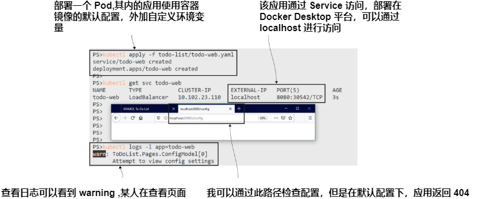

这里使用的配置层次结构是一种非常常见的方法。如果你对它不熟悉，电子书的附录C是《Learn Docker in a Month of lunch》中的“容器中的应用程序配置管理”章节，其中详细解释了它。这个例子是一个使用JSON的. net Core应用程序，但是你可以在Java Spring应用程序、Node.js、Go、Python等中看到使用各种文件格式的类似配置系统。在Kubernetes中，你使用相同的应用配置方法。

- 这可能只是适用于每个环境的设置，也可能是一组完整的配置选项，所以不需要任何额外的设置，应用程序就可以在开发模式下运行(这对那些可以用简单的Docker run命令快速启动应用程序的开发人员很有帮助)。
- 每个环境的实际设置存储在ConfigMap中，并呈现到容器文件系统中。Kubernetes将配置数据显示为一个位于已知位置的文件，应用程序检查并将其与默认文件中的内容合并。
- 任何需要调整的设置都可以作为部署Pod规范中的环境变量应用。

清单4.6显示了todo应用程序开发配置的YAML规范。它包含一个JSON文件的内容，应用程序将该JSON文件与容器镜像中的默认JSON配置文件合并，并设置使配置页面可见。

> 清单 4.6 todo-web-config-dev.yaml, 一个 ConfigMap的配置信息

```
apiVersion: v1
kind: ConfigMap                # ConfigMap 是一种资源类型
metadata:
  name: todo-web-config-dev    # ConfigMap 名字
data:
  config.json: |-              # 数据 key 是文件名
    {                          # 文件内容可以是任何格式
      "ConfigController": {
        "Enabled" : true
      }
    }
```

您可以将任何类型的文本配置文件嵌入到YAML规范中，只要小心处理空白即可。我更喜欢直接从配置文件加载ConfigMaps，因为这意味着你可以始终使用kubectl apply命令来部署应用程序的每个部分。如果我想直接加载JSON文件，我需要使用kubectl create命令来配置资源，并应用其他所有内容。

清单4.6中的ConfigMap定义只包含一个设置，但它以应用程序的本机配置格式存储。当我们部署更新的Pod规范时，该设置将被应用，配置页面将可见。


<b>现在就试试</b> 新的Pod规范引用了ConfigMap，因此需要首先通过应用YAML来创建ConfigMap，然后我们更新待办事项应用部署。

```
# 创建 JSON ConfigMap:
kubectl apply -f todo-list/configMaps/todo-web-config-dev.yaml
# 更新应用使用ConfigMap:
kubectl apply -f todo-list/todo-web-dev.yaml
# 刷新网页指向 /config 路由页面
```

可以在图4.7中看到我的输出。配置页面现在可以正确加载，因此新的部署配置正在合并ConfigMap中的设置，以覆盖镜像中的默认设置，该设置阻止了对该页的访问。


这种方法需要两个前提:应用程序需要能够合并ConfigMap数据，Pod规范需要将ConfigMap中的数据加载到容器文件系统中的预期文件路径中。我们将在下一节中看到它是如何工作的。

 ## 4.3 从 ConfigMaps 中查找配置数据

 将配置项加载到环境变量中的替代方法是将它们作为容器目录中的文件表示。容器文件系统是一个虚拟构造，由容器镜像和其他源构建。Kubernetes可以使用ConfigMaps作为文件系统源——它们作为一个目录挂载，每个数据项都有一个文件。图4.8显示了您刚刚部署的设置，其中ConfigMap中的数据项显示为一个文件。

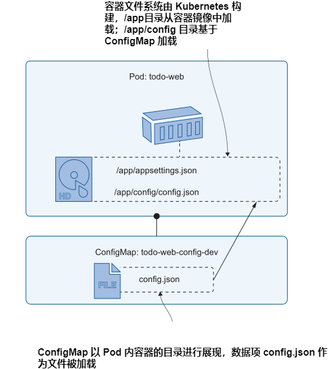

Kubernetes通过Pod 配置 Spec 的两个特性来管理这个奇怪的魔法:卷，它使ConfigMap的内容对Pod可用，卷挂载，它将ConfigMap卷的内容加载到Pod容器的指定路径中。清单4.7显示了在前面的练习中部署的卷和挂载。

> 清单 4.7 todo-web-dev.yaml, 将 ConfigMap 作为卷挂载

```
spec:
  containers:
    - name: web
      image: kiamol/ch04-todo-list
      volumeMounts:                  # 挂载卷到容器中
        - name: config               # 卷名称
          mountPath: "/app/config"   # 卷挂载的目录
          readOnly: true             # 卷 read-only 配置
  volumes:                           # Pod 层面定义卷
    - name: config                   # 匹配 volumeMount 部分的名称.
      configMap:                     # 卷来源是一个 ConfigMap.
        name: todo-web-config-dev    # ConfigMap 名称
```

这里需要意识到的重要一点是，ConfigMap被视为一个目录，具有多个数据项，每个数据项都成为容器文件系统中的文件。在这个例子中，应用程序从/app/appsettings.json文件中加载它的默认设置，然后它在/app/config 目录下寻找一个文件config.Json，它可以包含覆盖默认值的设置。容器镜像中不存在/app/config目录;它是由Kubernetes创建和填充的。

<b>现在就试试</b> 容器文件系统对于应用程序来说是一个单独的存储单元，但是它是由镜像和ConfigMap构建的。这些源有不同的行为。

```
# 显示默认的 config 文件:
kubectl exec deploy/todo-web -- sh -c 'ls -l /app/app*.json'
# 显示卷挂载进来的 config 文件:
kubectl exec deploy/todo-web -- sh -c 'ls -l /app/config/*.json'
# 检查它是否真的只读:
kubectl exec deploy/todo-web -- sh -c 'echo ch04 >> /app/config/config.json'
```

如图4.9所示，我的输出显示JSON配置文件存在于应用程序的预期位置，但ConfigMap文件由Kubernetes管理，并作为只读文件交付。

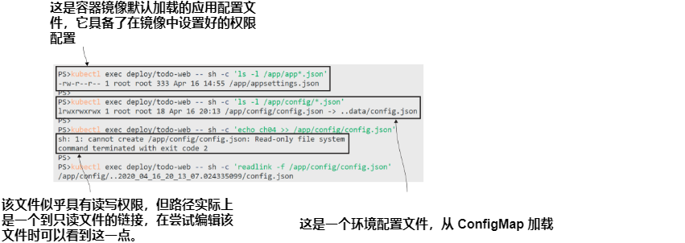

将ConfigMaps加载为目录是很灵活的，你可以使用它来支持不同的应用配置方法。如果您的配置被拆分到多个文件中，您可以将其全部存储在一个ConfigMap中，并将其全部加载到容器中。清单4.8显示了使用两个JSON文件更新to-do ConfigMap的数据项，这些JSON文件分离了应用程序行为和日志记录的设置。

> 清单 4.8 todo-web-config-dev-with-logging.yaml, 包含两个文件的 ConfigMap

```
data:
  config.json: |-                 # 原始的 app 配置文件
    {
      "ConfigController": {
        "Enabled" : true
      }
    }
  logging.json: |-                # 第二个 JSON file, 将会出现在卷挂载中
    {                             
      "Logging": {
        "LogLevel": {
          "ToDoList.Pages" : "Debug"
        }
      }
    }
```

当您将一个更新部署到一个live Pod正在使用的ConfigMap时会发生什么?Kubernetes将更新后的文件交付到容器，但接下来会发生什么取决于应用程序。一些应用程序在启动时将配置文件加载到内存中，然后忽略配置目录中的任何更改，因此更改ConfigMap实际上不会改变应用程序的配置，直到替换Pods。这个应用程序更加周到——它监视配置目录并重新加载任何文件更改，因此将更新部署到ConfigMap将更新应用程序配置。

<b>现在就试试</b> 使用清单4.9中的ConfigMap更新应用程序配置。这增加了日志记录级别，所以同一个Pod现在将开始写入更多的日志条目。

```
# 检查当前应用日志:
kubectl logs -l app=todo-web
# 部署更新后的 ConfigMap:
kubectl apply -f todo-list/configMaps/todo-web-config-dev-with-logging.yaml
# 等待配置变更生效到 Pod :
sleep 120
# 检查新的设置:
kubectl exec deploy/todo-web -- sh -c 'ls -l /app/config/*.json'

# 从您的 Service IP地址的站点加载几个页面，再次检查日志：
kubectl logs -l app=todo-web
```

可以在图4.10中看到我的输出。sleep 是为了让Kubernetes API有时间将新的配置文件在Pod 重新加载;几分钟后，新配置被加载，应用程序在增强的日志记录下运行。

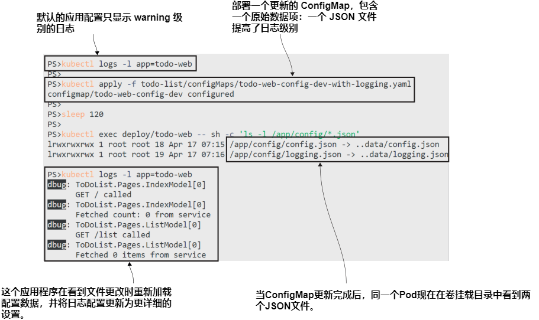

卷是加载配置文件的一个强大的选项，尤其是像这样的应用程序，它会对变化做出反应，并实时更新设置。在不重启应用程序的情况下提高日志级别对跟踪问题有很大帮助。但是，您需要小心您的配置，因为卷挂载不一定以您期望的方式工作。如果容器镜像中已经存在卷的挂载路径，那么ConfigMap目录将覆盖它，替换所有内容，这可能导致应用程序以令人兴奋的方式失败。清单4.9显示了一个示例。

> 清单 4.9 todo-web-dev-broken.yaml, 一个 Pod配置了错误的挂载

```
spec:
  containers:
    - name: web
      image: kiamol/ch04-todo-list
      volumeMounts:
        - name: config                # 挂载 ConfigMap 卷
          mountPath: "/app"           # 覆盖目录
```

这是一个坏的Pod spec 配置，其中ConfigMap被加载到/app目录而不是/app/config目录。作者可能是想合并目录，将JSON配置文件添加到现有的应用目录中。相反，它将清除应用程序二进制文件。

<b>现在就试试</b> 清单4.9中的Pod 配置删除了所有应用程序二进制文件，因此替换的Pod将无法启动。看看接下来会发生什么。

```
# 部署错误配置的 Pod:
kubectl apply -f todo-list/todo-web-dev-broken.yaml
# 访问应用程序，看看它的样子
# 检查应用日志:
kubectl logs -l app=todo-web
# 检查 pod 状态:
kubectl get pods -l app=todo-web
```

这里的结果很有趣:部署破坏了应用程序，但应用程序继续工作。这是Kubernetes在保护你。应用更改会创建一个新的Pod，该Pod中的容器立即退出并报错，因为它试图加载的二进制文件不再存在于app目录中。Kubernetes重新启动容器几次，给它一个机会，但它一直失败。经过三次尝试后，Kubernetes开始休息，如图4.11所示。

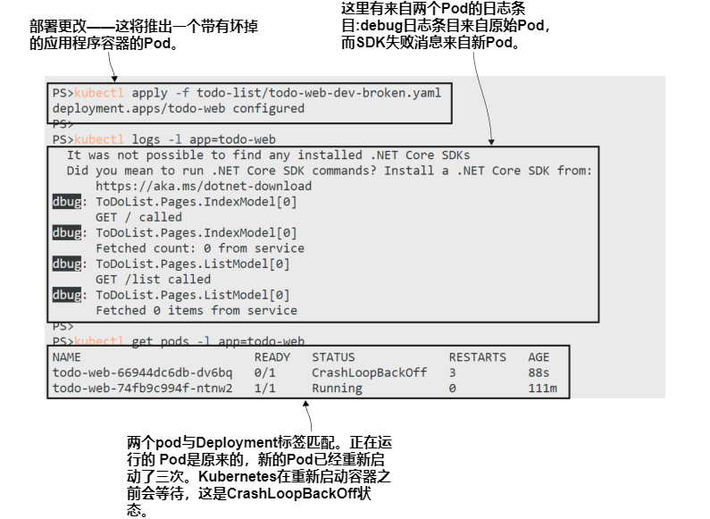

现在我们有了两个Pod，但Kubernetes不会删除旧的Pod，直到替换的Pod成功运行，在这种情况下它永远不会删除，因为我们破坏了容器设置。旧的Pod没有被移除，仍然愉快地服务于请求;新的Pod处于失败状态，但Kubernetes周期性地重新启动容器，希望它可能已经自我修复。这是一种需要注意的情况:apply命令似乎可以工作，应用程序继续工作，但它没有使用您所应用的清单。

现在我们将修复这个问题，并展示在容器文件系统中显示ConfigMaps的最后一个选项。您可以有选择地将数据项加载到目标目录中，而不是将每个数据项作为其自己的文件加载。清单4.10显示了更新后的Pod规范。挂载路径已经固定，但是卷被设置为只交付一个项。

> 清单 4.10 todo-web-dev-no-logging.yaml, 挂载 ConfigMap 单项

```
spec:
  containers:
    - name: web
      image: kiamol/ch04-todo-list
      volumeMounts:
        - name: config               # 挂载 ConfigMap 卷到正常的目录
          mountPath: "/app/config"   
          readOnly: true
volumes:
  - name: config
    configMap:
      name: todo-web-config-dev      # 加载 ConfigMap 卷
      items:                         # 指定数据项进行加载
      - key: config.json             # 加载 config.json 项
        path: config.json            # 作为 文件 config.json
```

该规范使用相同的ConfigMap，因此它只是对部署的更新。这将是一个级联更新:它将创建一个新的Pod，它将正确启动，并且然后Kubernetes会移除之前的两个pod。

<b>现在就试试</b>  部署清单4.10中的 spec，该 spec 推出更新后的卷挂载以修复应用程序，但也忽略了ConfigMap中的日志JSON文件。

```
# 应用变更:
kubectl apply -f todo-list/todo-web-dev-no-logging.yaml
# 列出配置文件夹的内容:
kubectl exec deploy/todo-web -- sh -c 'ls /app/config'
# 现在浏览应用的几个页面，
# 检查日志:
kubectl logs -l app=todo-web
# 检查 Pods:
kubectl get pods -l app=todo-web
```

图4.12显示了我的输出。应用程序又开始工作了，但它只看到一个配置文件，所以没有应用增强的日志记录设置。

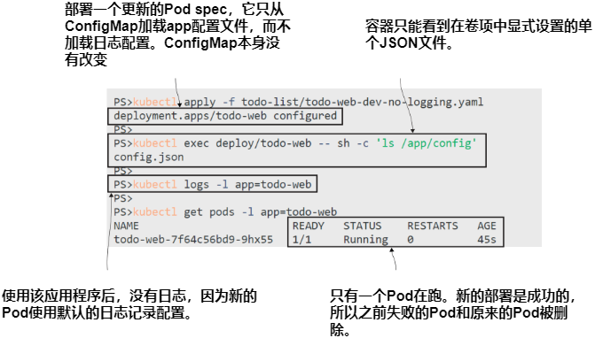

configmap支持广泛的配置系统。在环境变量和卷挂载之间，你应该能够在ConfigMaps中存储应用程序设置，并根据应用程序的需要应用它们。配置规范和应用规范之间的分离还支持不同的发布工作流，允许不同的团队拥有流程的不同部分。但是，有一件事不应该使用ConfigMaps，那就是任何敏感数据——它们实际上是文本文件的包装器，没有额外的安全语义。对于需要保护的配置数据，Kubernetes提供了Secrets。

 ## 4.4 使用 Secrets 配置敏感数据

Secrets 是一种单独的资源类型，但它们具有与ConfigMaps类似的API。你以同样的方式使用它们，但因为它们是用来存储敏感信息的，所以Kubernetes以不同的方式管理它们。主要的区别在于最大限度地减少接触。Secrets 只被发送到需要使用它们的节点，并且存储在内存中而不是磁盘上;Kubernetes还支持在传输和静止时对Secrets进行加密。

然而，Secrets 并不是100%加密的。任何可以访问集群中的 Secret 对象的人都可以读取未加密的值。有一个混淆层:Kubernetes可以读写Base64编码的secret 数据，这并不是一个真正的安全功能，但确实可以防止 secrets 意外暴露给那些在你背后看着你的人。

<b>现在就试试</b> 您可以从一个文字值创建Secrets，并将键和数据传递给kubectl命令。检索到的数据是Base64编码的。

```
# 对于 WINDOWS 这个脚本将一个Base64命令添加到会话中:
. .\base64.ps1
# 现在从纯文本文字创建一个 secret:
kubectl create secret generic sleep-secret-literal --from-literal=secret=shh...
# 友好展示 Secret 信息:
kubectl describe secret sleep-secret-literal
# 查看已编码的 Secret 值:
kubectl get secret sleep-secret-literal -o jsonpath='{.data.secret}'
# 然后解码数据:
kubectl get secret sleep-secret-literal -o jsonpath='{.data.secret}' | base64 -d
```

从图4.13的输出中可以看出，Kubernetes对Secrets的处理与ConfigMaps不同。kubectl describe命令中不显示数据值，只显示键值的名称，并且在获取数据时显示为编码，因此需要将其输送到解码器中进行读取。

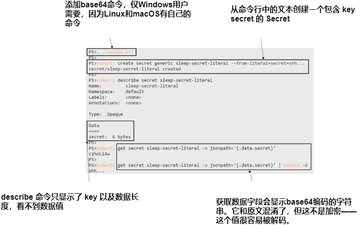

当 Secerts 在 Pod 容器内浮出水面时，这种预防措施并不适用。容器环境看到原始的纯文本数据。清单4.11显示了 sleep 应用程序的返回，配置为将新的Secret作为环境变量加载。

> 清单 4.11 sleep-with-secret.yaml, 一个 Pod 配置加载了 Secret

```
spec:
  containers:
    - name: sleep
      image: kiamol/ch03-sleep
      env:                                   # 环境变量
      - name: KIAMOL_SECRET                  # 容器中的变量名
        valueFrom:                           # 从外部源加载
          secretKeyRef:                      # 来自 Secret
            name: sleep-secret-literal       # Secret 名称
            key: secret                      # secret 数据项的key
```

使用 Secrets 的配置与使用configmaps的配置几乎相同——可以从Secret中的命名项加载命名环境变量。这个Pod 配置将 Secret 数据项以其原始形式交付到容器。

<b>现在就试试</b> 运行一个简单的sleep Pod，使用Secret作为环境变量。

```
# 更新 sleep Deployment:
kubectl apply -f sleep/sleep-with-secret.yaml
# 检查 pod 中的环境变量:
kubectl exec deploy/sleep -- printenv KIAMOL_SECRET
```

图4.14显示了输出结果。在这种情况下，Pod只使用Secret，但是Secrets和ConfigMaps可以混合在同一个Pod 配置中，填充环境变量或文件或两者。

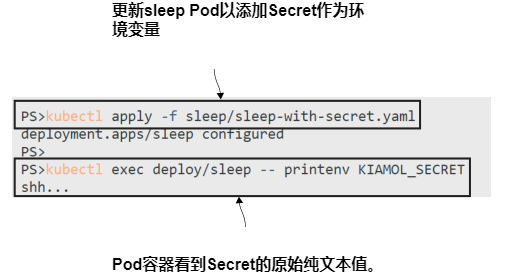

您应该警惕将Secrets加载到环境变量中。保护敏感数据的关键在于最大限度地减少其暴露。可以从任何进程读取环境变量,在Pod容器中，一些应用程序平台在遇到严重错误时记录所有环境变量的值。另一种方法是将Secrets显示为文件(如果应用程序支持的话)，这让您可以选择使用文件权限来保护访问。

为了圆满完成本章，我们将在不同的配置中运行待办事项应用程序，其中它使用单独的数据库来存储项目，运行在自己的Pod中。数据库服务器是使用Docker Hub上的官方镜像的 Postgres，它从环境中的配置值读取登录凭据。清单4.12显示了用于将数据库密码创建为Secret的YAML规范。

> 清单 4.12 -todo-db-secret-test.yaml, 数据库用户的 Secret
```
apiVersion: v1
kind: Secret                         # Secret 是资源类型
metadata:
  name: todo-db-secret-test          # 命名 Secret
type: Opaque                         # Opaque 类型 secrets 用于文本数据.
stringData:                          # stringData用于纯文本.
  POSTGRES_PASSWORD: "kiamol-2*2*"   # secret key 以及 value.
```

这种方法在stringData字段中以纯文本形式声明密码，在创建Secret时将其编码为Base64。为Secrets使用YAML文件带来了一个棘手的问题:它为您提供了一种良好的一致部署方法，代价是在源代码控制中可见所有敏感数据。

在生产场景中，您会将真实数据排除在YAML文件之外，而是使用占位符，并在部署过程中执行一些额外的处理——比如从GitHub Secret中将数据注入占位符。无论您采用哪种方法，请记住，一旦Secret存在于Kubernetes中，任何人都可以轻松读取该值。

<b>现在就试试</b>从清单4.12中的清单创建一个Secret，并检查数据

```
# 部署 Secret:
kubectl apply -f todo-list/secrets/todo-db-secret-test.yaml
# 检查数据是否已编码:
kubectl get secret todo-db-secret-test -o jsonpath='{.data.POSTGRES_PASSWORD}'
# 查看存储了哪些 annotations:
kubectl get secret todo-db-secret-test -o jsonpath='{.metadata.annotations}'
```

在图4.15中可以看到字符串被编码为Base64。其结果与规范使用普通数据字段并直接在YAML中设置Base64中的密码值相同。

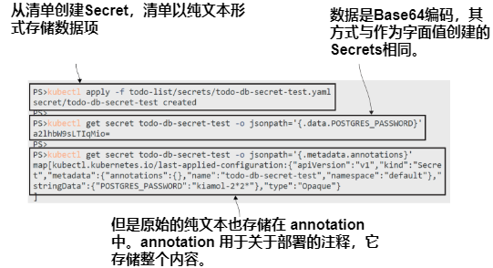

要使用Secret作为Postgres密码，镜像为我们提供了两个选项。我们可以将这个值加载到一个名为POSTGRES_PASSWORD的环境变量中——这并不理想——或者我们可以将它加载到一个文件中，并通过设置POSTGRES_PASSWORD_FILE环境变量告诉Postgres加载文件的位置。使用文件意味着我们可以在卷级别上控制访问权限，这就是清单4.13代码中配置数据库的方式。

> 清单 4.13 todo-db-test.yaml, 一个 Pod spec mount 了来自于 secret 的卷
```
spec:
  containers:
    - name: db
    image: postgres:11.6-alpine
    env:
    - name: POSTGRES_PASSWORD_FILE            # 设置环境变量文件
      value: /secrets/postgres_password
    volumeMounts:                             # 挂载 Secret 卷
      - name: secret                          # volume name
        mountPath: "/secrets"
  volumes:
    - name: secret
      secret:                                     # 从 Secret加载的 volume
        secretName: todo-db-secret-test           # Secret name
        defaultMode: 0400                         # 文件权限
        items:                                    # 可选 命名数据项
        - key: POSTGRES_PASSWORD
          path: postgres_password
```

当部署这个Pod时，Kubernetes将Secret项的值加载到路径为/secrets/postgres_password的文件中。该文件将设置为0400权限，这意味着容器用户可以读取它，但任何其他用户都不能读取。环境变量被设置为让Postgres从Postgres用户有权访问的文件中加载密码，因此数据库将从Secret中设置的凭据开始。

<b>现在就试试</b> 部署数据库Pod，并验证数据库是否正确启动。

```
# 部署清单 4.13 的 YAML
kubectl apply -f todo-list/todo-db-test.yaml
# 检查数据库日志:
kubectl logs -l app=todo-db --tail 1
# 检查密码文件权限:
kubectl exec deploy/todo-db -- sh -c 'ls -l $(readlink -f /secrets/postgres_password)'
```

图4.16显示了数据库启动和等待连接的过程——这表明数据库已正确配置——最终输出验证文件权限是否按预期设置。

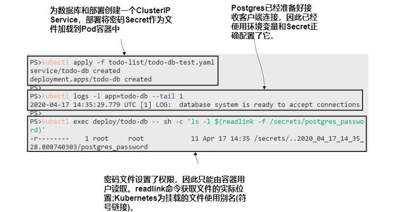

剩下的就是在测试配置中运行应用程序本身，这样它就可以连接到Postgres数据库，而不是使用本地数据库文件进行存储。还有很多YAML可以用来创建ConfigMap、Secret、Deployment和Service，但是这些都是使用我们已经介绍过的特性，所以我们只需要继续部署即可。

<b>现在就试试</b>运行 to-do 应用程序，使其使用Postgres数据库进行存储。

```
# ConfigMap配置应用使用Postgres:
kubectl apply -f todo-list/configMaps/todo-web-config-test.yaml

# Secret包含连接到Postgres的凭据:
kubectl apply -f todo-list/secrets/todo-web-secret-test.yaml
# 部署Pod规范使用ConfigMap和Secret:
kubectl apply -f todo-list/todo-web-test.yaml
# 检查应用程序中是否设置了数据库凭据:
kubectl exec deploy/todo-web-test -- cat /app/secrets/secrets.json
# 浏览应用程序并添加一些项目
```
我的输出如图4.17所示，其中Secret JSON文件的纯文本内容显示在web Pod容器中。

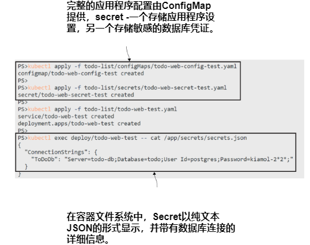

现在，当你在应用程序中添加待办事项时，它们被存储在Postgres数据库中，因此存储与应用程序运行时分离。你可以删除web Pod;它的控制器将启动一个具有相同配置的替换，它连接到相同的数据库Pod，因此所有来自原始web Pod的数据仍然可用。

这是Kubernetes中配置选项的一个非常详尽的介绍。原理非常简单—将configmap或secret加载到环境变量或文件中—但是有很多变化。你需要很好地理解这些细微差别，以便以一致的方式管理应用程序配置，即使你的应用程序都有不同的配置模型。

 ## 4.5 管理 Kubernetes 中的应用程序配置

 Kubernetes gives you the tools to manage app configuration using whatever workflow fits for your organization. The core requirement is for your applications to read configuration settings from the environment, ideally with a hierarchy of files and environment variables. Then you have the flexibility to use ConfigMaps and Secrets to support your deployment process. You have two factors to consider in your design: do you need your apps to respond to live configuration updates, and how will you manage Secrets?

If live updates without a Pod replacement are important to you, then your options are limited. You can’t use environment variables for settings, because any changes to those result in a Pod replacement. You can use a volume mount and load configuration changes from files, but you need to deploy changes by updating the existing ConfigMap or Secret objects. You can’t change the volume to point to a new config object, because that’s a Pod replacement too.

The alternative to updating the same config object is to deploy a new object every time with some versioning scheme in the object name and updating the app Deployment to reference the new object. You lose live updates but gain an audit trail of configuration changes and have an easy option to revert back to previous settings. Figure 4.18 shows those options.

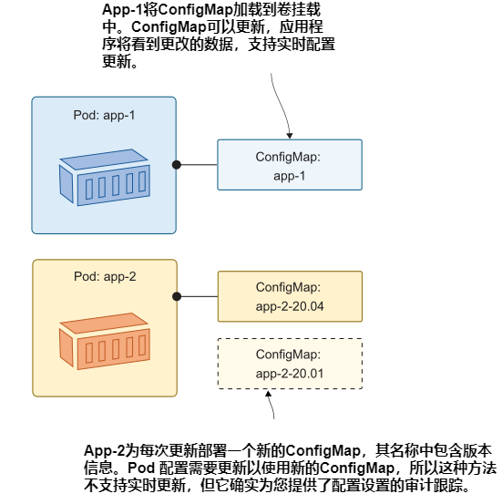

The other question is how you manage sensitive data. Large organizations might have dedicated configuration management teams who own the process of deploying configuration files. That fits nicely with a versioned approach to ConfigMaps and Secrets,where the configuration management team deploys new objects from literals or controlled files in advance of the deployment.

An alternative is a fully automated deployment, where ConfigMaps and Secrets are created from YAML templates in source control. The YAML files contain placeholders instead of sensitive data, and the deployment process replaces them with real values from a secure store, like Azure KeyVault, before applying them. Figure 4.19 compares those options.


You can use any approach that works for your teams and your application stacks,remembering that the goal is for all configuration settings to be loaded from the platform, so the same container image is deployed in every environment.It’s time to clean up your cluster. If you’ve followed along with all the exercises (and of course you have!), you’ll have a couple of dozen resources to remove. I’ll introduce some useful features of kubectl to help clear everything out.

TRY IT NOW
The kubectl delete command can read a YAML file and delete the resources defined in the file. And if you have multiple YAML files in a directory, you can use the directory name as the argument to delete (or apply),and it will run over all the files.

```
# delete all the resources in all the files in all the directories:
kubectl delete -f sleep/
kubectl delete -f todo-list/
kubectl delete -f todo-list/configMaps/
kubectl delete -f todo-list/secrets/
```

 ## 4.6 实验室

 If you’re reeling from all the options Kubernetes gives you to configure apps, this lab is going to help. In practice, your apps will have their own ideas about configuration
management, and you’ll need to model your Kubernetes Deployments to suit the way your apps expect to be configured. That’s what you need to do in this lab with a simple app called Adminer. Here we go:
- Adminer, a web UI for administering SQL databases, can be a handy tool to run in Kubernetes when you’re troubleshooting database issues.
- Start by deploying the YAML files in the ch04/lab/postgres folder, then deploy the ch04/lab/adminer.yaml file to run Adminer in its basic state.
- Find the external IP for your Adminer Service, and browse to port 8082. Note that you need to specify a database server and that the UI design is stuck in the 1990s. You can confirm the connection to Postgres by using postgres as the database name, username, and password.
- Your job is to create and use some config objects in the Adminer Deployment so that the database server name defaults to the lab’s Postgres Service, and the UI uses the much nicer design called price.
- You can set the default database server in an environment variable called ADMINER_DEFAULT_SERVER. Let’s call this sensitive data, so it should use a Secret.
- The UI design is set in the environment variable ADMINER_DESIGN; that’s not sensitive, so a ConfigMap will do nicely.

This will take a little bit of investigation and some thought on how to surface the configuration settings, so it’s good practice for real application configuration. My solution
is posted on GitHub for you to check your approach: https://github.com/sixeyed/kiamol/blob/master/ch04/lab/README.md.