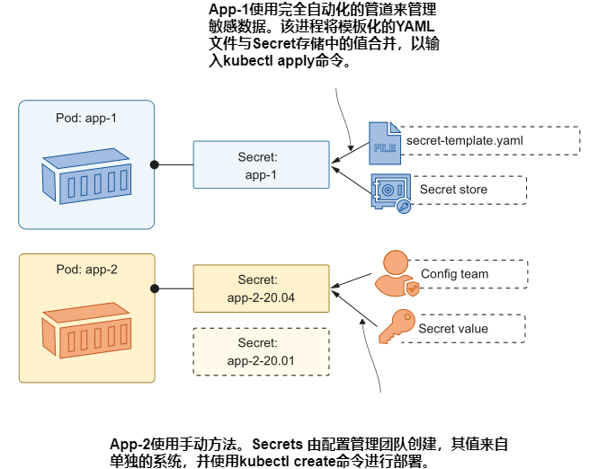

 # 第四章 通过 ConfigMaps 和 Secrets 配置应用程序

 在容器中运行应用程序的最大优势之一是消除了环境之间的差距。部署过程在所有测试环境直到生产环境中都使用相同的容器镜像，因此每个部署都使用与前一个环境完全相同的二进制文件集。您再也不会看到生产部署失败，因为服务器缺少某人手动安装在测试服务器上并且忘记记录的依赖项。当然，环境之间确实存在差异，您可以通过将配置设置注入到容器中来提供这种差异。

Kubernetes支持两种资源类型的配置注入:ConfigMap和Secrets。这两种类型都可以以任何合理的格式存储数据，并且这些数据独立于任何其他资源存在于集群中。可以通过访问ConfigMaps和Secrets中的数据来定义Pods，并为数据如何展现提供不同的选项。在本章中，您将学习在Kubernetes中管理配置的所有方法，这些方法足够灵活，可以满足任何应用程序的需求。

 ## 4.1 Kubernetes 如何为应用提供配置

 使用 kubectl 创建ConfigMap和Secret对象，就像在kubernete中创建其他资源一样，可以使用create命令，也可以应用YAML规范。不像其他资源，它们什么都不做;它们只是存储少量数据的存储单元。这些存储单元可以加载到Pod中，成为容器环境的一部分，因此容器中的应用程序可以读取数据。在讨论这些对象之前，我们先来看看提供配置设置的最简单方法:使用环境变量。

<b>现在就试试</b> 环境变量是Linux和Windows中的核心操作系统特性，它们可以在机器级别设置，以便任何应用程序都可以读取它们。环境变量是常用的，所有容器都有一些环境变量，由容器内的操作系统和Kubernetes设置。确保您的Kubernetes实验室已经启动并运行。

```
# 切换到本章练习目录:
cd ch04
# 使用 sleep image 部署一个没有额外配置的 Pod:
kubectl apply -f sleep/sleep.yaml
# 等待 pod ready:
kubectl wait --for=condition=Ready pod -l app=sleep
# 检查容器中的一些环境变量:
kubectl exec deploy/sleep -- printenv HOSTNAME KIAMOL_CHAPTER
```

从图4.1所示的输出中可以看到，容器中存在hostname变量，并由Kubernetes填充，但自定义Kiamol变量不存在。


在本练习中，应用程序只是Linux printenv工具，但原理对任何应用程序都是相同的。许多技术栈使用环境变量作为基本配置系统。在Kubernetes中提供这些设置的最简单方法是在Pod Spec 中添加环境变量。清单4.1显示了 sleep Deployment 的更新后的 Pod Spec，其中添加了Kiamol环境变量。

> Listing 4.1 sleep-with-env.yaml, 一个 Pod Spec 带了环境变量

```
spec:
  containers:
    - name: sleep
      image: kiamol/ch03-sleep
      env:                    # 设置环境变量
      - name: KIAMOL_CHAPTER  # 定义环境变量名称
        value: "04"           # 定义环境变量值
```

环境变量在Pod的生命周期中是静态的;在Pod运行时，你不能更新任何值。如果需要更改配置，则需要使用替换Pod执行更新。你应该习惯这样的想法:部署不仅仅是为了新特性的发布;你也会使用它们来进行配置更改和软件补丁，你必须设计你的应用程序来处理频繁的Pod更换。

<b>现在就试试</b> 使用清单4.1中的新Pod 配置更新 sleep Deployment，添加一个Pod容器内可见的环境变量。

```
# 更新 Deployment:
kubectl apply -f sleep/sleep-with-env.yaml
# 在新的 Pod 中检查同样的环境变量:
kubectl exec deploy/sleep -- printenv HOSTNAME KIAMOL_CHAPTER
```

我的输出(如图4.2所示)显示了结果——一个设置了Kiamol环境变量的新容器，在一个新的Pod中运行。


关于前面的练习，重要的是新应用程序使用相同的Docker 镜像;这是一个具有相同二进制文件的相同应用程序——只是配置设置在部署之间发生了更改。在Pod Spec 中内联设置环境值对于简单设置很好，但实际应用程序通常有更复杂的配置需求，这就是使用ConfigMaps时的情况。

ConfigMap只是一个资源，它存储了一些可以加载到Pod中的数据。数据可以是一组键-值对、文本简介，甚至是二进制文件。您可以使用键-值对加载带有环境变量的Pods，使用文本加载任何类型的配置文件—json、XML、YAML、TOML、ini—以及二进制文件加载许可密钥。一个Pod可以使用多个ConfigMap，每个ConfigMap可以被多个Pod使用。图4.3显示了其中的一些选项。


我们将继续使用简单的 sleep Deployment，以展示创建和使用configmap的基础知识。清单4.2显示了更新后Pod Spec的环境部分，其中使用了一个在YAML中定义的环境变量和一个从ConfigMap中加载的环境变量。

> 清单 4.2 sleep-with-configMap-env.yaml, 加载 ConfigMap 到 Pod 中

```
env:                             # 容器 Spec 环境变量配置部分
- name: KIAMOL_CHAPTER
  value: "04"                    # 变量值.
- name: KIAMOL_SECTION
  valueFrom:
    configMapKeyRef:             # 值来自于 ConfigMap.
      name: sleep-config-literal # ConfigMap 名称
      key: kiamol.section        # 加载的数据项名称
```
如果在 Pod Spec 中引用了ConfigMap，那么在部署Pod之前，ConfigMap必须已经存在。该配置期望在数据中找到一个名为sleep-config-literal的具有键值对的ConfigMap，最简单的创建方法是将键和值传递给kubectl命令。

<b>现在就试试</b> 通过指定命令中的数据创建ConfigMap，然后检查数据并部署更新后的sleep 应用程序来使用ConfigMap。

```
# 基于命令行创建 ConfigMap:
kubectl create configmap sleep-config-literal --from-literal=kiamol.section='4.1'
# 检查 ConfigMap 详情:
kubectl get cm sleep-config-literal
# 显示 ConfigMap 友好的描述信息:
kubectl describe cm sleep-config-literal
# 基于 清单 4.2 部署更新后的 Pod 配置:
kubectl apply -f sleep/sleep-with-configMap-env.yaml
# 检查 Kiamol 环境变量:
kubectl exec deploy/sleep -- sh -c 'printenv | grep "^KIAMOL"'
```

在本书中，我们不会经常使用kubectl describe 命令，因为输出通常很冗长，会占用大部分屏幕，但它绝对是值得尝试的东西。描述Services和Pods以可读的格式为您提供了许多有用的信息。您可以在图4.4中看到我的输出，其中包括描述ConfigMap时显示的键值数据。


从文字值创建 ConfigMap 对于单独的设置来说很好，但是如果您有很多配置数据，它会变得非常麻烦。除了在命令行上指定文本值外，Kubernetes还允许你从文件中加载configmap。

 ## 4.2 在 ConfigMaps 中存储和使用配置文件

 Options for creating and using ConfigMaps have evolved over many Kubernetes releases, so they now support practically every configuration variant you can think of. These sleep Pod exercises are a good way to show the variations, but they’re getting a bit boring, so we’ll just have one more before we move on to something more interesting. Listing 4.3 shows an environment file—a text file with key-value pairs that can be loaded to create one ConfigMap with multiple data items.

> Listing 4.3 ch04.env, a file of environment variables

```
# Environment files use a new line for each variable.
KIAMOL_CHAPTER=ch04
KIAMOL_SECTION=ch04-4.1
KIAMOL_EXERCISE=try it now
```

Environment files are a useful way to group multiple settings, and Kubernetes has explicit support for loading them into ConfigMaps and surfacing all the settings as environment variables in a Pod container.

TRY IT NOW
Create a new ConfigMap populated from the environment file in listing 4.3, then deploy an update to the sleep app to use the new settings.

```
# load an environment variable into a new ConfigMap:
kubectl create configmap sleep-config-env-file --from-env-
file=sleep/ch04.env
# check the details of the ConfigMap:
kubectl get cm sleep-config-env-file
# update the Pod to use the new ConfigMap:
kubectl apply -f sleep/sleep-with-configMap-env-file.yaml
# check the values in the container:
kubectl exec deploy/sleep -- sh -c 'printenv | grep "^KIAMOL"'
```

My output, in figure 4.5, shows the printenv command reading all the environment variables and showing the ones with Kiamol names, but it might not be the result you expect.


This exercise showed you how to create a ConfigMap from a file. It also showed you that Kubernetes has rules of precedence for applying environment variables. The Pod spec you just deployed, shown in listing 4.4, loads all environment variables from the ConfigMap, but it also specifies explicit environment values with some of the same keys.

> Listing 4.4 sleep-with-configMap-env-file.yaml, multiple ConfigMaps in a Pod

```
env:                              # The existing environment section
- name: KIAMOL_CHAPTER
  value: "04"
- name: KIAMOL_SECTION
  valueFrom:
    configMapKeyRef:
      name: sleep-config-literal
      key: kiamol.section
envFrom:                          # envFrom loads multiple variables
- configMapRef:                   # from a ConfigMap
    name: sleep-config-env-file
```

So the environment variables defined with env in the Pod spec override the values defined with envFrom if there are duplicate keys. It’s useful to remember that you can override any environment variables set in the container image or in ConfigMaps by explicitly setting them in the Pod spec—a quick way to change a configuration setting when you’re tracking down problems.

Environment variables are well supported, but they only get you so far, and most application platforms prefer a more structured approach. In the rest of the exercises in this chapter, we’ll use a web application that supports a hierarchy of configuration sources. Default settings are packaged in a JSON file in the Docker image, and the app looks in other locations at run time for JSON files with settings that override the defaults—and all the JSON settings can be overridden with environment variables. Listing 4.5 shows the Pod spec for the first deployment we’ll use.

> Listing 4.5 todo-web.yaml, a web app with configuration settings

```
spec:
  containers:
  - name: web
    image: kiamol/ch04-todo-list
    env:
    - name: Logging__LogLevel__Default
      value: Warning
```

This run of the app will use all the default settings from the JSON configuration file in the image, except for the default logging level, which is set as an environment variable.
TRY IT NOW
Run the app without any additional configuration, and check its behavior.

```
# deploy the app with a Service to access it:
kubectl apply -f todo-list/todo-web.yaml
# wait for the Pod to be ready:
kubectl wait --for=condition=Ready pod -l app=todo-web
# get the address of the app:
kubectl get svc todo-web -o
jsonpath='http://{.status.loadBalancer.ingress[0].*}:8080'
# browse to the app and have a play around
# then try browsing to /config
# check the application logs:
kubectl logs -l app=todo-web
```

The demo app is a simple to-do list (which will be distressingly familiar to readers of Learn Docker in a Month of Lunches). In its current setup, it lets you add and view items,
but there should also be a /config page we can use in nonproduction environments to view all the configuration settings. As you can see in figure 4.6, that page is empty,
and the app logs a warning that someone tried to access it.


The configuration hierarchy in use here is a very common approach. If you’re not familiar with it, appendix C in the ebook is the chapter “Application Configuration Management in Containers” from Learn Docker in a Month of Lunches, which explains it in detail. This example is a .NET Core app that uses JSON, but you see similar configuration systems using a variety of file formats in Java Spring apps, Node.js, Go, Python, and more. In Kubernetes, you use the same app configuration approach with them all.

- Default app settings are baked into the container image. This could be just the settings which apply in every environment, or it could be a full set of configuration options, so without any extra setup, the app runs in development mode (that’s helpful for developers who can quickly start the app with a simple Docker run command).
- The actual settings for each environment are stored in a ConfigMap and surfaced into the container filesystem. Kubernetes presents the configuration data as a file in a known location, which the app checks and merges with the content from the default file.
- Any settings that need to be tweaked can be applied as environment variables in the Pod specification for the Deployment.

Listing 4.6 shows the YAML specification for the development configuration of the todo app. It contains the contents of a JSON file, which the app will merge with the default JSON configuration file in the container image, with a setting to make the config page visible.

> Listing 4.6 todo-web-config-dev.yaml, a ConfigMap specification

```
apiVersion: v1
kind: ConfigMap                # ConfigMap is the resource type.
metadata:
  name: todo-web-config-dev    # Names the ConfigMap.
data:
  config.json: |-              # The data key is the filename.
    {                          # The file contents can be any format.
      "ConfigController": {
        "Enabled" : true
      }
    }
```
You can embed any kind of text configuration file into a YAML spec, as long as you’re careful with the whitespace. I prefer this to loading ConfigMaps directly from configuration files because it means you can consistently use the kubectl apply command to deploy every part of your app. If I wanted to load the JSON file directly, I’d need to use the kubectl create command for configuration resources and apply for everything else.

The ConfigMap definition in listing 4.6 contains just a single setting, but it’s stored in the native configuration format for the app. When we deploy an updated Pod spec,the setting will be applied and the config page will be visible.

TRY IT NOW
The new Pod spec references the ConfigMap, so that needs to be created first by applying the YAML, then we update the to-do app Deployment.

```
# create the JSON ConfigMap:
kubectl apply -f todo-list/configMaps/todo-web-config-dev.yaml
# update the app to use the ConfigMap:
kubectl apply -f todo-list/todo-web-dev.yaml
# refresh your web browser at the /config page for your Service
```

You can see my output in figure 4.7. The config page loads correctly now, so the new Deployment configuration is merging in the settings from the ConfigMap to override the default setting in the image, which blocked access to that page.


This approach needs two things: your application needs to be able to merge in the ConfigMap data, and your Pod specification needs to load the data from the ConfigMap into the expected file path in the container filesystem. We’ll see how that works in the next section.

 ## 4.3 从 ConfigMaps 中查找配置数据

 The alternative to loading configuration items into environment variables is to present them as files inside directories in the container. The container filesystem is a virtual construct, built from the container image and other sources. Kubernetes can use ConfigMaps as a filesystem source—they are mounted as a directory, with a file for each data item. Figure 4.8 shows the setup you’ve just deployed, where the data item in the ConfigMap is surfaced as a file.


Kubernetes manages this strange magic with two features of the Pod spec: volumes, which make the contents of the ConfigMap available to the Pod, and volume mounts,which load the contents of the ConfigMap volume into a specified path in the Pod container. Listing 4.7 shows the volumes and mounts you deployed in the previous exercise.

> Listing 4.7 todo-web-dev.yaml, loading a ConfigMap as a volume mount

```
spec:
  containers:
    - name: web
      image: kiamol/ch04-todo-list
      volumeMounts:                  # Mounts a volume into the container
        - name: config               # Names the volume
          mountPath: "/app/config"   # Directory path to mount the volume
          readOnly: true             # Flags the volume as read-only
  volumes:                           # Volumes are defined at the Pod level.
    - name: config                   # Name matches the volume mount.
      configMap:                     # Volume source is a ConfigMap.
        name: todo-web-config-dev    # ConfigMap name
```
The important thing to realize here is that the ConfigMap is treated like a directory, with multiple data items, which each become files in the container filesystem. In this example, the application loads its default settings from the file at /app/appsettings.json, and then it looks for a file at /app/config/config.json, which can contain settings to override the defaults. The /app/config directory doesn’t exist in the container image; it is created and populated by Kubernetes.

TRY IT NOW
The container filesystem appears as a single storage unit to the application, but it has been built from the image and the ConfigMap. Those sources have different behaviors.

```
# show the default config file:
kubectl exec deploy/todo-web -- sh -c 'ls -l /app/app*.json'
# show the config file in the volume mount:
kubectl exec deploy/todo-web -- sh -c 'ls -l /app/config/*.json'
# check it really is read-only:
kubectl exec deploy/todo-web -- sh -c 'echo ch04 >> /app/config/config.json'
```

My output, in figure 4.9, shows that the JSON configuration files exist in the expected locations for the app, but the ConfigMap files are managed by Kubernetes and delivered as read-only files.


Loading ConfigMaps as directories is flexible, and you can use it to support different approaches to app configuration. If your configuration is split across multiple files,you can store it all in a single ConfigMap and load it all into the container. Listing 4.8 shows the data items for an update to the to-do ConfigMap with two JSON files that separate the settings for application behavior and logging.

> Listing 4.8 todo-web-config-dev-with-logging.yaml, a ConfigMap with two files

```
data:
  config.json: |-                 # The original app config file
    {
      "ConfigController": {
        "Enabled" : true
      }
    }
  logging.json: |-                # A second JSON file, which will be
    {                             # surfaced in the volume mount
      "Logging": {
        "LogLevel": {
          "ToDoList.Pages" : "Debug"
        }
      }
    }
```

What happens when you deploy an update to a ConfigMap that a live Pod is using?Kubernetes delivers the updated files to the container, but what happens next depends on the application. Some apps load configuration files into memory when they start and then ignore any changes in the config directory, so changing the ConfigMap won’t actually change the app configuration until the Pods are replaced. This application is more thoughtful—it watches the config directory and reloads any file changes, so deploying an update to the ConfigMap will update the application configuration.

TRY IT NOW
Update the app configuration with the ConfigMap from listing 4.9.That increases the logging level, so the same Pod will now start writing more log entries.

```
# check the current app logs:
kubectl logs -l app=todo-web
# deploy the updated ConfigMap:
kubectl apply -f todo-list/configMaps/todo-web-config-dev-with-
logging.yaml
# wait for the config change to make it to the Pod:
sleep 120
# check the new setting:
kubectl exec deploy/todo-web -- sh -c 'ls -l /app/config/*.json'
# load a few pages from the site at your Service IP address
# check the logs again:
kubectl logs -l app=todo-web
```

You can see my output in figure 4.10. The sleep is there to give the Kubernetes API time to roll out the new configuration files to the Pod; after a couple of minutes, the new configuration is loaded, and the app is operating with enhanced logging.


Volumes are a powerful option for loading config files, especially with apps like this, which react to changes and update settings on the fly. Bumping up the logging level without having to restart your app is a great help in tracking down issues. You need to be careful with your configuration, though, because volume mounts don’t necessarily work the way you expect. If the mount path for a volume already exists in the container image, then the ConfigMap directory overwrites it, replacing all the contents, which can cause your app to fail in exciting ways. Listing 4.9 shows an example.

> Listing 4.9 todo-web-dev-broken.yaml, a Pod spec with a misconfigured mount

```
spec:
  containers:
    - name: web
      image: kiamol/ch04-todo-list
      volumeMounts:
        - name: config                # Mounts the ConfigMap volume
          mountPath: "/app"           # Overwrites the directory
```

This is a broken Pod spec, where the ConfigMap is loaded into the /app directory rather than the /app/config directory. The author probably intended this to merge the directories, adding the JSON config files to the existing app directory. Instead, it’s going to wipe out the application binaries.

TRY IT NOW
The Pod spec from listing 4.9 removes all the app binaries, so the replacement Pod won’t start. See what happens next.

```
# deploy the badly configured Pod:
kubectl apply -f todo-list/todo-web-dev-broken.yaml
# browse back to the app and see how it looks
# check the app logs:
kubectl logs -l app=todo-web
# and check the Pod status:
kubectl get pods -l app=todo-web
```
The results here are interesting: the deployment breaks the app, and yet the app carries on working. That’s Kubernetes watching out for you. Applying the change creates a new Pod, and the container in that Pod immediately exits with an error, because the binary it tries to load no longer exists in the app directory. Kubernetes restarts the container a few times to give it a chance, but it keeps failing. After three tries, Kubernetes takes a rest, as you can see in figure 4.11.


Now we have two Pods, but Kubernetes doesn’t remove the old Pod until the replacement is running successfully, which it never will in this case because we’ve broken the container setup. The old Pod isn’t removed and still happily serves requests; the new Pod is in a failed state, but Kubernetes periodically keeps restarting the container in the hope that it might have fixed itself. This is a situation to watch out for: the apply command seems to work, and the app carries on working, but it’s not using the manifest you’ve applied.

We’ll fix that now and show one final option for surfacing ConfigMaps in the container filesystem. You can selectively load data items into the target directory, rather than loading every data item as its own file. Listing 4.10 shows the updated Pod spec.The mount path has been fixed, but the volume is set to deliver only one item.

> Listing 4.10 todo-web-dev-no-logging.yaml, mounting a single ConfigMap item

```
spec:
  containers:
    - name: web
      image: kiamol/ch04-todo-list
      volumeMounts:
        - name: config               # Mounts the ConfigMap volume
          mountPath: "/app/config"   # to the correct direcory
          readOnly: true
volumes:
  - name: config
    configMap:
      name: todo-web-config-dev      # Loads the ConfigMap volume
      items:                         # Specifies the data items to load
      - key: config.json             # Loads the config.json item
        path: config.json            # Surfaces it as the file config.json
```

This specification uses the same ConfigMap, so it is just an update to the deployment.This will be a cascading update: it will create a new Pod, which will start correctly, and
then Kubernetes will remove the two previous Pods.

TRY IT NOW
Deploy the spec from listing 4.10, which rolls out the updated volume mount to fix the app but also ignores the logging JSON file in the ConfigMap.

```
# apply the change:
kubectl apply -f todo-list/todo-web-dev-no-logging.yaml
# list the config folder contents:
kubectl exec deploy/todo-web -- sh -c 'ls /app/config'
# now browse to a few pages on the app
# check the logs:
kubectl logs -l app=todo-web
# and check the Pods:
kubectl get pods -l app=todo-web
```

Figure 4.12 shows my output. The app is working again, but it sees only a single configuration file, so the enhanced logging settings don’t get applied.


ConfigMaps support a wide range of configuration systems. Between environment variables and volume mounts you should be able to store app settings in ConfigMaps and apply them however your app expects. The separation between the configuration spec and the app spec also supports different release workflows, allowing different teams to own different parts of the process. One thing you shouldn’t use ConfigMaps for, however, is any sensitive data—they’re effectively wrappers for text files with no additional security semantics. For configuration data that you need to keep secure,Kubernetes provides Secrets.

 ## 4.4 使用 Secrets 配置敏感数据
 Secrets are a separate type of resource, but they have a similar API to ConfigMaps. You work with them in the same way, but because they’re meant to store sensitive information, Kubernetes manages them differently. The main differences are all around minimizing exposure. Secrets are sent only to nodes that need to use them and are stored in memory rather than on disk; Kubernetes also supports encryption both in transit and at rest for Secrets.

Secrets are not encrypted 100% of the time, though. Anyone who has access to Secret objects in your cluster can read the unencrypted values. There is an obfuscation layer: Kubernetes can read and write Secret data with Base64 encoding, which isn’t really a security feature but does prevent accidental exposure of secrets to someone looking over your shoulder.

TRY IT NOW
You can create Secrets from a literal value, passing the key and data into the kubectl command. The retrieved data is Base64 encoded.
```
# FOR WINDOWS USERS—this script adds a Base64 command to your session:
. .\base64.ps1
# now create a secret from a plain text literal:
kubectl create secret generic sleep-secret-literal --from-
literal=secret=shh...
# show the friendly details of the Secret:
kubectl describe secret sleep-secret-literal
# retrieve the encoded Secret value:
kubectl get secret sleep-secret-literal -o jsonpath='{.data.secret}'
# and decode the data:
kubectl get secret sleep-secret-literal -o jsonpath='{.data.secret}' |
  base64 -d
```

You can see from the output in figure 4.13 that Kubernetes treats Secrets differently from ConfigMaps. The data values aren’t shown in the kubectl describe command,only the names of the item keys, and when you do fetch the data, it’s shown encoded, so you need to pipe it into a decoder to read it.


That precaution doesn’t apply when Secrets are surfaced inside Pod containers. The container environment sees the original plain text data. Listing 4.11 shows a return to the sleep app, configured to load the new Secret as an environment variable.

> Listing 4.11 sleep-with-secret.yaml, a Pod spec loading a Secret

```
spec:
  containers:
    - name: sleep
      image: kiamol/ch03-sleep
      env:                                   # Environment variables
      - name: KIAMOL_SECRET                  # Variable name in the container
        valueFrom:                           # loaded from an external source
          secretKeyRef:                      # which is a Secret
            name: sleep-secret-literal       # Names the Secret
            key: secret                      # Key of the Secret data item
```

The specification to consume Secrets is almost the same as for ConfigMaps—a named environment variable can be loaded from a named item in a Secret. This Pod spec delivers the Secret item in its original form to the container.


TRY IT NOW
Run a simple sleep Pod that uses the Secret as an environment variable.

```
# update the sleep Deployment:
kubectl apply -f sleep/sleep-with-secret.yaml
# check the environment variable in the Pod:
kubectl exec deploy/sleep -- printenv KIAMOL_SECRET
```

Figure 4.14 shows the output. In this case the Pod is using only a Secret, but Secrets and ConfigMaps can be mixed in the same Pod spec, populating environment variables or files or both.


You should be wary of loading Secrets into environment variables. Securing sensitive data is all about minimizing its exposure. Environment variables can be read from any process
in the Pod container, and some application platforms log all environment variable values if they hit a critical error. The alternative is to surface Secrets as files, if the application supports it, which gives you the option of securing access with file permissions.

To round off this chapter, we’ll run the to-do app in a different configuration where it uses a separate database to store items, running in its own Pod. The database
server is Postgres using the official image on Docker Hub, which reads logon credentials from configuration values in the environment. Listing 4.12 shows a YAML spec
for creating the database password as a Secret.

> Listing 4.12 -todo-db-secret-test.yaml, a Secret for the database user

```
apiVersion: v1
kind: Secret                         # Secret is the resource type.
metadata:
  name: todo-db-secret-test          # Names the Secret
type: Opaque                         # Opaque secrets are for text data.
stringData:                          # stringData is for plain text.
  POSTGRES_PASSWORD: "kiamol-2*2*"   # The secret key and value.
```

This approach states the password in plain text in the stringData field, which gets encoded to Base64 when you create the Secret. Using YAML files for Secrets poses a
tricky problem: it gives you a nice consistent deployment approach, at the cost of having all your sensitive data visible in source control.

In a production scenario, you would keep the real data out of the YAML file, using placeholders instead, and do some additional processing as part of your deployment—something like injecting the data into the placeholder from a GitHub Secret. Whichever approach you take, remember that once the Secret exists in Kubernetes, it’s easy for anyone who has access to read the value.

TRY IT NOW
Create a Secret from the manifest in listing 4.12, and check the data.

```
# deploy the Secret:
kubectl apply -f todo-list/secrets/todo-db-secret-test.yaml
# check the data is encoded:
kubectl get secret todo-db-secret-test -o
  jsonpath='{.data.POSTGRES_PASSWORD}'
# see what annotations are stored:
kubectl get secret todo-db-secret-test -o
  jsonpath='{.metadata.annotations}'
```

You can see in figure 4.15 that the string is encoded to Base64. The outcome is the same as it would be if the specification used the normal data field and set the password value in Base64 directly in the YAML.


To use that Secret as the Postgres password, the image gives us a couple of options.We can load the value into an environment variable called POSTGRES_PASSWORD—not ideal—or we can load it into a file and tell Postgres where to load the file, by setting the POSTGRES_PASSWORD_FILE environment variable. Using a file means we can control access permissions at the volume level, which is how the database is configured in code listing 4.13.

> Listing 4.13 todo-db-test.yaml, a Pod spec mounting a volume from a secret
```
spec:
  containers:
    - name: db
    image: postgres:11.6-alpine
    env:
    - name: POSTGRES_PASSWORD_FILE            # Sets the path to the file
      value: /secrets/postgres_password
    volumeMounts:                             # Mounts a Secret volume
      - name: secret                          # Names the volume
        mountPath: "/secrets"
  volumes:
    - name: secret
    secret:                                   # Volume loaded from a Secret
    secretName: todo-db-secret-test           # Secret name
    defaultMode: 0400                         # Permissions to set for files
    items:                                    # Optionally names the data items
    - key: POSTGRES_PASSWORD
    path: postgres_password
```

When this Pod is deployed, Kubernetes loads the value of the Secret item into a file at the path /secrets/postgres_password. That file will be set with 0400 permissions, which means it can be read by the container user but not by any other users. The environment variable is set for Postgres to load the password from that file, which the Postgres user has access to, so the database will start with credentials set from the Secret.

TRY IT NOW
Deploy the database Pod, and verify the database starts correctly.

```
# deploy the YAML from listing 4.13
kubectl apply -f todo-list/todo-db-test.yaml
# check the database logs:
kubectl logs -l app=todo-db --tail 1
# verify the password file permissions:
kubectl exec deploy/todo-db -- sh -c 'ls -l $(readlink -f
  /secrets/postgres_password)'
```

Figure 4.16 shows the database starting up and waiting for connections—indicating it has been configured correctly—and the final output verifies that the file permissions are set as expected.


All that’s left is to run the app itself in the test configuration, so it connects to the Postgres database rather than using a local database file for storage. There’s lots more
YAML for that, to create a ConfigMap, Secret, Deployment, and Service, but it’s all using features we’ve covered already, so we’ll just go ahead and deploy.

TRY IT NOW
Run the to-do app so it uses the Postgres database for storage.

```
# the ConfigMap configures the app to use Postgres:
kubectl apply -f todo-list/configMaps/todo-web-config-test.yaml

# the Secret contains the credentials to connect to Postgres:
kubectl apply -f todo-list/secrets/todo-web-secret-test.yaml
# the Deployment Pod spec uses the ConfigMap and Secret:
kubectl apply -f todo-list/todo-web-test.yaml
# check the database credentials are set in the app:
kubectl exec deploy/todo-web-test -- cat /app/secrets/secrets.json
# browse to the app and add some items
```
My output is shown in figure 4.17, where the plain text contents of the Secret JSON
file are shown inside the web Pod container.


Now when you add to-do items in the app, they are stored in the Postgres database, so storage is separated from the application runtime. You can delete the web Pod; its controller will start a replacement with the same configuration, which connects to the same database Pod, so all the data from the original web Pod is still available.

This has been a pretty exhaustive look at configuration options in Kubernetes. The principles are quite simple—loading ConfigMaps or Secrets into environment variables or files—but there are a lot of variations. You need a good understanding of the nuances so you can manage app configuration in a consistent way, even if your apps all have different configuration models.

 ## 4.5 管理 Kubernetes 中的应用程序配置

 Kubernetes gives you the tools to manage app configuration using whatever workflow fits for your organization. The core requirement is for your applications to read configuration settings from the environment, ideally with a hierarchy of files and environment variables. Then you have the flexibility to use ConfigMaps and Secrets to support your deployment process. You have two factors to consider in your design: do you need your apps to respond to live configuration updates, and how will you manage Secrets?

If live updates without a Pod replacement are important to you, then your options are limited. You can’t use environment variables for settings, because any changes to those result in a Pod replacement. You can use a volume mount and load configuration changes from files, but you need to deploy changes by updating the existing ConfigMap or Secret objects. You can’t change the volume to point to a new config object, because that’s a Pod replacement too.

The alternative to updating the same config object is to deploy a new object every time with some versioning scheme in the object name and updating the app Deployment to reference the new object. You lose live updates but gain an audit trail of configuration changes and have an easy option to revert back to previous settings. Figure 4.18 shows those options.


The other question is how you manage sensitive data. Large organizations might have dedicated configuration management teams who own the process of deploying configuration files. That fits nicely with a versioned approach to ConfigMaps and Secrets,where the configuration management team deploys new objects from literals or controlled files in advance of the deployment.

An alternative is a fully automated deployment, where ConfigMaps and Secrets are created from YAML templates in source control. The YAML files contain placeholders instead of sensitive data, and the deployment process replaces them with real values from a secure store, like Azure KeyVault, before applying them. Figure 4.19 compares those options.



You can use any approach that works for your teams and your application stacks,remembering that the goal is for all configuration settings to be loaded from the platform, so the same container image is deployed in every environment.It’s time to clean up your cluster. If you’ve followed along with all the exercises (and of course you have!), you’ll have a couple of dozen resources to remove. I’ll introduce some useful features of kubectl to help clear everything out.

TRY IT NOW
The kubectl delete command can read a YAML file and delete the resources defined in the file. And if you have multiple YAML files in a directory, you can use the directory name as the argument to delete (or apply),and it will run over all the files.

```
# delete all the resources in all the files in all the directories:
kubectl delete -f sleep/
kubectl delete -f todo-list/
kubectl delete -f todo-list/configMaps/
kubectl delete -f todo-list/secrets/
```

 ## 4.6 实验室

 If you’re reeling from all the options Kubernetes gives you to configure apps, this lab is going to help. In practice, your apps will have their own ideas about configuration
management, and you’ll need to model your Kubernetes Deployments to suit the way your apps expect to be configured. That’s what you need to do in this lab with a simple app called Adminer. Here we go:
- Adminer, a web UI for administering SQL databases, can be a handy tool to run in Kubernetes when you’re troubleshooting database issues.
- Start by deploying the YAML files in the ch04/lab/postgres folder, then deploy the ch04/lab/adminer.yaml file to run Adminer in its basic state.
- Find the external IP for your Adminer Service, and browse to port 8082. Note that you need to specify a database server and that the UI design is stuck in the 1990s. You can confirm the connection to Postgres by using postgres as the database name, username, and password.
- Your job is to create and use some config objects in the Adminer Deployment so that the database server name defaults to the lab’s Postgres Service, and the UI uses the much nicer design called price.
- You can set the default database server in an environment variable called ADMINER_DEFAULT_SERVER. Let’s call this sensitive data, so it should use a Secret.
- The UI design is set in the environment variable ADMINER_DESIGN; that’s not sensitive, so a ConfigMap will do nicely.

This will take a little bit of investigation and some thought on how to surface the configuration settings, so it’s good practice for real application configuration. My solution
is posted on GitHub for you to check your approach: https://github.com/sixeyed/kiamol/blob/master/ch04/lab/README.md.