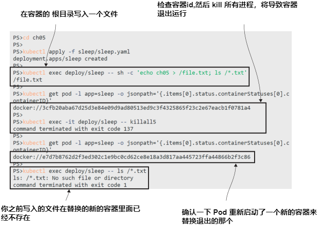
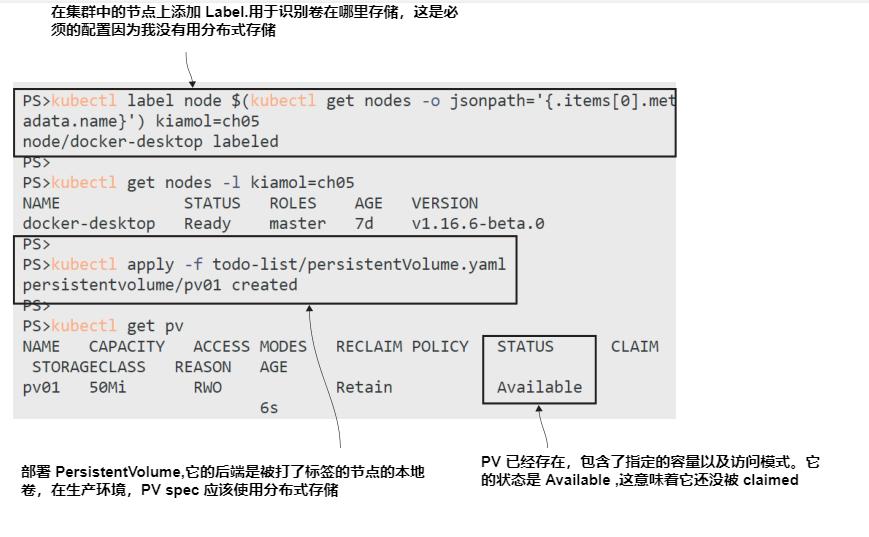
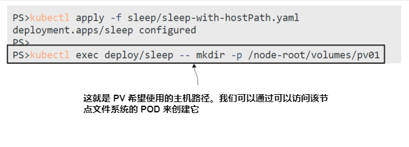
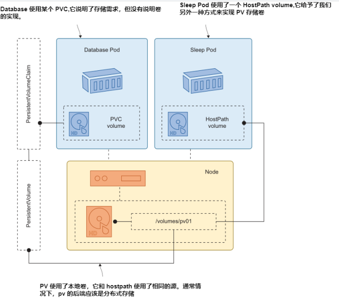
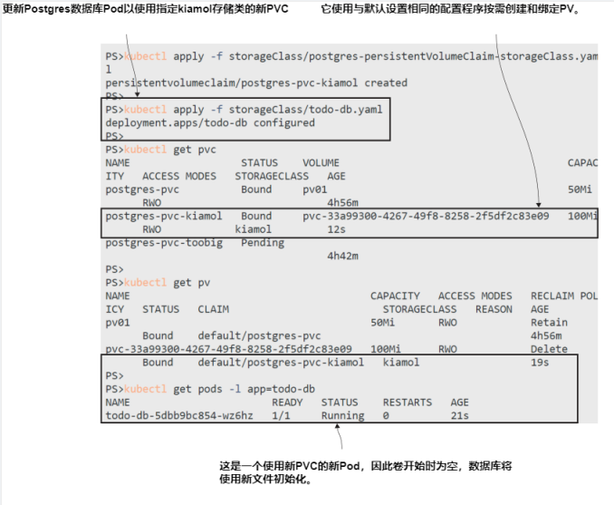

# 第五章 通过 volumes,mounts,claims 存储数据

在集群环境中访问数据是困难的。计算的移动是简单的部分，Kubernetes API与节点保持着持续的联系，如果一个节点停止响应，Kubernetes就会认为它已离线，并在其他节点上为其所有Pod启动替代品。但如果其中一个Pod中的应用程序将数据存储在节点上，那么在其他节点上启动时，替代品将无法访问该数据，如果该数据包含客户尚未完成的大订单，那将是令人失望的。你真的需要全集群存储，这样Pod就可以从任何节点访问相同的数据。

Kubernetes 没有内置集群范围的存储，因为没有一个解决方案适用于所有场景。应用程序有不同的存储需求，可以运行Kubernetes的平台有不同的存储能力。数据始终是访问速度和持久性之间的平衡，Kubernetes支持这一点，它允许您定义集群提供的不同存储类(storage class)，并为应用程序请求特定的存储类。在本章中，您将学习如何使用不同类型的存储，以及Kubernetes如何抽象出存储实现细节。

## 5.1 Kubernetes 如何构建容器文件系统

Pod 中的容器的文件系统由Kubernetes使用多个源构建。容器镜像提供文件系统的初始内容，并且每个容器都有一个可写存储层，用于从镜像写入新文件或更新任何文件。(Docker镜像是只读的，所以当容器从镜像中更新文件时，它实际上是在自己的可写层中更新文件的副本。)图5.1显示了Pod内部的情况。


<center>图5.1 容器并不知道这一点，但它们的文件系统是由Kubernetes构建的虚拟结构.</center>

在容器中运行的应用程序只看到一个它具有读写访问权限的文件系统，所有这些层的细节都是隐藏的。这对于将应用程序迁移到Kubernetes来说是很好的，因为它们不需要更改就可以在Pod中运行。但如果你的应用确实需要写入数据，你需要了解它们如何使用存储并设计Pods来支持它们的需求。否则，你的应用程序看起来运行正常，但当任何意外发生时(如使用新容器重新启动Pod)，你将面临数据丢失的风险。

**TRY IT NOW** If the app inside a container crashes and the container exits, the Pod will start a replacement. The new container will start with the filesystem from the container image and a new writable layer, and any data written by the previous container in its writable layer is gone.
<b>现在就试试</b>

```
# switch to this chapter’s exercise directory:
cd ch05
# deploy a sleep Pod:
kubectl apply -f sleep/sleep.yaml
# write a file inside the container:
kubectl exec deploy/sleep -- sh -c 'echo ch05 > /file.txt; ls /*.txt'
# check the container ID:
kubectl get pod -l app=sleep -o jsonpath='{.items[0].status.containerStatuses[0].containerID}'
# kill all processes in the container, causing a Pod restart:
kubectl exec -it deploy/sleep -- killall5
# check the replacment container ID:
kubectl get pod -l app=sleep -o jsonpath='{.items[0].status.containerStatuses[0].containerID}'
# look for the file you wrote it won’t be there:
kubectl exec deploy/sleep -- ls /*.txt
```
Remember two important things from this exercise: the filesystem of a Pod container has the life cycle of the container rather than the Pod, and when Kubernetes talks about a Pod restart, it’s actually referring to a replacement container. If your apps are merrily writing data inside containers, that data doesn’t get stored at the Pod level if the Pod restarts with a new container, all the data is gone. My output in figure 5.2 shows that.


<center>图5.2 可写层具有容器的生命周期，而不是Pod.</center>

We already know that Kubernetes can build the container filesystem from other sources we surfaced ConfigMaps and Secrets into filesystem directories in chapter 4. The mechanism for that is to define a volume at the Pod level that makes another storage source available and then to mount it into the container filesystem at a specified path. ConfigMaps and Secrets are read-only storage units, but Kubernetes supports many other types of volume that are writable. Figure 5.3 shows how you can design a Pod that uses a volume to store data that persists between restarts and could even be accessible clusterwide.


<center>图5.3 虚拟文件系统可以从引用外部存储块的卷构建.</center>

We’ll come to clusterwide volumes later in the chapter, but for now, we’ll start with a much simpler volume type, which is still useful for many scenarios. Listing 5.1 shows a Pod spec using a type of volume called EmptyDir, which is just an empty directory, but it’s stored at the Pod level rather than at the container level. It is mounted as a volume into the container, so it’s visible as a directory, but it’s not one of the image or container layers.

**Listing 5.1 sleep-with-emptyDir.yaml, a simple volume spec**
```
spec:
    containers:
        - name: sleep
          image: kiamol/ch03-sleep
          volumeMounts:
          - name: data # Mounts a volume called data
            mountPath: /data # into the /data directory
    volumes:
        - name: data # This is the data volume spec,
          emptyDir: {} # which is the EmptyDir type.
```

An empty directory sounds like the least useful piece of storage you can imagine, but actually it has a lot of uses because it has the same life cycle as the Pod. Any data stored in an EmptyDir volume remains in the Pod between restarts, so replacement containers can access data written by their predecessors.

**TRY IT NOW** Update the sleep deployment using the spec from listing 5.1,adding an EmptyDir volume. Now you can write data and kill the container and the replacement can read the data.
<b>现在就试试</b>

```
# update the sleep Pod to use an EmptyDir volume:
kubectl apply -f sleep/sleep-with-emptyDir.yaml
# list the contents of the volume mount:
kubectl exec deploy/sleep -- ls /data
# create a file in the empty directory:
kubectl exec deploy/sleep -- sh -c 'echo ch05 > /data/file.txt; ls /data'
# check the container ID:
kubectl get pod -l app=sleep -o jsonpath='{.items[0].status.containerStatuses[0].containerID}'
# kill the container processes:
kubectl exec deploy/sleep -- killall5
# check replacement container ID:
kubectl get pod -l app=sleep -o jsonpath='{.items[0].status.containerStatuses[0].containerID}'
# read the file in the volume:
kubectl exec deploy/sleep -- cat /data/file.txt
```
You can see my output in figure 5.4. The containers just see a directory in the filesystem, but it points to a storage unit which is part of the Pod.


<center>图5.4 像空目录这样的基本目录仍然是有用的，因为它可以由容器共享.</center>

You can use EmptyDir volumes for any applications that use the filesystem for temporary storage—maybe your app calls an API, which takes a few seconds to respond, and the response is valid for a long time. The app might save the API response in a local file because reading from disk is faster than repeating the API call. An EmptyDir volume is a reasonable source for a local cache because if the app crashes, then the replacement container will still have the cached files and still benefit from the speed boost.

EmptyDir volumes only share the life cycle of the Pod, so if the Pod is replaced,then the new Pod starts with, well, an empty directory. If you want your data to persist between Pods, then you can mount other types of volume that have their own life cycles.

## 5.2 在节点使用 volumes 及 mounts 存储数据

This is where working with data gets trickier than working with compute, because we need to think about whether data will be tied to a particular node—meaning any replacement Pods will need to run on that node to see the data—or whether the data has clusterwide access and the Pod can run on any node. Kubernetes supports many variations, but you need to know what you want and what your cluster supports and specify that for the Pod.

The simplest storage option is to use a volume that maps to a directory on the node, so when the container writes to the volume mount, the data is actually stored in a known directory on the node’s disk. We’ll demonstrate that by running a real app that uses an EmptyDir volume for cache data, understanding the limitations, and then upgrading it to use node-level storage.

**TRY IT NOW** Run a web application that uses a proxy component to improve performance. The web app runs in a Pod with an internal Service, and the proxy runs in another Pod, which is publicly available on a LoadBalancer Service.
<b>现在就试试</b>

```
# deploy the Pi application:
kubectl apply -f pi/v1/
# wait for the web Pod to be ready:
kubectl wait --for=condition=Ready pod -l app=pi-web
# find the app URL from your LoadBalancer:
kubectl get svc pi-proxy -o jsonpath='http://{.status.loadBalancer.ingress[0].*}:8080/?dp=30000'
# browse to the URL, wait for the response then refresh the page
# check the cache in the proxy
kubectl exec deploy/pi-proxy -- ls -l /data/nginx/cache
```

This is a common setup for web applications, where the proxy boosts performance by serving responses directly from its local cache, and that also reduces load on the web app. You can see my output in figure 5.5. The first Pi calculation took more than one second to respond, and the refresh was practically immediate because it came from the proxy and did not need to be calculated.


<center>图5.5 在 EmptyDir 卷中缓存文件意味着Pod重启后缓存仍然存在.</center>

An EmptyDir volume could be a reasonable approach for an app like this, because the data stored in the volume is not critical. If there’s a Pod restart, then the cache survives, and the new proxy container can serve responses cached by the previous container. If the Pod is replaced, then the cache is lost. The replacement Pod starts with an empty cache directory, but the cache isn’t required—the app still functions correctly; it just starts off slow until the cache gets filled again.

**TRY IT NOW** Remove the proxy Pod. It will be replaced because it’s managed by a deployment controller. The replacement starts with a new EmptyDir volume, which for this app means an empty proxy cache so requests are sent on to the web Pod.
<b>现在就试试</b>

```
# delete the proxy Pod:
kubectl delete pod -l app=pi-proxy
# check the cache directory of the replacement Pod:
kubectl exec deploy/pi-proxy -- ls -l /data/nginx/cache
# refresh your browser at the Pi app URL
```

My output is shown in figure 5.6. The result is the same, but I had to wait another second for it to be calculated by the web app, because the replacement proxy Pod started without a cache.


<center>图5.6 一个新的Pod从一个新的空目录开始.</center>

The next level of durability comes from using a volume that maps to a directory on the node’s disk, which Kubernetes calls a HostPath volume. HostPaths are specified as a volume in the Pod, which is mounted into the container filesystem in the usual way. When the container writes data into the mount directory, it actually is written to the disk on the node. Figure 5.7 shows the relationship among node, Pod, and volume.


<center>图5.7 HostPath卷维护Pod替换之间的数据，但前提是Pod使用相同的节点.</center>

HostPath volumes can be useful, but you need to be aware of their limitations. Data is physically stored on the node, and that’s that. Kubernetes doesn’t magically replicate that data to all the other nodes in the cluster. Listing 5.2 shows an updated Pod spec for the web proxy that uses a HostPath volume instead of an EmptyDir. When the proxy container writes cache files to /data/nginx/cache, they will actually be stored on the node at /volumes/nginx/cache.

**Listing 5.2 nginx-with-hostPath.yaml, mounting a HostPath volume**

```
spec: # This is an abridged Pod spec;
    containers: # the full spec also contains a configMap volume mount.
    - image: nginx:1.17-alpine
      name: nginx
      ports:
        - containerPort: 80
      volumeMounts:
        - name: cache-volume
          mountPath: /data/nginx/cache # The proxy cache path
    volumes:
    - name: cache-volume
      hostPath: # Using a directory on the node
        path: /volumes/nginx/cache # The volume path on the node
        type: DirectoryOrCreate # creates a path if it doesn’t exist
```
This method extends the durability of the data beyond the life cycle of the Pod to the life cycle of the node’s disk, provided replacement Pods always run on the same node. That will be the case in a single-node lab cluster because there’s only one node. Replacement Pods will load the HostPath volume when they start, and if it is populated with cache data from a previous Pod, then the new proxy can start serving cached data straight away.

**TRY IT NOW** Update the proxy deployment to use the Pod spec from listing 5.2, then use the app and delete the Pod. The replacement responds using the existing cache.
<b>现在就试试</b>

```
# update the proxy Pod to use a HostPath volume:
kubectl apply -f pi/nginx-with-hostPath.yaml
# list the contents of the cache directory:
kubectl exec deploy/pi-proxy -- ls -l /data/nginx/cache
# browse to the app URL
# delete the proxy Pod:
kubectl delete pod -l app=pi-proxy
# check the cache directory in the replacement Pod:
kubectl exec deploy/pi-proxy -- ls -l /data/nginx/cache
# refresh your browser
```

My output appears in figure 5.8. The initial request took just under a second to respond, but the refresh was pretty much instananeous because the new Pod inherited the cached response from the old Pod, stored on the node.


<center>图5.8 在单节点的集群中，Pods总是运行在同一个节点上，所以它们都可以使用HostPath.</center>

The obvious problem with HostPath volumes is that they don’t make sense in a cluster with more than one node, which is pretty much every cluster outside of a simple lab environment. You can include a requirement in your Pod spec to say the Pod should always run on the same node, to make sure it goes where the data is, but doing so lim- its the resilience of your solution—if the node goes offline, then the Pod won’t run, and you lose your app.

A less obvious problem is that method presents a nice security exploit. Kubernetes doesn’t restrict which directories on the node are available to use for HostPath volumes. The Pod spec shown in listing 5.3 is perfectly valid, and it makes the entire filesystem on the node available for the Pod container to access.

**Listing 5.3 sleep-with-hostPath.yaml, a Pod with full access to the node’s disk**
```
spec:
    containers:
      - name: sleep
        image: kiamol/ch03-sleep
        volumeMounts:
          - name: node-root
            mountPath: /node-root
    volumes:
      - name: node-root
        hostPath:
          path: / # The root of the node’s filesystem
          type: Directory # path needs to exist.
```

Anyone who has access to create a Pod from that specification now has access to the whole filesystem of the node where the Pod is running. You might be tempted to use a volume mount like this as a quick way to read multiple paths on the host, but if your app is compromised and an attacker can execute commands in the container, then they also have access to the node’s disk.

**TRY IT NOW** Run a Pod from the YAML shown in listing 5.3, and then run some commands in the Pod container to explore the node’s filesystem.
<b>现在就试试</b>

```
# run a Pod with a volume mount to the host:
kubectl apply -f sleep/sleep-with-hostPath.yaml
# check the log files inside the container:
kubectl exec deploy/sleep -- ls -l /var/log
# check the logs on the node using the volume:
kubectl exec deploy/sleep -- ls -l /node-root/var/log
# check the container user:
kubectl exec deploy/sleep -- whoami
```

As shown in figure 5.9, the Pod container can see the log files on the node, which in this case includes the Kubernetes logs. This is fairly harmless, but this container runs as the root user, which maps to the root user on the node, so the container has complete access to the filesystem.


<center>图5.9 危险!挂载HostPath可以让你完全访问节点上的数据.</center>

If this all seems like a terrible idea, remember that Kubernetes is a platform with a wide range of features to suit many applications. You could have an older app that needs to access specific file paths on the node where it is running, and the HostPath volume lets you do that. In that scenario, you can take a safer approach, using a volume that has access to one path on the node, which limits what the container can see by declaring subpaths for the volume mount. Listing 5.4 shows that.

**Listing 5.4 sleep-with-hostPath-subPath.yaml, restricting mounts with subpaths**
```
spec:
  containers:
    - name: sleep
      image: kiamol/ch03-sleep
      volumeMounts:
        - name: node-root # Name of the volume to mount
          mountPath: /pod-logs # Target path for the container
          subPath: var/log/pods # Source path within the volume
        - name: node-root
          mountPath: /container-logs
          subPath: var/log/containers
  volumes:
    - name: node-root
      hostPath:
        path: /
        type: Directory
```
Here, the volume is still defined at the root path on the node, but the only way to access it is through the volume mounts in the container, which are restricted to defined subpaths. Between the volume specification and the mount specification, you have a lot of flexibility in building and mapping your container filesystem.

**TRY IT NOW** Update the sleep Pod so the container’s volume mount is restricted to the subpaths defined in listing 5.4, and check the file contents.
<b>现在就试试</b>

```
# update the Pod spec:
kubectl apply -f sleep/sleep-with-hostPath-subPath.yaml
# check the Pod logs on the node:
kubectl exec deploy/sleep -- sh -c 'ls /pod-logs | grep _pi-'
# check the container logs:
kubectl exec deploy/sleep -- sh -c 'ls /container-logs | grep nginx'
```

In this exercise, there’s no way to explore the node’s filesystem other than through the mounts to the log directories. As shown in figure 5.10, the container can access files only in the subpaths.
HostPath volumes are a good way to start with stateful apps; they’re easy to use, and they work in the same way on any cluster. They are useful in real-world applications, too, but only when your apps are using state for temporary storage. For permanent storage, we need to move on to volumes which can be accessed by any node in the cluster.


<center>图5.10 限制对带子路径的卷的访问限制了容器可以做的事情.</center>

## 5.3 使用 persistent volumes 及 claims 存储集群范围数据

A Kubernetes cluster is like a pool of resources: it has a number of nodes, which each have some CPU and memory capacity they make available to the cluster, and Kubernetes uses that to run your apps. Storage is just another resource that Kubernetes makes available to your application, but it can only provide clusterwide storage if the nodes can plug into a distributed storage system. Figure 5.11 shows how Pods can access volumes from any node if the volume uses distributed storage.


<center>图5.11 分布式存储使 Pod 可以访问来自任何节点的数据，但它需要平台支持.</center>

Kubernetes supports many volume types backed by distributed storage systems: AKS clusters can use Azure Files or Azure Disk, EKS clusters can use Elastic Block Store, and in the datacenter, you can use simple Network File System (NFS) shares, or a networked filesystem like GlusterFS. All of these systems have different configuration requirements, and you can specify them in the volume spec for your Pod. Doing so would make your application spec tightly coupled to one storage implementation, and Kubernetes provides a more flexible approach.

Pods are an abstraction over the compute layer, and Services are an abstraction over the network layer. In the storage layer, the abstractions are PersistentVolumes (PV) and PersistentVolumeClaims. A PersistentVolume is a Kubernetes object that defines an available piece of storage. A cluster administrator may create a set of PersistentVolumes, which each contain the volume spec for the underlying storage system. Listing 5.5 shows a PersistentVolume spec that uses NFS storage.


**Listing 5.5 persistentVolume-nfs.yaml, a volume backed by an NFS mount**

```
apiVersion: v1
kind: PersistentVolume
metadata:
  name: pv01 # A generic storage unit with a generic name
spec:
  capacity:
    storage: 50Mi # The amount of storage the PV offers
  accessModes: # How the volume can be accessed by Pods
    - ReadWriteOnce # It can only be used by one Pod. 
  nfs: # This PV is backed by NFS.
    server: nfs.my.network # Domain name of the NFS server
    path: "/kubernetes-volumes" # Path to the NFS share
```

You won’t be able to deploy that spec in your lab environment, unless you happen to have an NFS server in your network with the domain name nfs.my.network and a share called kubernetes-volumes. You could be running Kubernetes on any platform, so for the exercises that follow, we’ll use a local volume that will work anywhere. (If I used Azure Files in the exercises, they would work only on an AKS cluster, because EKS and Docker Desktop and the other Kubernetes distributions aren’t configured for Azure volume types.)

**TRY IT NOW** Create a PV that uses local storage. The PV is clusterwide, but the volume is local to one node, so we need to make sure the PV is linked to the node where the volume lives. We’ll do that with labels.
<b>现在就试试</b>

```
# apply a custom label to the first node in your cluster:
kubectl label node $(kubectl get nodes -o jsonpath='{.items[0].metadata.name}') kiamol=ch05
# check the nodes with a label selector:
kubectl get nodes -l kiamol=ch05
# deploy a PV that uses a local volume on the labeled node:
kubectl apply -f todo-list/persistentVolume.yaml
# check the PV:
kubectl get pv
```

My output is shown in figure 5.12. The node labeling is necessary only because I’m not using a distributed storage system; you would normally just specify the NFS or Azure Disk volume configuration, which is accessible from any node. A local volume exists on only one node, and the PV identifies that node using the label.


<center>图5.12 如果没有分布式存储，可以通过将PV固定到本地卷来作弊.</center>

Now the PV exists in the cluster as an available storage unit, with a known set of features, including the size and access mode. Pods can’t use that PV directly; instead, they need to claim it using a PersistentVolumeClaim (PVC). The PVC is the storage abstraction that Pods use, and it just requests some storage for an application. The PVC gets matched to a PV by Kubernetes, and it leaves the underlying volume details to the PV. Listing 5.6 shows a claim for some storage that will be matched to the PV we created.

**Listing 5.6 postgres-persistentVolumeClaim.yaml, a PVC matching the PV**

```
apiVersion: v1
kind: PersistentVolumeClaim
metadata:
  name: postgres-pvc # The claim will be used by a specific app.
spec:
  accessModes: # The required access mode
    - ReadWriteOnce
resources:
  requests:
    storage: 40Mi # The amount of storage requested
storageClassName: "" # A blank class means a PV needs to exist.
```

The PVC spec includes an access mode, storage amount, and storage class. If no storage class is specified, Kubernetes tries to find an existing PV that matches the requirements in the claim. If there is a match, then the PVC is bound to the PV—there is a one-to-one link, so once a PV is claimed, it is not available for any other PVCs to use.

**TRY IT NOW** Deploy the PVC from listing 5.6. Its requirements are met by the PV we created in the previous exercise, so the claim will be bound to that volume.
<b>现在就试试</b>

```
# create a PVC that will bind to the PV:
kubectl apply -f todo-list/postgres-persistentVolumeClaim.yaml
# check PVCs:
kubectl get pvc
# check PVs:
kubectl get pv
```

My output appears in figure 5.13, where you can see the one-to-one binding: the PVC is bound to the volume, and the PV is bound by the claim.


**Figure 5.13 PVs are just units of storage in the cluster; you claim them for your app with a PVC.**
<center>图5.13 PV 只是集群中的存储单元;你可以用 PVC 来为你的应用认领它.</center>

This is a static provisioning approach, where the PV needs to be explicitly created so Kubernetes can bind to it. If there is no matching PV when you create a PVC, the claim is still created, but it’s not usable. It will stay in the system waiting for a PV to be created that meets its requirements.

**TRY IT NOW** The PV in your cluster is already bound to a claim, so it can’t be used again. Create another PVC that will remain unbound.
<b>现在就试试</b>

```
# create a PVC that doesn’t match any available PVs:
kubectl apply -f todo-list/postgres-persistentVolumeClaim-too-big.yaml
# check claims:
kubectl get pvc
```

You can see in figure 5.14 that the new PVC is in the Pending status. It will remain that way until a PV appears in the cluster with at least 100 MB capacity, which is the storage request in this claim.


<center>图5.14 对于静态配置（static provisioning），PVC将不可用，直到有一个PV可以绑定到它.</center>

A PVC needs to be bound before a Pod can use it. If you deploy a Pod that references an unbound PVC, the Pod will stay in the Pending state until the PVC is bound, and so your app will never run until it has the storage it needs. The first PVC we created has been bound, so it can be used, but by only one Pod. The access mode of the claim is ReadWriteOnce, which means the volume is writable but can be mounted by only one Pod. Listing 5.7 shows an abbreviated Pod spec for a Postgres database, using the PVC for storage.

**Listing 5.7 todo-db.yaml, a Pod spec consuming a PVC**
```
spec:
  containers:
    - name: db
      image: postgres:11.6-alpine
      volumeMounts:
        - name: data
          mountPath: /var/lib/postgresql/data
  volumes:
    - name: data
      persistentVolumeClaim: # Volume uses a PVC
        claimName: postgres-pvc # PVC to use
```

Now we have all the pieces in place to deploy a Postgres database Pod using a volume, which may or may not be backed by distributed storage. The application designer owns the Pod spec and the PVC and isn’t concerned about the PV—that’s dependent on the infrastructure of the Kubernetes cluster and could be managed by a different team. In our lab environment, we own it all. We need to take one more step: create the directory path on the node that the volume expects to use.

**TRY IT NOW** You probably won’t have access to log on to the nodes in a real Kubernetes cluster, so we’ll cheat here by running a sleep Pod, which has a HostPath mount to the node’s root, and create the directory using the mount.
<b>现在就试试</b>

```
# run the sleep Pod, which has access to the node’s disk:
kubectl apply -f sleep/sleep-with-hostPath.yaml
# wait for the Pod to be ready:
kubectl wait --for=condition=Ready pod -l app=sleep
# create the directory path on the node, which the PV expects:
kubectl exec deploy/sleep -- mkdir -p /node-root/volumes/pv01
```

Figure 5.15 shows the sleep Pod running with root permissions, so it can create the directory on the node, even though I don’t have access to the node directly.


<center>图5.15 在本例中，HostPath是访问节点PV源的另一种方式.</center>

Everything is in place now to run the to-do list app with persistent storage. Normally, you won’t need to go through as many steps as this, because you’ll know the capabilities your cluster provides. I don’t know what your cluster can do, however, so these exercises work on any cluster, and they’ve been a useful introduction to all the storage resources. Figure 5.16 shows what we’ve deployed so far, along with the database we’re about to deploy.


<center>图5.16 只是有点复杂——将PV和HostPath映射到相同的存储位置.</center>

Let’s run the database. When the Postgres container is created, it mounts the volume in the Pod, which is backed by the PVC. This new database container connects to an empty volume, so when it starts up, it will initialize the database, creating the writeahead log (WAL), which is the main data file. The Postgres Pod doesn’t know it, but the PVC is backed by a local volume on the node, where we also have a sleep Pod running, which we can use to look at the Postgres files.

**TRY IT NOW** Deploy the database, and give it time to initialize the data files, and then check what’s been written in the volume using the sleep Pod.
<b>现在就试试</b>

```
# deploy the database:
kubectl apply -f todo-list/postgres/
# wait for Postgres to initialize:
sleep 30
# check the database logs:
kubectl logs -l app=todo-db --tail 1
# check the data files in the volume:
kubectl exec deploy/sleep -- sh -c 'ls -l /node-root/volumes/pv01 | grep wal'
```

My output in figure 5.17 shows he database server starting correctly and waiting for connections, having written all its data files to the volume.


<center>图5.17 数据库容器写入本地数据路径，但这实际上是PVC的挂载.</center>

The last thing to do is run the app, test it, and confirm the data still exists if the data-
base Pod is replaced.

**TRY IT NOW** Run the web Pod for the to-do app, which connects to the Postgres database.
<b>现在就试试</b>

```
# deploy the web app components:
kubectl apply -f todo-list/web/
# wait for the web Pod:
kubectl wait --for=condition=Ready pod -l app=todo-web
# get the app URL from the Service:
kubectl get svc todo-web -o jsonpath='http://{.status.loadBalancer.ingress[0].*}:8081/new'
# browse to the app, and add a new item
# delete the database Pod:
kubectl delete pod -l app=todo-db
# check the contents of the volume on the node:
kubectl exec deploy/sleep -- ls -l /node-root/volumes/pv01/pg_wal
# check that your item is still in the to-do list
```

You can see in figure 5.18 that my to-do app is showing some data, and you’ll just have to take my word for it that the data was added into the first database Pod and reloaded from the second database Pod.


<center>图5.18 存储抽象意味着数据库只需挂载PVC就可以获得持久存储.</center>

We now have a nicely decoupled app, with a web Pod that can be updated and scaled independently of the database, and a database Pod, which uses persistent storage outside of the Pod life cycle. This exercise used a local volume as the backing store for the persistent data, but the only change you’d need to make for a production deployment is to replace the volume spec in the PV with a distributed volume supported by your cluster.

Whether you should run a relational database in Kubernetes is a question we’ll address at the end of the chapter, but before we do that, we’ll look at the real deal with storage: having the cluster dynamically provision volumes based on an abstracted storage class.


## 5.4 动态 volume provisioning 及 storage classes

So far we’ve used a static provisioning workflow. We explicitly created the PV and then created the PVC, which Kubernetes bound to the PV. That works for all Kubernetes clusters and might be the preferred workflow in organizations where access to storage is strictly controlled, but most Kubernetes platforms support a simpler alternative with dynamic provisioning.
In the dynamic provisioning workflow, you just create the PVC, and the PV that backs it is created on demand by the cluster. Clusters can be configured with multiple storage classes that reflect the different volume capabilities on offer as well as a default storage class. PVCs can specify the name of the storage class they want, or if they want to use the default class, then they omit the storage class field in the claim spec, as shown in listing 5.8.

**Listing 5.8 postgres-persistentVolumeClaim-dynamic.yaml, dynamic PVC**

```
apiVersion: v1
kind: PersistentVolumeClaim
metadata:
  name: postgres-pvc-dynamic
spec:
  accessModes:
    - ReadWriteOnce
  resources:
    requests:
      storage: 100Mi
      # There is no storageClassName field, so this uses the default class.
```

You can deploy this PVC to your cluster without creating a PV—but I can’t tell you what will happen, because that depends on the setup of your cluster. If your Kubernetes platform supports dynamic provisioning with a default storage class, then you’ll see a PV is created and bound to the claim, and that PV will use whatever volume type your cluster has set for the default.

**TRY IT NOW** Deploy a PVC, and see if it is dynamically provisioned.
<b>现在就试试</b>

```
# deploy the PVC from listing 5.8:
kubectl apply -f todo-list/postgres-persistentVolumeClaim-dynamic.yaml
# check claims and volumes:
kubectl get pvc
kubectl get pv
# delete the claim:
kubectl delete pvc postgres-pvc-dynamic
# check volumes again:
kubectl get pv
```

What happens when you run the exercise? Docker Desktop uses a HostPath volume in the default storage class for dynamically provisioned PVs; AKS uses Azure Files; K3s uses HostPath but with a different configuration from Docker Desktop, which means you won’t see the PV because it is created only when a Pod that uses the PVC is cre- ated. Figure 5.19 shows my output from Docker Desktop. The PV is created and bound to the PVC, and when the PVC is deleted, the PV is removed, too.


<center>图5.19 Docker Desktop 有一组默认 storage class 的行为;其他平台有所不同.</center>

Storage classes provide a lot of flexibility. You create them as standard Kubernetes resources, and in the spec, you define exactly how the storage class works with the following three fields:
- provisioner—the component that creates PVs on demand. Different platforms have different provisioners, for example, the provisioner in the default AKS storage class integrates with Azure Files to create new file shares.
- reclaimPolicy—defines what to do with dynamically created volumes when the claim is deleted. The underlying volume can be deleted, too, or it can be retained.
- volumeBindingMode—determines whether the PV is created as soon as the PVC is created or not until a Pod that uses the PVC is created.

Combining those properties lets you put together a choice of storage classes in your cluster, so applications can request the properties they need—everything from fast local storage to highly available clustered storage—without ever specifying the exact details of a volume or volume type. I can’t give you a storage class YAML that I can be sure will work on your cluster, because clusters don’t all have the same provisioners available. Instead we’ll create a new storage class by cloning your default class.

**TRY IT NOW** Fetching the default storage class and cloning it contains some nasty details, so I’ve wrapped those steps in a script. You can check the script contents if you’re curious, but you may need to have a lie-down afterward.
<b>现在就试试</b>

```
# list the storage classes in the cluster:
kubectl get storageclass
# clone the default on Windows:
Set-ExecutionPolicy Bypass -Scope Process -Force;
./cloneDefaultStorageClass.ps1
# OR on Mac/Linux:
chmod +x cloneDefaultStorageClass.sh && ./cloneDefaultStorageClass.sh
# list storage classes:
kubectl get sc
```

The output you see from listing the storage classes shows what your cluster has configured. After running the script, you should have a new class called kiamol, which has the same setup as the default storage class. My output from Docker Desktop is shown in figure 5.20.


<center>图5.20 克隆 default storage class 以创建可在PVC spec 中使用的自定义类型.</center>

Now you have a custom storage class that your apps can request in a PVC. This is a much more intuitive and flexible way to manage storage, especially in a cloud platform where dynamic provisioning is simple and fast. Listing 5.9 shows a PVC spec requesting the new storage class.

**Listing 5.9 postgres-persistentVolumeClaim-storageClass.yaml**
```
spec:
  accessModes:
    - ReadWriteOnce
  storageClassName: kiamol # The storage class is the abstraction.
  resources:
    requests:
      storage: 100Mi
```

The storage classes in a production cluster will have more meaningful names, but we all now have a storage class with the same name in our clusters, so we can update the Postgres database to use that explicit class.

**TRY IT NOW** Create the new PVC, and update the database Pod spec to use it.
<b>现在就试试</b>

```
# create a new PVC using the custom storage class:
kubectl apply -f storageClass/postgres-persistentVolumeClaim-
storageClass.yaml
# update the database to use the new PVC:
kubectl apply -f storageClass/todo-db.yaml
# check the storage:
kubectl get pvc
kubectl get pv
# check the Pods:
kubectl get pods -l app=todo-db
# refresh the list in your to-do app
```

This exercise switches the database Pod to use the new dynamically provisioned PVC, as shown in my output in figure 5.21. The new PVC is backed by a new volume, so it will start empty and you’ll lose your previous data. The previous volume still exists, so you could deploy another update to your database Pod, revert it back to the old PVC, and see your items.


<center>图5.21 使用 storage classes 极大地简化了你的应用配置;你只需在你的PVC中命名这个类别.</center>

## 5.5 理解 Kubernetes 中存储的选择

So that’s storage in Kubernetes. In your usual work, you’ll define PersistentVolumeClaims for your Pods and specify the size and storage class you need, which could be a custom value like FastLocal or Replicated. We took a long journey to get there in this chapter, because it’s important to understand what actually happens when you claim storage, what other resources are involved, and how you can configure them.

We also covered volume types, and that’s an area you’ll need to research more to understand what options are available on your Kubernetes platform and what capabilities they provide. If you’re in a cloud environment, you should have the luxury of multiple clusterwide storage options, but remember that storage costs, and fast storage costs a lot. You need to understand that you can create a PVC using a fast storage class that could be configured to retain the underlying volume, and that means you’ll still be paying for storage when you’ve deleted your deployment.

Which brings us to the big question: should you even use Kubernetes to run stateful apps like databases? The functionality is all there to give you highly available, replicated storage (if your platform provides it), but that doesn’t mean you should rush to decommission your Oracle estate and replace it with MySQL running in Kubernetes. Managing data adds a lot of complexity to your Kubernetes applications, and running stateful apps is only part of the problem. There are data backups, snapshots, and rollbacks to think about, and if you’re running in the cloud, a managed database service will probably give you that out of the box. But having your whole stack defined in Kubernetes manifests is pretty tempting, and some modern database servers are designed to run in a container platform; TiDB and CockroachDB are options worth looking at.

All that’s left now is to tidy up your lab cluster before we move on to the lab.

**TRY IT NOW** Delete all the objects from the manifests used in this chapter. You can ignore any errors you get, because not all the objects will exist when you run this.
<b>现在就试试</b>

```
# delete deployments, PVCs, PVs, and Services:
kubectl delete -f pi/v1 -f sleep/ -f storageClass/ -f todo-list/web -f todo-list/postgres -f todo-list/
# delete the custom storage class:
kubectl delete sc kiamol
```

## 5.6 实验室

These labs are meant to give you some experience in real-world Kubernetes problems, so I’m not going to ask you to replicate the exercise to clone the default storage class. Instead we have a new deployment of the to-do app, which has a couple of issues. We’re using a proxy in front of the web Pod to improve performance and a local database file inside the web Pod because this is just a development deployment. We need some persistent storage configured at the proxy layer and the web layer, so you can remove Pods and deployments, and the data still persists.

- Start by deploying the app manifests in the ch05/lab/todo-list folder; that creates the Services and Deployments for the proxy and web components.
- Find the URL for the LoadBalancer, and try using the app. You’ll find it doesn’t respond, and you’ll need to dig into the logs to find out what’s wrong.
- Your task is to configure persistent storage for the proxy cache files and for the database file in the web Pod. You should be able to find the mount targets from the log entries and the Pod spec.
- When you have the app running, you should be able to add some data, delete all your Pods, refresh the browser, and see that your data is still there.
- You can use any volume type or storage class that you like. This is a good opportunity to explore what your platform provides.

My solution is on GitHub as usual for you to check if you need to: https://github.com/sixeyed/kiamol/blob/master/ch05/lab/README.md.