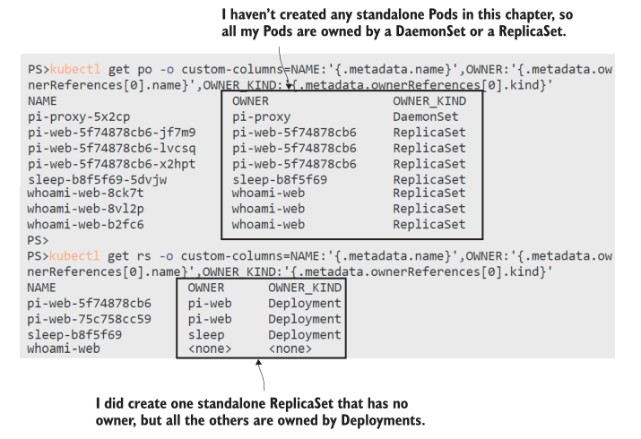

# 第六章 通过 controllers 在多个 Pod 之间扩展应用

扩展应用程序的基本思想很简单:运行更多的pod。Kubernetes 将网络和存储从计算层中抽象出来，所以你可以运行许多 pod，它们是同一个应用程序的副本，只需将它们插入相同的抽象中即可。Kubernetes称这些pod为副本，在多节点集群中，它们将分布在许多节点上。这为您提供了规模的所有好处:更大的负载处理能力和故障时的高可用性——所有这些都在一个可以在几秒钟内扩大和缩小的平台中。

Kubernetes 还提供了一些可替代的扩展选项来满足不同的应用程序需求，我们将在本章中详细介绍这些选项。您最常使用的是 Deployment 控制器，它实际上是最简单的，但我们也将花时间讨论其他控制器，以便您了解如何在集群中扩展不同类型的应用程序。

## 6.1 Kubernetes 如何大规模运行应用程序

Pod 是 Kubernetes 中的计算单元，你在第二章中了解到你通常不会直接运行Pod;相反，您可以定义另一个资源来为您管理它们。该资源是一个控制器，从那时起我们就一直使用 Deployment 控制器。控制器 spec 配置包括一个 Pod Template，用于创建和替换Pod。它可以使用相同的 Template 创建Pod的多个副本。

Deployments 可能是您在Kubernetes中使用最多的资源，并且您已经有了很多使用它们的经验。现在是时候深入挖掘并了解 Deployment 实际上并不直接管理Pods——这是由另一个称为 ReplicaSet 的资源完成的。图6.1显示了Deployment、ReplicaSet和Pods之间的关系。


<center>图 6.1 每个软件问题都可以通过添加另一个抽象层来解决</center>

在大多数情况下，你会使用 Deployment 来描述你的应用; Deployment 是一个管理 ReplicaSet 的控制器，ReplicaSet 是一个管理 Pods 的控制器。您可以直接创建 ReplicaSet，而不是使用Deployment，我们将在前几个练习中这样做，只是为了了解如何进行伸缩。ReplicaSet 的 YAML 与 Deployment 的 YAML 几乎相同;它需要一个选择器来查找它拥有的资源，需要一个 Pod 模板来创建资源。清单 6.1显 示了一个简短的 spec 配置。

> 清单 6.1 whoami.yaml, 一个不包含 Deployment 的 ReplicaSet

```
apiVersion: apps/v1
kind: ReplicaSet # Spec 配置与 deployment 基本相同
metadata:
  name: whoami-web
spec:
  replicas: 1
  selector: # selector 用于匹配 Pods
    matchLabels:
      app: whoami-web
  template: # 后面就是常规的 pod temlate.
```

在这个 spec 中，与我们使用的与 deployment 定义唯一不同的地方是对象类型 ReplicaSet 和 replicas字段，它声明要运行多少个pod。该 spec 使用单个副本，这意味着Kubernetes将运行单个Pod。

<b>现在就试试</b> 部署 ReplicaSet 和 LoadBalancer Service，它使用与 ReplicaSet 相同的标签选择器将流量发送到Pods。

```
# 进入本章练习目录:
cd ch06
# 部署 ReplicaSet 和 Service:
kubectl apply -f whoami/
# 检查资源:
kubectl get replicaset whoami-web
# 向 service 发起 http 请求:
curl $(kubectl get svc whoami-web -o jsonpath='http://{.status.loadBalancer.ingress[0].*}:8088')
# 删除所有的 Pods:
kubectl delete pods -l app=whoami-web
# 发起请求:
curl $(kubectl get svc whoami-web -o jsonpath='http://{.status.loadBalancer.ingress[0].*}:8088')
# 查看 ReplicaSet 明细:
kubectl describe rs whoami-web
```

可以在图6.2中看到我的输出。这里没有什么新东西;ReplicaSet拥有一个Pod，当你删除那个Pod时，ReplicaSet会替换它。我在最后的命令中删除了kubectl描述输出，但是如果运行它，您将看到它以一个事件列表结束，ReplicaSet在其中写入关于它如何创建Pods的活动日志。


<center>图 6.2 使用 ReplicaSet 就像使用 Deployment: 它创建并管理Pods</center>

ReplicaSet 替换删除的 Pods 是因为它不断地运行一个控制循环，检查它拥有的对象数量是否与它应该拥有的副本数量相匹配。当您扩展应用程序时，您使用相同的机制—您更新ReplicaSet规范以设置新的副本数量，然后控制循环看到它需要更多副本，并从相同的 Pod 模板创建它们。

<b>现在就试试</b> 通过部署指定三个副本的更新 ReplicaSet 定义来扩展应用程序。

```
# 部署更新后的应用:
kubectl apply -f whoami/update/whoami-replicas-3.yaml
# 检查 Pods:
kubectl get pods -l app=whoami-web
# 删除所有 Pods:
kubectl delete pods -l app=whoami-web
# 再次检查:
kubectl get pods -l app=whoami-web
# 多发起几次 http 请求:
curl $(kubectl get svc whoami-web -o jsonpath='http://{.status.loadBalancer.ingress[0].*}:8088')
```

如图6.3所示，我的输出提出了几个问题:Kubernetes是如何快速扩展应用程序的，以及HTTP响应是如何来自不同的pod的?


<center>图 6.3 扩展 ReplicaSets 是快速的，并且在规模上，一个 Service 可以将请求分发到许多pod</center>

第一个问题很简单:这是一个单节点集群，所以每个 Pod 都将运行在同一个节点上，并且该节点已经为应用程序拉取了 Docker 镜像。当你在生产集群中扩展时，很可能会安排新的 Pod 运行在本地没有镜像的节点上，它们需要在运行 Pod 之前拉取镜像。你可以缩放的速度受限于你的镜像可以被拉取的速度，这就是为什么你需要投入时间来优化你的镜像。

至于我们如何向同一个 Kubernetes 服务发出 HTTP 请求，并从不同的 pod 获得响应，这都取决于服务和 Pods 之间的松散耦合。当你扩大 ReplicaSet 时，突然有多个 pod 与服务的标签选择器匹配，当这种情况发生时，Kubernetes 在 pod 之间平衡负载请求。图 6.4 显示了相同的标签选择器如何维护 ReplicaSet 和 Pods 之间以及 Service 和 Pods 之间的关系。


<center>图 6.4 具有与 ReplicaSet 相同标签选择器的 Service 将使用其所有 pod</center>

网络和计算之间的抽象使得 Kubernetes 的扩展如此容易。您现在可能正在经历一种温暖的感觉——突然，所有的复杂性都开始适应，您会看到资源之间的分离是如何促成一些非常强大的功能的。这是扩展的核心:你运行尽可能多的 pod，它们都位于一个 Service 后面。当消费者访问服务时，Kubernetes在Pods之间分配负载。

负载均衡是 Kubernetes 中所有服务类型的特性。在这些练习中，我们已经部署了一个 LoadBalancer Service，它接收到集群中的流量并将其发送到Pods。它还创建了一个 ClusterIP 供其他 pod 使用，当 pod 在集群内通信时，它们也受益于负载平衡。

<b>现在就试试</b> 部署一个新的 Pod，并使用它在内部调用 who-am-I 服务，使用 ClusterIP, Kubernetes从服务名称解析ClusterIP。

```
# 运行一个 sleep Pod:
kubectl apply -f sleep.yaml
# 检查 who-am-i Service 信息:
kubectl get svc whoami-web
# 在 sleep Pod 中为服务运行DNS查找:
kubectl exec deploy/sleep -- sh -c 'nslookup whoami-web | grep "^[^*]"'
# 发起一些 http 请求:
kubectl exec deploy/sleep -- sh -c 'for i in 1 2 3; do curl -w \\n -s http://whoami-web:8088; done;'
```

如图6.5所示，Pod 使用内部服务的行为与外部消费者的行为相同，并且请求在Pod之间是负载平衡的。当您运行这个练习时，您可能会看到请求完全均匀地分布，或者您可能会看到一些pod响应不止一次，这取决于网络的变化。


<center>图 6.5 集群内部的世界:Pod-to-Pod网络还受益于服务负载均衡。</center>

在第3章中，我们讨论了服务，以及ClusterIP地址是如何从Pod的IP地址抽象出来的，因此当Pod被替换时，应用程序仍然可以使用相同的服务地址访问。现在您可以看到，服务可以是跨许多Pod的抽象，将流量路由到任何节点上的Pod的同一网络层可以跨多个Pod进行负载平衡。

## 6.2 使用 Deployments 和 ReplicaSets 来扩展负载

ReplicaSets 使得扩展应用变得非常容易:你可以在几秒钟内通过改变 spec 中的副本数量来扩展或缩小应用。它非常适合运行在小型精简容器中的无状态组件，这就是为什么 Kubernetes 构建的应用程序通常使用分布式架构，将功能分解为许多块，可以单独更新和扩展。

部署在 ReplicaSets 之上添加了一个有用的管理层。既然我们知道了它们的工作原理，我们就不再直接使用 ReplicaSets 了—— Deployments 应该是定义应用程序的首选。在第9章介绍应用程序升级和回滚之前，我们不会探讨 deployment 的所有特性，但是准确地理解额外的抽象会给您带来什么是很有用的。图6.6显示了这一点。


<center>图 6.6 0 是所需副本的有效数量; Deployment 将旧的ReplicaSets缩小到零</center>

Deployment 是 ReplicaSet 的一个控制器，为了大规模运行，您需要在Deployment spec 中包含相同的replicas字段，并将其传递给ReplicaSet。清单6.2显示了Pi web应用程序的缩略YAML，它显式地设置了两个副本。

> 清单 6.2 web.yaml, 一个 Deployment 运行多个副本

```
apiVersion: apps/v1
kind: Deployment
metadata:
  name: pi-web
spec:
  replicas: 2 # replicas 是可选项; 默认值 1.
selector:
  matchLabels:
    app: pi-web
  template: # 后续就是 Pod 的 Template 配置.
```

Deployment 的标签选择器需要匹配 Pod 模板中定义的标签，这些标签用于表示从 Pod 到 ReplicaSet 到 Deployment 的所有权链。当您扩展一个 Deployment 时，它会更新现有的 ReplicaSet 以设置新的副本数量，但是如果您更改了 Deployment 中的 Pod spec，它会替换 ReplicaSet 并将之前的ReplicaSet缩小到零。这使得 Deployment 在如何管理更新以及如何处理任何问题方面拥有很大的控制权。

<b>现在就试试</b> 为Pi web应用程序创建一个 Deployment和 Service，并进行一些更新，以查看如何管理ReplicaSets。

```
# 部署 Pi app:
kubectl apply -f pi/web/
# 检查 ReplicaSet:
kubectl get rs -l app=pi-web
# 增加副本 replicas:
kubectl apply -f pi/web/update/web-replicas-3.yaml
# 检查 RS:
kubectl get rs -l app=pi-web
# 使用增强的日志记录部署更改的 Pod Spec:
kubectl apply -f pi/web/update/web-logging-level.yaml
# 再次检查 ReplicaSets:
kubectl get rs -l app=pi-web
```

这个练习表明 ReplicaSet 仍然是缩放机制:当您增加或减少部署中的副本数量时，它只是更新ReplicaSet。Deployment是部署机制，它通过多个replicaset管理应用程序更新。我的输出(如图6.7所示)显示了Deployment如何等待新的ReplicaSet完全可操作，然后再完全缩小旧的ReplicaSet。


<center>图 6.7 Deployments 管理 ReplicaSets 以在更新期间保持所需数量的pod可用</center>

可以使用 kubectl scale 命令作为缩放控制器的快捷方式。你应该谨慎使用它，因为它是一种强制的工作方式，使用声明性YAML文件要好得多，这样你的应用程序在生产中的状态总是与源代码控制中存储的规范完全匹配。但是，如果您的应用程序性能不佳，并且自动部署需要90秒，那么这是一种快速扩展的方法——只要您还记得更新YAML文件。

<b>现在就试试</b> 直接使用 kubectl 扩展 Pi 应用程序，然后看看在另一个完全部署发生时ReplicaSets会发生什么。

```
# 我们需要快速扩展 Pi app:
kubectl scale --replicas=4 deploy/pi-web
# 检查哪一个 ReplicaSet 发生了变化:
kubectl get rs -l app=pi-web
# 现在我们可以恢复到原始的日志级别:
kubectl apply -f pi/web/update/web-replicas-3.yaml
# 但这将撤销我们手动设置的副本:
kubectl get rs -l app=pi-web
# 检查 Pods:
kubectl get pods -l app=pi-web
```

当你应用更新后的 YAML 时，你会看到两件事:应用程序缩小到三个副本，部署通过将新的ReplicaSet缩小到0个pod和将旧的ReplicaSet 回归到3个pod来实现这一点。图 6.8显示了更新后的Deployment将创建三个新的pod。


<center>图 6.8 Deployment 知道它们的 ReplicaSet 的 spec 信息，并且可以通过扩展旧的ReplicaSet来回滚。</center>

部署更新覆盖了手动缩放级别，这并不奇怪;YAML定义是理想的状态，如果两者不一致，Kubernetes不会试图保留当前规范的任何部分。部署重用旧的ReplicaSet而不是创建一个新的ReplicaSet，这可能更令人惊讶，但这是Kubernetes工作的更有效的方式，因为有更多的标签。

从部署中创建的Pods有一个生成的名称，看起来是随机的，但实际上不是。Pod名称包含部署的Pod spec 中的模板哈希，因此如果您对 spec 进行了与以前的部署相匹配的更改，那么它将具有与缩小的 ReplicaSet 相同的模板哈希，并且部署可以找到该 ReplicaSet 并再次扩大它以实现更改。Pod模板哈希存储在一个标签中。

<b>现在就试试</b> 查看Pi Pods和ReplicaSets的标签以查看 template hash 信息。

```
# 查询 ReplicaSets 并显示 labels:
kubectl get rs -l app=pi-web --show-labels
# 查询 Pods 显示 labels:
kubectl get po -l app=pi-web --show-labels
```

图6.9显示 template hash 包含在对象名称中，但这只是为了方便——kubernetes使用标签进行管理。


<center>图 6.9 Kubernetes 生成的对象名称不仅仅是随机的——它们包括 template hash 值</center>

了解一个 Deployment 如何与它的 Pods 相关的内部机制，将帮助您理解更改是如何推出的，并在您看到大量Pod数为零的ReplicaSets时消除任何困惑。但是Pods中的计算层和服务中的网络层之间的交互是以相同的方式工作的。

在典型的分布式应用程序中，每个组件都有不同的规模需求，您将使用 Service 来实现它们之间的多层负载平衡。到目前为止，我们部署的Pi应用程序只有一个ClusterIP Service——它不是面向公众的组件。公共组件是一个代理(实际上，它是一个反向代理，因为它处理传入流量而不是传出流量)，并且使用LoadBalancer Service。我们可以大规模地运行web组件和代理，并实现从客户端到代理Pods以及从代理到应用程序Pods的负载平衡。

<b>现在就试试</b> 创建代理 Deployment，它运行两个副本，以及一个Service和ConfigMap，用于设置与Pi web应用程序的集成。

```
# 部署 proxy 资源:
kubectl apply -f pi/proxy/
# 获取代理应用 URL:
kubectl get svc whoami-web -o jsonpath='http://{.status.loadBalancer.ingress[0].*}:8080/?dp=10000'
# 访问 app, 多尝试几个不同的  dp 参数值
```

如果您在浏览器中打开开发人员工具并查看网络请求，您可以找到代理发送的响应头。其中包括代理服务器的主机名(实际上是Pod名)，以及网页本身包括生成响应的web应用程序Pod的名称。我的输出(如图6.10所示)显示了来自代理缓存的响应。


<center>图 6.10 Pi的响应包括发送它们的Pod的名称，所以你可以看到负载均衡在工作。</center>

这个配置很简单，很容易扩展。代理的Pod spec 使用两个卷:ConfigMap用于加载代理配置文件，EmptyDir用于存储缓存的响应。ConfigMap是只读的，所以一个ConfigMap可以被所有的代理pod共享。EmptyDir卷是可写的，但它们对于Pod是唯一的，因此每个代理都有自己的卷用于缓存文件。图6.11显示了设置过程。


<center>图 6.11 大规模运行Pod——一些类型的卷可以共享，而另一些则是Pod独有的。</center>

这种架构提出了一个问题，如果您请求将 Pi 移到小数点后很多位，并不断刷新浏览器，您就会看到这个问题。第一个请求会很慢，因为它是由web应用程序计算的;随后的响应将很快，因为它们来自代理缓存，但很快你的请求将转到另一个代理Pod，它的缓存中没有响应，所以页面将再次加载缓慢。

通过使用共享存储来解决这个问题会很好，这样每个代理Pod都可以访问相同的缓存。这样做将把我们带回到分布式存储的棘手领域，我们认为我们已经在第5章中离开了，但是让我们从一个简单的方法开始，看看它会给我们带来什么。

<b>现在就试试</b>  部署对代理 spec 的更新，该更新使用HostPath卷来缓存文件，而不是EmptyDir卷。同一节点上的多个pod将使用相同的卷，这意味着它们将有一个共享的代理缓存。

```
# 部署更新后的 spec:
kubectl apply -f pi/proxy/update/nginx-hostPath.yaml
# 检查 Pods—新的配置有 3个副本:
kubectl get po -l app=pi-proxy
# 访问 Pi app, 多刷新几次
# 检查 proxy 的日志:
kubectl logs -l app=pi-proxy --tail 1
```

现在你应该能够刷新到你想要的内容，并且响应总是来自缓存，无论你被指向哪个代理Pod。图6.12显示了所有响应请求的代理pod，这些请求由服务在它们之间共享。
对于大多数有状态应用程序，这种方法不起作用。写数据的应用程序倾向于假设它们对文件有独占访问权，如果同一个应用程序的另一个实例试图使用相同的文件位置，你会得到意想不到但令人失望的结果——比如应用程序崩溃或数据损坏。我使用的反向代理叫做Nginx;它在这里非常宽容，并且它很乐意与它自己的其他实例共享它的缓存目录。


<center>图 6.12 在规模上，您可以使用标签选择器使用kubectl查看所有Pod日志</center>

如果你的应用需要伸缩性和存储空间，你可以选择使用不同类型的控制器。在本章的剩余部分，我们将查看DaemonSet;最后一种类型是StatefulSet，它很快就会变得复杂，我们将在第8章讲到它，在那里它得到了本章的大部分内容。DaemonSets和StatefulSets都是Pod控制器，尽管使用它们的频率远低于 Deployment ，但您需要知道可以使用它们做什么，因为它们支持一些强大的模式。

## 6.3 使用 DaemonSets 实现高可用性

DaemonSet 得名于 Linux 守护进程，它通常是一个在后台作为单个实例不断运行的系统进程(相当于Windows世界中的Windows Service)。在Kubernetes中，DaemonSet 在集群中的每个节点上运行 Pod 的单个副本，如果在 spec 中添加选择器，则在节点的子集上运行 Pod 的单个副本。

daemonset 通常用于基础设施级的关注点，您可能希望从每个节点获取信息并将其发送到中央收集器。Pod 在每个节点上运行，只为该节点抓取数据。您不需要担心任何资源冲突，因为节点上只有一个Pod。我们将在本书后面使用 DaemonSets 从 Pods 收集日志，以及关于节点活动的度量。

当您希望获得高可用性，而不需要在每个节点上加载多个副本时，也可以在自己的设计中使用它们。反向代理就是一个很好的例子:单个Nginx Pod可以处理数千个并发连接，所以你不一定需要很多，但你可能想确保每个节点上都有一个运行，这样本地Pod就可以响应任何流量到达的地方。清单6.3显示了daemonset的缩略YAML——它看起来很像其他控制器，但没有 replica 计数。

> 清单 6.3 nginx-ds.yaml, 代理组件的 DamonSet

```
apiVersion: apps/v1
kind: DaemonSet
metadata:
  name: pi-proxy
spec:
  selector:
    matchLabels: # DaemonSets使用相同的标签选择器机制.
      app: pi-proxy 
template:
  metadata:
    labels:
      app: pi-proxy # 应用于Pods的标签必须与选择器匹配。
spec:
# 后续就是 pod 常规的 spec 信息
```

代理的这个 spec 仍然使用HostPath卷。这意味着每个Pod都有自己的代理缓存，所以我们无法从共享缓存中获得最佳性能。这种方法适用于其他有状态应用，它们比Nginx更麻烦，因为多个实例使用相同的数据文件没有问题。

<b>现在就试试</b> 你不能从一种类型的控制器转换为另一种类型的控制器，但是我们可以在不破坏应用程序的情况下将Deployment转换为DaemonSet。

```
# 部署 DaemonSet:
kubectl apply -f pi/proxy/daemonset/nginx-ds.yaml
# 检查代理服务中使用的端点:
kubectl get endpoints pi-proxy
# 删除 Deployment:
kubectl delete deploy pi-proxy
# 检查 DaemonSet:
kubectl get daemonset pi-proxy
# 检查 Pods:
kubectl get po -l app=pi-proxy
# 在浏览器上刷新最新的圆周率计算
```

图 6.13 显示了我的输出。在删除 Deployment 之前创建DaemonSet意味着始终有可用的Pods来接收来自服务的请求。首先删除Deployment将使应用程序不可用，直到DaemonSet启动。如果您检查HTTP响应头，您还应该看到您的请求来自代理缓存，因为新的DaemonSet Pod使用与Deployment Pods相同的HostPath卷。


<center>图 6.13 你需要为一个大的改变计划部署的顺序，以保持你的应用在线</center>

我使用的是单节点集群，所以我的 DaemonSet 运行一个Pod;如果节点更多，每个节点上就有一个Pod。控制循环监视加入集群的节点，任何新节点都将在加入集群后立即启动一个副本Pod。控制器还会监视Pod状态，因此如果Pod被移除，则会启动一个替换。

<b>现在就试试</b> 手动删除代理Pod。DaemonSet将启动一个替换。

```
# 检查 DaemonSet 状态:
kubectl get ds pi-proxy
# 删除 Pod:
kubectl delete po -l app=pi-proxy
# 检查 Pods:
kubectl get po -l app=pi-proxy
```

如果你在 Pod 被删除时刷新浏览器，你会看到它在 DaemonSet 启动替换之前没有响应。这是因为您使用的是单节点实验室集群。服务只向正在运行的Pod发送流量，因此在多节点环境中，请求将发送到仍然拥有健康Pod的节点。图6.14显示了我的输出。


<center>图 6.14 DaemonSets 监视节点和 pod，以确保始终满足所需的副本计数。</center>

需要 DaemonSet 的情况通常比只想在每个节点上运行Pod更加微妙。在这个代理示例中，您的生产集群可能只有一个可以从internet接收流量的节点子集，因此您希望只在这些节点上运行代理Pods。您可以通过标签来实现这一点，添加任何您想要标识节点的任意标签，然后在Pod spec 中选择该标签。清单6.4使用 nodeSelector字段显示了这一点。

> 清单 6.4 nginx-ds-nodeSelector.yaml, 配置了 node selection 的 daemonset

```
# 这是在DaemonSet的 template 域中的Pod spec。
spec:
  containers:
    # ...
  volumes:
    # ...
  nodeSelector: # Pods 将只在某些节点上运行.
    kiamol: ch06 
```

DaemonSet 控制器不只是观察加入集群的节点;它会查看所有节点，看看它们是否符合Pod spec 中的要求。当你部署这个更改时，你会告诉DaemonSet只在标签kiamol设置为ch06值的节点上运行。集群中没有匹配的节点，因此DaemonSet将缩小到零。

<b>现在就试试</b> 更新 DaemonSet 以包含清单 6.4 中的节点选择器。现在没有符合要求的节点，所以现有Pod将被移除。然后标记一个节点，一个新的Pod将被调度。

```
# 更新 DaemonSet spec:
kubectl apply -f pi/proxy/daemonset/nginx-ds-nodeSelector.yaml
# 检查 DS:
kubectl get ds pi-proxy
# 检查 Pods:
kubectl get po -l app=pi-proxy
# 现在标记集群中的一个节点，使其与选择器匹配:
kubectl label node $(kubectl get nodes -o jsonpath='{.items[0].metadata.name}') kiamol=ch06 --overwrite
# 再次检查 pod:
kubectl get ds pi-proxy
```

您可以在图 6.15 中看到 DaemonSet 的控制循环。当应用节点选择器时，没有节点符合选择器，因此DaemonSet所需的副本计数降为零。现有Pod对于所需的计数来说多了一个，因此将其删除。然后，当节点被标记时，有一个匹配的选择器，所需的计数增加到1，因此创建一个新的Pod。


<center>图 6.15 DaemonSets 监视节点及其标签，以及当前 Pod 状态。</center>

DaemonSets 与 ReplicaSets 具有不同的控制循环，因为它们的逻辑需要监视节点活动以及Pod计数，但从根本上讲，它们都是管理Pod的控制器。所有控制器都对其托管对象的生命周期负责，但这些链接可能会断开。我们将在另一个练习中使用DaemonSet来演示如何将pod从控制器中释放出来。

<b>现在就试试</b> Kubectl 在 delete 命令上有一个级联选项，您可以使用该选项删除控制器而不删除其管理对象。这样做会留下孤儿pod，如果它们与之前的主人匹配，就可以被另一个控制器收养。

```
# 删除 DaemonSet, 留下 Pod:
kubectl delete ds pi-proxy --cascade=false
# 检查 pod:
kubectl get po -l app=pi-proxy
# 重新创建 DS:
kubectl apply -f pi/proxy/daemonset/nginx-ds-nodeSelector.yaml
# 检查 DS and Pod:
kubectl get ds pi-proxy
kubectl get po -l app=pi-proxy
# 再次删除 DS, 不增加 cascade 选项:
kubectl delete ds pi-proxy
# 检查 Pods:
kubectl get po -l app=pi-proxy
```

图 6.16 显示了同一个 Pod 在 DaemonSet 被删除和重新创建的过程中仍然存在。新的 DaemonSet 需要一个Pod，现有的Pod与它的 template 匹配，因此它成为Pod的管理器。当这个DaemonSet被删除时，Pod也会被删除。


<center>图 6.16 孤儿 Pod 已经失去了他们的控制器，所以他们不再是高可用集的一部分。</center>

暂停级联删除是您将很少使用的功能之一，但当您确实需要它时，您将非常高兴了解它。在这种情况下，您可能对现有的所有pod都很满意，但在节点上有一些维护任务。与让DaemonSet在处理节点时添加和删除Pods不同，您可以在维护完成后删除它并恢复它。

我们在这里为DaemonSets使用的示例是关于高可用性的，但它仅限于某些类型的应用程序——您需要多个实例，并且每个实例都有自己独立的数据存储是可以接受的。其他需要高可用性的应用程序可能需要在实例之间保持数据同步，对于这些应用程序，您可以使用StatefulSets。不过，不要直接跳到第8章，因为在第7章中你也会学到一些有助于有状态应用的简洁模式。

statfulsets, DaemonSets, ReplicaSets和deployment是你用来建模应用的工具，它们应该给你足够的灵活性，让你在Kubernetes中运行几乎任何东西。我们将快速浏览一下Kubernetes实际上是如何管理拥有其他的对象来结束本章，然后我们将回顾本书第一部分的内容。

## 6.4 理解 Kubernetes 中的对象所有权

Controllers use a label selector to find objects that they manage, and the objects themselves keep a record of their owner in a metadata field. When you delete a controller, its managed objects still exist but not for long. Kubernetes runs a garbage collector process that looks for objects whose owner has been deleted, and it deletes them, too. Object ownership can model a hierarchy: Pods are owned by ReplicaSets, and ReplicaSets are owned by Deployments.

**TRY IT NOW** Look at the owner reference in the metadata fields for all Pods and ReplicaSets.

```
# check which objects own the Pods:
kubectl get po -o custom-columns=NAME:'{.metadata.name}', OWNER:'{.metadata.ownerReferences[0].name}',OWNER_KIND:'{.metadata.ownerReferences[0].kind}'
# check which objects own the ReplicaSets:
kubectl get rs -o custom-columns=NAME:'{.metadata.name}', OWNER:'{.metadata.ownerReferences[0].name}',OWNER_KIND:'{.metadata.ownerReferences[0].kind}'
```

Figure 6.17 shows my output, where all of my Pods are owned by some other object, and all but one of my ReplicaSets are owned by a Deployment.


<center>图 6.17 Objects know who their owners are—you can find this in the object metadata.</center>

Kubernetes does a good job of managing relationships, but you need to remember that controllers track their dependents using the label selector alone, so if you fiddle with labels, you could break that relationship. The default delete behavior is what you want most of the time, but you can stop cascading deletes using kubectl and delete only the controller—that removes the owner reference in the metadata for the dependents, so they don’t get picked up by the garbage collector.

We’re going to finish up with a look at the architecture for the latest version of the Pi app, which we’ve deployed in this chapter. Figure 6.18 shows it in all its glory.


<center>图 6.18 The Pi application: no annotations necessary—the diagram should be crystal clear.</center>

Quite a lot is going on in this diagram: it’s a simple app, but the deployment is complex because it uses lots of Kubernetes features to get high availability, scale, and flexibility. By now you should be comfortable with all those Kubernetes resources, and you should understand how they fit together and when to use them. Around 150 lines of YAML define the application, but those YAML files are all you need to run this app on your laptop or on a 50-node cluster in the cloud. When someone new joins the project, if they have solid Kubernetes experience—or if they’ve read the first six chapters of this book—they can be productive straight away.
That’s all for the first section. My apologies if you had to take a few extended lunchtimes this week, but now you have all the fundamentals of Kubernetes, with best practices built in. All we need to do is tidy up before you attempt the lab.

**TRY IT NOW** All the top-level objects in this chapter had a kiamol label applied. Now that you understand cascading deletes, you’ll know that when you delete all those objects, all their dependents get deleted, too.

```
# remove all the controllers and Services:
kubectl delete all -l kiamol=ch06
```

## 6.5 Lab
Kubernetes has changed a lot over the last few years. The controllers we’ve used in this chapter are the recommended ones, but there have been alternatives in the past. Your job in this lab is to take an app spec that uses some older approaches and update it to use the controllers you’ve learned about.

- Start by deploying the app in ch06/lab/numbers—it’s the random-number app from chapter 3 but with a strange configuration. And it’s broken.
- You need to update the web component to use a controller that supports high load. We’ll want to run dozens of these in production.
- The API needs to be updated, too. It needs to be replicated for high availability, but the app uses a hardware random-number generator attached to the server, which can be used by only one Pod at a time. Nodes with the right hardware have the label rng=hw (you’ll need to simulate that in your cluster).
- This isn’t a clean upgrade, so you need to plan your deployment to make sure there’s no downtime for the web app.

Sounds scary, but you shouldn’t find this too bad. My solution is on GitHub for you to check: https://github.com/sixeyed/kiamol/blob/master/ch06/lab/README.md.
