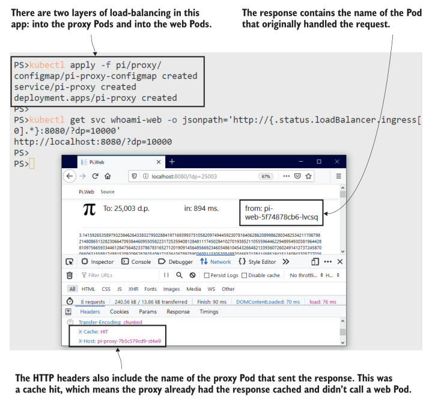

# 第六章 通过 controllers 在多个 Pod 之间扩展应用

The basic idea for scaling applications is simple: run more Pods. Kubernetes abstracts networking and storage away from the compute layer, so you can run many Pods, which are copies of the same app, and just plug them into the same abstractions. Kubernetes calls those Pods replicas, and in a multinode cluster, they’ll be distributed across many nodes. This gives you all the benefits of scale: greater capacity to handle load and high availability in case of failure—all in a platform that can scaleup and down in seconds.

Kubernetes also provides some alternative scaling options to meet different application requirements, and we’ll work through them all in this chapter. The one you’ll use most often is the Deployment controller, which is actually the simplest, but we’ll spend time on the others, too, so you understand how to scale different types of applications in your cluster.

## 6.1 Kubernetes 如何大规模运行应用程序

The Pod is the unit of compute in Kubernetes, and you learned in chapter 2 that you don’t usually run Pods directly; instead, you define another resource to manage them for you. That resource is a controller, and we’ve used Deployment controllers ever since. A controller spec includes a Pod template, which it uses to create and replace Pods. It can use that same template to create many replicas of a Pod.
Deployments are probably the resource you’ll use most in Kubernetes, and you’ve already had lots of experience with them. Now it’s time to dig a bit deeper and learn that Deployments don’t actually manage Pods directly—that’s done by another resource called a ReplicaSet. Figure 6.1 shows the relationship among Deployment, ReplicaSet, and Pods.


**Figure 6.1 Every software problem can be solved by adding another layer of abstraction.**

You’ll use a Deployment to describe your app in most cases; the Deployment is a controller that manages ReplicaSets, and the ReplicaSet is a controller that manages Pods. You can create a ReplicaSet directly rather than using a Deployment, and we’ll do that for the first few exercises, just to see how scaling works. The YAML for a ReplicaSet is almost the same as for a Deployment; it needs a selector to find the resources it owns and a Pod template to create resources. Listing 6.1 shows an abbreviated spec.

**Listing 6.1 whoami.yaml, a ReplicaSet without a Deployment**

```
apiVersion: apps/v1
kind: ReplicaSet # The spec is almost identical to a Deployment.
metadata:
  name: whoami-web
spec:
  replicas: 1
  selector: # The selector for the ReplicaSet to find its Pods
    matchLabels:
      app: whoami-web
  template: # The usual Pod spec follows.
```

The only things different in this spec from the Deployment definitions we’ve used are the object type ReplicaSet and the replicas field, which states how many Pods to run. This spec uses a single replica, which means Kubernetes will run a single Pod.

**TRY IT NOW** Deploy the ReplicaSet, along with a LoadBalancer Service, which uses the same label selector as the ReplicaSet to send traffic to the Pods.

```
# switch to this chapter's exercises:
cd ch06
# deploy the ReplicaSet and Service:
kubectl apply -f whoami/
# check the resource:
kubectl get replicaset whoami-web
# make an HTTP GET call to the Service:
curl $(kubectl get svc whoami-web -o jsonpath='http://{.status.loadBalancer.ingress[0].*}:8088')
# delete all the Pods:
kubectl delete pods -l app=whoami-web
# repeat the HTTP call:
curl $(kubectl get svc whoami-web -o jsonpath='http://{.status.loadBalancer.ingress[0].*}:8088')
# show the detail about the ReplicaSet:
kubectl describe rs whoami-web
```

You can see my output in figure 6.2. There’s nothing new here; the ReplicaSet owns a single Pod, and when you delete that Pod, the ReplicaSet replaces it. I’ve removed the kubectl describe output in the final command, but if you run that, you’ll see it ends with a list of events, where the ReplicaSet writes activity logs on how it created Pods.
The ReplicaSet replaces deleted Pods because it constantly runs a control loop, checking that the number of objects it owns matches the number of replicas it should have. You use the same mechanism when you scale up your application—you update the ReplicaSet spec to set a new number of replicas, and then the control loop sees that it needs more and creates them from the same Pod template.

**TRY IT NOW** Scale up the application by deploying an updated ReplicaSet definition that specifies three replicas.

```
# deploy the update:
kubectl apply -f whoami/update/whoami-replicas-3.yaml
#check Pods:
kubectl get pods -l app=whoami-web
# delete all the Pods:
kubectl delete pods -l app=whoami-web
# check again:
kubectl get pods -l app=whoami-web
# repeat this HTTP call a few times:
curl $(kubectl get svc whoami-web -o jsonpath='http://{.status.loadBalancer.ingress[0].*}:8088')
```


**Figure 6.2 Working with a ReplicaSet is just like working with a Deployment: it creates and manages Pods.**

My output, shown in figure 6.3, raises a couple of questions: How does Kubernetes manage to scale the app so quickly, and how do the HTTP responses come from different Pods?

The first is simple to answer: this is a single-node cluster, so every Pod will run on the same node, and that node has already pulled the Docker image for the app. When you scale up in a production cluster, it’s likely that new Pods will be scheduled to run on nodes that don’t have the image locally, and they’ll need to pull the image before they can run the Pod. The speed at which you can scale is bounded by the speed at which your images can be pulled, which is why you need to invest time in optimizing your images.

As to how we can make an HTTP request to the same Kubernetes Service and get responses from different Pods, that’s all down to the loose coupling between Services and Pods. When you scaled up the ReplicaSet, there were suddenly multiple Pods that matched the Service’s label selector, and when that happens, Kubernetes load-balances requests across the Pods. Figure 6.4 shows how the same label selector maintains the relationship between ReplicaSet and Pods and between Service and Pods.


**Figure 6.3 Scaling ReplicaSets is fast, and at scale, a Service can distribute requests to many Pods.**

The abstraction between networking and compute is what makes scaling so easy in Kubernetes. You may be experiencing a warm glow about now—suddenly all the complexity starts to fit into place, and you see how the separation between resources is the enabler for some very powerful features. This is the core of scaling: you run as many Pods as you need, and they all sit behind one Service. When consumers access the Service, Kubernetes distributes the load between Pods.

Load balancing is a feature of all the Service types in Kubernetes. We’ve deployed a LoadBalancer Service in these exercises, and that receives traffic into the cluster and sends it to the Pods. It also creates a ClusterIP for other Pods to use, and when Pods communicate within the cluster, they also benefit from load balancing.


**Figure 6.4 A Service with the same label selector as a ReplicaSet will use all of its Pods.**

**TRY IT NOW** Deploy a new Pod, and use it to call the who-am-I Service internally, using the ClusterIP, which Kubernetes resolves from the service name.

```
# run a sleep Pod:
kubectl apply -f sleep.yaml
# check the details of the who-am-I Service:
kubectl get svc whoami-web
# run a DNS lookup for the Service in the sleep Pod:
kubectl exec deploy/sleep -- sh -c 'nslookup whoami-web | grep "^[^*]"'
# make some HTTP calls:
kubectl exec deploy/sleep -- sh -c 'for i in 1 2 3; do curl -w \\n -s http://whoami-web:8088; done;'
```

As shown in figure 6.5, the behavior for a Pod consuming an internal Service is the same as for external consumers, and requests are load-balanced across the Pods. When you run this exercise, you may see the requests distributed exactly equally, or you may see some Pods responding more than once, depending on the vagaries of the network.


**Figure 6.5 The world inside the cluster: Pod-to-Pod networking also benefits from Service load balancing.**

In chapter 3, we covered Services and how the ClusterIP address is an abstraction from the Pod’s IP address, so when a Pod is replaced, the application is still accessible using the same Service address. Now you see that the Service can be an abstraction across many Pods, and the same networking layer that routes traffic to a Pod on any node can load-balance across multiple Pods.

## 6.2 使用 Deployments 和 ReplicaSets 来扩展负载

ReplicaSets make it incredibly easy to scale your app: you can scale up or down in seconds just by changing the number of replicas in the spec. It’s perfect for stateless components that run in small,lean containers, and that’s why applications built for Kubernetes typically use a distributed architecture, breaking down functionality across many pieces, which can be individually updated and scaled.

Deployments add a useful management layer on top of ReplicaSets. Now that we know how they work, we won’t be using ReplicaSets directly anymore—Deployments should be your first choice for defining applications. We won’t explore all the features of Deployments until we get to application upgrades and rollbacks in chapter 9,but it’s useful to understand exactly what the extra abstraction gives you. Figure 6.6 shows this.


**Figure 6.6 Zero is a valid number of desired replicas; Deployments scale down old ReplicaSets to zero.**

A Deployment is a controller for ReplicaSets, and to run at scale, you include the same replicas field in the Deployment spec, and that is passed to the ReplicaSet. Listing 6.2 shows the abbreviated YAML for the Pi web application, which explicitly sets two replicas.

**Listing 6.2 web.yaml, a Deployment to run multiple replicas**

```
apiVersion: apps/v1
kind: Deployment
metadata:
  name: pi-web
spec:
  replicas: 2 # The replicas field is optional; it defaults to 1.
selector:
  matchLabels:
    app: pi-web
  template: # The Pod spec follows.
```

The label selector for the Deployment needs to match the labels defined in the Pod template, and those labels are used to express the chain of ownership from Pod to ReplicaSet to Deployment. When you scale a Deployment, it updates the existing ReplicaSet to set the new number of replicas, but if you change the Pod spec in the Deployment, it replaces the ReplicaSet and scales the previous one down to zero. That gives the Deployment a lot of control over how it manages the update and how it deals with any problems.

**TRY IT NOW** Create a Deployment and Service for the Pi web application, and make some updates to see how the ReplicaSets are managed.

```
# deploy the Pi app:
kubectl apply -f pi/web/
# check the ReplicaSet:
kubectl get rs -l app=pi-web
# scale up to more replicas:
kubectl apply -f pi/web/update/web-replicas-3.yaml
# check the RS:
kubectl get rs -l app=pi-web
# deploy a changed Pod spec with enhanced logging:
kubectl apply -f pi/web/update/web-logging-level.yaml
# check ReplicaSets again:
kubectl get rs -l app=pi-web
```

This exercise shows that the ReplicaSet is still the scale mechanism: when you increase or decrease the number of replicas in your Deployment, it just updates the ReplicaSet. The Deployment is the, well, deployment mechanism, and it manages application updates through multiple ReplicaSets. My output, which appears in figure 6.7, shows how the Deployment waits for the new ReplicaSet to be fully operational before completely scaling down the old one.

You can use the kubectl scale command as a shortcut for scaling controllers. You should use it sparingly because it’s an imperative way to work, and it’s much better to use declarative YAML files, so that the state of your apps in production always exactly matches the spec stored in source control. But if your app is underperforming and the automated deployment takes 90 seconds, it’s a quick way to scale—as long as you remember to update the YAML file, too.

**TRY IT NOW** Scale up the Pi application using kubectl directly, and then see what happens with the ReplicaSets when another full deployment happens.

```
# we need to scale the Pi app fast:
kubectl scale --replicas=4 deploy/pi-web
# check which ReplicaSet makes the change:
kubectl get rs -l app=pi-web
# now we can revert back to the original logging level:
kubectl apply -f pi/web/update/web-replicas-3.yaml
# but that will undo the scale we set manually:
kubectl get rs -l app=pi-web
# check the Pods:
kubectl get pods -l app=pi-web
```


**Figure 6.7 Deployments manage ReplicaSets to keep the desired number of Pods available during updates.**

You’ll see two things when you apply the updated YAML: the app scales back down to three replicas, and the Deployment does that by scaling the new ReplicaSet down to zero Pods and scaling the old ReplicaSet back up to three Pods. Figure 6.8 shows that the updated Deployment results in three new Pods being created.

It shouldn’t be a surprise that the Deployment update overwrote the manual scale level; the YAML definition is the desired state, and Kubernetes does not attempt to retain any part of the current spec if the two differ. It might be more of a surprise that the Deployment reused the old ReplicaSet instead of creating a new one, but that’s a more efficient way for Kubernetes to work, and it’s possible because of more labels.

Pods created from Deployments have a generated name that looks random but actually isn’t. The Pod name contains a hash of the template in the Pod spec for the Deployment, so if you make a change to the spec that matches a previous Deployment, then it will have the same template hash as a scaled-down ReplicaSet, and the Deployment can find that ReplicaSet and scale it up again to effect the change. The Pod template hash is stored in a label.

**TRY IT NOW** Check out the labels for the Pi Pods and ReplicaSets to see the template hash.


**Figure 6.8 Deployments know the spec for their ReplicaSets and can roll back by scaling an old ReplicaSet.**

Pods created from Deployments have a generated name that looks random but actually isn’t. The Pod name contains a hash of the template in the Pod spec for the Deployment, so if you make a change to the spec that matches a previous Deployment, then it will have the same template hash as a scaled-down ReplicaSet, and the Deployment can find that ReplicaSet and scale it up again to effect the change. The Pod template hash is stored in a label.

**TRY IT NOW** Check out the labels for the Pi Pods and ReplicaSets to see the template hash.

```
# list ReplicaSets with labels:
kubectl get rs -l app=pi-web --show-labels
# list Pods with labels:
kubectl get po -l app=pi-web --show-labels
```

Figure 6.9 shows that the template hash is included in the object name, but this is just for convenience—Kubernetes uses the labels for management.


**Figure 6.9 Object names generated by Kubernetes aren’t just random—they include the template hash.**

Knowing the internals of how a Deployment is related to its Pods will help you understand how changes are rolled out and clear up any confusion when you see lots of ReplicaSets with desired Pod counts of zero. But the interaction between the compute layer in the Pods and the network layer in the Services works in the same way.

In a typical distributed application, you’ll have different scale requirements for each component, and you’ll make use of Services to achieve multiple layers of load balancing between them. The Pi application we’ve deployed so far has only a ClusterIP Service—it’s not a public-facing component. The public component is a proxy (actually, it’s a reverse proxy because it handles incoming traffic rather than outgoing traffic), and that uses a LoadBalancer Service. We can run both the web component and the proxy at scale and achieve load balancing from the client to the proxy Pods and from the proxy to the application Pods.

**TRY IT NOW** Create the proxy Deployment, which runs with two replicas, along with a Service and ConfigMap, which sets up the integration with the Pi web app.

```
# deploy the proxy resources:
kubectl apply -f pi/proxy/
# get the URL to the proxied app:
kubectl get svc whoami-web -o jsonpath='http://{.status.loadBalancer.ingress[0].*}:8080/?dp=10000'
# browse to the app, and try a few different values for 'dp' in the URL
```

If you open the developer tools in your browser and look at the network requests, you can find the response headers sent by the proxy. These include the hostname of the proxy server—which is actually the Pod name—and the web page itself includes the name of the web application Pod that generated the response. My output, which appears in figure 6.10, shows a response that came from the proxy cache.



**Figure 6.10 The Pi responses include the name of the Pod that sent them, so you can see the load balancing at work.**

This configuration is a simple one, which makes it easy to scale. The Pod spec for the proxy uses two volumes: a ConfigMap to load the proxy configuration file and an EmptyDir to store the cached responses. ConfigMaps are read-only, so one ConfigMap can be shared by all the proxy Pods. EmptyDir volumes are writable, but they’re unique to the Pod, so each proxy gets its own volume to use for cache files. Figure 6.11 shows the setup.


**Figure 6.11 Running Pods at scale—some types of volume can be shared, whereas others are unique to the Pod.**

This architecture presents a problem, which you’ll see if you request Pi to a high number of decimal places and keep refreshing the browser. The first request will be slow because it is computed by the web app; subsequent responses will be fast, because they come from the proxy cache, but soon your request will go to a different proxy Pod that doesn’t have that response in its cache, so the page will load slowly again.

It would be nice to fix this by using shared storage, so every proxy Pod had access to the same cache. Doing so will bring us back to the tricky area of distributed storage that we thought we’d left behind in chapter 5, but let’s start with a simple approach and see where it gets us.

**TRY IT NOW** Deploy an update to the proxy spec, which uses a HostPath volume for cache files instead of an EmptyDir. Multiple Pods on the same node will use the same volume, which means they’ll have a shared proxy cache.

```
# deploy the updated spec:
kubectl apply -f pi/proxy/update/nginx-hostPath.yaml
# check the Pods—the new spec adds a third replica:
kubectl get po -l app=pi-proxy
# browse back to the Pi app, and refresh it a few times
# check the proxy logs:
kubectl logs -l app=pi-proxy --tail 1
```

Now you should be able to refresh away to your heart’s content, and responses will always come from the cache, no matter which proxy Pod you are directed to. Figure 6.12 shows all my proxy Pods responding to requests, which are shared between them by the Service.
For most stateful applications, this approach wouldn’t work. Apps that write data tend to assume they have exclusive access to the files, and if another instance of the same app tries to use the same file location, you’d get unexpected but disappointing results—like the app crashing or the data being corrupted. The reverse proxy I’m using is called Nginx; it’s unusually lenient here, and it will happily share its cache directory with other instances of itself.

If your apps need scale and storage, you have a couple of other options for using different types of controller. In the rest of this chapter, we’ll look at the DaemonSet; the final type is the StatefulSet, which gets complicated quickly, and we’ll come to it in chapter 8 where it gets most of the chapter to itself. DaemonSets and StatefulSets are both Pod controllers, and although you’ll use them a lot less frequently than Deployments, you need to know what you can do with them because they enable some powerful patterns.


**Figure 6.12 At scale, you can see all the Pod logs with kubectl, using a label selector.**

## 6.3 使用 DaemonSets 实现高可用性

The DaemonSet takes its name from the Linux daemon, which is usually a system process that runs constantly as a single instance in the background (the equivalent of a Windows Service in the Windows world). In Kubernetes, the DaemonSet runs a single replica of a Pod on every node in the cluster, or on a subset of nodes, if you add a selector in the spec.
DaemonSets are common for infrastructure-level concerns, where you might want to grab information from every node and send it on to a central collector. A Pod runs on each node, grabbing just the data for that node. You don’t need to worry about any resource conflicts, because there will be only one Pod on the node. We’ll use DaemonSets later in this book to collect logs from Pods, and metrics about the node’s activity.

You can also use them in your own designs when you want high availability without the load requirements for many replicas on each node. A reverse proxy is a good example: a single Nginx Pod can handle many thousands of concurrent connections, so you don’t necessarily need a lot of them, but you may want to be sure there’s one running on every node, so a local Pod can respond wherever the traffic lands. Listing 6.3 shows the abbreviated YAML for a DaemonSet—it looks much like the other controllers but without the replica count.

**Listing 6.3 nginx-ds.yaml, a DaemonSet for the proxy component**

```
apiVersion: apps/v1
kind: DaemonSet
metadata:
  name: pi-proxy
spec:
  selector:
    matchLabels: # DaemonSets use the same label selector mechanism.
      app: pi-proxy # Finds the Pods that the set owns
template:
  metadata:
    labels:
      app: pi-proxy # Labels applied to the Pods must match the selector.
spec:
# Pod spec follows
```

This spec for the proxy still uses a HostPath volume. That means each Pod will have its own proxy cache, so we don’t get ultimate performance from a shared cache. This approach would work for other stateful apps, which are fussier than Nginx, because there’s no issue with multiple instances using the same data files.

**TRY IT NOW** You can’t convert from one type of controller to another, but we can make the change from Deployment to DaemonSet without breaking the app.

```
# deploy the DaemonSet:
kubectl apply -f pi/proxy/daemonset/nginx-ds.yaml
# check the endpoints used in the proxy service:
kubectl get endpoints pi-proxy
# delete the Deployment:
kubectl delete deploy pi-proxy
# check the DaemonSet:
kubectl get daemonset pi-proxy
# check the Pods:
kubectl get po -l app=pi-proxy
# refresh your latest Pi calculation on the browser
```

Figure 6.13 shows my output. Creating the DaemonSet before removing the Deployment means there are always Pods available to receive requests from the Service. Deleting the Deployment first would make the app unavailable until the DaemonSet started. If you check the HTTP response headers, you should also see that your request came from the proxy cache, because the new DaemonSet Pod uses the same HostPath volume as the Deployment Pods.


**Figure 6.13 You need to plan the order of the deployment for a big change to keep your app online.**

I’m using a single-node cluster, so my DaemonSet runs a single Pod; with more nodes, I’d have one Pod on each node. The control loop watches for nodes joining the cluster, and any new nodes will be scheduled to start a replica Pod as soon as they join. The controller also watches the Pod status, so if a Pod is removed, then a replacement starts up.

**TRY IT NOW** Manually delete the proxy Pod. The DaemonSet will start a replacement.

```
# check the status of the DaemonSet:
kubectl get ds pi-proxy
# delete its Pod:
kubectl delete po -l app=pi-proxy
# check the Pods:
kubectl get po -l app=pi-proxy
```

If you refresh your browser while the Pod is being deleted, you’ll see it doesn’t respond until the DaemonSet has started a replacement. This is because you’re using a single-node lab cluster. Services send traffic only to running Pods, so in a multinode environment, the request would go to a node that still had a healthy Pod. Figure 6.14 shows my output.


**Figure 6.14 DaemonSets watch nodes and Pods to ensure the desired replica count is always met.**

Situations where you need a DaemonSet are often a bit more nuanced than just wanting to run a Pod on every node. In this proxy example, your production cluster might have only a subset of nodes that can receive traffic from the internet, so you’d want to run proxy Pods only on those nodes. You can achieve that with labels, adding whatever arbitrary label you’d like to identify your nodes and then selecting that label in the Pod spec. Listing 6.4 shows this with a nodeSelector field.

**Listing 6.4 nginx-ds-nodeSelector.yaml, a DaemonSet with node selection**

```
# This is the Pod spec within the template field of the DaemonSet.
spec:
  containers:
    # ...
  volumes:
    # ...
  nodeSelector: # Pods will run only on certain nodes.
    kiamol: ch06 # Selected with the label kiamol=ch06
```

The DaemonSet controller doesn’t just watch to see nodes joining the cluster; it looks at all nodes to see if they match the requirements in the Pod spec. When you deploy this change, you’re telling the DaemonSet to run on only nodes that have the label kiamol set to the value of ch06. There will be no matching nodes in your cluster, so the DaemonSet will scale down to zero.

**TRY IT NOW** Update the DaemonSet to include the node selector from listing 6.4. Now there are no nodes that match the requirements, so the existing Pod will be removed. Then label a node, and a new Pod will be scheduled.

```
# update the DaemonSet spec:
kubectl apply -f pi/proxy/daemonset/nginx-ds-nodeSelector.yaml
# check the DS:
kubectl get ds pi-proxy
# check the Pods:
kubectl get po -l app=pi-proxy
# now label a node in your cluster so it matches the selector:
kubectl label node $(kubectl get nodes -o jsonpath='{.items[0].metadata.name}') kiamol=ch06 --overwrite
# check the Pods again:
kubectl get ds pi-proxy
```

You can see the control loop for the DaemonSet in action in figure 6.15. When the node selector is applied, no nodes meet the selector, so the desired replica count for the DaemonSet drops to zero. The existing Pod is one too many for the desired count, so it is removed. Then, when the node is labeled, there’s a match for the selector, and the desired count increases to one, so a new Pod is created.


**Figure 6.15 DaemonSets watch nodes and their labels, as well as the current Pod status.**

DaemonSets have a different control loop from ReplicaSets because their logic needs to watch node activity as well as Pod counts, but fundamentally, they are both controllers that manage Pods. All controllers are responsible for the life cycle of their managed objects, but the links can be broken. We’ll use the DaemonSet in one more exercise to show how Pods can be set free from their controllers.

**TRY IT NOW** Kubectl has a cascade option on the delete command, which you can use to delete a controller without deleting its managed objects. Doing so leaves orphaned Pods behind, which can be adopted by another controller if they are a match for their previous owner.

```
# delete the DaemonSet, but leave the Pod alone:
kubectl delete ds pi-proxy --cascade=false
# check the Pod:
kubectl get po -l app=pi-proxy
# recreate the DS:
kubectl apply -f pi/proxy/daemonset/nginx-ds-nodeSelector.yaml
# check the DS and Pod:
kubectl get ds pi-proxy
kubectl get po -l app=pi-proxy
# delete the DS again, without the cascade option:
kubectl delete ds pi-proxy
# check the Pods:
kubectl get po -l app=pi-proxy
```

Figure 6.16 shows the same Pod survives through the DaemonSet being deleted and recreated. The new DaemonSet requires a single Pod, and the existing Pod is a match for its template, so it becomes the manager of the Pod. When this DaemonSet is deleted, the Pod is removed too.

Putting a halt on cascading deletes is one of those features you’re going to use rarely, but you’ll be very glad you knew about it when you do need it. In this scenario, you might be happy with all your existing Pods but have some maintenance tasks coming up on the nodes. Rather than have the DaemonSet adding and removing Pods while you work on the nodes, you could delete it and reinstate it after the maintenance is done.

The example we’ve used here for DaemonSets is about high availability, but it’s limited to certain types of application—where you want multiple instances and it’s acceptable for each instance to have its own independent data store. Other applications where you need high availability might need to keep data synchronized between instances, and for those, you can use StatefulSets. Don’t skip on to chapter 8 yet, though, because you’ll learn some neat patterns in chapter 7 that help with stateful apps, too.


**Figure 6.16 Orphaned Pods have lost their controller, so they're not part of a highly available set anymore.**

StatefulSets, DaemonSets, ReplicaSets, and Deployments are the tools you use to model your apps, and they should give you enough flexibility to run pretty much any- thing in Kubernetes. We’ll finish this chapter with a quick look at how Kubernetes actually manages objects that own other objects, and then we’ll review how far we’ve come in this first section of the book.

## 6.4 理解 Kubernetes 中的对象所有权

Controllers use a label selector to find objects that they manage, and the objects themselves keep a record of their owner in a metadata field. When you delete a controller, its managed objects still exist but not for long. Kubernetes runs a garbage collector process that looks for objects whose owner has been deleted, and it deletes them, too. Object ownership can model a hierarchy: Pods are owned by ReplicaSets, and ReplicaSets are owned by Deployments.

**TRY IT NOW** Look at the owner reference in the metadata fields for all Pods and ReplicaSets.

```
# check which objects own the Pods:
kubectl get po -o custom-columns=NAME:'{.metadata.name}', OWNER:'{.metadata.ownerReferences[0].name}',OWNER_KIND:'{.metadata.ownerReferences[0].kind}'
# check which objects own the ReplicaSets:
kubectl get rs -o custom-columns=NAME:'{.metadata.name}', OWNER:'{.metadata.ownerReferences[0].name}',OWNER_KIND:'{.metadata.ownerReferences[0].kind}'
```

Figure 6.17 shows my output, where all of my Pods are owned by some other object, and all but one of my ReplicaSets are owned by a Deployment.


**Figure 6.17 Objects know who their owners are—you can find this in the object metadata.**

Kubernetes does a good job of managing relationships, but you need to remember that controllers track their dependents using the label selector alone, so if you fiddle with labels, you could break that relationship. The default delete behavior is what you want most of the time, but you can stop cascading deletes using kubectl and delete only the controller—that removes the owner reference in the metadata for the dependents, so they don’t get picked up by the garbage collector.

We’re going to finish up with a look at the architecture for the latest version of the Pi app, which we’ve deployed in this chapter. Figure 6.18 shows it in all its glory.


**Figure 6.18 The Pi application: no annotations necessary—the diagram should be crystal clear.**

Quite a lot is going on in this diagram: it’s a simple app, but the deployment is complex because it uses lots of Kubernetes features to get high availability, scale, and flexibility. By now you should be comfortable with all those Kubernetes resources, and you should understand how they fit together and when to use them. Around 150 lines of YAML define the application, but those YAML files are all you need to run this app on your laptop or on a 50-node cluster in the cloud. When someone new joins the project, if they have solid Kubernetes experience—or if they’ve read the first six chapters of this book—they can be productive straight away.
That’s all for the first section. My apologies if you had to take a few extended lunchtimes this week, but now you have all the fundamentals of Kubernetes, with best practices built in. All we need to do is tidy up before you attempt the lab.

**TRY IT NOW** All the top-level objects in this chapter had a kiamol label applied. Now that you understand cascading deletes, you’ll know that when you delete all those objects, all their dependents get deleted, too.

```
# remove all the controllers and Services:
kubectl delete all -l kiamol=ch06
```

## 6.5 Lab
Kubernetes has changed a lot over the last few years. The controllers we’ve used in this chapter are the recommended ones, but there have been alternatives in the past. Your job in this lab is to take an app spec that uses some older approaches and update it to use the controllers you’ve learned about.

- Start by deploying the app in ch06/lab/numbers—it’s the random-number app from chapter 3 but with a strange configuration. And it’s broken.
- You need to update the web component to use a controller that supports high load. We’ll want to run dozens of these in production.
- The API needs to be updated, too. It needs to be replicated for high availability, but the app uses a hardware random-number generator attached to the server, which can be used by only one Pod at a time. Nodes with the right hardware have the label rng=hw (you’ll need to simulate that in your cluster).
- This isn’t a clean upgrade, so you need to plan your deployment to make sure there’s no downtime for the web app.

Sounds scary, but you shouldn’t find this too bad. My solution is on GitHub for you to check: https://github.com/sixeyed/kiamol/blob/master/ch06/lab/README.md.
