# 第七章 使用多容器 Pods 扩展应用程序

我们在第 2 章中见识了 Pod，那时你知道你可以在一个 Pod 中运行多个容器，但实际上你并没有这样做。在本章中，您将看到它是如何工作的，并理解它所支持的模式。这是本书这一部分的第一个更高级的主题，但它不是一个复杂的主题——它只是帮助您了解前面章节的所有背景知识。从概念上讲，这很简单:一个Pod 运行许多容器，通常是您的应用程序容器加上一些 helper 容器。正是使用这些 helper 可以做的事情使得这个特性如此有趣。

Pod 中的容器共享相同的虚拟环境，因此当一个容器执行一个操作时，其他容器可以看到它并对其做出反应。它们甚至可以在原始容器不知道的情况下修改预期的操作。这种行为允许您对应用程序进行建模，这样应用程序容器就非常简单了——它只专注于自己的工作，并且有帮助程序负责将应用程序与其他组件和Kubernetes平台集成。这是向所有应用程序(无论是新应用程序还是旧应用程序)添加一致的管理API的好方法。

## 7.1 Pod 中多个容器如何通信

Pod 是一个虚拟环境，为一个或多个容器创建共享网络和文件系统空间。容器是孤立的单元;它们有自己的流程和环境变量，并且可以使用不同技术堆栈的不同镜像。Pod 是一个单独的单元，因此当它被分配到一个节点上运行时，所有 Pod 容器都运行在同一个节点上。你可以让一个容器运行 Python，另一个运行 Java，但你不能让一些 Linux 容器和一些 Windows 容器在同一个Pod中(目前)，因为 Linux 容器需要运行在 Linux 节点上，而Windows 容器需要运行在 Windows 节点上。

Pod 中的容器共享网络，因此每个容器都有相同的IP地址——Pod 的 IP 地址。多个容器可以接收外部流量，但它们需要侦听不同的端口，Pod 中的容器可以使用本地主机地址进行通信。每个容器都有自己的文件系统，但它可以从 Pod 挂载卷，因此容器可以通过共享相同的挂载来交换信息。图7.1显示了带有两个容器的 Pod 的布局。

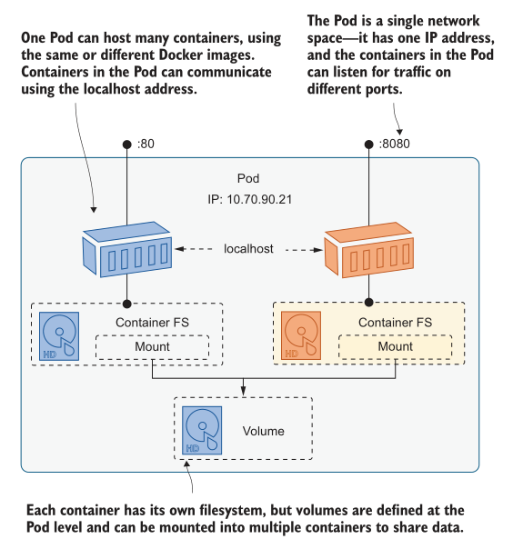
<center>图 7.1 Pod 是许多容器的共享网络和存储环境</center>

这就是我们现在需要的所有理论，当我们阅读本章时，您会惊讶地发现仅使用共享网络和磁盘就可以完成一些聪明的事情。在本节中，我们将从一些简单的练习开始探索 Pod 环境。清单7.1显示了一个 Deployment 的多容器 Pod Spec 配置。定义了恰好使用相同镜像的两个容器，它们都挂载了 Pod 中定义的 EmptyDir 卷。

> 清单 7.1 sleep-with-file-reader.yaml, 一个简单的多容器 Pod spec

```
spec:
  containers: # containers 字段是个数组
    - name: sleep
      image: kiamol/ch03-sleep
      volumeMounts:
        - name: data
          mountPath: /data-rw # 可写挂载一个卷
    - name: file-reader # 多个容器的名字不能一样
      image: kiamol/ch03-sleep # 但是可以使用相同或者不同的镜像
      volumeMounts:
        - name: data
          mountPath: /data-ro
          readOnly: true # 只读挂载同一个卷
  volumes:
    - name: data # Volumes 可以被多个目标挂载
      containers.
        emptyDir: {}
```

这是一个运行两个容器的 Pod Spec。当您部署它时，您将看到在如何使用多容器 Pods 方面存在的一些差异。

<b>现在就试试</b> 部署清单 7.1, 运行两个容器的 Pod

```
# 进入到章节练习目录:
cd ch07
# 部署 Pod:
kubectl apply -f sleep/sleep-with-file-reader.yaml
# 查看 Pod 详细信息:
kubectl get pod -l app=sleep -o wide
# 显示 container 名称:
kubectl get pod -l app=sleep -o jsonpath='{.items[0].status.containerStatuses[*].name}'
# 检查日志—将会失败:
kubectl logs -l app=sleep
```

我的输出(如图 7.2 所示)显示Pod有两个具有单个IP地址的容器，它们都运行在同一个节点上。您可以看到 Pod 作为单个单元的详细信息，但不能在Pod级别打印日志;您需要指定一个容器，从中获取日志。

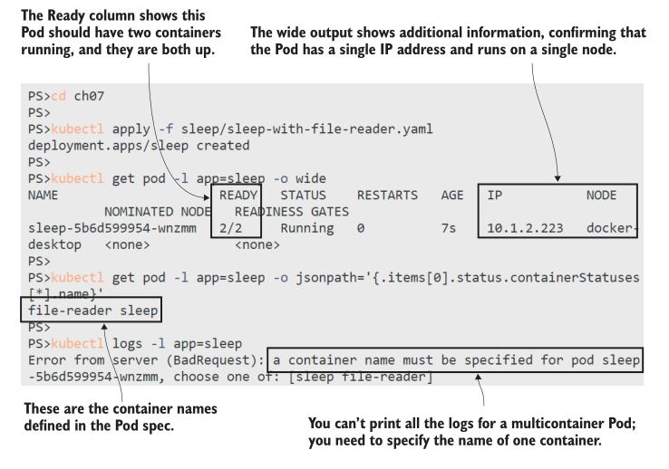
<center>图 7.2 您总是将 Pod 作为单个单元使用，除非需要指定容器</center>

该练习中的两个容器都使用 sleep 镜像，因此它们没有做任何事情，但容器继续运行，Pod保持可用。这两个容器都从 Pod 挂载 EmptyDir 卷，因此这是文件系统的共享部分，您可以在两个容器中使用它。

<b>现在就试试</b> 一个容器以读写方式挂载卷，另一个容器以只读方式挂载卷。您可以在一个容器中写入文件，在另一个容器中读取文件。

```
# 使用一个容器将文件写入共享卷:
kubectl exec deploy/sleep -c sleep -- sh -c 'echo ${HOSTNAME} > /data-rw/hostname.txt'
# 使用相同的容器读取文件:
kubectl exec deploy/sleep -c sleep -- cat /data-rw/hostname.txt
# 使用另一个容器读取文件:
kubectl exec deploy/sleep -c file-reader -- cat /data-ro/hostname.txt
# 尝试将文件添加到只读容器-这将失败:
kubectl exec deploy/sleep -c file-reader -- sh -c 'echo more >> /data-ro/hostname.txt'
```

在运行这个练习时，您将看到第一个容器可以向共享卷写入数据，第二个容器可以读取数据，但它本身不能写入数据。这是因为在Pod spec 中，第二个容器的卷挂载被定义为只读。这不是一般的 Pod 限制;如果需要，可以将挂载定义为多个容器的可写。图7.3显示了我的输出。

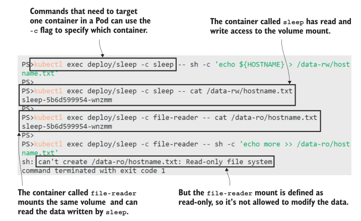
<center>图 7.3 容器可以挂载相同的Pod卷以共享数据，但具有不同的访问级别。</center>

一个好的 empty 卷在这里再次显示了它的价值;这是一个简单的便签，所有的 Pod 容器都可以访问。卷是在 Pod 级别定义的，并安装在容器级别，这意味着您可以使用任何类型的卷或PVC，并使其可供许多容器使用。将卷定义与卷挂载解耦还允许选择性共享，因此一个容器可能能够看到Secrets，而其他容器则不能。

另一个共享空间是网络，其中容器可以侦听不同的端口并提供独立的功能。如果你的应用容器正在做一些后台工作，但没有任何功能来报告进度，这是很有用的。同一Pod中的另一个容器可以提供REST API，该API报告应用程序容器正在做什么。
清单7.2显示了这个过程的简化版本。这是对sleep deployment 的更新，它将文件共享容器替换为运行简单 HTTP 服务的新容器 spec。

> 清单 7.2 sleep-with-server.yaml, 在另一个容器里面运行 web 服务

```
spec:
  containers:
    - name: sleep
      image: kiamol/ch03-sleep # 和清单 7.1 相同的容器
    - name: server
      image: kiamol/ch03-sleep # 第二个容器不一样
      command: ['sh', '-c', "while true; do echo -e 'HTTP/1.1 ..."]
    ports:
      - containerPort: 8080 # 包括端口只记录应用程序使用的端口。
```

现在 Pod 将使用原始的应用程序容器(sleep 容器，实际上什么都不做)和服务器容器(在端口8080上提供HTTP端点)运行。这两个容器共享相同的网络空间，因此 Sleep 容器可以使用本地主机地址访问服务器。

<b>现在就试试</b> 使用清单 7.2 中的文件更新 sleep Deployment，并确认 server 容器是可访问的。

```
# 部署更新的内容:
kubectl apply -f sleep/sleep-with-server.yaml
# 检查 Pod 状态:
kubectl get pods -l app=sleep
# 列出新 Pod 中容器的名称:
kubectl get pod -l app=sleep -o jsonpath='{.items[0].status.containerStatuses[*].name}'
# 在容器之间进行网络调用:
kubectl exec deploy/sleep -c sleep -- wget -q -O - localhost:8080
# 检查 server 容器 logs:
kubectl logs -l app=sleep -c server
```

可以在图 7.4 中看到我的输出。虽然它们是独立的容器，但在网络级别上，它们的功能就像运行在同一台机器上的不同进程一样，使用本地地址进行通信。

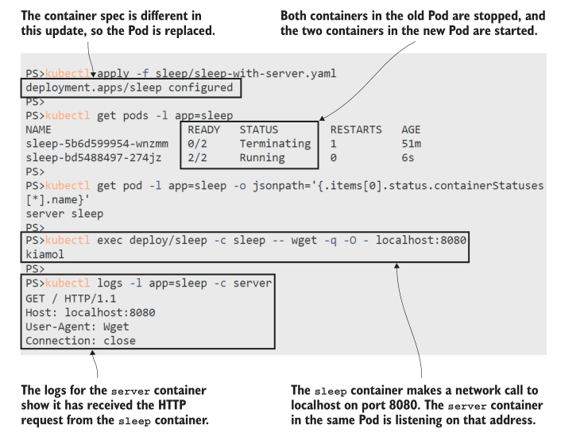
<center>图 7.4 同一 Pod 中的容器之间的网络通信是通过本地主机进行的 </center>

网络不仅在 Pod 内部是共享的。Pod 在集群上有一个 IP 地址，如果 Pod 中的任何容器正在侦听端口，那么其他 Pod 就可以访问它们。您可以创建一个Service，将流量路由到特定端口上的 Pod，在该端口上侦听的容器将接收请求。

<b>现在就试试</b> 使用 kubectl 命令公开 Pod 端口——这是一种无需编写yaml就可以快速创建服务的方法，然后测试HTTP服务是否可以从外部访问。

```
# 创建一个针对 server 容器端口的 Service:
kubectl expose -f sleep/sleep-with-server.yaml --type LoadBalancer --port 8020 --target-port 8080
# 获取你的 service 的URL:
kubectl get svc sleep -o jsonpath='http://{.status.loadBalancer.ingress[0].*}:8020'
# 打开浏览器输入地址
# 检查 server 容器日志:
kubectl logs -l app=sleep -c server
```

图 7.5 显示了我的输出。从外部世界来看，它只是流向服务的网络流量，服务被路由到Pod。Pod正在运行多个容器，但这是一个对消费者隐藏的细节。

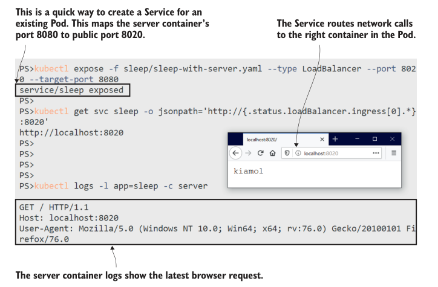
<center>图 7.5 Service 可以将网络请求路由到任何已发布端口的Pod容器</center>

你应该能感受到在 Pod 中运行多个容器是多么强大，在本章的剩余部分，我们将把这些想法应用到现实场景中。有一件事需要强调:Pod不是 VM 的替代品，所以不要认为你可以在一个 Pod 中运行应用程序的所有组件。你可能会想用一个web服务器容器和一个 API 容器在同一个 pod 中运行来建模一个应用程序。Pod是一个单独的单元，它应该用于应用程序的单个组件。可以使用其他容器来支持应用程序容器，但你不应该在同一个 Pod 中运行不同的应用程序。这样做会破坏您独立更新、扩展和管理这些组件的能力。

## 7.2 使用 init 容器设置应用程序

到目前为止，我们已经运行了带有多个容器的 Pod，其中所有容器都是并行运行的:它们一起启动，直到所有容器都准备好了，Pod 才被认为是准备好了。您将听到一种被称为 sidecar 的模式，它强化了附加容器(sidecar)对应用程序容器(摩托车)发挥支持作用的想法。Kubernetes 还支持另一种模式，当你需要在应用容器之前运行一个容器来设置部分环境时。这被称为 init 容器。

Init 容器的工作方式与 sidecars 不同。你可以为 Pod 定义多个 init 容器，它们按照 Pod spec 中写的顺序依次运行。每个 init 容器需要在下一个容器启动之前成功完成，并且所有的 init 容器都必须在 Pod 容器启动之前成功完成。图 7.6 显示了带有 init 容器的 Pod 的启动顺序。

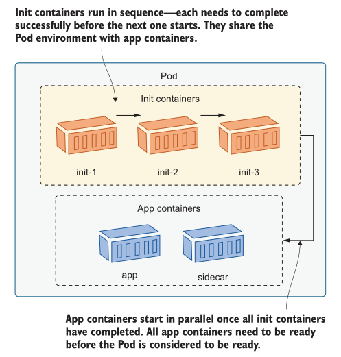
<center>图 7.6 Init 容器对于启动任务很有用，可以为应用程序容器准备 Pod</center>

所有容器都可以访问 Pod 中定义的卷，因此主要的用例是 init 容器写入为应用程序容器准备环境的数据。清单 7.3 显示了前面练习中的 sleep Pod 中对HTTP服务的简单扩展。init 容器运行并生成 HTML 文件，它将该文件写入 EmptyDir 卷的挂载中。server 容器通过发送该文件的内容来响应 HTTP 请求。

> 清单 7.3 sleep-with-html-server.yaml, Pod spec 配置中的 init 容器

```
spec: # Deployment template 下的 Pod spec 配置
  initContainers: #  init 容器同样也是一个数组
    - name: init-html # 它们顺序运行
      image: kiamol/ch03-sleep
      command: ['sh', '-c', "echo '<!DOCTYPE html...' > /data/index.html"]
      volumeMounts:
    - name: data
      mountPath: /data # Init 容器同样可以挂在 Pod volumes.
```

本例为 init 容器使用相同的 sleep 镜像，但它可以是任何镜像。您可以使用 init 容器来设置应用程序环境，使用的工具不希望出现在正在运行的应用程序中。init 容器可以使用安装了 Git 命令行的Docker 镜像，并将存储库克隆到共享文件系统中。应用程序容器可以访问这些文件，而无需在应用程序镜像中设置Git客户端。

<b>现在就试试</b> 部署清单 7.3 的更新, 看一下 init 容器是如何工作的

```
# 部署 init 容器的部署更新:
kubectl apply -f sleep/sleep-with-html-server.yaml
# 检查 Pod 容器:
kubectl get pod -l app=sleep -o jsonpath='{.items[0].status.containerStatuses[*].name}'
# 检查 init 容器:
kubectl get pod -l app=sleep -o jsonpath='{.items[0].status.initContainerStatuses[*].name}'
# 检查 init container 的日志—什么都没有:
kubectl logs -l app=sleep -c init-html
# 检查 pod 容器中的那个文件是否可用:
kubectl exec deploy/sleep -c server -- ls -l /data-ro
```

从这个练习中你会学到一些东西。App 容器被保证在 init 容器成功完成之前不会运行，所以你的应用可以安全地假设 init 容器准备的环境。在这种情况下，HTML 文件必须在 Server 容器启动之前存在。Init 容器是Pod Spec 配置的不同部分，但一些管理特性的工作方式与应用程序容器相同——即使在 Init 容器退出后，您也可以从 Init 容器读取日志。我的输出如图 7.7 所示。

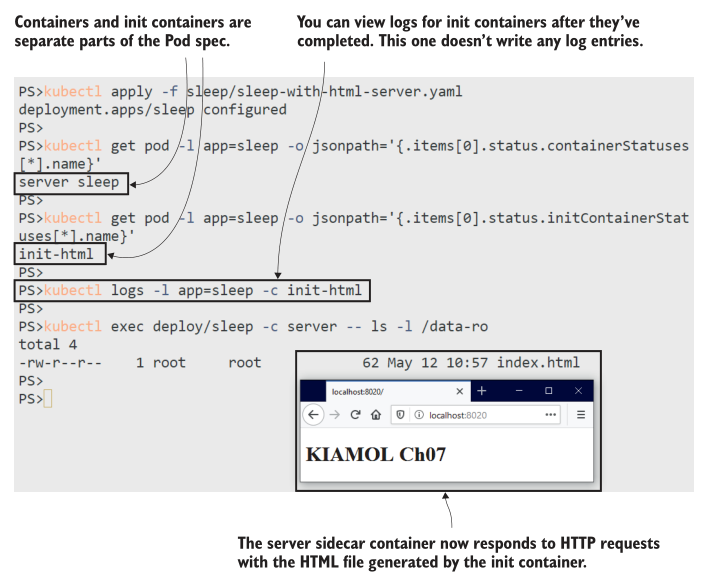
<center>图 7.7 Init 容器对于为 app 和 sidecar 容器准备 Pod 环境非常有用。</center>

不过，这仍然不是一个非常真实的例子，所以让我们做一些更好的事情。我们在第4章讨论了应用程序配置，并了解了如何使用环境变量、ConfigMaps和Secrets来构建配置设置的层次结构。如果你的应用程序支持这种灵活性，那就太好了，但许多老应用程序没有这种灵活性;他们希望在一个地方找到一个配置文件，而不会去其他地方寻找。让我们看看这样一个应用程序。

<b>现在就试试</b> 这一章有一个新的演示应用程序，因为如果我已经厌倦了看圆周率，那么你一定也厌倦了。这款游戏并不有趣，但至少有所不同。它只是每隔几秒钟向日志文件写入一个时间戳。它有一个老式的配置框架，所以我们不能使用到目前为止学到的任何配置技术。

```
# 运行应用，它使用到了一个配置文件:
kubectl apply -f timecheck/timecheck.yaml
# 检查容器日志—不会有任何东西:
kubectl logs -l app=timecheck
# 检查容器内的日志文件:
kubectl exec deploy/timecheck -- cat /logs/timecheck.log
# 检查配置信息:
kubectl exec deploy/timecheck -- cat /config/appsettings.json
```

您可以在图 7.8 中看到我的输出。有限的配置框架并不是这个应用程序在容器平台中不是一个好公民的唯一原因——Pod中也没有日志——但我们可以通过Pod中的其他容器解决所有问题。

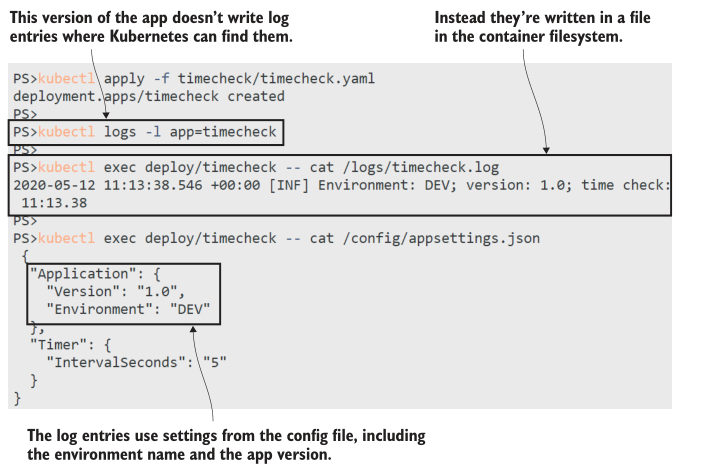
<center>图 7.8 使用单一配置源的旧应用程序无法从配置层次结构中受益</center>

init 容器是一个完美的工具，可以让这个应用程序与我们想要用于所有应用程序的配置方法保持一致。我们可以将设置存储在ConfigMaps、Secrets和环境变量中，并使用init容器从所有不同的输入中读取，合并内容，并将输出写入应用程序使用的单个文件位置。清单7.4显示了Pod spec 中的init容器。

> 清单 7.4 timecheck-with-config.yaml, 一个 init 容器写入了配置

```
spec:
  initContainers:
    - name: init-config
      image: kiamol/ch03-sleep # 镜像中存在  jq 工具
      command: ['sh', '-c', "cat /config-in/appsettings.json | jq --arg
    APP_ENV \"$APP_ENVIRONMENT\" '.Application.Environment=$APP_ENV' >
    /config-out/appsettings.json"]
     env:
       - name: APP_ENVIRONMENT # 所有容器有它们自己的环境变量，它们不在 POd 中共享
         value: TEST 
     volumeMounts:
       - name: config-map # 挂载一个 ConfigMap 用于读
         mountPath: /config-in
       - name: config-dir
         mountPath: /config-out # 挂载一个 EmptyDir volume 用于写
```

在我们更新 deployment 之前，有几件事需要注意:

- init 容器使用 jq 工具，应用程序不需要 jq 工具。容器使用不同的镜像，每个镜像都带有运行该步骤所需的工具。
- init容器中的命令从 ConfigMap 卷挂载中读取，合并环境变量值，并写入EmptyDir卷挂载中。
- 应用程序容器将 EmptyDir 卷挂载到需要配置文件的路径。init 容器生成的文件隐藏了应用镜像中的默认配置。
- 容器不共享环境变量。这些设置是为 init 容器指定的;应用程序容器看不到这些。
- 容器映射它们所需要的卷。两个容器都挂载它们共享的EmptyDir卷，但只有init容器挂载ConfigMap。

当我们应用此更新时，应用程序的行为将随着ConfigMap和环境变量而改变，即使应用程序容器没有将它们用作配置源。


<b>现在就试试</b> 使用清单 7.4 更新 timecheck 应用程序，以便从多个源配置应用程序容器。

```
# 部署 ConfigMap 以及新的 Deployment spec:
kubectl apply -f timecheck/timecheck-configMap.yaml -f timecheck/timecheck-with-config.yaml
# 等待容器启动:
kubectl wait --for=condition=ContainersReady pod -l app=timecheck,version=v2
# 检查新的应用容器的日志:
kubectl exec deploy/timecheck -- cat /logs/timecheck.log
# 查看 init 容器创建的配置文件:
kubectl exec deploy/timecheck -- cat /config/appsettings.json
```

当您运行这个时，您将看到应用程序与新配置一起工作，应用程序容器 spec 的唯一变化是配置目录从EmptyDir卷中挂载。我的输出如图7.9所示。

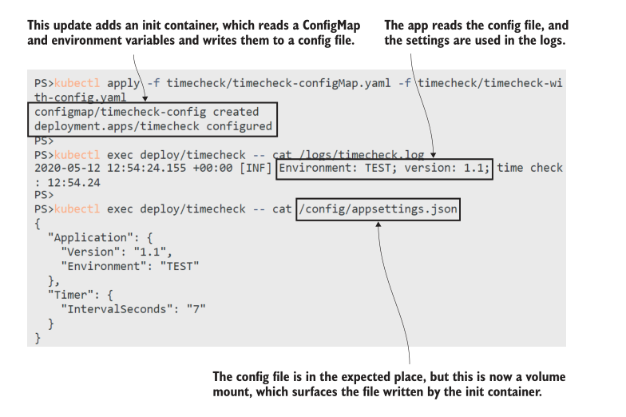
<center>图 7.9 Init 容器可以在不改变应用代码或 Docker 镜像的情况下改变应用行为。</center>

这种方法有效，因为配置文件是从专用目录加载的。请记住，卷挂载将覆盖镜像中的目录(如果该目录已经存在)。如果应用程序从与应用程序二进制文件相同的目录加载配置文件，你不能这样做，因为EmptyDir挂载会覆盖整个应用程序文件夹。在这种情况下，您需要在应用程序容器启动中执行额外的步骤，将配置文件从挂载复制到应用程序目录中。

将标准配置方法应用于非标准应用程序是init容器的一大用处，但旧的应用程序仍然不能在现代平台上很好地运行，这就是 sidecar 容器可以帮助的地方。

## 7.3 通过 adapter 容器以应用一致性

将应用程序迁移到 Kubernetes 是一个很好的机会，可以在所有应用程序之间添加一致性层，因此无论应用程序正在做什么，或者它使用什么技术堆栈，或者它是什么时候开发的，您都可以使用相同的工具以相同的方式部署和管理它们。我的同事、码头工人队长苏恩·凯勒(Sune Keller)谈到过Alm Brand使用的服务型酒店(https://bit.ly/376rBcF)概念。他们的容器平台为“客户”提供了一组保证(比如高可用性和安全性)，前提是他们遵守规则(比如从平台中提取配置并将日志写入其中)。

并不是所有的应用程序都知道这些规则，其中一些规则不能从外部被平台应用，但 sidecar 容器与应用程序容器一起运行，因此它们具有特权地位。你可以将它们作为适配器使用，它们理解应用程序工作方式的某些方面，并使其适应平台希望它工作的方式。日志记录就是一个经典的例子。

每个应用程序都写一些输出到日志条目——或者应该;否则，它将完全无法管理，您应该拒绝使用它。像Node.js和.net Core这样的现代应用平台写入标准输出流，这是Docker获取容器日志的地方，也是Kubernetes获取Pod日志的地方。旧的应用程序对日志有不同的想法，它们可能会写入文件或其他目标，这些目标永远不会作为容器日志出现，所以你永远不会看到任何Pod日志。这就是timcheck应用程序所做的，我们可以用一个非常简单的sidecar容器来修复它。spec 如清单7.5所示。

> 清单 7.5 timecheck-with-logging.yaml, 通过 sidecar 容器导出日志

```
containers:
  - name: timecheck
    image: kiamol/ch07-timecheck
    volumeMounts:
      - name: logs-dir # 应用容器写入日志到一个挂载的 EmptyDir 卷
        mountPath: /logs 
  - name: logger
    image: kiamol/ch03-sleep # sidecar 容器仅仅 watch 日志文件
    command: ['sh', '-c', 'tail -f /logs-ro/timecheck.log']
    volumeMounts:
      - name: logs-dir
        mountPath: /logs-ro # 使用与 APP 容器相同的卷
        readOnly: true
```

sidecar 所做的就是挂载日志卷(进入EmptyDir!)并使用标准的Linux tail命令从日志文件中读取。-f选项表示命令将跟随文件;实际上，它只是等待并观察新的写入，当任何行写入文件时，它们将被回显为标准输出。它是一个中继，使应用程序的实际日志实现适应Kubernetes的期望。

<b>现在就试试</b> 应用清单 7.5 中的更新，并检查应用程序日志是否可用。

```
# 添加sidecar日志记录容器:
kubectl apply -f timecheck/timecheck-with-logging.yaml
# 等待容器启动:
kubectl wait --for=condition=ContainersReady pod -l app=timecheck,version=v3
# 检查 Pods:
kubectl get pods -l app=timecheck
# 检查 Pod 中的容器:
kubectl get pod -l app=timecheck -o jsonpath='{.items[0].status.containerStatuses[*].name}'
# 现在你可以看到 Pod 中的应用日志:
kubectl logs -l app=timecheck -c logger
```

这里有一些低效率，因为应用程序容器将日志写入文件，然后日志容器再次将它们读回来。这将有一个小的时间延迟，可能会浪费很多磁盘，但Pod将在下一次应用程序更新中被替换，卷中使用的所有空间将被回收。好处是这个Pod现在像其他Pod一样，使应用程序日志可用于Kubernetes，但不需要对应用程序本身进行任何更改，如图7.10所示。

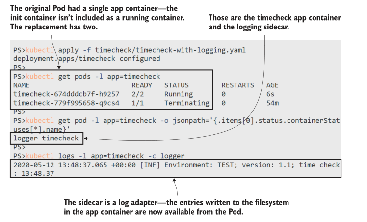
<center>图 7.10 适配器为Pods带来了一层一致性，使旧应用程序像新应用程序一样运行。</center>

从平台接收配置并将日志写入平台几乎是任何应用程序的基础，但随着平台的成熟，您将对标准行为有更多的期望。您希望能够测试容器内的应用程序是否健康，还希望能够从应用程序中提取指标，以查看它正在做什么以及它的工作强度。

Sidecars 也可以提供帮助，要么运行自定义容器，为应用程序提供定制的信息，要么拥有标准的健康和指标容器镜像，应用于所有 Pod spec。我们将使用时间检查应用程序来完成练习，并添加这些功能，使其成为Kubernetes的好公民。但是，我们将使用一些更静态的HTTP Server 容器，如清单7.6所示。

> 清单 7.6 timecheck-good-citizen.yaml, 更多的 sidecars 扩展应用

```
containers: # 之前的 应用和 日志容器都是一样的
  - name: timecheck
# ...
  - name: logger
# ...
  - name: healthz # 一个新的 sidecar 容器提供了健康检查 API
    image: kiamol/ch03-sleep # 仅仅是一个静态的响应
    command: ['sh', '-c', "while true; do echo -e 'HTTP/1.1 200 OK\nContent-
      Type: application/json\nContent-Length: 17\n\n{\"status\": \"OK\"}' | nc
      -l -p 8080; done"]
    ports:
      - containerPort: 8080 # 在 Pod 的 8080端口进行暴露
  - name: metrics # 另一个 sidecar, 添加了 metrics API
    image: kiamol/ch03-sleep # 内容同样是静态的.
    command: ['sh', '-c', "while true; do echo -e 'HTTP/1.1 200 OK\nContent-
      Type: text/plain\nContent-Length: 104\n\n# HELP timechecks_total The
      total number timechecks.\n# TYPE timechecks_total
      counter\ntimechecks_total 6' | nc -l -p 8081; done"]
      ports:
        - containerPort: 8081 # 暴露在不同的端口
```

完整的 YAML 文件还包括一个 ClusterIP Service，它在 health 端点的端口8080上发布，在metrics端点的端口8081上发布。在生产集群中，其他组件将使用这些数据来收集监视统计信息。部署是以前版本的扩展，所以应用程序使用init容器进行配置，并有一个日志sidecar和新的sidecar。

<b>现在就试试</b> 部署更新，并检查应用程序的运行状况和性能的新管理端点。

```
# 应用更新的内容:
kubectl apply -f timecheck/timecheck-good-citizen.yaml
# 等待所有容器 ready:
kubectl wait --for=condition=ContainersReady pod -l app=timecheck,version=v4
# 检查运行的容器:
kubectl get pod -l app=timecheck -o jsonpath='{.items[0].status.containerStatuses[*].name}'
# 通过 sleep 容器检查 timecheck 应用的健康:
kubectl exec deploy/sleep -c sleep -- wget -q -O - http://timecheck:8080
# 检查 metrics:
kubectl exec deploy/sleep -c sleep -- wget -q -O - http://timecheck:8081
```

当您运行这个练习时，您将看到一切都按预期运行，如图7.11所示。你可能还会发现更新速度不如你习惯的那么快，新Pod启动的时间更长，旧Pod终止的时间更长。额外的启动时间来自初始化容器、应用程序容器和所有 sidecar——在新Pod被认为准备好之前，它们都需要准备好。额外的终止时间是因为被替换的Pod也有多个容器，每个容器都有一个关闭容器进程的宽限期。

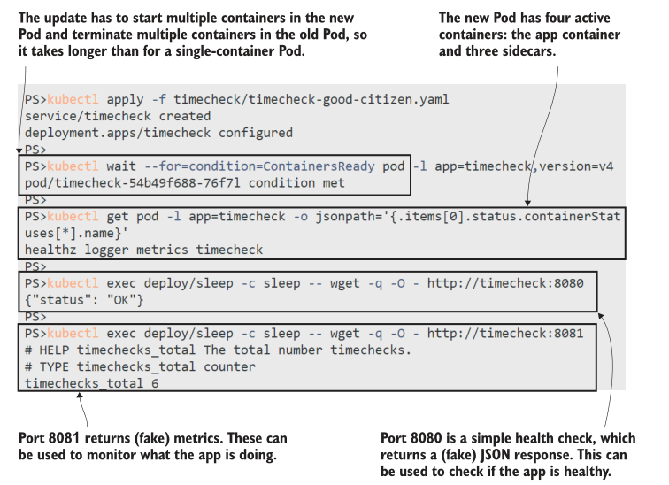
<center>图 7.11 多个适配器sidecars给应用程序一个一致的管理API。</center>

将所有这些sidecar容器作为适配器运行是有开销的。您已经看到，它增加了部署时间，但也增加了应用程序的持续计算需求——甚至存储和基本的sidecars(它只是跟踪日志文件并提供简单的HTTP响应)都使用内存和计算周期。但如果你想把现有的应用程序转移到没有这些功能的Kubernetes上，让所有应用程序都以相同的方式运行是一种可以接受的方法，如图7.12所示。

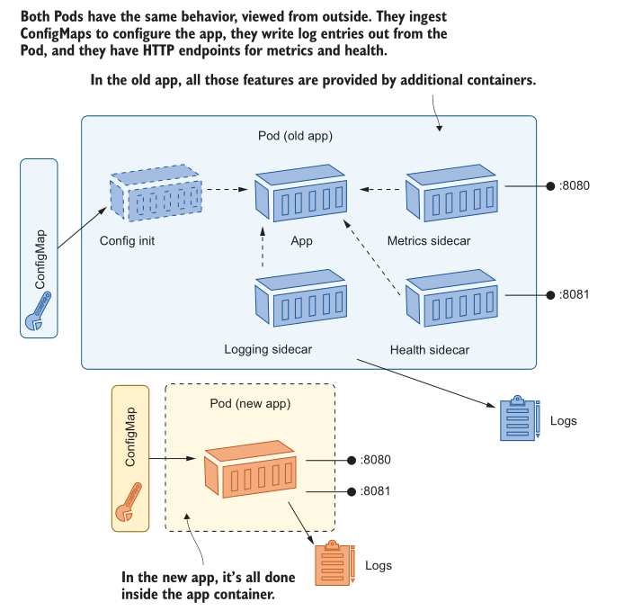
<center>图 7.12 一个一致的管理API可以很容易地与Pod一起工作——不管API是如何在Pod中提供的。</center>

在前面的练习中，我们使用了一个旧的 sleep Pod来调用时间检查应用程序的新HTTP端点。请记住，Kubernetes有一个平面网络模型，其中Pod可以通过服务向任何其他Pod发送流量。你可能想要在你的应用程序中对网络通信有更多的控制，你也可以用sidecars来做到这一点，通过运行一个代理容器来管理从你的应用程序容器传出的流量。

## 7.4 通过 ambassador 容器抽象连接

The ambassador pattern lets you control and simplify outgoing connections from your application: your app makes network requests to the localhost address, which are picked up and performed by the ambassador. You can make use of a generic ambassador container, or one that is specific to your application components, in several situations. Figure 7.13 shows some examples. The logic in the ambassador might be geared to improving performance or increasing reliability or security.

Taking control of the network away from the application is hugely powerful. A proxy container can do service discovery, load balancing, retries, and even layer encryption onto an unencrypted channel. Perhaps you’ve heard of the service mesh architecture, using technologies like Linkerd and Istio—they’re all powered by proxy sidecar containers in a variation of the ambassador pattern.

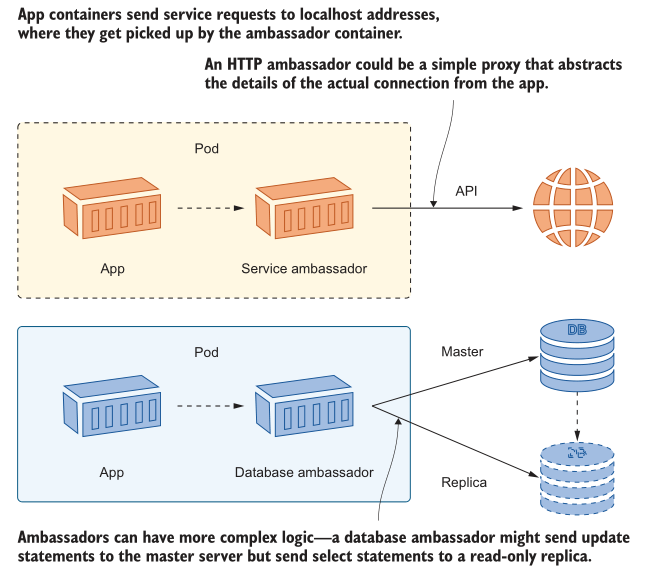
<center>图 7.13 The ambassador pattern has lots of potential, from simplifying app logic to increasing performance.</center>

We won’t use a service mesh architecture here because that would take us well past lunchtime and on into the night, but we’ll get a flavor of what it can do with a simplified example. The starting point is the random-number app we’ve used before. There’s a web app running in a Pod, which consumes an API running in another Pod. The API is the only component the web app uses, so ideally we would restrict network calls to any other address, but in the initial deployment that doesn’t happen.

<b>现在就试试</b> Run the random-number app, and verify that the web app container can use any network address.

```
# deploy the app and Services:
kubectl apply -f numbers/
# find the URL for your app:
kubectl get svc numbers-web -o jsonpath='http://{.status.loadBalancer.ingress[0].*}:8090'
# browse and get yourself a nice random number
# check that the web app has access to other endpoints:
kubectl exec deploy/numbers-web -c web -- wget -q -O -http://timecheck:8080
```

The web Pod can reach the API using the ClusterIP Service and the domain name numbers-api, but it can also access any other address, which could be a URL on the public internet or another ClusterIP Service. Figure 7.14 shows the app can read the health endpoint of the timecheck app—that should be a private endpoint, and it might expose information that is useful to someone up to no good.

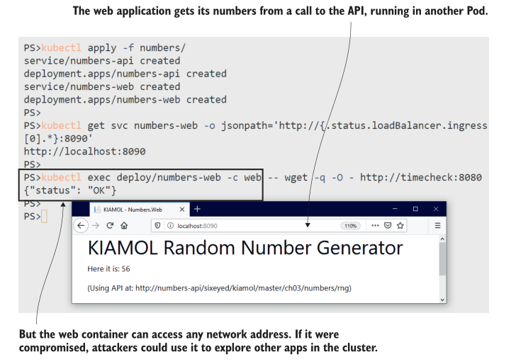
<center>图 7.14 Kubernetes doesn’t have any default restrictions on outgoing connections from Pod containers.</center>

You have a lot of options for restricting network access besides using a proxy sidecar, but the ambassador pattern comes with some additional features that make it worth considering. Listing 7.7 shows an update to the web app spec, using a simple proxy container as an ambassador.

**Listing 7.7 web-with-proxy.yaml, using a proxy as an ambassador**

```
containers:
  - name: web
    image: kiamol/ch03-numbers-web
    env:
      - name: http_proxy # Sets the container to use the proxy
        value: http://localhost:1080 # so traffic goes to the ambassador
      - name: RngApi__Url
        value: http://localhost/api # Uses a localhost address for the API
  - name: proxy
    image: kiamol/ch07-simple-proxy # This is a basic HTTP proxy.
      env:
        - name: Proxy__Port # Routes network requests from the app
          value: "1080" # using the configured URI mapping
        - name: Proxy__Request__UriMap__Source
          value: http://localhost/api
        - name: Proxy__Request__UriMap__Target
          value: http://numbers-api/sixeyed/kiamol/master/ch03/numbers/rng
```

This example shows the major pieces of the ambassador pattern: the app container uses localhost addresses for any services it consumes, and it’s configured to route all network calls through the proxy container. The proxy is a custom app that logs network calls, maps localhost addresses to real addresses, and blocks any addresses that are not listed in the map. All that becomes functionality in the Pod, but it’s transparent to the application container.

<b>现在就试试</b> Update the random-number app, and confirm the network is now locked down.

```
# apply the update from listing 7.5:
kubectl apply -f numbers/update/web-with-proxy.yaml
# refresh your browser, and get a new number
# check the proxy container logs:
kubectl logs -l app=numbers-web -c proxy
# try to read the health of the timecheck app:
kubectl exec deploy/numbers-web -c web -- wget -q -O -http://timecheck:8080
# check proxy logs again:
kubectl logs -l app=numbers-web -c proxy
```

Now the web app is decoupled even further from the API, because it doesn’t even know the URL of the API—that’s set in the ambassador, which can be configured independently of the app. The web app is also restricted to using a single address for outgoing requests, and all of those calls are logged by the proxy, as you see in figure 7.15.

The ambassador for this web app proxies HTTP calls outside of the Pod, but the ambassador pattern is wider than that. It plugs into the network at the transport layer,so it can work on any kind of traffic. A database ambassador can make some smart choices, like sending queries to a read-only database replica and using only the master database for writes. That’s going to improve performance and scale, while keeping complex logic out of the application.

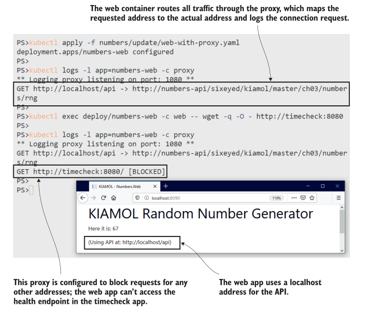
<center>图 7.15 All network access is via the ambassador, which can implement its own access rules.</center>

We’ll round out the chapter by taking a closer look at what it means to use the Pod as a shared environment for many containers.

## 7.5 理解 Pod 环境

The Pod is a boundary around one or more containers, just like the container is a boundary around one or more processes. Pods create layers of virtualization without adding overhead, so they’re flexible and efficient. The cost of that flexibility is—as always—complexity, and you need to be aware of some nuances to working with multicontainer Pods.
The main thing to understand is that the Pod is still the single unit of compute, even if lots of containers are running inside it. Pods aren’t ready until all the containers in the Pod are ready, and Services send traffic only to Pods that are ready. Adding sidecars and init containers adds to the failure modes for your application.

<b>现在就试试</b> You can break your application if an init container fails. This update to the numbers app won’t be successful because the init container is misconfigured.

```
# apply the update:
kubectl apply -f numbers/update/web-v2-broken-init-container.yaml
# check the new Pod:
kubectl get po -l app=numbers-web,version=v2
# check the logs for the new init container:
kubectl logs -l app=numbers-web,version=v2 -c init-version
# check the status of the Deployment:
kubectl get deploy numbers-web
# check the status of the ReplicaSets:
kubectl get rs -l app=numbers-web
```

You can see in this exercise that the failed init container effectively prevents the application from updating. The new Pod never enters the running state and won’t receive traffic from the Service. The Deployment never scales down the old ReplicaSet because the new one doesn’t reach the required level of availability, but the basic details of the Deployment look like the update has worked, as shown in figure 7.16.

The same situation will happen if a sidecar container fails on startup—the Pod doesn’t have all of its containers running so the Pod itself isn’t ready. Any deployment checks you have in place need to be extended for multicontainer Pods to ensure all init containers run to completion and all Pod containers are running. You need to be aware of the following restart conditions, too:

- If a Pod with init containers is replaced, then the new Pod runs all the init containers again. You must ensure your init logic can be run repeatedly.
- If you deploy a change to the init container image(s) for a Pod, that restarts the Pod. Init containers all execute again, and app containers are replaced.
- If you deploy a Pod spec change to the app container image(s), the app containers are replaced, but the init containers are not executed again.
- If an application container exits, then the Pod re-creates it. Until the container is replaced, the Pod is not fully running and won’t receive Service traffic.

The Pod is a single compute environment, but when you add multiple moving parts inside that environment, you need to test all the failure scenarios and make sure your app behaves as you expect.

There’s one last part of the Pod environment that we haven’t covered: the compute layer. Pod containers have a shared network and can share parts of the filesystem, but they can’t access each other’s processes—the container boundary still provides compute isolation. That’s the default behavior, but in some cases, you want your sidecar to have access to the processes in the application container, either for interprocess communication or so the sidecar can fetch metrics about the app process.

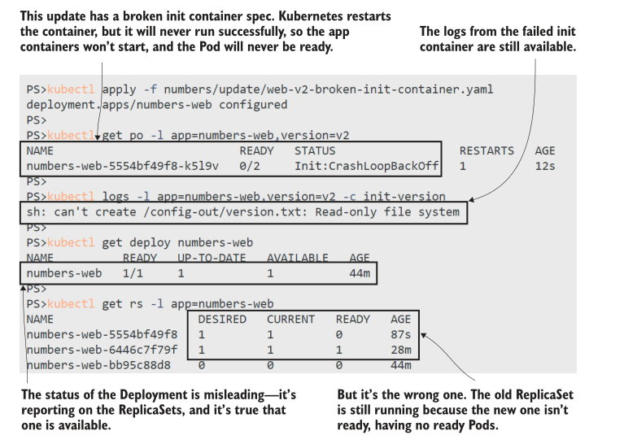
<center>图 7.16 Adding more containers to your Pod spec adds more opportunities for the Pod to fail</center>

You can enable this access with a simple setting in the Pod spec: shareProcess-Namespace: true. That means every container in the Pod shares the same compute space and can see each other’s processes.

<b>现在就试试</b> Deploy an update to the sleep Pod so the containers use a shared compute space and can access each other’s processes.

```
# check the processes in the current container:
kubectl exec deploy/sleep -c sleep -- ps
# apply the update:
kubectl apply -f sleep/sleep-with-server-shared.yaml
# wait for the new containers:
kubectl wait --for=condition=ContainersReady pod -l app=sleep,version=shared
# check the processes again:
kubectl exec deploy/sleep -c sleep -- ps
```

You can see my output in figure 7.17. The sleep container can see all the server container’s processes, and it could happily kill them all and leave the Pod in a confused state.

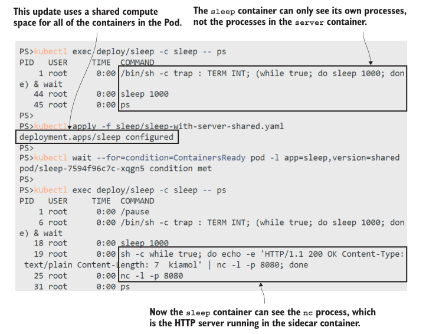
<center>图 7.17 You can configure a Pod so all containers can see all processes—use with care.</center>

That’s all for multicontainer Pods. You’ve seen in this chapter that you can use init containers to prepare the environment for your application container and run sidecar containers to add features to your app, all without changing the app code or the Docker image. There are some caveats to using multiple containers, but it’s a pattern you’ll use often to extend your applications. Just remember that the Pod should be one logical component: I don’t want to see you running Nginx, WordPress, and MySQL in a single Pod just because you can. Let’s tidy up now and get ready for the lab.

<b>现在就试试</b> Remove everything matching this chapter’s label.

```
kubectl delete all -l kiamol=ch07
```

## 7.6 实验室

It’s back to the Pi app for this lab. The Docker image kiamol/ch05-pi can actually be used in different ways, and to run it as a web app, you need to override the startup command in the container spec. We’ve done that in the YAML files in previous chapters, but now we’ve been asked to use a standard approach to setting up the pod. Here are the requirements and some hints:

- The app container needs to use a standard startup command that all Pods in our platform are using. It should run /init/startup.sh.
- The Pod should use port 80 for the app container.
- The Pod should also publish port 8080 for an HTTP server, which returns the version number of the app,
- The app container image doesn’t contain a startup script, so you’ll need to usesomething that can create that script and make it executable for the app container to run.
- The app doesn’t publish a version API on port 8080 (or anywhere else), so you’ll need something that can provide that (it can just be any static text).

The starting point is the YAML in ch07/lab/pi, which is broken at the moment. You’ll need to do some investigation into how the app ran in previous chapters and apply the techniques we’ve learned in this chapter. You have plenty of ways to approach this one, and you’ll find my sample solution in the usual place: https://github.com/sixeyed/kiamol/blob/master/ch07/lab/README.md.